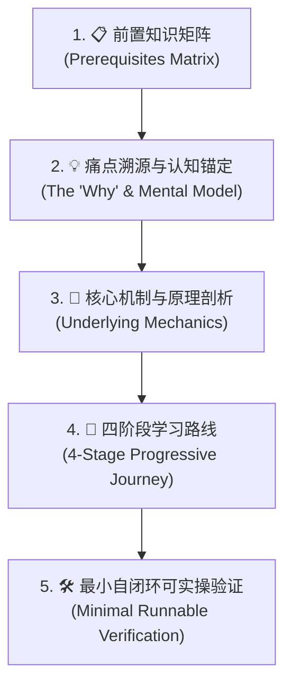
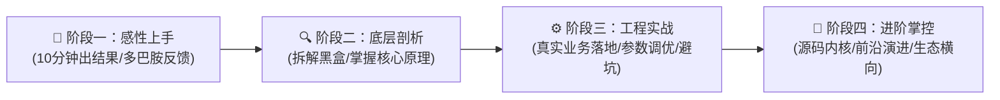
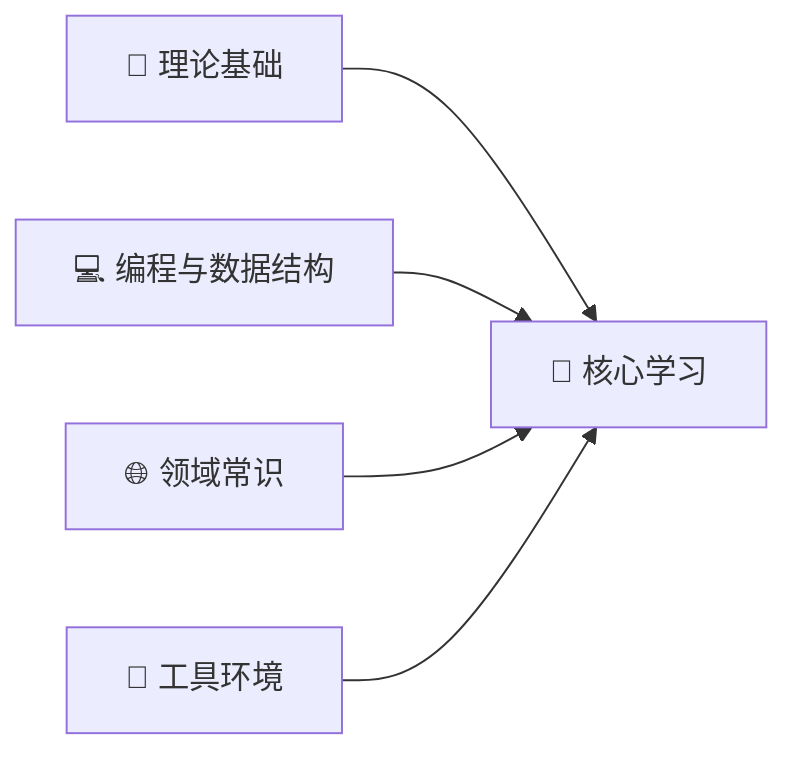

# `new_know` - 新知识解构与系统化学习路径构建指南

> **核心哲学**：**“破除知识的诅咒，把任何复杂的黑盒技术，拆解为确定性、低认知摩擦、可自测自闭环的学习工程。”**  
> 专家在教授新技术时，往往容易默认学习者拥有与自己相同的隐性知识（Tacit Knowledge）。`new_know` 的使命就是站在初学者的认知第一视角，建立清晰的“依赖前置条件”、“极简自测门槛”、“痛点认知锚点”与“四阶段学习阶梯”。

---

## 🎯 触发条件（Activation Triggers）

当满足以下任一场景时，应当主动激活或应用本 Skill：
1. 用户请求讲解某个新技术、数据库、算法、框架或底层原理（如：“讲讲向量数据库”、“介绍一下 PostgreSQL 的基础概念和学习路径”）。
2. 用户要求制定某项技术的**学习路线（Learning Roadmap）**或**系统化掌握指南**。
3. 用户要求明确指出学习某项知识所需的**前置知识准备清单（Prerequisites）**与自测标准。
4. 用户要求撰写具备教学深度、可实操落地的高质量技术博客或知识库文档。
5. 明确调用 `/new_know` 或提及 `new_know` 规范。

---

## 🏗️ 核心五维解构方法论（The 5-Pillar Methodology）

每个由 `new_know` 生成的知识输出，必须严格包含以下五个维度的标准化解构：



---

### 第一维：前置知识多维解构与极简自测（Prerequisite Matrix）

绝不直接抛出晦涩专业术语，必须在文章最开篇（引言之后、正文之前）提供前置知识准备清单。

#### 1. 四大前置维度分类法
必须从以下四个象限无遗漏地拆解前置依赖：
- **📐 数学与理论基石（Math & Theory）**：例如线性代数（点积/范数）、微积分、离散数学、概率统计、关系代数。
- **🐍 编程与底层数据结构（Code & Data Structures）**：例如 Python/Go 语言语法、B 树、跳表、图邻接表、哈希表、异步与并发模型。
- **🌐 领域上下文与概念常识（Domain Context）**：例如大模型 Embedding/RAG、数据库事务 ACID、分布式一致性、网络协议。
- **🐳 环境与工程工具链（Environment & Toolchains）**：例如 Docker 基础操作、Linux 终端命令、Git、IDE、包管理器。

#### 2. 前置知识矩阵标准表格
必须采用四列表格呈现，包含具体的**客观自测标准**与**极速补课资料**：

| 模块类别 | 必备核心知识点 | 掌握程度与自测标准（如何知道自己已达标？） | 零基础推荐前置补课资料 |
| :--- | :--- | :--- | :--- |
| **数学/理论基础** | 列出关键定理或公式概念 | 给出一个具体的计算或推导演练场景 | 权威、可视化的高质量教程链接/书名 |
| **编程/数据结构** | 列出关键语言特性与结构 | 给出一个能独立写出的代码片段要求 | 经典互动练习或教程推荐 |
| **领域上下文** | 列出必备业务背景或概念 | 给出一个能用自己的话解释的概念考题 | 极简通识科普教程 |
| **环境与工具** | 列出必用命令或运行环境 | 给出一行能敲入并正常运行的验证命令 | 官方 5 分钟极简 Getting Started |

#### 3. 前置依赖 Mermaid 流程图
在表格上方必须配以清晰的 Mermaid `flowchart LR` 有向图，将各前置基础直观汇聚至核心课题。

#### 4. 一分钟极简自测门槛（One-Minute Diagnostic）
必须使用 Docsify/Markdown Tip 提示块，提炼出一句毫无压力的“通关黄金标准”：
```markdown
> [!TIP]
> **一分钟极简自测**：如果你知道“______”，并且本地具备“______”，你就可以毫无门槛地通读本指南的全部内容！
```

---

### 第二维：痛点溯源与思维认知锚定（The "Why" & Mental Model）

在讲解“怎么做”之前，必须彻底阐明“为什么需要它”：

1. **传统方案在什么边界下崩溃？（The Breaking Point）**
   - 过去大家用什么方案解决此类问题？
   - 当数据规模、吞吐并发、维度或业务复杂度达到什么极限时，传统技术遇到了无法逾越的物理/算法瓶颈？
2. **一句话灵魂比喻（The Cognitive Anchor）**
   - 运用学习者已知的直观概念进行隐喻锚定。
   - 例：*“向量数据库是大模型的外挂海马体（长期记忆）”*、*“HNSW 索引就像高维空间的六度分隔人脉网络与高速跳表”*。
3. **输入输出黑盒拆解（Input-Process-Output Flowchart）**
   - 绘制数据从原始形态，经过该技术的处理，到最终消费输出的数据流图。

---

### 第三维：底层核心原理与关键算法图解（Underlying Mechanics）

不浮于表面的 API 罗列，深入剖析内核骨架：

1. **核心数学与度量方式（Metrics & Math）**
   - 公式要规范化（LaTeX 排版），解释各变量物理含义与适用场景（如欧氏距离 vs 余弦相似度 vs 内积）。
2. **底层索引与核心数据结构（Data Structures & Algorithms）**
   - 图解关键算法（如 HNSW、B-Tree、LSM-Tree、IVF、WAL 日志等）。
   - 剖析空间与时间复杂度，揭示其权衡（Trade-offs：查得快 vs 占内存 vs 写入延迟）。
3. **生态横向对比矩阵（Ecosystem Comparison Matrix）**
   - 给出主流选型的全景对比表（如 Qdrant vs Milvus vs pgvector）。
   - 总结一条**选型决策树（Decision Tree）**，帮助学习者在面临真实架构选型时做出判断。

---

### 第四维：由浅入深四阶段系统化学习路线（4-Stage Progressive Journey）

学习路线必须被划分为清晰、步步为营的四个进阶阶梯：



1. **阶段一：感性认知与极速上手（Quickstart & Intuition）**
   - **核心目标**：10 分钟内跑通第一个 Demo，建立成就感。
   - **关键行动**：一行 Docker 启动容器、3 行代码调用 SDK、立即看到输入与预期输出。
2. **阶段二：核心机制与原理深剖（Deep Dive & Architecture）**
   - **核心目标**：搞懂内部运行机制，知其所以然。
   - **关键行动**：学习数据生命周期、内存与磁盘布局、核心算法演化与查询执行计划。
3. **阶段三：工程实战与生产避坑（Production & Best Practices）**
   - **核心目标**：能够把技术应用在真实业务中并保证高可用与高性能。
   - **关键行动**：复合过滤、批量导入、持久化策略、性能调优、监控指标与避坑指南。
4. **阶段四：进阶掌控与前沿演进（Advanced Mastery & System Internals）**
   - **核心目标**：具备技术选型掌控力、故障排查（Troubleshooting）与源码级理解能力。
   - **关键行动**：分布式集群分片、混合多模检索、源码扩展开发与未来发展趋势洞察。

---

### 第五维：最小自闭环可执行实战（Minimal Runnable Verification）

所有的理论必须落地为一个可验证的最小闭环：

1. **零假设前提**：不依赖未说明的外部密钥或复杂网络，提供完整的 Docker 启动命令或本地安装脚本。
2. **完整可复制的代码（Self-Contained Runnable Code）**：
   - 包含从连接初始化、数据构造、入库索引到检索/查询的完整脚本。
   - 附带关键行注释，解释业务意图。
3. **预期输出与自测检查点（Checkpoints & Expected Output）**：
   - 给出运行后的真实终端打印结果。
   - 明确指出若报错（如连接拒绝、维度不匹配）的最常见排查方案。

---

## 📝 标准输出模板（Markdown Template）

编写指南时，可直接套用以下骨架：

```markdown
---
title: [技术名称]核心概念深度解析与系统化学习路径指南
date: YYYY-MM-DD HH:MM
updated: YYYY-MM-DD HH:MM
tags: [核心标签1, 标签2, 学习路线]
author: Inkstar
---

# [技术名称]核心概念深度解析与系统化学习路径指南

> **“一句话灵魂金句/比喻，锚定核心价值。”**
> 核心背景交代与痛点阐述……

本指南旨在为技术开发者建立一套**成体系、有深度、可动手落地**的认知模型。文章分为三大部分：
1. **[📋 学习本指南所需的前置知识准备清单（Prerequisites）](#-学习本指南所需的前置知识准备prerequisites)**
2. **[🧠 核心基础概念与底层架构深度解析](#一-痛点溯源与核心价值)**
3. **[🚀 由浅入深的四阶段系统化学习路线](#四-系统化四阶段学习路线)**

---

## 📋 学习本指南所需的前置知识准备（Prerequisites）

在开始系统学习本技术之前，建议你已经具备以下基础认知：



| 模块类别 | 必备核心知识点 | 掌握程度与自测标准 | 零基础推荐前置补课资料 |
| :--- | :--- | :--- | :--- |
| **数学/理论基础** | ... | ... | ... |
| **编程与数据结构** | ... | ... | ... |
| **领域常识** | ... | ... | ... |
| **环境与工具** | ... | ... | ... |

> [!TIP]
> **一分钟极简自测**：如果你知道“______”，并且本地安装了“______”，你就可以毫无门槛地通读本指南的全部内容！

---

## 一、 痛点溯源与为什么需要它？
...

## 二、 核心概念与思维模型
...

## 三、 底层原理与关键算法图解
...

## 四、 生态全景横向选型对比
...

## 五、 系统化四阶段学习路线
...

## 六、 最小可运行上手实战（Hello World 闭环）
...

## 总结与下一步探索
...
```

---

## 📋 发布前终审自检清单（Quality Checklist）

在交付生成的知识指南前，必须逐项核对：
- [ ] **前置知识完整性**：是否包含数理/理论、编程/结构、领域常识、环境工具四大象限？
- [ ] **前置图解与自测**：是否包含 Mermaid 依赖流图以及直观的“一分钟极简自测”？
- [ ] **痛点与认知比喻**：是否阐明了传统方案为何崩溃？是否有易懂的生动比喻？
- [ ] **路线阶梯分明**：四阶段是否从“10分钟出结果”逐步递进到“源码与生产调优”？
- [ ] **实战可闭环**：提供的实操代码是否无需任何额外猜测即可直接运行复现？
- [ ] **排版视觉质感**：是否善用 Markdown 引用块（Alerts）、代码高亮与表格对比？
