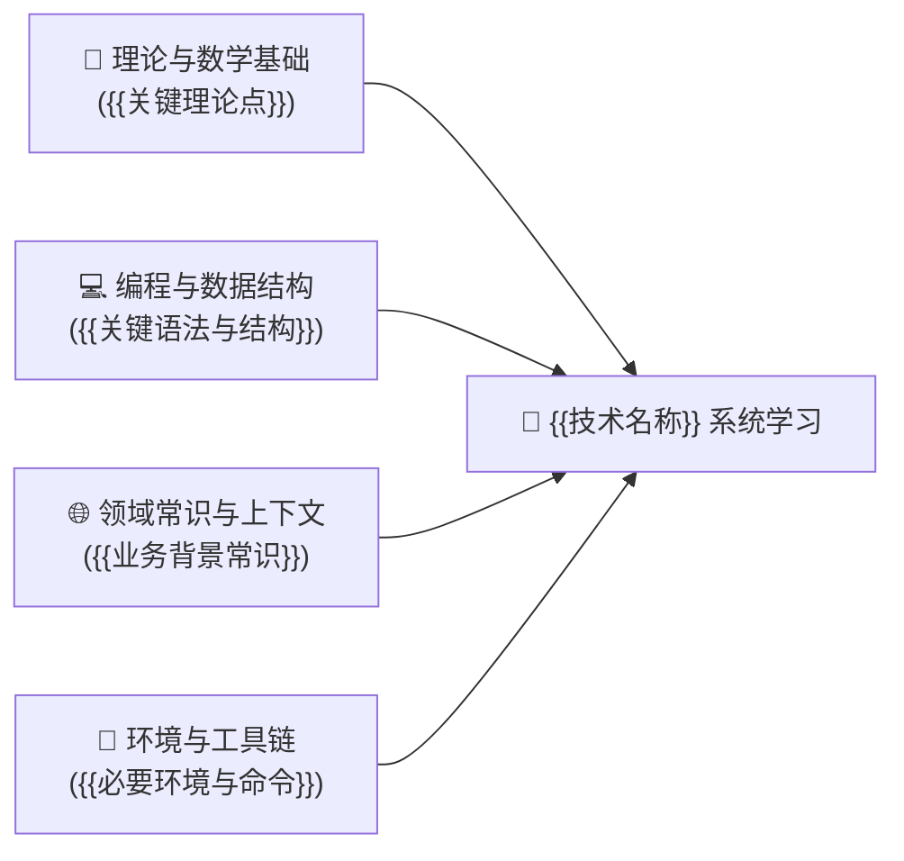
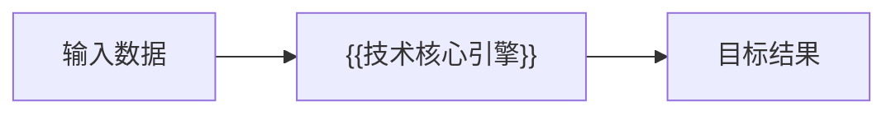
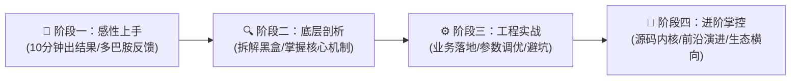

# `new_know` 教学指南标准 Markdown 模板

```markdown
---
title: {{技术名称}}核心概念深度解析与系统化学习路径指南
date: {{YYYY-MM-DD HH:MM}}
updated: {{YYYY-MM-DD HH:MM}}
tags: [{{核心技术}}, {{领域}}, 学习路线, 核心概念]
author: Inkstar
---

# {{技术名称}}核心概念深度解析与系统化学习路径指南

> **“{{一句话灵魂金句或通俗比喻，提炼该技术在体系中的独特生态位}}”**
> {{简述该技术的产生背景、解决的历史痛点以及在现代技术栈中的关键价值}}

本指南旨在为技术开发者建立一套**成体系、有深度、可动手落地**的认知模型。文章分为三大部分：
1. **[📋 学习本指南所需的前置知识准备清单（Prerequisites）](#-学习本指南所需的前置知识准备prerequisites)**（自测标准与基础补齐资源）
2. **[🧠 核心基础概念与底层架构深度解析](#一-为什么需要它与解决的核心痛点)**（底层原理与架构剖析）
3. **[🚀 由浅入深的四阶段系统化学习路线](#四-系统化四阶段学习路线)**（演练与落地方案）

---

## 📋 学习本指南所需的前置知识准备（Prerequisites）

在深入学习 {{技术名称}} 之前，建议你已经具备以下基础认知。如果某些知识点存在盲区，可参考推荐指引快速补齐：



| 模块类别 | 必备核心知识点 | 掌握程度与自测标准（如何知道自己达标？） | 零基础推荐前置补课资料 |
| :--- | :--- | :--- | :--- |
| **理论与数学基础** | • {{知识点1}}<br/>• {{知识点2}} | {{具体可量化的自测标准，如能口算或推导某公式}} | [{{教程名}}]({{链接或书籍}}) |
| **编程与数据结构** | • {{语言特性}}<br/>• {{核心数据结构}} | {{具体编码能力要求，如能独立写出某种数据操作}} | [{{教程名}}]({{链接或书籍}}) |
| **领域常识与上下文** | • {{背景概念1}}<br/>• {{背景概念2}} | {{具体概念解释要求，如能阐述两个相似概念区别}} | [{{教程名}}]({{链接或书籍}}) |
| **环境与工具链** | • {{环境/容器}}<br/>• {{常用命令}} | {{环境准备与验证命令，如能启动容器拉取镜像}} | [{{教程名}}]({{链接或书籍}}) |

> [!TIP]
> **一分钟极简自测**：如果你知道“{{极简概念，如列表/矩阵/SQL/JSON}}”，并且本地安装了“{{极简环境，如 Python 或 Docker}}”，你就可以毫无门槛地通读本指南的全部内容！

---

## 一、 为什么需要它与解决的核心痛点？

### 1. 传统方案在什么边界下崩溃？
- 痛点 1
- 痛点 2

### 2. 核心思维模型与数据流向


---

## 二、 核心概念与底层架构机制

### 1. 关键术语与概念映射
...

### 2. 底层数据结构与算法原理
...

---

## 三、 生态全景与横向对比选型

| 方案 / 框架 | 核心优势 | 潜在短板 | 适用业务场景 |
| :--- | :--- | :--- | :--- |
| **{{主流方案A}}** | ... | ... | ... |
| **{{主流方案B}}** | ... | ... | ... |
| **{{轻量级方案C}}** | ... | ... | ... |

> [!NOTE]
> **选型决策建议**：{{给出 1~2 句针对具体场景的实用选型建议}}。

---

## 四、 系统化四阶段学习路线



### 阶段一：感性认知与极速上手（Day 1 ~ Day 3）
- **核心目标**：10 分钟内跑通第一个 Demo，建立成就感。
- **推荐行动清单**：
  1. ...
  2. ...

### 阶段二：核心原理与机制深剖（Week 1 ~ Week 2）
- **核心目标**：拆解黑盒，搞懂底层机制。
- **推荐行动清单**：
  1. ...
  2. ...

### 阶段三：工程实战与生产避坑（Week 3 ~ Month 1）
- **核心目标**：能够在真实业务中落地并处理异常与调优。
- **推荐行动清单**：
  1. ...
  2. ...

### 阶段四：进阶掌控与架构设计（Month 2+）
- **核心目标**：具备技术选型掌控力与高阶架构调优能力。
- **推荐行动清单**：
  1. ...
  2. ...

---

## 五、 最小自闭环可运行上手实战（Hello World）

```bash
# 步骤 1：启动环境
{{一键启动命令}}
```

```python
# 步骤 2：核心可执行代码
def main():
    pass

if __name__ == '__main__':
    main()
```

### 预期输出与自测检查点
```text
{{预期控制台输出}}
```

---

## 六、 总结与结语
...
```
