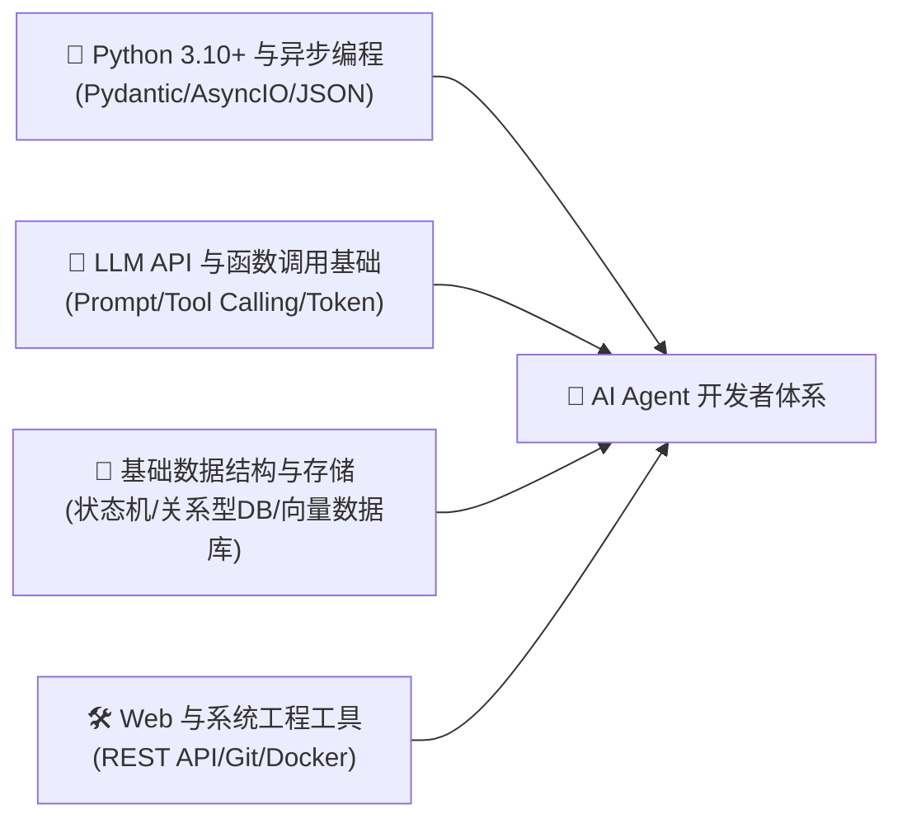
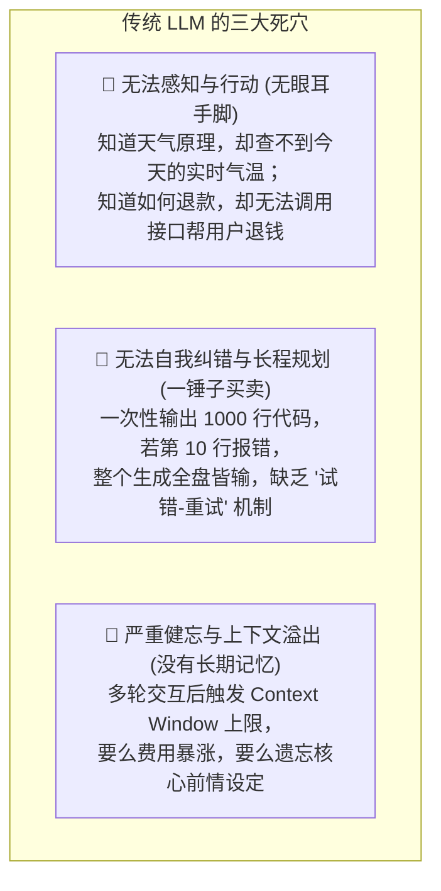
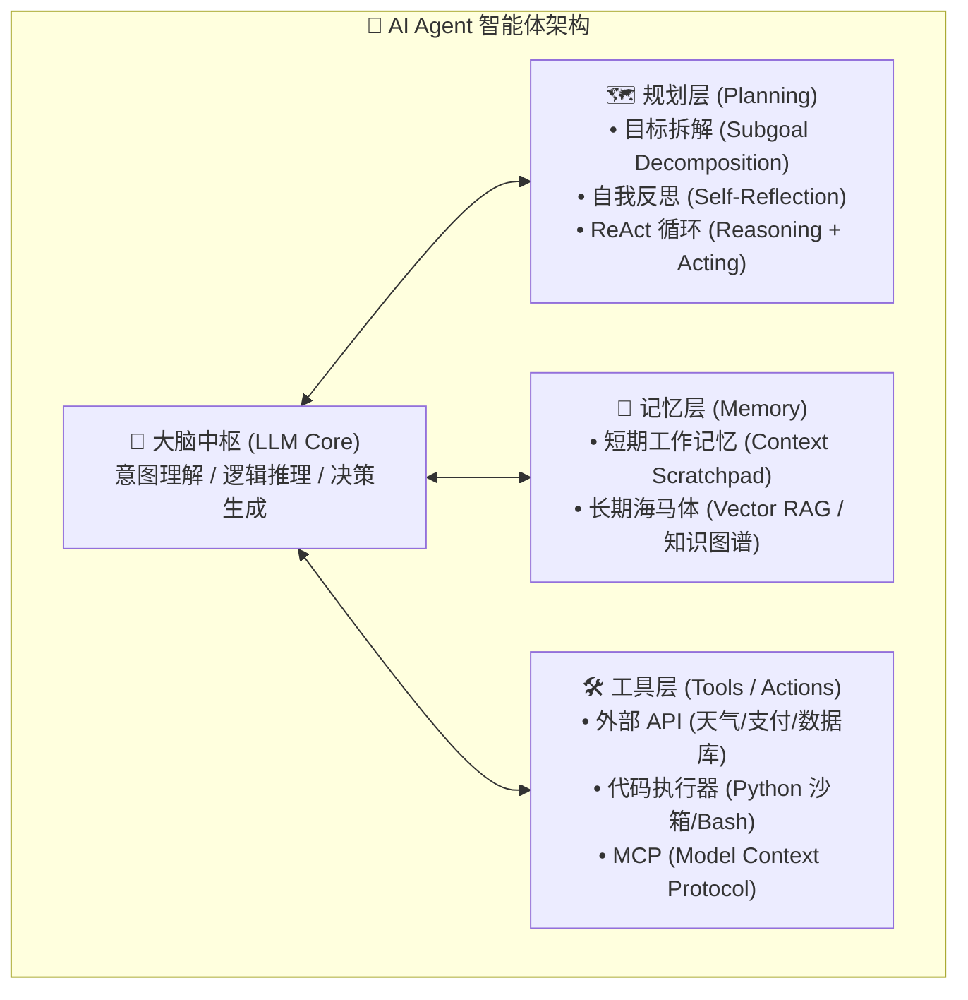
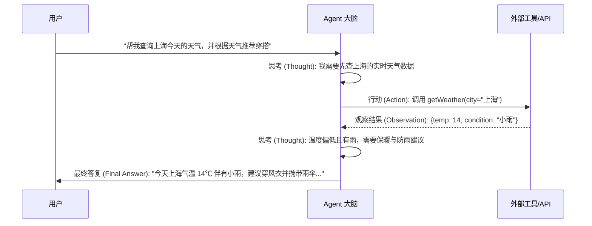
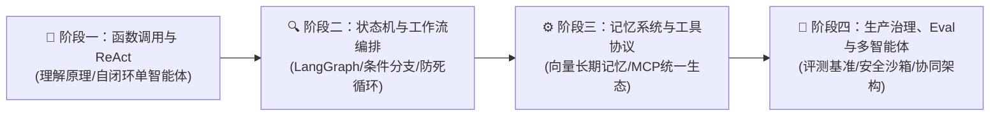

# 如何成为一名卓越的 AI Agent 开发者：核心架构全景解析与系统化学习路径指南

> **“如果说大语言模型（LLM）是拥有海量知识却被困在玻璃罩里的‘缸中之脑’，那么 AI Agent（智能体）就是为这个大脑配上了眼睛、耳朵、双手与记忆的完整数字生命体。”**  
> 2023 年，行业还在沉迷于各种炫酷的 Prompt 技巧；而在 2026 年，软件工程正在经历一场从 **“人机对话（Chatbot）”** 到 **“智能体自主行动（Agentic Action）”** 的底层范式革命。从自动调试代码的 Devin、智能搜索的 Perplexity，到自主协作的企业多智能体系统，**Agent 开发已成为现代全栈工程师与架构师最具竞争力的核心能力**。

本指南严格遵循 **`new_know`** 认知解构规范，旨在帮助开发者从零建立系统的 Agent 认知模型并掌握工业级开发技能：
1. **[📋 学习本指南所需的前置知识准备清单（Prerequisites）](#-学习本指南所需的前置知识准备prerequisites)**
2. **[💡 痛点溯源：为什么传统的 LLM Chatbot 远远不够？](#一-痛点溯源从缸中之脑到全能数字员工)**
3. **[🧠 核心机制：AI Agent 的底层经典黄金架构](#二-核心机制ai-agent-底层经典四大支柱)**
4. **[🗺️ 生态技术栈全景与主流框架横向对比](#三-主流-agent-工程框架全景选型与对比)**
5. **[🚀 由浅入深四阶段系统化学习路线](#四-由浅入深四阶段系统化学习路线)**
6. **[🛠️ 零框架纯 Python 手写工业级 ReAct 智能体循环实战](#五-最小自闭环可运行实战纯-python-手写-react-循环引擎)**

---

## 📋 学习本指南所需的前置知识准备（Prerequisites）

在开启 AI Agent 开发之旅前，建议你已经具备以下技术背景。如有短板，可先根据推荐指引快速补齐：



| 模块类别 | 必备核心知识点 | 掌握程度与自测标准（如何自测？） | 零基础推荐前置补课资料 |
| :--- | :--- | :--- | :--- |
| **编程与数据模型** | • **Python 进阶**：掌握类型提示（Type Hints）、`dataclass`、异步编程（`async`/`await`）<br/>• **Pydantic 验证**：熟练定义 Schema 并进行 JSON 序列化与反序列化 | 能使用 Pydantic 定义一个嵌套数据模型并从字典安全解析；能写出一个异步 HTTP 请求脚本 | 官方 Pydantic 快速入门、《Fluent Python》异步章节 |
| **LLM 交互基础** | • **API 机制**：理解 `system`, `user`, `assistant`, `tool` 四种上下文角色<br/>• **核心参数**：清楚 Temperature、Top-P、Max Tokens 对生成确定性与创造力的影响<br/>• **Prompt 范式**：理解 Few-Shot 提示与思维链（Chain of Thought, CoT） | 能够调用 OpenAI 兼容 API 跑通一次携带 `tools` 定义的聊天补全请求并解析返回结果 | DeepLearning.AI《ChatGPT Prompt Engineering for Developers》 |
| **数据结构与系统状态** | • **有限状态机（FSM）**：理解有向图（DAG）、节点（Node）、边（Edge）与状态流转<br/>• **数据持久化**：理解内存缓存（Dict/Redis）、长期向量检索（VectorDB / Embedding） | 能手绘出一个订单支付超时自动取消的状态流转图；清楚为什么大模型需要 RAG 外挂记忆 | 《数据结构与算法之美》图论与状态机章节 |
| **工程工具与环境** | • **API 测试工具**：熟练使用 `curl` 或 Postman 调试 RESTful/SSE 接口<br/>• **环境隔离**：熟练运用 `venv`、`uv` 或 `poetry` 管理依赖，掌握环境变量 `.env` 配置 | 能在终端通过 `export OPENAI_API_KEY=...` 并在 Python 中通过 `os.getenv` 读取 | Python 官方 `venv` 文档、FastAPI 官方教程 |

> [!TIP]
> **一分钟极简自测**：如果你能用 Python 写一个函数，并通过官方 SDK 调通一次大模型的 Chat Completions API（知道如何定义一条函数参数描述），你就完全具备开启本指南全部内容的学习条件！

---

## 一、 痛点溯源：从“缸中之脑”到全能数字员工

### 1. 传统 LLM Chatbot 的三大致命缺陷

如果只将大语言模型当成“问答机器人（Chatbot）”，它在复杂的现实业务中会迅速暴露出物理局限：



### 2. 什么是 AI Agent？认知公式与灵魂比喻

AI Agent 的诞生彻底打破了这一被动困境。计算机科学家 Lilian Weng 提出了著名的 **Agent 核心构建公式**：

$$\text{Agent} = \text{LLM (大脑中枢)} + \text{Planning (规划与反思)} + \text{Memory (短期工作区与长期海马体)} + \text{Tools (现实世界交互接口)}$$

- **一句话灵魂比喻**：
  > 传统 Chatbot 像是一个**通读万卷书却瘫痪在床的学者**，你问他什么都知道，但他干不了任何实事；  
  > 而 AI Agent 则是一个**配齐了工牌、电脑、双手与笔记本的实习生**：他会自己拆解任务、遇到报错自己去查日志、调用内部系统改数据，直到任务最终达成交付！

---

## 二、 核心机制：AI Agent 底层经典四大支柱

一个功能完备的智能体系统，其内部由四大相互协同的模块构成：



### 1. 规划（Planning）与 ReAct 动态反思循环
ReAct（Reasoning + Acting）是现代 Agent 最经典的思考范式。模型不再一次性给出答案，而是进入一个交替循环：



### 2. 工具交互与标准协议（Tools & MCP）
- **Function Calling（函数调用）**：开发者向 LLM 提交 JSON Schema 描述（函数名、参数类型、释义），LLM 输出结构化调用指令（`tool_calls`），由宿主代码安全执行后将结果灌回上下文。
- **MCP（Model Context Protocol）**：Anthropic 推出的开放协议，正迅速成为 Agent 世界的“Type-C 统一插口”，让 Agent 能够即插即用各类本地服务（文件系统、Git、PostgreSQL）与 SaaS 工具。

### 3. 记忆系统（Memory Architecture）
- **短期工作记忆（Working Memory）**：当前的 Context Window、Scratchpad（草稿本），记录正在执行的步骤。
- **长期沉淀记忆（Long-Term Memory）**：基于向量数据库（如 Qdrant、pgvector）存储的历史会话、用户偏好与业务事实，通过语义检索按需激活（Retrieve-on-demand）。

---

## 三、 主流 Agent 工程框架全景选型与对比

在实际工程落地中，开发者无需每次都从零造轮子。当前主流生态呈现出阶梯化分工：

| 框架 / 工具 | 核心设计哲学 | 最佳适用场景 | 学习曲线与评价 |
| :--- | :--- | :--- | :--- |
| **原生 SDK (OpenAI / Anthropic)** | 零封装、完全掌控、极简直接 | 教学理解原理、超轻量单 Agent 任务、构建自定义框架 | 曲线平缓；但复杂状态流转需手动维护 |
| **LangGraph (LangChain 体系)** | **基于有向图（Graph）与循环状态机**，显式控制执行分支与回滚 | 生产级复杂工作流、人机协同（Human-in-the-loop）、高可靠严谨流程 | 工业标准；心智负担较高，需理解图节点与状态合并 |
| **CrewAI** | **基于角色扮演（Role-Playing）与团队协作**，开箱即用 | 多智能体协作（如：产品经理 + 架构师 + 程序员协同写需求） | 上手极快，抽象友好；但高度复杂的条件分支掌控度稍弱 |
| **AutoGen (微软)** | 事件驱动的多 Agent 对话与代码执行沙箱 | 深度推理、科研仿真、代码自主生成与迭代调试 | 灵活性高，但在生产严格确定性业务中稍显发散 |
| **LlamaIndex Workflows** | 面向数据检索与 RAG 密集型的高性能事件驱动架构 | 复杂私有知识库智能问答、多源数据合成分析 | 检索能力天花板，与存储系统深度整合 |

> [!NOTE]
> **选型建议**：初学者切忌一上来就死磕重型框架！**“先用纯原生代码手写一次 ReAct 循环搞懂本质 $\rightarrow$ 生产选型首选 LangGraph 掌控状态 $\rightarrow$ 多角色协同探索 CrewAI”**，是最扎实的进阶路线。

---

## 四、 由浅入深四阶段系统化学习路线



### 阶段一：函数调用与单智能体 ReAct 原理（Day 1 ~ Week 2）
- **核心目标**：彻底告别黑盒框架，理解大模型如何“决定”调用工具与反思循环。
- **关键行动清单**：
  1. 使用原生 SDK 手写 Function Calling，为 LLM 接入 2~3 个本地工具（如计算器、查天气、查数据库）。
  2. 实现一个标准的 `while` 循环状态机：捕获 `finish_reason == "tool_calls"`，执行本地逻辑并将结果作为 `role: "tool"` 重新喂回模型。
  3. 为循环加入**最大步数熔断器（Max Iterations Guard）**，防止模型在循环中产生死锁。

### 阶段二：状态机与复杂工作流编排（Week 3 ~ Month 1）
- **核心目标**：构建生产级、可预测、支持复杂分支的 Agentic Workflow。
- **关键行动清单**：
  1. 学习 **LangGraph** 核心概念：`State`（共享状态对象）、`Node`（处理节点）、`Edge`（路由边与条件边）。
  2. 实现 **Human-in-the-Loop（人机协同审批）**：当 Agent 触发高危动作（如真实转账、执行 `DROP TABLE`、发送外部邮件）时，挂起状态并等待人工确认。
  3. 实现带有**自我审查（Self-Correction/Reflection）** 的生成流：写作智能体 $\rightarrow$ 审查智能体指出漏洞 $\rightarrow$ 自动回退修改。

### 阶段三：高级上下文工程、记忆与 MCP 生态（Month 2 ~ Month 3）
- **核心目标**：解决长程复杂任务中的失忆、上下文膨胀与工具碎片化问题。
- **关键行动清单**：
  1. **上下文管理与压缩**：开发对话历史动态裁剪与定期摘要机制（Summary Memory），只将核心工作状态保留在当前窗口中。
  2. **混合检索记忆库**：结合向量数据库（Qdrant/pgvector）与关键词检索，为 Agent 构建可以持久保存用户特征与事实经验的长期海马体。
  3. **接入 MCP 协议生态**：编写或集成标准 MCP Server，实现对本地文件树、SQLite 数据库、GitHub 的即插即用安全工具调用。

### 阶段四：生产治理、评测体系与复杂多智能体协同（Month 4+）
- **核心目标**：具备工业级 Agent 系统的稳定性把控、量化评测与企业级架构设计能力。
- **关键行动清单**：
  1. **Agent 自动化评估（Evals）**：搭建基于真实场景的测试集，使用 LLM-as-a-Judge 自动化度量任务完成率（Success Rate）、工具调用准确率与成本延迟。
  2. **安全与沙箱隔离**：使用 Docker 容器或安全运行时（如 e2b / gVisor）隔离 Agent 执行的 Python/Bash 代码，防止越权与恶意指令注入。
  3. **Multi-Agent 协作拓扑**：掌握主从分层式（Supervisor）、对等协作式（Peer-to-Peer）通信协议，设计多角色分工自愈系统。

---

## 五、 最小自闭环可运行实战：纯 Python 手写 ReAct 循环引擎

为了让你**穿透一切框架包装直击 Agent 本质**，以下脚本**不依赖任何 LangChain 或第三方重型库**，仅使用标准 Python，完整实现了一套具备“意图分析 $\rightarrow$ 动态选工具 $\rightarrow$ 观察执行结果 $\rightarrow$ 自我纠错收敛”的经典 ReAct 引擎：

### 1. 核心实战代码（可直接本地复制运行）

```python
import json
import re

# ==========================================
# 1. 定义现实世界工具箱 (Tools)
# ==========================================
def calculate(expression: str) -> str:
    """计算数学表达式"""
    try:
        # 简单安全评估数学运算
        allowed = set("0123456789+-*/(). ")
        if not all(c in allowed for c in expression):
            return "错误: 含有非法字符"
        return str(eval(expression))
    except Exception as e:
        return f"计算错误: {e}"

def get_stock_price(ticker: str) -> str:
    """模拟股票价格查询接口"""
    mock_db = {"AAPL": 225.5, "GOOGL": 182.0, "NVDA": 138.2}
    price = mock_db.get(ticker.upper())
    if price:
        return f"{ticker.upper()} 当前股价为 ${price}"
    return f"未找到股票代码 {ticker}"

TOOL_REGISTRY = {
    "calculate": calculate,
    "get_stock_price": get_stock_price
}

# ==========================================
# 2. 模拟 LLM 大脑决策 (可用真实 API 替换)
# ==========================================
def mock_llm_react_step(prompt_history: str) -> str:
    """
    模拟大模型在大脑内部输出的 ReAct 思维链：
    格式: Thought: ... Action: tool_name: tool_arg
    或:   Thought: ... Final Answer: ...
    """
    if "NVDA 当前股价为 $138.2" not in prompt_history:
        return (
            "Thought: 用户想知道买 50 股英伟达(NVDA)需要多少钱。我需要先查询 NVDA 的最新股价。\n"
            "Action: get_stock_price: NVDA"
        )
    else:
        return (
            "Thought: 我已经获取到 NVDA 股价为 $138.2。现在我需要计算 138.2 * 50 的总金额。\n"
            "Action: calculate: 138.2 * 50"
        )

# ==========================================
# 3. 核心 ReAct 调度循环引擎
# ==========================================
def run_agent(user_query: str, max_steps: int = 5):
    print(f"🎯 用户目标: {user_query}\n" + "="*50)
    
    context = f"Question: {user_query}\n"
    
    for step in range(1, max_steps + 1):
        print(f"\n🔄 --- 循环轮次 (Step {step}) ---")
        
        # ① 让 LLM 进行推理并决定下一步动作
        llm_output = mock_llm_react_step(context)
        print(f"🤖 LLM 输出:\n{llm_output}")
        context += llm_output + "\n"
        
        # 检查是否已得出最终结论
        if "Final Answer:" in llm_output:
            final_ans = llm_output.split("Final Answer:")[1].strip()
            print(f"\n🎉 任务圆满达成！最终交付: {final_ans}")
            return final_ans
        
        # ② 解析 Action
        action_match = re.search(r"Action:\s*([a-zA-Z_]+):\s*(.*)", llm_output)
        if not action_match:
            print("⚠️ 未解析出有效工具调用，提前收敛。")
            break
            
        tool_name, tool_arg = action_match.group(1).strip(), action_match.group(2).strip()
        
        # ③ 宿主环境执行现实工具
        if tool_name in TOOL_REGISTRY:
            print(f"🛠️ [宿主执行工具] 调用 `{tool_name}`，参数: `{tool_arg}`")
            observation = TOOL_REGISTRY[tool_name](tool_arg)
        else:
            observation = f"错误: 未知工具 `{tool_name}`"
            
        print(f"👁️ 工具返回观察值 (Observation): {observation}")
        
        # ④ 将工具返回注入记忆上下文，闭环反馈
        context += f"Observation: {observation}\n"
        
        # 针对本次演示的第二步结束逻辑
        if tool_name == "calculate":
            final_res = f"购买 50 股 NVDA 总共需要 ${observation} 美元。"
            print(f"\n🎉 任务圆满达成！最终交付: {final_res}")
            return final_res
            
    print("\n❌ 达到最大迭代次数，任务未能在限度内完成。")

if __name__ == "__main__":
    run_agent("我想买 50 股英伟达股票，现在需要准备多少美元？")
```

### 2. 预期输出与关键执行轨迹

在本地终端执行 `python agent_core.py`，你将看到 Agent 如何像人类一样一步步搜集信息、计算并自我闭环：

```text
🎯 用户目标: 我想买 50 股英伟达股票，现在需要准备多少美元？
==================================================

🔄 --- 循环轮次 (Step 1) ---
🤖 LLM 输出:
Thought: 用户想知道买 50 股英伟达(NVDA)需要多少钱。我需要先查询 NVDA 的最新股价。
Action: get_stock_price: NVDA
🛠️ [宿主执行工具] 调用 `get_stock_price`，参数: `NVDA`
👁️ 工具返回观察值 (Observation): NVDA 当前股价为 $138.2

🔄 --- 循环轮次 (Step 2) ---
🤖 LLM 输出:
Thought: 我已经获取到 NVDA 股价为 $138.2。现在我需要计算 138.2 * 50 的总金额。
Action: calculate: 138.2 * 50
🛠️ [宿主执行工具] 调用 `calculate`，参数: `138.2 * 50`
👁️ 工具返回观察值 (Observation): 6910.0

🎉 任务圆满达成！最终交付: 购买 50 股 NVDA 总共需要 $6910.0 美元。
```

---

## 总结与成为顶尖 Agent 开发者的心法

1. **摆脱 Prompt 调优的执念，拥抱系统工程**：在 Agent 开发中，Prompt 质量只占 30%，剩下的 70% 取决于状态机设计、异常重试机制、上下文修剪与工具容错契约。
2. **严防“自主失控”陷阱**：在企业生产中，越自由的 Agent 越不可控。**“有限状态图（DAG）约束骨架 + LLM 在关键节点灵活决策”**，是目前所有成功商用 Agent 的通用架构真理。
3. **下一步行动建议**：将上述 Python 代码中的 Mock 函数替换为真实的 `openai.OpenAI().chat.completions.create`，你就正式迈入了具备实战能力的 Agent 开发者行列！
