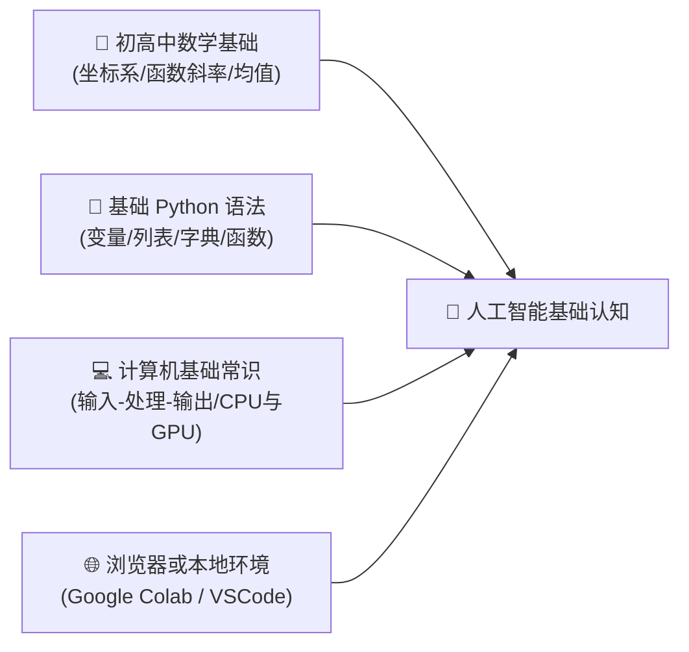
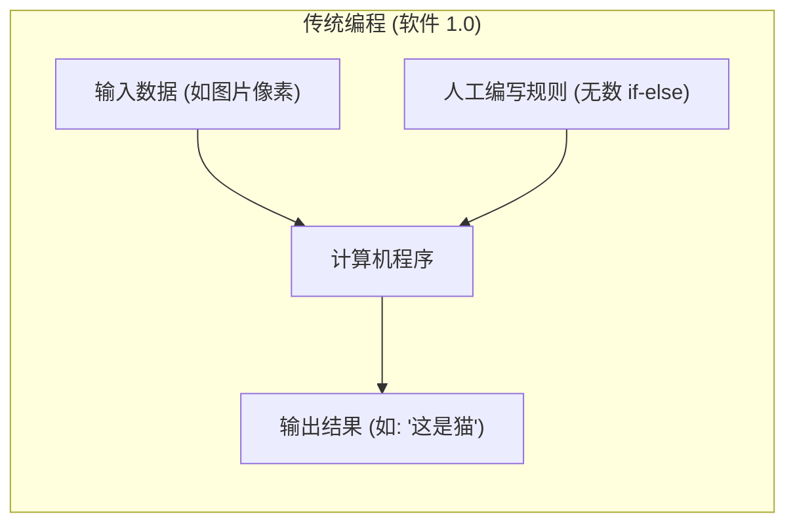
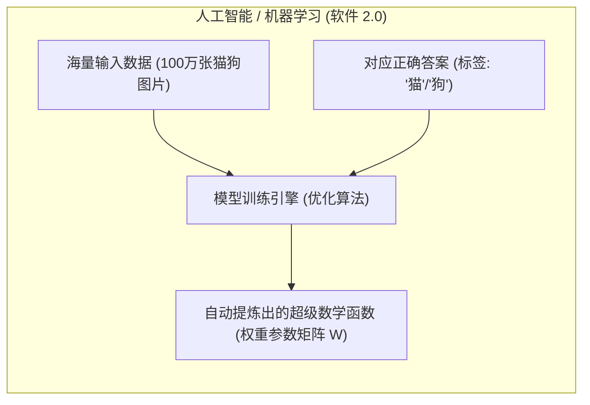
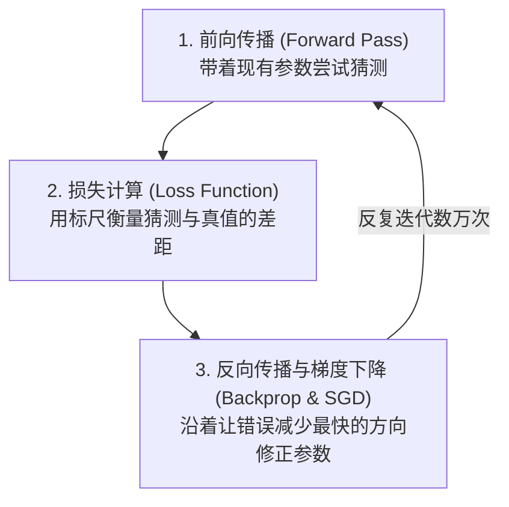
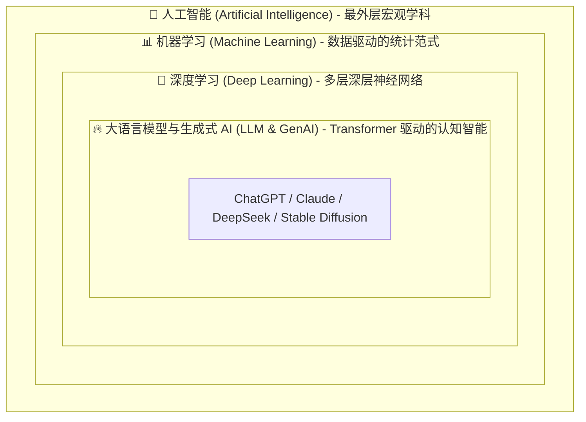

# 人工智能基础核心概念深度解析与系统化学习路径

> **“软件 1.0 是人类为机器编写精确的规则；而人工智能（软件 2.0）是人类提供海量的数据与答案，让机器自动学习出宇宙规律的函数映射。”**  
> 随着以 ChatGPT、Claude、DeepSeek 为代表的大语言模型爆发，人工智能已经从学术实验室走向千行百业。然而，面对铺天盖地的数学公式、算法论文与纷繁术语，初学者往往陷入“概念碎片化”或“数学劝退”的认知困境。

本指南严格遵循 **`new_know`** 认知解构规范，旨在为初学者与工程师建立一套**无门槛、有深度、可动手落地**的 AI 底层认知框架。全文结构如下：
1. **[📋 学习本指南所需的前置知识准备清单（Prerequisites）](#-学习本指南所需的前置知识准备prerequisites)**
2. **[💡 痛点溯源：为什么规则编程会崩溃？](#一-痛点溯源软件-10-在什么边界下崩溃)**
3. **[🧠 核心机制：人工智能运行的底层三要素](#二-核心机制揭秘ai-是如何从数据中学到知识的)**
4. **[🗺️ 概念同心圆结构解构：AI / ML / DL / LLM](#三-概念结构解构ai--ml--dl--llm-同心圆模型)**
5. **[🚀 由浅入深的四阶段系统化学习路线](#四-由浅入深四阶段系统化学习路线)**
6. **[🛠️ 25 行 Python 纯手写极简神经网络自闭环实战](#五-最小自闭环可运行实战纯-numpy-手写梯度下降)**

---

## 📋 学习本指南所需的前置知识准备（Prerequisites）

在开始系统学习人工智能之前，建议你已经具备以下基础认知。如果某些知识点有盲区，可参考推荐资源快速补齐：



| 模块类别 | 必备核心知识点 | 掌握程度与自测标准（如何自测？） | 零基础推荐前置补课资料 |
| :--- | :--- | :--- | :--- |
| **数学理论基础** | • **初高中函数与解析几何**：一次函数 $y = kx + b$、平面坐标、斜率（导数的直观几何意义）<br/>• **基础统计学概念**：平均数（Mean）、方差（Variance）、概率直观理解 | 能够画出 $y = 2x + 1$ 的图像；理解“斜率代表变化趋势的快慢与方向” | 3Blue1Brown《微积分的本质》（B站/YouTube） |
| **编程与数据结构** | • **Python 基础**：变量类型、循环（`for`/`while`）、列表与字典、基础函数定义<br/>• **NumPy 数组意识**：对“数组乘法”和列表运算不陌生 | 能独立写出一个 Python 脚本，遍历一个数字列表并求出其平均值 | 廖雪峰 Python 3 教程（基础语法部分） |
| **计算机与领域常识** | • **程序基本流程**：输入（Input） $\rightarrow$ 运算处理（Process） $\rightarrow$ 输出（Output）<br/>• **计算硬件直觉**：CPU（善于串行复杂逻辑） vs GPU（善于海量矩阵并行吞吐） | 理解电脑处理任务需要算力；知道为什么训模型大家都在抢显卡（GPU） | 极客时间《计算机组成原理通识》 |
| **开发与实验环境** | • **云端或本地环境**：能打开 Google Colab，或在本地电脑安装 Python 3.10+ | 能在浏览器中打开 Google Colab 单元格输入 `print("Hello AI")` 并回车执行 | Google Colab 官方 2 分钟新手上手教程 |

> [!TIP]
> **一分钟极简自测**：如果你知道“一次函数 $y = wx + b$ 中，$w$ 决定了直线的倾斜角度，$b$ 决定了直线的高低”，并且本地会用 Python 打印一句话，你就可以毫无门槛地通读本指南的全部内容！

---

## 一、 痛点溯源：软件 1.0 在什么边界下崩溃？

### 1. 传统规则编程（Rule-Based Systems）的死胡同

在没有现代人工智能之前，人类编写程序的方式是 **“人类设计规则 + 机器执行指令”**：



这种模式在面对**明确逻辑**时无往不利（如银行算利息、编译器词法分析、电商库存扣减）。但当它面对现实世界的**非结构化感知数据**时，会彻底崩溃：
- **经典困境：如何用 `if-else` 写一个“识别猫咪照片”的程序？**
  - 如果猫是黑色的？白色的？三花的？
  - 如果猫趴着？跑着？只露出一只耳朵？
  - 像素光照暗了一倍？视角倾斜了 15 度？
- **物理极限**：现实世界的多样性是**无限维度的连续空间**，人类工程师哪怕编写 10 亿行 `if-else`，也无法穷尽一只猫的全部形态特征。

### 2. 人工智能（软件 2.0）的核心思维跃迁

AI 提出了逆向思考：**既然人类总结不出全部规则，何不把规则的发现权交给机器？**



- **认知锚点（一句话灵魂比喻）**：
  > **AI 模型的本质，就是一个拥有数亿甚至数千亿参数的“超级复合万能拟合函数” $f(x)$。**  
  > 训练 AI，不是在教它“理解哲学”，而是在高维数学空间里，通过不断试错，把这个函数的参数调整到最拟合现实世界规律的状态。

---

## 二、 核心机制揭秘：AI 是如何从数据中学到知识的？

任何现代深度学习和机器学习系统，其学习机制都可以抽象为 **三大黄金动力支柱**：



### 1. 前向传播（Forward Pass）：神经元的数学直观
单个神经元模仿生物神经元的“刺激累加与阈值激活”，其数学形式极其简洁：

$$\hat{y} = \sigma\left(\sum_{i=1}^n w_i x_i + b\right) = \sigma(\mathbf{w}^T \mathbf{x} + b)$$

- $\mathbf{x}$（输入特征）：例如图片的像素灰度值、房屋的面积。
- $\mathbf{w}$（权重，Weights）：决定每个特征的重要程度。
- $b$（偏置，Bias）：基准门槛。
- $\sigma$（激活函数，如 ReLU、Sigmoid）：**关键转折点！** 若无激活函数，多层神经网络堆叠依然是线性方程，无法拟合现实世界复杂的非线性弯曲曲线。

### 2. 损失函数（Loss Function）：度量错误的严厉标尺
模型第一次猜的结果往往错得离谱。损失函数（Loss）就是用来计算“**猜得有多烂**”的量化数字：
- **回归任务（预测具体数值）**：均方误差 MSE $\mathcal{L} = \frac{1}{N}\sum (y - \hat{y})^2$
- **分类任务（判断类别）**：交叉熵损失 Cross-Entropy（度量两个概率分布的距离）

### 3. 反向传播与梯度下降（Gradient Descent）：“浓雾中如何下山”
知道了错误有多大，如何调整每个参数 $w$？
- **直观比喻**：你被蒙上双眼，置身于浓雾笼罩的大山中，你的目标是走到谷底（误差最小的地方）。你唯一能做的是**用脚探查四周地面的倾斜方向（梯度 Gradient）**，然后**沿着最陡峭的下坡方向迈出一小步（学习率 Learning Rate $\eta$）**：

$$w_{\text{new}} = w_{\text{old}} - \eta \cdot \frac{\partial \mathcal{L}}{\partial w}$$

通过链式求导法则（微积分基础），计算机可以极快地计算出网络中成千上万个神经元对总损失的贡献梯度，并在百万次迭代后收敛。

---

## 三、 概念结构解构：AI / ML / DL / LLM 同心圆模型

很多人常常将“人工智能”、“机器学习”、“深度学习”和“大模型”混为一谈。它们其实是一个严谨的**包含与演进关系**：



### 核心流派与技术对比表

| 层次 | 核心定义 | 关键代表技术/算法 | 优缺点与适用场景 |
| :--- | :--- | :--- | :--- |
| **人工智能 (AI)** | 广义概念：使机器展现出类人智能行为的一切技术学科（诞生于 1956 年达特茅斯会议） | 专家系统、A* 寻路算法、遗传算法、机器学习 | 涵盖符号学派与联结学派；早期系统规则过于僵化 |
| **机器学习 (ML)** | 狭义方法：无需显式编写规则，通过统计数学从历史数据中归纳规律的学科 | 线性回归、决策树、随机森林、SVM、K-Means、XGBoost | 解释性强、计算资源消耗低；但面对图像/音频等高维非结构化数据表现乏力 |
| **深度学习 (DL)** | 现代中坚：采用 3 层以上的深层人工神经网络（ANN），能够**端到端自动提取特征** | CNN（卷积视觉）、RNN/LSTM（循环时序）、ResNet | 彻底打破传统特征工程瓶颈；极度依赖海量标注数据和 GPU 算力，可解释性弱（黑盒） |
| **大模型 (LLM/GenAI)**| 前沿爆发：基于 Transformer 架构的海量参数通用预训练模型，具备泛化推理与涌现能力 | GPT-4、Claude 3.5、DeepSeek-V3、Llama 3、DALL-E | 零样本/小样本迁移能力极强，成为新一代计算操作系统；训练成本极高，存在幻觉（Hallucination）风险 |

---

## 四、 由浅入深四阶段系统化学习路线


### 阶段一：感性认知与极速上手（Day 1 ~ Week 1）
- **核心目标**：绝不陷入枯燥数学推导，先跑通第一个预测程序，直观感受“输入数据 $\rightarrow$ 机器自学 $\rightarrow$ 输出预测”。
- **推荐行动清单**：
  1. 打开 [Google Colab](https://colab.research.google.com/)，在免配置的云端 Python 环境中体验代码运行。
  2. 使用 30 行 Python 代码跑通一个手写数字识别（MNIST 数据集）。
  3. 玩一玩 Google 的 [Teachable Machine](https://teachablemachine.withgoogle.com/)，在浏览器里用摄像头采集动作，3 分钟无代码训练一个分类模型，直观感受数据输入与分类决策。

### 阶段二：经典机器学习核心骨架（Week 2 ~ Month 1）
- **核心目标**：掌握现代 AI 的统计基石与核心概念，理解数据预处理、过拟合与模型评估。
- **必备技能树**：
  - **核心算法**：线性回归（Regression）、逻辑回归（Classification）、决策树与随机森林（Random Forest）、K-均值聚类（K-Means）。
  - **核心概念**：训练集 vs 测试集、过拟合（Overfitting）与欠拟合（Underfitting）、正则化（L1/L2）。
  - **评估指标**：准确率（Accuracy）、精确率（Precision）、召回率（Recall）、F1 分数。
- **推荐实践**：
  - 使用 Python 工业级标准库 `scikit-learn` 载入鸢尾花（Iris）数据集，体验数据清洗、划分与模型训练全流程。

### 阶段三：深度学习架构与 PyTorch 实战（Month 2 ~ Month 3）
- **核心目标**：拆解多层神经网络黑盒，熟练掌握现代深度学习主流开发框架。
- **必备技能树**：
  - **开发框架**：全面掌握 **PyTorch**（张量 Tensor 操作、`nn.Module` 自定义网络、自动求导 Autograd、`DataLoader` 数据流）。
  - **三大经典骨干网络架构**：
    - **MLP（多层感知机）**：全连接网络基础。
    - **CNN（卷积神经网络）**：卷积核、池化层，掌握图像边缘提取原理。
    - **RNN / LSTM**：理解序列时序记忆机制与梯度消失问题。
- **推荐实践**：
  - 在 PyTorch 中搭建一个简单的 3 层神经网络，并在 Kaggle 猫狗图像分类赛题中动手完成一次模型推理。

### 阶段四：现代大模型与前沿工程应用（Month 4+）
- **核心目标**：深入前沿 Generative AI 范式，具备大模型二次开发、微调调优与工程落地的核心架构能力。
- **必备技能树**：
  - **Transformer 架构灵魂**：自注意力机制（Self-Attention）、Query-Key-Value 机制、多头注意力（Multi-Head Attention）。
  - **大模型生命周期**：海量无监督预训练（Pre-training） $\rightarrow$ 有监督指令微调（SFT） $\rightarrow$ 人类对齐（RLHF / DPO）。
  - **应用落地三大技术栈**：
    - **Prompt 工程与结构化输出**
    - **RAG（检索增强生成）**：结合向量数据库（如 Qdrant, pgvector）解决大模型幻觉与私有数据融合。
    - **AI Agent（智能体工作流）**：规划（Planning）、记忆（Memory）、工具调用（Tool Use / MCP）。
- **推荐实践**：
  - 使用开源模型（如 Qwen2.5 或 DeepSeek-R1）在本地通过 Ollama 或 vLLM 部署推理，并搭建一个个人专属私有知识库助手。

---

## 五、 最小自闭环可运行实战：纯 NumPy 手写梯度下降

为了让你**彻底破除 AI 的神秘感**，我们**不依赖任何现成框架（不调 PyTorch、不调 TensorFlow）**，仅用 **25 行纯 Python + NumPy**，从零手写一个最简单的单神经元线性模型，自动从数据中拟合出目标公式：

$$y = 3x + 2$$

### 1. 核心实战代码（可直接复制运行）

```python
import numpy as np

# 1. 制造真实世界数据（假设真实规律是: y = 3x + 2 + 极小随机噪声）
np.random.seed(42)
X = np.linspace(-1, 1, 100)
true_w, true_b = 3.0, 2.0
y = true_w * X + true_b + np.random.normal(0, 0.05, size=X.shape)

# 2. 随机初始化 AI 模型的参数（完全不知道答案是 3 和 2）
w = np.random.randn()
b = np.random.randn()
learning_rate = 0.1  # 学习率：每次下坡迈出的一小步

print(f"🚀 初始随机参数: w = {w:.4f}, b = {b:.4f}")

# 3. 开始训练循环（共让机器看 100 轮数据）
for epoch in range(1, 101):
    # ① 前向传播：带着现在的参数做预测
    y_pred = w * X + b
    
    # ② 计算均方误差损失 (MSE)
    loss = np.mean((y_pred - y) ** 2)
    
    # ③ 计算梯度（微积分求偏导）
    dw = np.mean(2 * (y_pred - y) * X)
    db = np.mean(2 * (y_pred - y))
    
    # ④ 梯度下降：沿着错误减小的方向更新权重
    w -= learning_rate * dw
    b -= learning_rate * db
    
    if epoch % 20 == 0:
        print(f"Epoch [{epoch:3d}/100] | 当前 Loss: {loss:.5f} | 学习到的参数: w={w:.4f}, b={b:.4f}")

print(f"\n🎉 最终学习成果: 拟合函数为 y = {w:.4f}x + {b:.4f} (完美逼近真实规律 3x + 2)！")
```

### 2. 预期输出与关键验证指标

在终端中执行 `python demo.py`，你将亲眼见证机器从“懵懂猜测”到“领悟真理”的过程：

```text
🚀 初始随机参数: w = 0.4967, b = -0.1383
Epoch [ 20/100] | 当前 Loss: 0.12931 | 学习到的参数: w=2.4512, b=1.5831
Epoch [ 40/100] | 当前 Loss: 0.00845 | 学习到的参数: w=2.8953, b=1.9184
Epoch [ 60/100] | 当前 Loss: 0.00287 | 学习到的参数: w=2.9796, b=1.9841
Epoch [ 80/100] | 当前 Loss: 0.00261 | 学习到的参数: w=2.9959, b=1.9969
Epoch [100/100] | 当前 Loss: 0.00260 | 学习到的参数: w=2.9991, b=1.9994

🎉 最终学习成果: 拟合函数为 y = 2.9991x + 1.9994 (完美逼近真实规律 3x + 2)！
```

### 3. 故障排查与自测反思点
- **如果把 `learning_rate` 改成 `10.0` 会怎样？**  
  $\rightarrow$ 步子迈得太大，会在山谷两侧来回震荡，Loss 直接变成 `inf`（梯度爆炸）。
- **如果把 `learning_rate` 改成 `0.00001` 会怎样？**  
  $\rightarrow$ 步子太小，100 轮之后参数几乎纹丝不动，模型无法在有限时间内收敛。
- **这个小实验揭示了什么？**  
  $\rightarrow$ 无论包含 1750 亿参数的 GPT-4 还是这个只有 2 个参数的 Demo，其底层的数学本质**毫无二致**：定义损失 $\rightarrow$ 计算梯度 $\rightarrow$ 步步调整参数。

---

## 总结与下一步进阶建议

1. **核心心智模型建立**：记住，AI 不是魔法，而是用微积分与线性代数搭建的精巧统计机器。
2. **拒绝盲目啃数学**：不必一上来就通读泛函分析或概率论；**“以实战代码为锚点，遇到不懂的微积分求导再有针对性地逆向补课”**，是现代工程师掌握 AI 最快、最不痛苦的路径。
3. **下一步推荐**：在 Google Colab 上亲手运行上述 25 行代码，然后尝试将它改写为预测多元输入（如面积和房间数预测房价），你就已经迈入了现代机器学习的大门！
