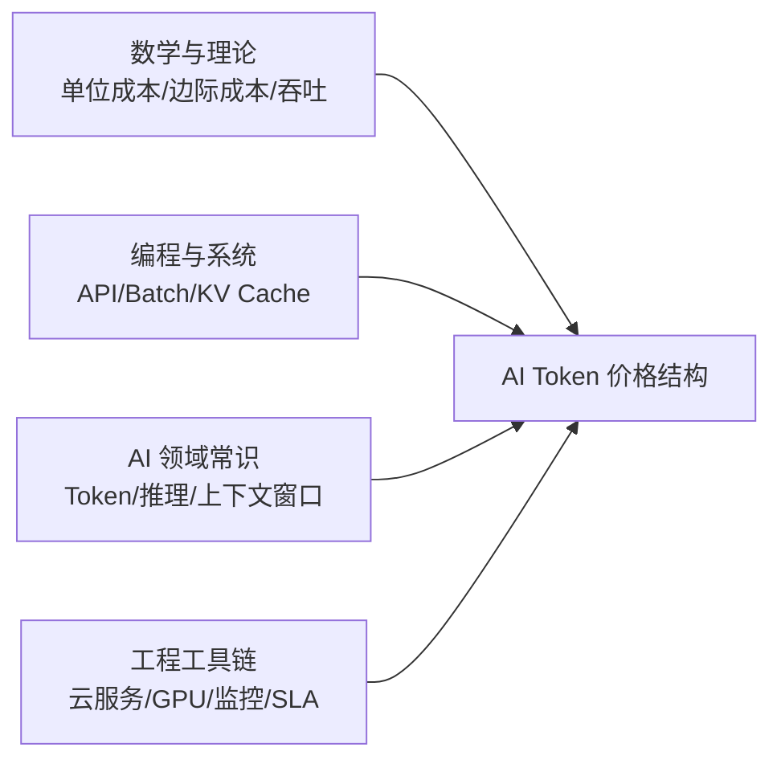
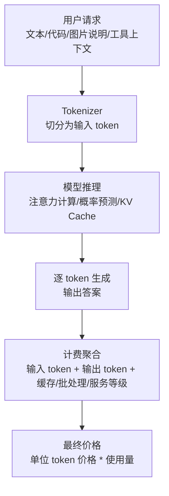

# AI Token 价格影响因素深度解析与成本结构研究

> **AI 领域的 token 价格，不是“文字价格”，而是大模型把输入读进去、把输出算出来时，每一小段语言背后的单位智能计算价格。**

本文讨论的 token，特指大模型 API、推理服务、智能体平台和模型调用计费中的 **AI token**，不是区块链或虚拟货币中的 token。

为了便于理解，本文给出一个经验性的价格影响比例模型：

| 影响因素 | 参考占比 |
| :--- | ---: |
| 算力与硬件成本 | 30% |
| 模型规模与架构复杂度 | 20% |
| 推理效率与系统优化 | 15% |
| 上下文窗口与显存占用 | 10% |
| 服务质量与可靠性 | 10% |
| 训练与研发摊销 | 7% |
| 市场竞争与商业策略 | 5% |
| 数据、安全、合规成本 | 3% |

> [!IMPORTANT]
> 上表不是任何单一厂商的财务披露，而是用于理解 AI token 定价逻辑的分析模型。不同厂商、不同模型、不同调用方式、不同部署形态下，比例会发生变化。

---

## 学习本指南所需的前置知识准备



| 模块类别 | 必备核心知识点 | 掌握程度与自测标准（如何知道自己已达标？） | 零基础推荐前置补课资料 |
| :--- | :--- | :--- | :--- |
| **数学/理论基础** | 单位成本、固定成本、边际成本、吞吐率、利用率 | 能解释“同样 100 万 token，低峰批处理和高峰实时请求为什么成本不同” | 微观经济学中的边际成本概念；云计算 FinOps 入门文章 |
| **编程/数据结构** | API 调用、并发请求、缓存、批处理、队列调度 | 能看懂一次模型调用中 prompt、completion、latency、tokens 的含义 | 任意 REST API 入门；Python requests 基础 |
| **领域上下文** | Token、输入 token、输出 token、上下文窗口、推理模型、多模态模型 | 能用自己的话说明为什么输出 token 通常比输入 token 更贵 | OpenAI、Anthropic、Google 等模型 API 文档中的 pricing/token 说明 |
| **环境与工具** | GPU/TPU/NPU、云服务器、模型服务、SLA、日志监控 | 能解释“模型 API 价格中为什么包含稳定性和高可用成本” | 云计算入门；NVIDIA GPU 与数据中心基础科普 |

> [!TIP]
> **一分钟极简自测**：如果你知道“token 是模型处理文本的基本单位，而不是自然语言里的一个完整单词”，并且你能区分“输入 token”和“输出 token”，你就可以顺畅读完本文。

### 前置概念 1：Token

**一句话定义**：Token 是大模型读写文本时使用的最小处理片段，可能是一个汉字、一个英文词的一部分、一个标点，也可能是一段编码后的文本片段。

**它在本文中的作用**：AI 服务按 token 计费，是因为模型内部并不是按“文章篇数”或“字符数”工作，而是把文本切成 token 后进行向量化、注意力计算和逐步生成。

**最小例子**：

```text
输入：ChatGPT 很强
可能被切成：Chat / G / PT / 很 / 强
```

实际切分取决于 tokenizer，不同模型的切分方式可能不同。

**常见误解**：很多人把 token 理解成“一个单词”。这在英文里有时近似成立，但并不准确；在中文、代码、数学符号、多语言混合文本中，token 和自然语言词语经常不一一对应。

### 前置概念 2：输入 Token 与输出 Token

**一句话定义**：输入 token 是模型读进去的上下文，输出 token 是模型生成出来的回答。

**它在本文中的作用**：大多数商业模型会把输入和输出分开计价，且输出 token 往往更贵。原因是输入更像“读材料”，输出更像“边推理边写作”。

**最小例子**：

```text
用户输入：请总结这篇 3000 字文章
模型输出：一段 500 字摘要

计费通常会拆成：
输入 token 成本 + 输出 token 成本
```

**常见误解**：输入 token 不是免费的。即使模型最后只输出一句话，长 prompt、长文档、长代码上下文依然会消耗计算和显存资源。

### 前置概念 3：推理成本

**一句话定义**：推理成本是模型在服务用户请求时，为读入上下文、计算概率分布、生成下一个 token 所消耗的硬件和系统成本。

**它在本文中的作用**：token 价格的底层锚点不是文本本身，而是推理过程里的矩阵计算、显存占用、芯片时间、电力散热和系统调度。

**最小例子**：

```text
每生成 1 个 token
模型都要根据已有上下文计算“下一个 token 最可能是什么”
```

如果回答有 1000 个输出 token，这个过程会重复很多轮。

**常见误解**：很多人以为模型“想好一次再整段输出”。真实系统通常是自回归生成，至少在经典 Transformer 语言模型中，输出是逐 token 展开的。

### 前置概念 4：上下文窗口

**一句话定义**：上下文窗口是模型一次请求中能够看到的最大 token 数量。

**它在本文中的作用**：上下文越长，模型需要维护的 KV Cache 越大，注意力计算和显存压力越高，因此超长上下文通常会影响价格和速度。

**最小例子**：

```text
8K 上下文：适合普通问答、短文档
128K 上下文：适合长报告、代码库片段、多文档分析
1M 上下文：适合超长材料，但成本与延迟压力显著提高
```

**常见误解**：上下文窗口越大不等于每次都更好。把大量无关材料塞进 prompt，会增加成本、延迟和噪声。

### 前置概念 5：边际成本与固定成本

**一句话定义**：固定成本是模型研发、训练、基础设施建设等先投入成本；边际成本是每多处理一批 token 新增的实际运行成本。

**它在本文中的作用**：AI token 定价同时受两类成本影响。短期内，边际推理成本决定价格底线；长期看，训练研发和平台建设成本也需要通过规模化调用回收。

**最小例子**：

```text
训练旗舰模型：先花很大一笔固定成本
每天 API 调用：持续产生边际推理成本
```

**常见误解**：模型训练完成后并不是“回答免费”。训练成本可能已经发生，但每一次推理仍然要消耗真实算力。

---

## 一、为什么 AI Token 价格会成为关键问题？

### 1. 传统软件计价方式在大模型时代失灵

传统 SaaS 常见计价方式是按账号、席位、存储空间、功能模块或请求次数收费。到了大模型时代，请求次数已经不能准确反映成本。

一次请求可能只是：

```text
“把这句话翻译成英文”
```

也可能是：

```text
“阅读 20 万 token 的代码库上下文，定位缺陷并生成修复方案”
```

两者都是一次 API 调用，但成本完全不在同一量级。因此模型厂商需要用 token 作为更接近真实负载的计价单位。

### 2. 一句话灵魂比喻

**AI token 价格像“智能电表”：它不关心你是在写邮件、分析代码还是做客服，它记录的是模型为了完成任务实际消耗了多少智能计算。**

### 3. 从用户请求到 token 账单的数据流



---

## 二、AI Token 价格影响因素总览

一个简化的定价结构可以写成：

```text
AI Token 价格
= 算力硬件成本
+ 模型复杂度成本
+ 推理系统成本
+ 上下文与显存成本
+ 服务质量成本
+ 训练研发摊销
+ 市场策略溢价/补贴
+ 数据安全与合规成本
```

其中最核心的三项是：

```text
算力硬件 + 模型复杂度 + 推理效率 = 约 65%
```

这意味着，AI token 价格的主要矛盾是：**如何用更少的计算，提供更强、更稳定、更长上下文的智能服务。**

---

## 三、核心影响因素拆解

### 1. 算力与硬件成本：约 30%

这是 AI token 价格中最基础、最直接的部分。

大模型推理通常依赖 GPU、TPU、NPU 或其他 AI 加速芯片。模型每处理一批 token，都要执行大量矩阵乘法、注意力计算和缓存读写。高端芯片昂贵，数据中心建设周期长，电力和散热也是真实成本。

| 子因素 | 对价格的影响 |
| :--- | :--- |
| 芯片采购成本 | GPU 越贵，单位推理成本越难压低 |
| 芯片利用率 | 利用率越高，闲置成本越少，token 单价越有下降空间 |
| 显存容量 | 大模型、长上下文、多并发请求都依赖显存 |
| 内存带宽 | 生成阶段常受显存带宽限制，不只是算力峰值 |
| 电力与散热 | 长期运营成本会进入 token 价格 |
| 数据中心运维 | 机房、网络、容灾、人员都需要摊销 |

最容易被忽略的是 **利用率**。一块昂贵 GPU 如果大部分时间空闲，单位 token 成本会非常高；如果通过批处理、调度和多租户系统持续满载，成本就能被摊薄。

### 2. 模型规模与架构复杂度：约 20%

模型越强，通常每 token 所需计算越多，但二者不是简单线性关系。

影响模型复杂度的因素包括：

- 参数规模：参数越多，矩阵计算规模通常越大。
- 层数和隐藏维度：决定每个 token 经过多少计算路径。
- 注意力结构：长上下文注意力机制会显著影响成本。
- MoE 架构：混合专家模型只激活部分专家，可能用更低成本获得较强能力。
- 推理模型机制：复杂推理、长链路思考、工具调用会增加输出侧成本。
- 多模态编码器：图像、音频、视频输入会引入额外编码成本。

一个重要判断是：**模型能力越接近旗舰级，价格中“能力溢价”和“复杂推理成本”的占比越高。**

小模型适合分类、抽取、改写、简单客服等高频任务；大模型适合复杂推理、代码生成、多文档综合、规划与 Agent 工作流。把所有任务都交给最贵模型，通常不是经济最优。

### 3. 推理效率与系统优化：约 15%

推理效率决定“同一个模型能不能卖得更便宜”。

常见优化方式如下：

| 优化方式 | 作用 | 对价格的影响 |
| :--- | :--- | :--- |
| KV Cache | 缓存历史 token 的 Key/Value，减少重复计算 | 降低长对话和续写成本 |
| Batch 推理 | 多个请求合并执行，提高 GPU 利用率 | 降低单位 token 成本，但可能增加等待 |
| 量化 | 用更低精度表示权重和激活 | 降低显存与计算压力 |
| Speculative Decoding | 小模型先草拟，大模型校验 | 提高生成速度，降低延迟成本 |
| 并行调度 | 在多卡、多节点间合理切分任务 | 提升吞吐，减少资源空转 |
| 蒸馏与模型路由 | 简单任务走便宜模型，困难任务走强模型 | 降低平均调用成本 |

这也是为什么模型 API 价格会不断下降：不只是芯片变便宜，也因为推理系统持续优化。

一个成熟厂商的优势，经常不只在模型本身，而在服务系统能否把请求调度得足够密、足够稳、足够快。

### 4. 上下文窗口与显存占用：约 10%

长上下文是 token 价格的放大器。

当用户把长文档、代码库、聊天历史、检索结果全部塞进 prompt，输入 token 数量增加只是第一层成本。更深层的成本是：模型需要为这些 token 维护上下文状态，KV Cache 占用显存，注意力计算和内存访问压力上升。

典型现象包括：

- 普通上下文价格较低，超长上下文价格较高。
- 缓存命中的输入 token 可能更便宜。
- 长上下文请求的延迟更高。
- 多轮对话如果不做摘要压缩，成本会越来越高。

因此，真实工程中常见的省钱策略不是“少用 AI”，而是：

```text
少塞无关上下文
+ 做检索召回
+ 做上下文压缩
+ 利用缓存
+ 分层模型路由
```

### 5. 服务质量与可靠性：约 10%

API 价格不只包含模型计算，还包含“稳定可用”的服务成本。

企业级 AI 服务需要解决：

- 低延迟响应
- 高并发吞吐
- 峰值流量冗余
- 多区域部署
- 故障转移
- 请求队列和限流
- 日志、监控、告警
- SLA 与企业支持

同一个模型，如果是离线批处理，可以用更低成本慢慢跑；如果是面向千万用户的实时客服、代码助手、搜索问答，就必须为峰值和可靠性付费。

所以 token 单价中有一部分不是“模型更聪明”的钱，而是“随时可用、稳定可用、大规模可用”的钱。

### 6. 训练与研发摊销：约 7%

虽然 token 计费主要发生在推理阶段，但旗舰模型的训练和研发投入也会影响商业定价。

这部分成本包括：

- 预训练算力
- 数据清洗与过滤
- 后训练与偏好对齐
- 安全评测
- 红队测试
- 模型压缩与部署工程
- 研究团队与基础设施投入

当模型刚发布时，研发摊销和能力溢价通常更高；随着调用规模扩大、推理系统优化、模型被新一代产品替代，价格往往会下降。

### 7. 市场竞争与商业策略：约 5%

AI token 价格并不完全由成本决定。厂商会根据市场目标做策略性定价。

常见策略包括：

- 低价模型吸引开发者生态。
- 旗舰模型维持高端能力溢价。
- 免费额度降低试用门槛。
- Batch API 打折鼓励离线任务。
- Prompt caching 降低重复上下文成本。
- 输入便宜、输出较贵，引导用户控制生成长度。
- 企业套餐绑定安全、权限、审计和支持能力。
- 开源模型竞争压低闭源 API 价格。

因此，观察 token 价格时，要同时看技术成本和商业意图。有时降价不是因为成本立刻下降，而是因为厂商希望抢占开发者、应用生态和企业预算入口。

### 8. 数据、安全、合规成本：约 3%

这部分在普通消费级 API 中占比可能不高，但在企业、金融、医疗、教育、政务场景中会显著上升。

相关成本包括：

- 数据隐私保护
- 内容安全审核
- 滥用检测
- 权限隔离
- 审计日志
- 数据驻留
- 合规认证
- 企业级删除和保留策略

合规能力通常不会直接让模型回答得更聪明，但会决定一个模型服务能否进入高价值行业。

---

## 四、不同模型类型的价格结构差异

| 模型类型 | 主要成本中心 | 价格特点 | 适合任务 |
| :--- | :--- | :--- | :--- |
| 小模型 | 部署、吞吐、服务调度 | token 便宜，延迟低 | 分类、抽取、简单改写、批量处理 |
| 通用大模型 | 算力、研发、服务质量 | 价格中高，能力均衡 | 问答、写作、代码、综合分析 |
| 推理模型 | 输出阶段计算、长链路推理 | 输出 token 或推理步骤更贵 | 数学、代码推理、复杂规划 |
| 长上下文模型 | 显存、KV Cache、上下文调度 | 长输入敏感，缓存价值高 | 长文档、代码库、多轮任务 |
| 多模态模型 | 图像/音频/视频编码器 | 不只按文本 token 成本计算 | 看图、听音频、视频理解 |
| 企业专属模型 | 隔离、安全、SLA、支持 | 溢价明显 | 金融、医疗、政企、内部知识库 |

这张表的核心启发是：**便宜模型不是低级模型，而是适合高频、确定、短链路任务的经济模型；昂贵模型也不是万能模型，而是适合复杂、不确定、高价值任务的专家资源。**

---

## 五、价格下降的主要驱动力

### 1. 硬件进步

更高算力、更大显存、更低能耗、更高带宽的芯片，会直接压低单位 token 的硬件成本。专用 AI 芯片和云厂商自研加速器，也会改变长期成本结构。

### 2. 推理系统优化

KV Cache、量化、投机解码、批处理、并行调度、内核优化，会让同一模型在同样硬件上处理更多 token。

### 3. 模型架构演进

MoE、蒸馏、小模型路由、稀疏注意力、长上下文优化，会让模型不必每次都用最大计算路径回答所有问题。

### 4. 市场竞争

开源模型、云厂商、创业公司和大模型平台之间的竞争，会持续压缩通用能力模型的价格。

### 5. 产品计费细化

未来 token 价格会越来越细：实时调用、离线批处理、缓存命中、长上下文、多模态输入、推理深度、企业 SLA，都可能形成不同计费层。

---

## 六、使用者如何理解和优化 Token 成本？

对开发者和企业来说，理解 token 价格不是为了盯着每个字省钱，而是为了做合理架构。

### 1. 控制输入上下文

不要把所有资料一次性塞给模型。更好的方式是：

- 先检索相关片段。
- 再压缩上下文。
- 最后只把必要信息交给模型。

### 2. 控制输出长度

输出 token 通常更贵。对于结构化任务，可以明确要求：

```text
只输出 JSON
只输出 5 条结论
每条不超过 50 字
```

这比笼统地说“详细回答”更可控。

### 3. 做模型分层

可以把任务分成三层：

| 任务类型 | 推荐模型策略 |
| :--- | :--- |
| 简单分类、抽取、格式转换 | 小模型 |
| 普通问答、摘要、写作 | 中等通用模型 |
| 复杂推理、代码架构、关键决策 | 强模型或推理模型 |

### 4. 利用缓存和批处理

如果系统中大量请求共享相同说明、相同文档、相同知识库上下文，prompt caching 会显著降低重复输入成本。

如果任务不需要实时返回，Batch API 或离线队列通常更便宜。

### 5. 用成本指标管理 AI 应用

真正成熟的 AI 应用，不只看准确率，还应该看：

- 每次任务平均 token 成本
- 输入/输出 token 比例
- 缓存命中率
- 单用户日均成本
- 单业务动作成本
- 延迟和失败率
- 不同模型路由占比

---

## 七、最终比例模型

综合来看，AI token 价格可以近似拆成：

```text
Token 价格
= 30% 算力硬件
+ 20% 模型复杂度
+ 15% 推理系统效率
+ 10% 上下文与显存
+ 10% 服务质量
+ 7% 训练研发摊销
+ 5% 市场策略
+ 3% 安全合规
```

如果只保留一句话结论：

> **AI token 价格的本质，是模型能力、推理效率、硬件资源和商业策略共同折算出来的单位智能计算价格。**

未来通用 token 单价大概率继续下降，但高端推理、超长上下文、多模态理解、企业安全和实时高可靠服务，仍会保留明显溢价。

---

## 八、压缩学习路线

| 阶段 | 目标 | 练习 | 验收标准 |
| :--- | :--- | :--- | :--- |
| 阶段一：建立直觉 | 分清 token、输入 token、输出 token | 拿一条 API pricing 表，解释输入/输出为何不同价 | 能说清“为什么输出更贵” |
| 阶段二：理解成本 | 拆解算力、显存、上下文、推理效率 | 用本文比例模型分析一个模型价格 | 能指出前三大成本来源 |
| 阶段三：工程优化 | 学会控制上下文、输出长度、模型路由 | 设计一个“便宜模型 + 强模型”的两层调用方案 | 能降低平均调用成本 |
| 阶段四：商业判断 | 看懂厂商定价策略 | 比较实时、Batch、缓存、企业版价格差异 | 能判断价格变化背后的策略 |

