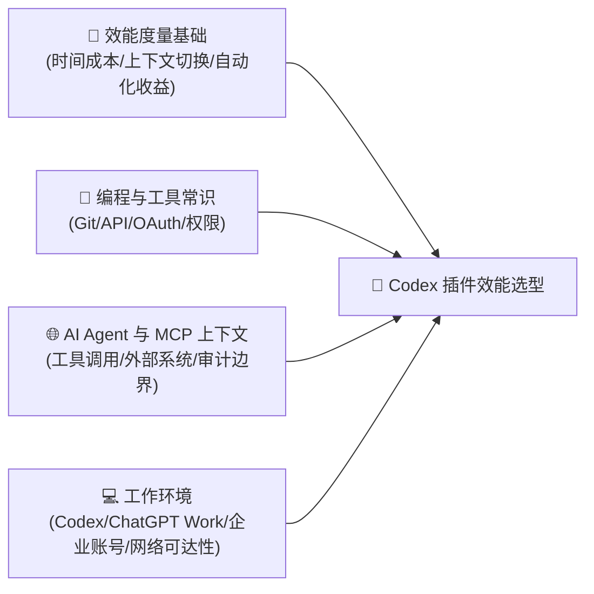
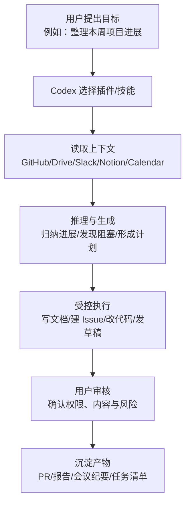
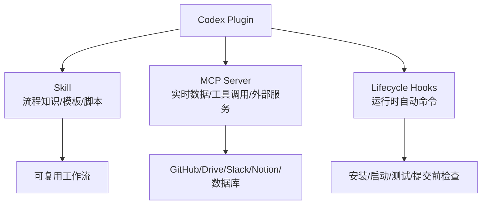
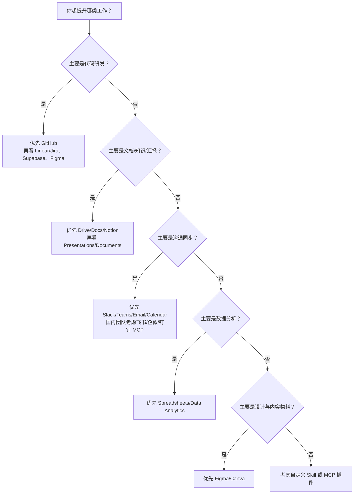
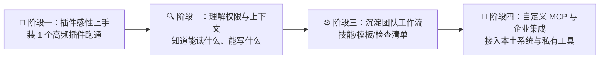

# Codex 插件生态与工作效能提升指南

> **“Codex 插件不是给 AI 装饰用的小挂件，而是把它从‘会写代码的聊天框’推进到‘能接入真实工作系统的执行代理’。”**
> 对中国大陆的开发者、产品经理、运营、设计和教育工作者来说，真正值得关心的不是“插件商店里哪个名字最热闹”，而是：哪些插件能接入你每天已经在用的代码仓库、文档、设计稿、项目管理、邮件日程和数据表，并把原本需要跨软件复制粘贴的流程压缩成一次可审计的代理任务。

> [!IMPORTANT]
> 截至 2026-09-22，OpenAI 官方文档说明 **ChatGPT 与 Codex 共用通用插件目录**，插件可以包含技能、MCP 服务器、两者组合以及 Codex 运行时生命周期钩子；但官方并未发布“按中国大陆用户数排序的 Codex 插件排行榜”。因此本文的“受欢迎”采用更严谨的定义：**官方/市场可见度 + 中国大陆用户真实工作流适配度 + 可量化效能提升潜力**，而不是伪造下载榜单。

本文参考：

- OpenAI 官方文档：[技能与插件](https://developers.openai.com/zh-Hans/docs/skills-and-plugins)
- OpenAI 官方文档：[插件架构](https://developers.openai.com/zh-Hans/plugins/concepts/plugins)
- OpenAI 官方文档：[构建技能](https://developers.openai.com/zh-Hans/plugins/build/skills)
- OpenAI 官方说明：[Codex for every role, tool, and workflow](https://openai.com/zh-Hans-CN/index/codex-for-every-role-tool-workflow/)
- OpenAI 公开插件示例仓库：[role-specific-plugins](https://github.com/openai/role-specific-plugins)

---

## 📋 学习本指南所需的前置知识准备（Prerequisites）



| 模块类别 | 必备核心知识点 | 掌握程度与自测标准（如何知道自己已达标？） | 零基础推荐前置补课资料 |
| :--- | :--- | :--- | :--- |
| **数学/理论基础** | 时间成本、上下文切换成本、自动化 ROI、信息检索召回率 | 能把一个工作流拆成“查找资料、理解上下文、执行修改、同步结果”四类耗时，并粗略估算每周可节省多少小时 | 《The Goal》约束理论；《Deep Work》关于上下文切换的章节 |
| **编程/数据结构** | Git、Issue/PR、API、Webhook、OAuth 授权、文件树与权限边界 | 能解释为什么 GitHub 插件可以读 PR，但写入仓库或创建 PR 需要更高权限 | GitHub Docs：Pull requests 与 OAuth Apps 基础 |
| **领域上下文** | AI Agent、MCP、插件、技能、连接器、工作流自动化 | 能用自己的话说明“插件负责接入工具，技能负责沉淀流程，MCP 负责把外部系统暴露为可调用工具” | OpenAI Docs：Skills and Plugins、Model Context Protocol |
| **环境与工具** | Codex 桌面/CLI、ChatGPT Work、浏览器、企业账号、VPN/网络策略、SSO 管理 | 能确认一个插件是否已安装、是否已授权、是否能访问目标工作区或仓库 | OpenAI 插件文档；企业管理员的应用授权说明 |

> [!TIP]
> **一分钟极简自测**：如果你知道“插件不是模型能力本身，而是让 Codex 连接外部工具与上下文的资源包”，并且你能列出自己每天最常打开的 5 个工作软件，你就可以顺畅读完本指南并开始做插件选型。

---

## 一、为什么中国大陆用户需要重新理解 Codex 插件？

### 1. 传统 AI 工作流在什么边界下崩溃？

很多人最初使用 Codex 或 ChatGPT 的方式是“复制一段上下文进去，让它回答”。这个方式在单点问题上很有效，但在真实工作中很快遇到四类瓶颈：

1. **上下文搬运成本高**：需求在飞书/Notion/Google Docs，代码在 GitHub，设计稿在 Figma，数据在表格，AI 却只看到你粘贴的一小段。
2. **工具切换损耗大**：查邮件、看 PR、翻设计稿、读会议纪要、改代码、写周报，每一步都在不同软件之间跳转。
3. **结果难以回写**：AI 生成的计划、代码、总结还要人工复制回 Issue、PR、文档或邮件。
4. **流程无法复用**：每次都要重新解释“我们公司的 PR 模板、周报格式、设计走查口径、项目管理习惯”。

Codex 插件的价值，就是把这些碎片系统接进来，让模型能在权限允许的范围内读取上下文、执行动作、回写产物。

### 2. 一句话灵魂比喻

**插件像给 Codex 发“工作证”和“门禁卡”：没有插件，它只能听你描述办公室；有插件，它可以在授权范围内进入对应系统、查资料、办事、留下记录。**

### 3. 从口头需求到真实交付的数据流



---

## 二、先说结论：中国大陆最值得优先关注的 Codex 插件梯队

> [!NOTE]
> 这里的“最受欢迎”不是官方下载量排行，而是面向中国大陆个人开发者、创业团队、外企/跨境团队、AI 原生工作者的实用优先级。若你的团队主要使用飞书、企业微信、钉钉、语雀、腾讯文档、阿里云、腾讯云，则应优先考虑官方插件之外的 MCP/自定义插件路线。

| 优先级 | 插件/插件类型 | 典型人群 | 效能提升关键词 | 中国大陆使用提示 |
| :--- | :--- | :--- | :--- | :--- |
| S | **GitHub** | 开发者、技术负责人、开源作者 | PR 走查、Issue 分类、CI 失败定位、代码变更摘要 | GitHub 在国内技术圈仍高度常用，但访问稳定性受网络环境影响 |
| S | **Google Drive / Docs / Sheets / Slides** | 跨境团队、咨询、教育、产品运营 | 文档检索、资料汇总、表格分析、汇报材料生成 | 需要可访问 Google Workspace；本土团队可用 Drive 思路迁移到企业网盘/MCP |
| S | **Notion** | 创业团队、知识库重度用户、个人知识管理 | 会议纪要、项目 Wiki、需求文档、知识库问答 | 国内使用面广但网络环境不稳定，适合个人和小团队 |
| A | **Figma** | 前端、设计师、产品经理 | 设计稿理解、UI 走查、设计转代码、组件一致性检查 | 国内互联网产品设计流程高频使用，设计到前端链路收益明显 |
| A | **Slack / Teams** | 外企、跨境团队、远程协作团队 | 线程总结、行动项提取、事故复盘、跨团队同步 | 国内本土团队更常见飞书/企微/钉钉，需要替代插件或 MCP |
| A | **Linear / Jira 类项目管理** | 工程团队、产品研发团队 | Issue 拆解、优先级梳理、Sprint 总结、任务回写 | Linear 在 AI/海外团队更常见；国内可映射到 TAPD、PingCode、飞书项目 |
| A | **Gmail / Outlook Email + Calendar** | 管理者、销售、咨询、跨境商务 | 邮件归纳、日程安排、会前简报、跟进草稿 | 取决于企业邮箱体系；Outlook/Teams 在外企更常见 |
| B | **Spreadsheets / Data Analytics** | 运营、财务、数据分析、增长团队 | 清洗数据、生成报表、异常解释、KPI 复盘 | 对不写 SQL 的业务同学提升很大，适合搭配 Drive/Sheets |
| B | **Supabase / 数据库类插件** | 全栈开发者、独立开发者、AI 应用团队 | Schema 理解、SQL 辅助、RLS 排查、后端联调 | AI 应用原型和小团队全栈开发收益高 |
| B | **Canva / Presentations / Documents** | 市场、培训、销售、教师 | 方案页、PPT、讲义、品牌材料生成 | 对内容交付团队有效，但需配合品牌规范和人工审核 |

---

## 三、核心机制：Codex 插件到底由什么组成？

OpenAI 官方文档对插件的定位很清楚：插件是 ChatGPT 和 Codex 中可发现、安装、分享和发布的软件包。一个插件可以包含：

1. **Skills（技能）**：给模型提供可复用的工作流指令、模板、脚本和资源。
2. **MCP Server（模型上下文协议服务器）**：暴露外部系统的工具、实时数据、授权与受控操作。
3. **技能 + MCP 组合**：既能连接真实系统，又能规定怎样完成某类工作。
4. **Lifecycle Hooks（生命周期钩子）**：在 Codex 运行时特定阶段执行命令，适合环境初始化、检查、格式化、测试等自动化动作。



### 插件和普通提示词的本质区别

| 维度 | 普通提示词 | Codex 插件 |
| :--- | :--- | :--- |
| 上下文来源 | 用户手动粘贴 | 从授权系统读取 |
| 执行动作 | 多为生成建议 | 可在权限范围内读写工具 |
| 复用方式 | 每次重新解释 | 技能/模板/脚本固化 |
| 审计边界 | 难以追踪 | 可通过工具调用、PR、评论、草稿留下记录 |
| 适合任务 | 单次问答、轻量生成 | 多系统、多步骤、可回写的工作流 |

---

## 四、主流插件如何提升工作效能？

### 1. GitHub：开发者的第一优先级

**典型工作流**

- 读取 Issue 背景，定位相关代码文件。
- 根据 CI 错误日志修复测试。
- 总结 PR 变更，指出风险点和缺少的测试。
- 将需求拆成小提交或小 PR。

**效能提升**

- 把“读代码 + 查上下文 + 写修改说明”的时间压缩 30%~60%。
- 降低新人接手陌生仓库的启动成本。
- 对开源维护者尤其有用：Issue 分类、复现路径整理、PR 初筛都可以代理化。

**适用判断**

如果你每天打开 GitHub 超过 5 次，或者经常让 AI 根据仓库上下文改代码，GitHub 插件就是最先应该接入的插件。

### 2. Google Drive / Docs / Sheets / Slides：知识资产入口

**典型工作流**

- 从一组文档中提炼项目背景、风险、时间线。
- 把会议记录整理成客户状态更新。
- 从 Sheets 中读取数据，生成运营分析和图表说明。
- 根据旧 PPT 和新素材生成汇报草稿。

**效能提升**

- 减少“到处找最新版文档”的时间。
- 把文档、表格、幻灯片变成可被 Codex 直接引用的知识库。
- 对咨询、教育、跨境协作、客户交付类工作尤其有效。

**中国大陆提示**

Google Workspace 在大陆网络环境中不稳定。若团队主要使用飞书文档、腾讯文档、语雀或企业网盘，可以把 Drive 插件的思想迁移为自定义 MCP：统一暴露“搜索文档、读取页面、写入草稿、追加评论”等工具。

### 3. Notion：从第二大脑到项目操作台

**典型工作流**

- 把零散会议纪要转为结构化任务。
- 根据知识库回答“这个项目为什么这么设计”。
- 生成周报、复盘、产品需求文档。
- 从数据库视图中筛出延期任务和阻塞项。

**效能提升**

- 降低知识库“写了但没人看”的问题。
- 让 Codex 能从长期沉淀的项目背景中理解当前任务。
- 对个人知识管理、初创团队、内容团队很友好。

### 4. Figma：设计到代码的高价值桥梁

**典型工作流**

- 读取设计稿结构，生成 React/Vue 组件草稿。
- 检查设计稿与已有 Design System 是否一致。
- 把交互状态、间距、颜色、字体转成开发任务。
- 对比设计稿与实现页面，指出视觉偏差。

**效能提升**

- 减少设计和前端之间反复口头解释。
- 把“看图写 CSS”的手工劳动变成可审查的工程任务。
- 对 UI 密集型产品、官网、后台管理系统、移动端 H5 都有明显收益。

### 5. Slack / Teams：把聊天流变成行动流

**典型工作流**

- 总结长线程，提取决策和行动项。
- 生成事故复盘初稿。
- 从频道中查找某个问题的历史讨论。
- 将讨论转成 Issue、PR 说明或客户回复草稿。

**效能提升**

- 降低“信息埋在群聊里”的损耗。
- 新成员可以快速追上项目上下文。
- 事故响应和跨时区协作收益尤其大。

**中国大陆提示**

本土团队往往使用飞书、企业微信或钉钉。若没有官方插件，价值路径依然成立：用 MCP 或企业开放 API 暴露“搜索消息、读取会话、写入草稿、创建任务”等能力。

### 6. Linear / Jira 类项目管理：让任务系统真正可执行

**典型工作流**

- 根据需求文档拆解 Issue。
- 从提交记录和 PR 自动生成 Sprint 进展。
- 识别延期任务和阻塞项。
- 把用户反馈归类到已有 Roadmap。

**效能提升**

- 让项目管理从“人工填表”变成“上下文驱动的状态同步”。
- PM、Tech Lead、工程师之间的状态对齐更轻。

### 7. Gmail / Outlook Email + Calendar：管理者和商务角色的效率放大器

**典型工作流**

- 生成会前简报：参会人、历史邮件、相关文档、待确认问题。
- 从邮件线程中提取承诺事项和截止日期。
- 起草回复，但由用户最终审核发送。
- 根据日历安排工作块和跟进提醒。

**效能提升**

- 减少邮件和日程之间的机械切换。
- 让管理者的“信息摄入与跟进”流程自动化。

### 8. Spreadsheets / Data Analytics：非技术同学的高杠杆插件

**典型工作流**

- 清理 CSV 或 Excel。
- 解释指标变化原因。
- 生成 KPI 周报。
- 做简单可视化和数据质量检查。

**效能提升**

- 把“会问业务问题但不熟 SQL/Python”的同学直接带到分析结果层。
- 对运营、财务、市场、教育教研非常实用。

### 9. Supabase / 数据库类插件：AI 应用团队的后端加速器

**典型工作流**

- 读取表结构，生成 SQL 查询。
- 排查 RLS 策略导致的权限问题。
- 设计轻量应用的 Auth、Storage、Realtime 方案。
- 从前端报错追到数据库约束或索引问题。

**效能提升**

- 独立开发者可以更快完成从原型到可用后端。
- 对 AI 应用、内部工具、小型 SaaS 早期阶段很有帮助。

---

## 五、中国大陆工作流下的插件选型矩阵

| 工作角色 | 推荐优先插件 | 主要提升 | 不建议优先投入的情况 |
| :--- | :--- | :--- | :--- |
| 后端/全栈开发 | GitHub、Supabase、Google Drive、Linear/Jira | 改代码、查需求、读日志、建 PR | 代码不在 GitHub，且公司严格禁止外部 AI 访问仓库 |
| 前端工程师 | GitHub、Figma、Chrome/Browser、Build Web Apps | 设计转代码、页面调试、视觉还原 | 设计稿不规范或没有组件体系 |
| 产品经理 | Notion、Google Drive、Linear/Jira、Slack/Teams | PRD、竞品研究、需求拆解、周报 | 所有需求都只在本地聊天群，缺少结构化资料 |
| 运营/增长 | Sheets、Data Analytics、Gmail/Outlook、Drive | 数据清洗、日报周报、邮件跟进 | 数据口径混乱且无人能确认指标定义 |
| 设计/市场 | Figma、Canva、Presentations、Drive | 物料生成、品牌检查、设计交付 | 品牌规范不清晰，审批链条必须人工逐字确认 |
| 教育/知识创作 | Drive、Documents、Presentations、Notion | 讲义、课件、知识库、复习材料 | 素材版权不清或学生隐私数据未脱敏 |
| 管理者/创业者 | Email、Calendar、Slack/Teams、Notion、GitHub | 会前简报、跟进事项、跨团队同步 | 工作系统极度分散且权限无法打通 |

---

## 六、效能提升的可量化模型

不要只问“这个插件酷不酷”，而要问它能不能减少下面四类成本：

$$\text{Weekly Saved Time} = N \times (T_{search} + T_{switch} + T_{rewrite} + T_{sync}) \times Q$$

其中：

- $N$：每周重复次数。
- $T_{search}$：查找上下文的时间。
- $T_{switch}$：切换软件和重新进入状态的时间。
- $T_{rewrite}$：把同一份内容改写成不同格式的时间。
- $T_{sync}$：把结果同步回工具系统的时间。
- $Q$：插件可覆盖比例，取值 0 到 1。

例如，一个技术负责人每周处理 20 个 Issue/PR，每个任务平均需要 8 分钟查上下文、5 分钟写说明、3 分钟同步状态。如果 GitHub + 项目管理插件能覆盖 60%：

$$20 \times (8 + 5 + 3) \times 0.6 = 192 \text{分钟/周}$$

也就是每周约 3.2 小时。这个收益还没有计算减少遗漏、降低沟通误解和缩短新人启动时间的隐性价值。

---

## 七、插件选型决策树



---

## 八、由浅入深四阶段系统化学习路线



### 阶段一：感性认知与极速上手

**目标**：选一个最高频场景，在 10 分钟内看到插件带来的具体收益。

推荐动作：

1. 开发者：先接 GitHub，让 Codex 总结一个 PR 或分析一个 Issue。
2. 产品/运营：先接 Drive/Notion，让 Codex 汇总一个项目文件夹或页面。
3. 管理者：先接 Email/Calendar，让 Codex 做会前简报草稿。

### 阶段二：核心机制与权限边界

**目标**：理解插件不是“万能钥匙”，而是受权限、网络、组织策略约束的工具接口。

重点掌握：

- OAuth 授权范围。
- 只读权限与写入权限的区别。
- 草稿、评论、直接提交之间的风险差异。
- 企业管理员对外部应用的限制。

### 阶段三：工程实战与团队复用

**目标**：把个人尝鲜变成团队可复用流程。

推荐沉淀：

- PR Review 模板。
- 周报/复盘模板。
- 需求拆解模板。
- 设计走查清单。
- 数据分析口径说明。

插件负责拿上下文和执行动作，技能负责规定“我们团队怎么做才算合格”。

### 阶段四：进阶掌控与本土系统集成

**目标**：当官方插件覆盖不了飞书、企业微信、钉钉、语雀、腾讯文档、阿里云、腾讯云等系统时，用 MCP 或自定义插件补齐。

推荐方向：

- 为飞书知识库暴露搜索、读取、写入草稿工具。
- 为企业内部工单系统暴露查询、创建、更新状态工具。
- 为私有 GitLab 或代码平台暴露 Issue/PR/MR 工具。
- 为教育机构题库或教案库暴露检索与生成工具。

---

## 九、最小自闭环可执行实战：做一张插件 ROI 清单

不需要任何外部密钥。先用一个本地 Markdown 表格判断自己最该装哪个插件。

### 1. 创建 `codex-plugin-roi.md`

```markdown
| 工作流 | 每周次数 | 单次查找上下文分钟 | 单次改写/整理分钟 | 单次同步分钟 | 候选插件 | 覆盖比例 | 每周节省分钟 |
| :--- | ---: | ---: | ---: | ---: | :--- | ---: | ---: |
| PR 总结与风险检查 | 10 | 8 | 6 | 3 | GitHub | 0.6 | 102 |
| 项目周报 | 2 | 30 | 40 | 10 | Drive/Notion | 0.7 | 112 |
| 会前简报 | 5 | 12 | 8 | 5 | Email/Calendar | 0.5 | 62.5 |
```

计算方式：

```text
每周节省分钟 = 每周次数 × (查找上下文 + 改写整理 + 同步) × 覆盖比例
```

### 2. 自测检查点

完成后问自己三个问题：

1. 哪个插件每周节省时间最高？
2. 哪个插件需要的权限最敏感？
3. 哪个插件如果不可用，可以用自定义 MCP 或本土系统 API 替代？

### 3. 常见误区

| 误区 | 为什么危险 | 正确做法 |
| :--- | :--- | :--- |
| 看到插件就全装 | 权限面过大，噪音变多 | 只装高频工作流需要的插件 |
| 让插件直接发正式内容 | 容易误发、越权或语气不当 | 优先生成草稿，由人审核 |
| 只看单次省时 | 高频小任务才是最大收益池 | 用每周次数乘以单次节省 |
| 忽略国内工具生态 | 官方插件可能覆盖不到飞书/企微/钉钉 | 用 MCP 思路接入本土系统 |

---

## 十、推荐安装顺序

### 个人开发者 / 独立开发者

1. GitHub
2. Figma
3. Supabase
4. Notion
5. Spreadsheets / Data Analytics

### 跨境团队 / 外企团队

1. Google Drive
2. Slack 或 Teams
3. Gmail/Outlook + Calendar
4. GitHub
5. Linear/Jira 类项目管理

### 中国大陆本土团队

1. GitHub 或私有 Git 平台插件/MCP
2. Figma
3. Notion 或内部知识库 MCP
4. 飞书/企微/钉钉自定义 MCP
5. 表格与数据分析类插件

### 教育与内容团队

1. Documents
2. Presentations
3. Spreadsheets
4. Google Drive / Notion / 本土文档系统 MCP
5. Canva

---

## 十一、最终判断：哪些插件最值得在中国大陆优先看？

如果只能选 5 类，我会按这个顺序：

1. **GitHub**：技术工作流的最高杠杆入口，尤其适合代码、Issue、PR、CI。
2. **Figma**：国内产品研发团队高频使用，设计到前端的摩擦很大，插件收益明显。
3. **Notion / Drive 类知识库插件**：把项目资料从“散落的文档”变成可检索上下文。
4. **Slack/Teams/Email/Calendar 类沟通插件**：对跨境团队、管理者、销售和咨询场景很强。
5. **Spreadsheets/Data Analytics 类数据插件**：让业务同学也能完成数据清洗、分析和报告。

而对于完全本土化的团队，真正的下一步不是等待某个官方排行榜，而是问：

> 我们每天最高频、最耗时、最容易遗漏的工作流在哪里？它连接的是 GitHub、Figma、飞书、企微、钉钉、语雀、腾讯文档，还是内部系统？

找到这个答案，再决定装插件、写技能，还是做一个轻量 MCP。这样，Codex 才不会只是“更会聊天”，而是切实成为工作系统里能减少摩擦、沉淀流程、提高交付质量的执行代理。

