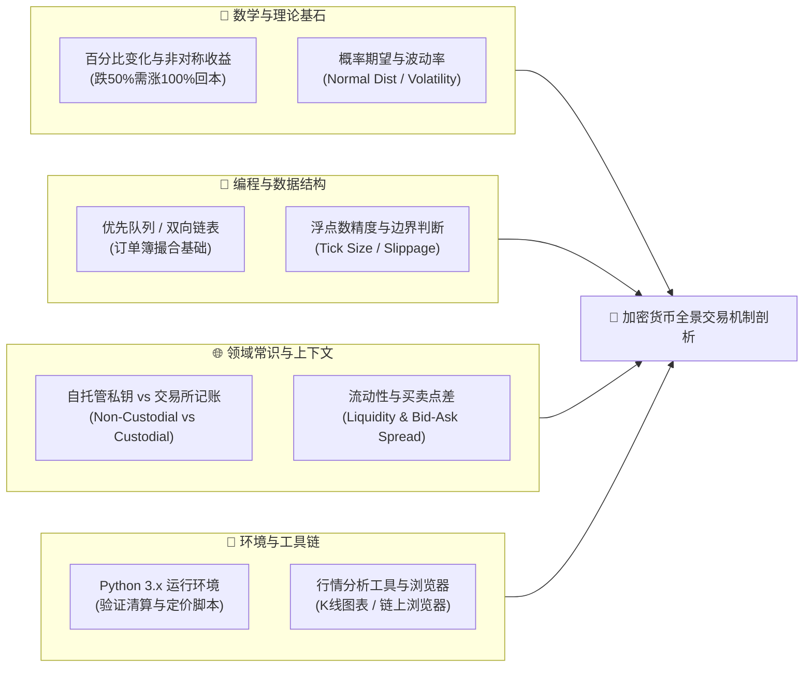
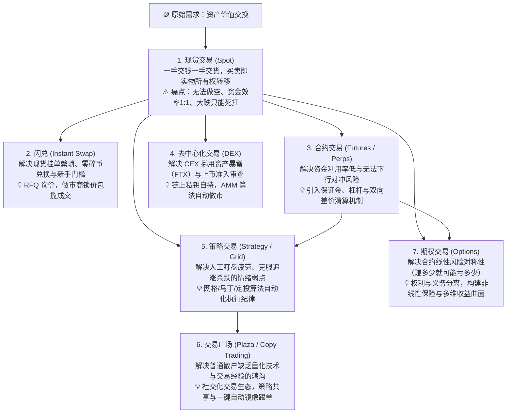
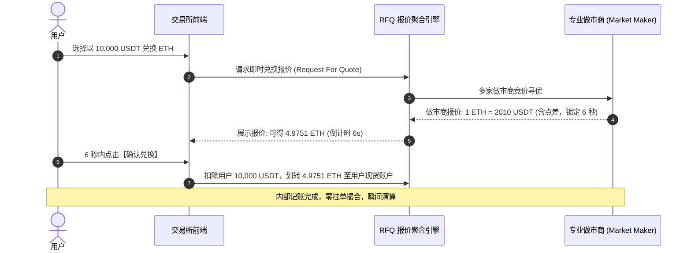
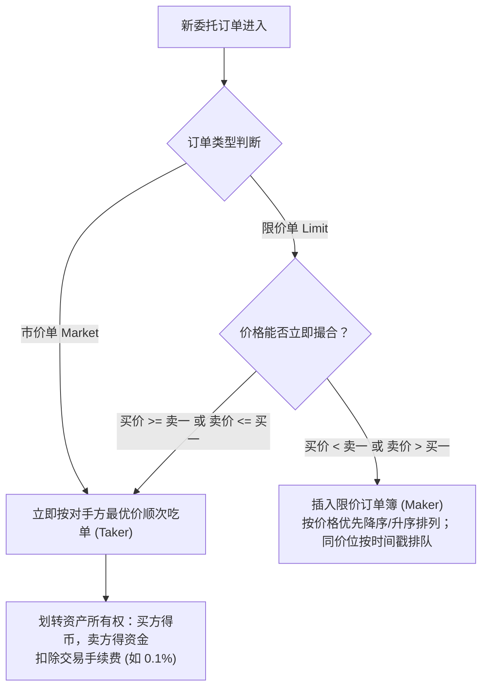
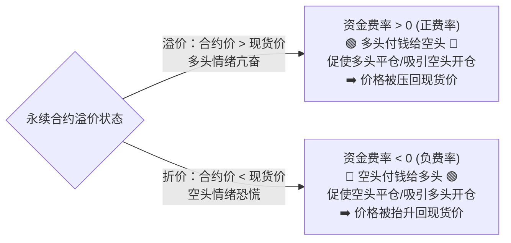
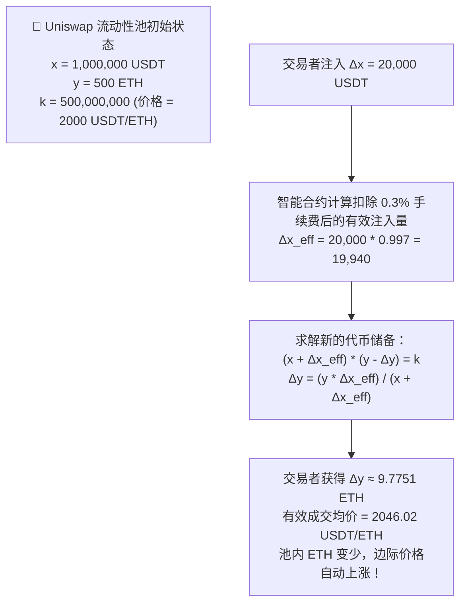
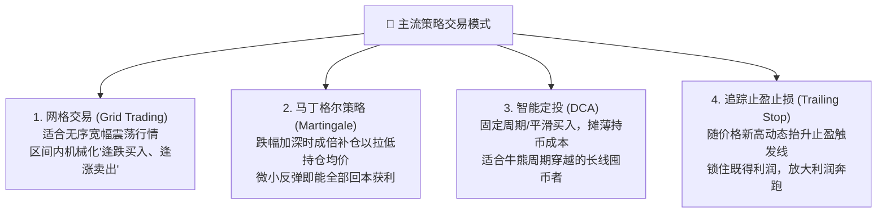
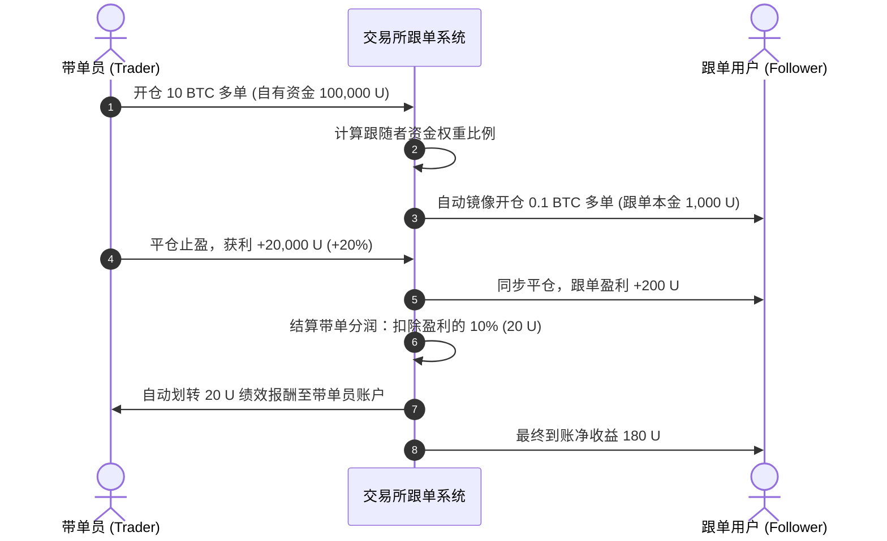
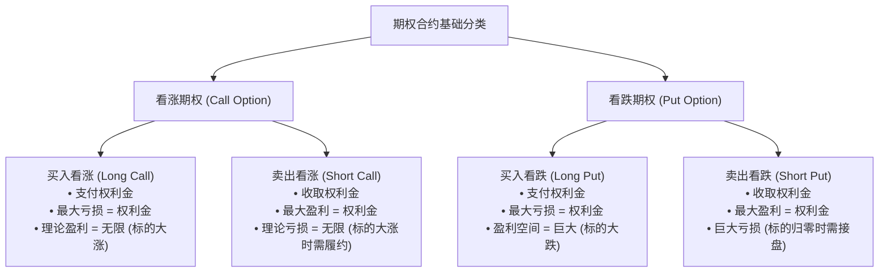
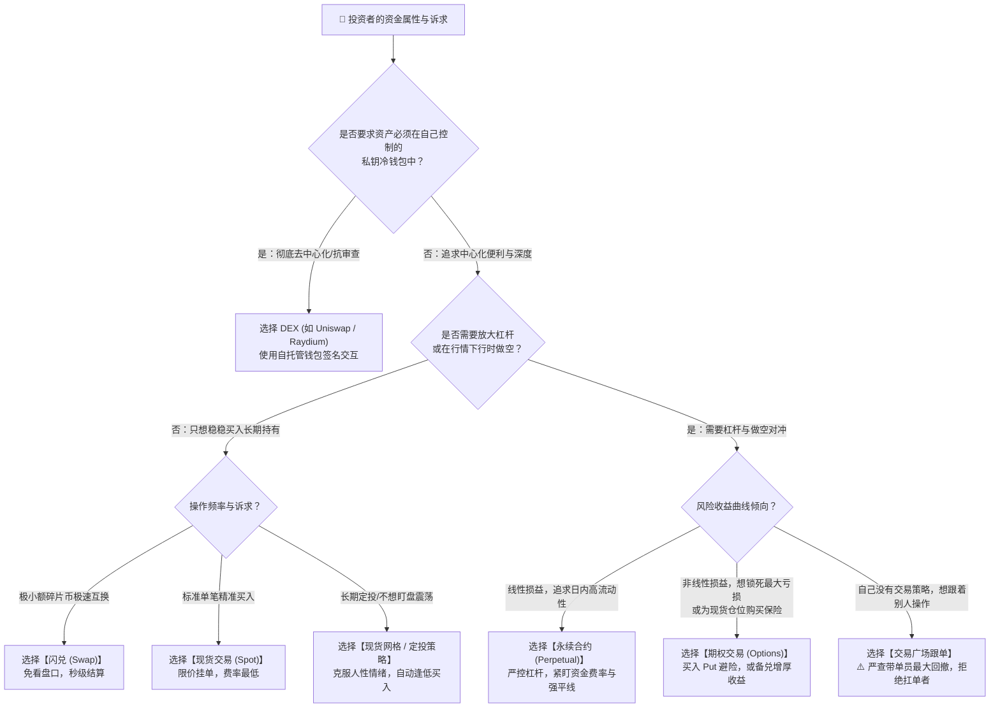

# 加密货币交易核心机制全景拆解：闪兑、现货、合约、DEX、策略交易、交易广场与期权深度指南

> **“在加密市场中，交易形态的演进本质上是流动性组织形式、资金杠杆率与风险收益非线性特征的重新排列组合。”**  
> 许多初学者进入加密资产市场时，容易被交易所 App 底部琳琅满目的功能标签搞晕：点击“闪兑”是一键换币，点击“现货”是红绿盘口，进入“合约”提示强平与倍数，跳转“Web3”又接触到 DEX 与流动性池，此外还有“策略机器人”、“跟单广场”和“期权”。  
> 如果仅将它们视为“几种不同的买币按钮”，投资者很容易在不经意间承担认知之外的灭顶之灾（如把高溢价当免手续费、把高倍合约当现货长拿、把伪胜率跟单当稳健理财、把做空期权当被动收益）。

本指南基于 `new_know` 认知解构方法论，系统拆解 **闪兑、现货、合约、DEX、策略交易、交易广场、期权** 七大核心交易形态的定义差异、底层运作机制、数学逻辑、核心边界与风险权衡，并附带纯 Python 自闭环可运行验证脚本与精选进阶学习渠道。

---

## 📋 学习本指南所需的前置知识准备（Prerequisites）

为了彻底读懂各交易形态底层发生的资产转移与风险清算，建议读者具备以下四个维度的基础认知：



### 1. 前置知识矩阵

| 模块类别 | 必备核心知识点 | 掌握程度与自测标准（如何知道自己已达标？） | 零基础推荐前置补课资料 |
| :--- | :--- | :--- | :--- |
| **数学/理论基础** | • **杠杆倍数与盈亏放大**：名义价值（Notional Value）= 本金 × 杠杆。<br/>• **非对称盈亏**：亏损 $50\%$ 需要盈利 $100\%$ 才能回本。<br/>• **波动率与期望**：资产价格围绕价值波动的分散度与极端行情的肥尾效应（Fat-tail Risk）。 | 能够独立算出口算题：10 倍杠杆做多某代币，跌幅达到多少时本金亏光（$-10\%$ 触发全亏）；跌 $20\%$ 时若要回本需要涨多少（$25\%$）。 | 汗萨学院《金融与资本市场》基础概念系列 |
| **编程/数据结构** | • **红黑树与优先级队列**：理解订单按“价格最高优先、同价时间最早优先”的排序思路。<br/>• **哈希映射与状态机**：理解账户余额与订单状态在内存中的更新逻辑。 | 能够用 Python `dict` 与 `list` 描述一个包含价格与数量的深度盘口并做简单遍历。 | 经典算法教程《数据结构与算法之美》堆与二叉树章节 |
| **领域上下文** | • **交易所中心化账本**：CEX 内部交易仅是 MySQL/Redis 记账，不产生链上手续费。<br/>• **链上自托管与 Gas**：链上交互需私钥签名，交易由以太坊/Solana 验证者打包，需支付网络 Gas。 | 能用自己的话清晰解释：“为什么在币安买卖现货不需要等链上确认，而在 MetaMask 交换代币必须等待区块出块”。 | Ethereum.org 官方《Web3 与区块链通识入门》 |
| **环境与工具** | • **Python 基础运行环境**：掌握命令行运行 `.py` 脚本。<br/>• **行情看板查看**：能够看懂蜡烛图（K 线）、成交量与深度图的基本坐标。 | 在本地终端输入 `python3 --version` 输出正常，能看懂 TradingView 或行情 App 的分时走势。 | Python 官方 5 分钟 Getting Started 指南 |

> [!TIP]
> **一分钟极简自测**：如果你知道“交易所账户里的数字只是平台对你的负债借条，而提币到硬件钱包里的代币才是你通过私钥真正拥有的资产”，并且了解“10 倍杠杆会让 1% 的波动变成 10% 的盈亏”，你就可以毫无门槛地通读本文的全部核心机制！

---

### 2. 前置概念深度补课区（Prerequisite Primer）

在进入 7 种交易模式之前，必须先将 4 个底层核心金融与计算机概念拆透，避免后续机制混淆：

#### 概念一：资产托管权属（Custodial vs Self-Custodial）
- **一句话定义**：**“Not your keys, not your coins.”** 托管指资产私钥归属于中心化实体（如 CEX 交易所），用户通过用户名和密码访问；非托管（自托管）指用户直接掌控助记词与私钥。
- **在本文中的作用**：直接决定了“现货/合约/闪兑（通常在 CEX 发生）”与“DEX 交互（链上智能合约发生）”在底层安全性、法律归属与清算执行环境上的根本分裂。
- **最小例子**：在币安账户看到 1 BTC，实际上是币安数据库里记录了“欠用户 A 1 BTC”；若提到自己的冷钱包，以太坊/比特币分布式账本上该地址的 UTXO/账户状态才真正由你签署转移。
- **常见误解**：初学者误以为在中心化交易所点“充值”，是区块链直接绑定了自己的个人账户，其实只是充进了交易所的热钱包地址汇总池中。

#### 概念二：限价订单簿与盘口点差（Order Book, Bid-Ask Spread & Slippage）
- **一句话定义**：买方与卖方分别提交不同意愿价格与数量构成的挂单列表，买方最高价（Bid 1）与卖方最低价（Ask 1）之间的差值称为**买卖点差（Spread）**。
- **在本文中的作用**：这是理解“现货撮合”、“闪兑全包报价”以及“DEX 自动做市商 AMM 为什么不需要订单簿”的前提。
- **最小例子**：当前买一价为 2000 USDT，卖一价为 2002 USDT，点差为 2 USDT。若你下市价买单，系统直接以 2002 USDT 成交；若买量极大穿透了卖一的存量，成交均价将被推高，这就是**滑点（Slippage）**。
- **常见误解**：误以为市价单一定能按照当前看到的屏幕中间价成交。在流动性匮乏的小币种中，市价单极易被深度不足的盘口“吞噬”产生几十个点的恶性滑点。

#### 概念三：保证金、杠杆与穿仓清算（Margin, Leverage & Liquidation）
- **一句话定义**：投资者缴纳一部分资金作为履约担保（保证金），通过借贷或差价合约放大头寸敞口（杠杆）；当头寸浮亏逼近保证金底线时，系统强制平仓以防发生穿仓倒欠。
- **在本文中的作用**：现货绝不爆仓（除非资产归零），但合约、杠杆借贷与期权卖方皆具备**强制平仓机制**。
- **最小例子**：自有本金 1000 USDT，使用 10 倍杠杆做多价值 10,000 USDT 的 ETH。若 ETH 价格下跌 10%，浮亏达到 1000 USDT，本金彻底耗尽。为了防止系统亏损，清算引擎会在价格跌破约 9%~9.5%（触发维持保证金率）时强行平仓。
- **常见误解**：误以为爆仓了还能像股票现货一样“套牢装死等解套”。一旦触发强制清算，仓位被清算引擎接管，本金永久归零，即使随后行情暴涨也与你无关。

#### 概念四：智能合约确定性与原子性（Atomicity & Smart Contracts）
- **一句话定义**：部署在区块链上的代码逻辑不可篡改，交易执行遵循**原子性（All-or-Nothing）**——要么全部步骤成功，要么发生任何异常时整体状态瞬间回滚，宛如从未发生。
- **在本文中的作用**：DEX 的自动做市、链上聚合路由与跨币种闪电贷套利均依赖原子性运行，彻底规避了传统中心化交易对手赖账违约的信任风险。
- **最小例子**：在 DEX 进行一次多跳交换（Token A $\to$ Token B $\to$ Token C），若中间某池子流动性不足导致滑点超限，整笔交易 revert（回滚），除了扣除少量 Gas 费，用户资产分毫未动。
- **常见误解**：误以为智能合约由人工管理员在后台审批。真实 DEX 交易全由数学公式与节点矿工虚拟机自动运算。

---

## 一、 为什么加密生态分化出七大交易形态？（痛点溯源与思维认知）

为什么不能仅保留一种“一手交钱一手交货”的简单买卖方式？每一种交易形态的诞生，都是为了击穿前一种机制在特定金融边界下的物理极限：



### 认知锚定灵魂比喻表

| 交易形态 | 一句话灵魂比喻 | 现实世界对应物 | 核心终极诉求 |
| :--- | :--- | :--- | :--- |
| **闪兑 (Instant Swap)** | 机场外币兑换专属快速窗口 | 机场货币兑换柜台（免手续费，但汇率含差价） | 极简、免去盯盘挂单、秒级兑换 |
| **现货 (Spot Trading)** | 农贸批发市场一手交钱一手交货 | 现款现货提货买卖 | 真实资产所有权、长期囤币价值存储 |
| **合约 (Futures/Perps)** | 对赌未来气温涨跌的带保证金协议 | 芝商所（CME）商品期货 / 差价合约（CFD） | 高杠杆博弈、双向做多/做空、风险对冲 |
| **DEX (去中心化交易)** | 公共街头无人售货兑换机 | 存入两箱货币、按恒定数学比例兑换的自动售货机 | 资产自持、抗审查、无准入门槛 |
| **策略交易 (Strategy)** | 不知疲倦、严格打卡的流水线机器人 | 工业机械臂自动高抛低吸 | 克服人性弱点、震荡市高频套利、自动化纪律 |
| **交易广场 (Plaza/Copy)** | 华尔街操盘手橱窗秀与社交跟单集市 | 基金经理路演展示柜与影子基金镜像投资 | 借用专业认知、策略复用、社区分润 |
| **期权 (Options)** | 为爱车购买碰撞损失险或买一张彩票 | 汽车商业保险保单（买方付出保费，出险获赔） | 锁定最大亏损下行、波动率做多做空、非线性收益 |

---

## 二、 核心机制与原理深度剖析（七大形态拆解）

### 1. 闪兑（Instant Swap / RFQ Quick Convert）

#### 核心定义
用户仅需选定支付币种与目标币种，系统跳过传统订单簿撮合，直接给出确定的兑换汇率并锁定数秒，用户确认后即刻瞬时成交。

#### 底层运行机制（RFQ 模型）


#### 关键机制剖析
- **报价机制（RFQ - Request for Quote）**：做市商承担盘口深度波动的市场风险，向交易所聚合器提供一个**全包一口价（All-in Price）**。
- **为什么宣传“0 手续费”？**：交易所确实没有在账面上向你收取百分之几的佣金，但做市商在给出的汇率中嵌入了**隐形价差（Hidden Spread）**。例如市场现货卖一价为 2000 USDT，闪兑报价可能是 2010 USDT（多出的 0.5% 即为其风险利润）。
- **适用场景**：
  1. 零碎小额资产一键兑换为平台币或稳定币（清理钱包零钱）。
  2. 极端暴跌行情下，免除挂限价单未能成交的恐慌，极速完成避险调仓。
- **边界与局限**：大额交易（如几十万 USDT）若直接走闪兑，其隐含点差成本可能远远高于在现货深度盘口挂限价单的手续费。

---

### 2. 现货交易（Spot Trading）

#### 核心定义
买卖双方基于公开透明的订单簿（Order Book），按照价格与时间优先级进行撮合，一旦成交，**真实代币的所有权即时转移**至买方账户。

#### 底层核心机制：价格-时间优先撮合引擎（Price-Time Priority）


#### 关键组成要素
1. **订单簿（Order Book）与盘口**：
   - **买盘（Bids）**：愿意买入的价格从高到低排列（买一价最高）。
   - **卖盘（Asks）**：愿意卖出的价格从低到高排列（卖一价最低）。
   - **点差（Spread）**：$\text{Spread} = \text{Ask}_1 - \text{Bid}_1$。流动性越充裕的主流币，点差越接近 0。
2. **挂单者（Maker）与吃单者（Taker）**：
   - **Maker（流动性提供者）**：提交限价单挂在盘口等待别人成交，丰富了盘面深度，手续费通常享受折扣甚至返佣。
   - **Taker（流动性消耗者）**：以市价单或越过盘口的限价单立即吃掉现有挂单，手续费率相对较高。
3. **权属与安全性**：现货账户买入的代币，支持随时通过链上提币转出至硬件冷钱包。资产没有强平价格，即使价格暴跌 90%，你拥有的代币数量永远不会减少。

---

### 3. 合约交易（Futures & Perpetual Swaps）

#### 核心定义
交易双方并不发生底层真实代币的所有权交割，而是以特定加密资产指数价格为标的，通过缴纳一定比例保证金，对未来价格走势看涨（做多）或看跌（做空）的**金融差价衍生品协议**。

#### 核心分类：交割合约 vs 永续合约（Perpetual Swaps）
- **传统交割合约**：具有明确到期日（如“当周”、“季度”）。到期时按照现货指数均价进行平仓结算交割。
- **永续合约（加密原生伟大创新）**：**没有到期日**，只要不发生爆仓或主动平仓，投资者可以无限期持有。

#### 永续合约的核心锚定器：资金费率（Funding Rate）
永续合约没有到期交割日的强制收敛，它是如何保证合约价格不脱离现货价格胡乱狂飙的？答案是**资金费率机制**：

$$\text{资金费用} = \text{仓位名义价值} \times \text{资金费率}$$


*通常每 8 小时（或 1 小时）在多空持仓者之间直接结算一次，交易所自身不从中抽取这笔资金费用。*

#### 保证金与强制清算机制
- **全仓模式（Cross Margin）**：账户内所有可用资金作为共享保证金，抗风险能力强，但一旦爆仓，账户内所有抵押资产一次性亏尽。
- **逐仓模式（Isolated Margin）**：单个仓位分配固定保证金，盈亏独立核算，最大损失仅限于该仓位分配的金额。
- **双轨价格机制（Mark Price vs Last Price）**：
  - **最新成交价（Last Price）**：交易所盘口实际撮合成交价，容易被游资通过大单瞬间打穿（“恶意插针”）。
  - **标记价格（Mark Price）**：加权整合全球多家头部现货交易所的现货指数加上基差均线。**所有强平清算和未实现盈亏只由标记价格触发**，从工程机制上保护了用户不被假插针搞爆仓。
- **强平公式（以做多为例）**：
  
  $$P_{\text{liq}} = P_{\text{entry}} \times \left(1 - \frac{1}{\text{Leverage}} + \text{MMR}\right)$$
  
  其中 $\text{MMR}$ 为维持保证金率（Maintenance Margin Rate，如 $0.5\%$）。

---

### 4. DEX（去中心化交易所, Decentralized Exchange）

#### 核心定义
基于公链智能合约运行的非托管交易基础设施。用户的资金始终存储在用户自己的去中心化钱包地址中，交易通过智能合约状态机在链上原子化撮合与结算，无需信任任何中心化中介。

#### 核心范式演进：订单簿 DEX 与 AMM（自动做市商）
早期在以太坊主网搭建订单簿系统，由于区块确认需 12 秒且每笔挂单撤单都要消耗几十美元 Gas，导致性能完全崩溃。Uniswap 由此提出了 **AMM 自动做市商**。

#### AMM 底层数学：恒定乘积公式（Constant Product Formula）
以 Uniswap v2 为代表：

$$x \cdot y = k$$

- $x$：流动性池中 Token A（例如 USDT）的数量储备。
- $y$：流动性池中 Token B（例如 ETH）的数量储备。
- $k$：在没有外部流动性注入或撤出的情况下，乘积必须严格保持恒定。



#### LP 提供者致命痛点：无常损失（Impermanent Loss, IL）
当外部市场价格发生剧烈偏离时，套利者（Arbitrageur）会冲入 AMM 池低买高卖拉平价差。这会导致流动性提供者（LP）池内的代币组合总价值，**必然低于**若最初什么都不做、仅仅将这两种币放在自托管钱包里被动持有（HODL）的价值：

$$\text{IL}(k) = \frac{2\sqrt{k}}{1 + k} - 1$$

*(其中 $k = P_{\text{new}} / P_{\text{old}}$ 为价格变动比率。当币价翻倍 $k=2$ 时，无常损失约为 $-5.72\%$；只有当交易手续费分红能够覆盖无常损失时，LP 才能真正盈利。)*

---

### 5. 策略交易（Strategy / Algorithmic Trading）

#### 核心定义
利用预先设定的数学逻辑、触发条件与执行规则，由程序托管并在满足特定行情特征时自动执行挂单、平仓与调仓的纪律化交易方式。

#### 核心策略模式拆解



#### 深度剖析：现货网格的数学结构与风险边界
- **网格原理**：在设定价格区间 $[P_{\min}, P_{\max}]$ 内，将其等分成 $N$ 个网格。价格每下穿一格自动挂单买入，每上穿一格自动挂单卖出，通过捕获局部的微观波动率兑现利润。
- **致命软肋（破网风险）**：
  - **向上破网**：价格单边暴涨突破 $P_{\max}$，策略沿途把所有现货全部卖光，导致投资者过早下车，**承担巨大机会成本（踏空）**。
  - **向下破网**：价格单边暴跌击穿 $P_{\min}$，策略把所有现金资金抄底耗尽，随后账户全仓深度套牢。

---

### 6. 交易广场与跟单交易（Trading Plaza & Copy Trading）

#### 核心定义
聚合了交易者社交展示、公开量化收益榜单与全自动资产镜像复制功能的交易生态集市。跟随者（Follower）可以一键将自己的资金按比例绑定优秀交易员（带单员/Lead Trader），自动镜像其每一个开平仓动作。

#### 核心业务与分润模型


#### 关键风控指标评估
评估交易广场上的带单员，绝不能只看“累计收益率（ROI）”或“近期胜率（Win Rate）”：
1. **最大回撤（Maximum Drawdown, MDD）**：历史净值从最高峰滑落至最低谷的最大跌幅。MDD 超过 $30\%$ 说明风控极度激进。
2. **夏普比率（Sharpe Ratio）**：每承担一单位波动风险所带来的超额回报，数值大于 1.5 属于优秀。
3. **真实持仓杠杆与持仓周期**：是否经常高倍杠杆持仓过夜。

> [!WARNING]
> **交易广场业内猫腻与防坑指南**：
> - **“浮亏死扛刷高胜率”**：部分带单员胜率高达 $98\%$，其实是因为只要亏损就死扛不平仓（浮亏不算平仓，账面胜率不跌）。一旦遇到大单边行情，一次爆仓直接带走所有跟随者全部本金。
> - **滑点剥削与流动性陷阱**：带单员在极小市值山寨币上建仓，跟随者庞大资金涌入市价吃单抬轿，带单员趁机出货，导致跟随者因巨大滑点严重亏损。

---

### 7. 期权交易（Options Trading）

#### 核心定义
期权是一种赋予买方在未来某一特定日期（到期日），以约定价格（行权价）买入或卖出标的资产的**权利而非义务**的金融衍生品契约。卖方（写方）收取期权买方支付的**权利金（Premium）**，并承担必须无条件履约的义务。

#### 四种核心基本态势与盈亏图解（Payoff）



#### 核心希腊字母（The Greeks - 风险敏感度量度）
期权不是线性的“涨 1 块赚 1 块”，其价格受多维参数联动影响：
- **Delta ($\Delta$)**：标的资产价格变动 1 美元，期权价格跟随变动的幅度（买入看涨期权 Delta 范围在 $0 \sim 1$ 之间，亦可近似视为到期行权概率）。
- **Gamma ($\Gamma$)**：标的价格变动对 Delta 的变化速率（曲率，衡量非线性加速程度）。
- **Theta ($\Theta$)**：每过去一天，期权时间价值的衰减损耗（买方的敌人，卖方的朋友）。
- **Vega ($\mathcal{V}$)**：隐含波动率（IV）每变动 $1\%$，期权价格的变动幅度。重大事件（如 ETF 决议、升级事件）落地后 IV 暴跌（“波动率压榨 / IV Crush”），即使猜对方向期权买方也可能因 Vega 暴跌而亏损。

#### 典型实战组合模式
- **备兑看涨（Covered Call）**：手持现货 ETH 的同时，卖出虚值看涨期权。若没涨到行权价，白白赚取权利金增厚年化收益；若暴涨则相当于在行权价把现货止盈出清。
- **保护性看跌（Protective Put）**：手持现货的同时买入看跌期权，相当于为现货买了一份保单，锁死下行最大可能回撤。

---

## 三、 全景对比矩阵与选型决策树

### 1. 七大交易形态多维对比矩阵

| 核心维度 | 闪兑 (Swap) | 现货 (Spot) | 合约 (Perps/Futures) | DEX (AMM) | 策略交易 (Grid/Martingale) | 交易广场 (Copy Trading) | 期权 (Options) |
| :--- | :--- | :--- | :--- | :--- | :--- | :--- | :--- |
| **底层资产所有权** | 真实代币 | 真实代币 | 纯虚拟价格差价契约 | 真实代币 (智能合约锁定) | 依赖底仓 (现货或合约) | 视带单品类而定 | 权利凭证 (欧式现金结算) |
| **资金杠杆能力** | 无杠杆 (1:1) | 无杠杆 (1:1) | 支持高杠杆 (1~125x) | 无/合成杠杆 | 视底仓而定 (0~低倍) | 视带单员策略设定 | 内在非线性杠杆 |
| **爆仓强平风险** | **无** | **无** (除非归零) | **极高** (触发强平价归零) | **无** (但有清算/无常损失) | 合约网格会爆仓 | **高** (随带单员爆仓) | 买方无爆仓，卖方有强平 |
| **交易对手方** | 做市商 RFQ | 订单簿其他交易者 | 订单簿多空对手方 | 去中心化流动性池 (LP) | 市场无序震荡撮合方 | 镜像交易员对手方 | 期权做市商 / 买卖方 |
| **主要成本构成** | 隐形汇率点差 | 手续费 (Maker/Taker) | 手续费 + 资金费率 + 利息 | 链上 Gas 费 + 兑换手续费 | 频繁成交手续费摩擦 | 手续费 + 盈利分润 (10%) | 权利金损耗 (Theta 衰减) |
| **核心适用场景** | 快速小额兑换/避险 | 中长线价值投资/HODL | 双向对冲、日内高频博弈 | 抗审查、早期链上代币挖掘 | 宽幅区间震荡行情套利 | 新手懒人借用他人认知 | 波动率交易、资产下行保险 |
| **操作心智门槛** | 极低（新手级） | 低（基础金融常识） | 高（必须懂风控与数学） | 中（需懂钱包私钥交互） | 中（需参数调优与回测） | 极低（但识人风控门槛极高） | **极高**（需精通希腊字母） |

---

### 2. 交易形态选型决策树



---

## 四、 最小自闭环可运行实战代码（Python 模拟引擎）

下面的 Python 脚本无需安装任何第三方库（仅使用 Python 3 标准库），完整仿真了 **闪兑 RFQ、现货订单簿、永续合约资金费率与强平、Uniswap AMM 恒定乘积与无常损失、网格策略套利、交易广场跟单回撤、以及期权损益 Payoff** 的全部数学计算：

```python
"""
crypto_trading_simulator.py
轻量级自闭环加密货币核心交易机制仿真引擎
涵盖：闪兑、现货订单簿、永续合约、DEX AMM、网格策略、跟单回撤、期权 Payoff
"""
import math

def simulate_instant_swap():
    print("=" * 60)
    print("1. 【闪兑】(Instant Swap - RFQ 询价与隐形点差仿真)")
    fair_market_price = 2000.0  # 真实市场基准价 (USDT/ETH)
    rfq_spread_rate = 0.005     # 做市商嵌入的 0.5% 隐形价差
    user_pay_usdt = 10000.0
    
    # 做市商锁定报价 (买入价上浮)
    locked_quote_price = fair_market_price * (1 + rfq_spread_rate)
    received_eth = user_pay_usdt / locked_quote_price
    implicit_cost_usdt = user_pay_usdt - (received_eth * fair_market_price)
    
    print(f"公允基准价: {fair_market_price:.2f} USDT")
    print(f"闪兑锁定价格: {locked_quote_price:.2f} USDT (倒计时 5 秒锁定)")
    print(f"支付: {user_pay_usdt:.2f} USDT -> 最终获得: {received_eth:.4f} ETH")
    print(f"表面手续费: 0.00 USDT | 隐形点差损耗: {implicit_cost_usdt:.2f} USDT")

def simulate_spot_orderbook():
    print("\n" + "=" * 60)
    print("2. 【现货】(Spot Order Book - 价格优先与深度撮合)")
    # 模拟限价订单簿 (Price, Amount)
    bids = [(1999.0, 3.0), (1998.0, 5.0), (1995.0, 10.0)]  # 买盘
    asks = [(2001.0, 2.0), (2002.0, 4.0), (2005.0, 8.0)]   # 卖盘
    
    spread = asks[0][0] - bids[0][0]
    print(f"当前盘口点差 (Spread): {spread:.2f} USDT")
    print(f"买一 (Bid 1): {bids[0][0]} USDT ({bids[0][1]} ETH) | 卖一 (Ask 1): {asks[0][0]} USDT ({asks[0][1]} ETH)")
    
    # 用户提交市价买单 5.0 ETH
    buy_amount_needed = 5.0
    total_cost = 0.0
    remaining = buy_amount_needed
    print(f"用户提交市价买单: {buy_amount_needed} ETH")
    for price, qty in asks:
        matched = min(remaining, qty)
        total_cost += matched * price
        remaining -= matched
        print(f" -> 撮合成交: {matched:.2f} ETH @ {price:.2f} USDT")
        if remaining <= 0:
            break
    avg_price = total_cost / buy_amount_needed
    print(f"撮合完成！平均成交价: {avg_price:.2f} USDT (相对于卖一产生滑点: {((avg_price - asks[0][0])/asks[0][0])*100:.2f}%)")

def simulate_perpetual():
    print("\n" + "=" * 60)
    print("3. 【永续合约】(Perpetual Swap - 资金费率与维持保证金强平)")
    entry_price = 2000.0
    leverage = 10.0
    position_size_eth = 5.0
    notional_value = entry_price * position_size_eth  # 10,000 USDT
    initial_margin = notional_value / leverage       # 1,000 USDT
    mmr = 0.005                                      # 维持保证金率 0.5%
    
    # 做多强平价推导：Entry * (1 - 1/leverage + mmr)
    liq_price_long = entry_price * (1 - (1 / leverage) + mmr)
    # 做空强平价推导：Entry * (1 + 1/leverage - mmr)
    liq_price_short = entry_price * (1 + (1 / leverage) - mmr)
    
    funding_rate = 0.0001  # 0.01% (正费率：多头付给空头)
    funding_fee = notional_value * funding_rate
    
    print(f"开仓仓位: 10x 杠杆做多 {position_size_eth} ETH (名义价值: {notional_value:.2f} USDT)")
    print(f"初始保证金: {initial_margin:.2f} USDT")
    print(f"做多预估强平价 (Mark Price): {liq_price_long:.2f} USDT (跌幅仅需 {((entry_price-liq_price_long)/entry_price)*100:.2f}%)")
    print(f"对应做空预估强平价 (Mark Price): {liq_price_short:.2f} USDT")
    print(f"8小时资金费用结算 (费率 0.01%): 多头账户需划转 {funding_fee:.2f} USDT 给空头")

def simulate_dex_amm():
    print("\n" + "=" * 60)
    print("4. 【DEX AMM】(Uniswap v2 恒定乘积公式与无常损失)")
    reserve_x = 1000000.0  # 100 万 USDT
    reserve_y = 500.0      # 500 ETH (初始价格 2000 USDT/ETH)
    k = reserve_x * reserve_y
    fee_rate = 0.003       # 0.3% 手续费
    
    dx = 20000.0           # 交易者存入 20,000 USDT 买 ETH
    dx_eff = dx * (1 - fee_rate)
    # (x + dx_eff) * (y - dy) = k
    dy = (reserve_y * dx_eff) / (reserve_x + dx_eff)
    new_price = (reserve_x + dx_eff) / (reserve_y - dy)
    effective_price = dx / dy
    
    print(f"AMM 池初始储备: {reserve_x:.0f} USDT / {reserve_y:.0f} ETH")
    print(f"交易者支付: {dx:.2f} USDT -> 获得: {dy:.4f} ETH")
    print(f"有效执行价格: {effective_price:.2f} USDT/ETH | 池内最新边际价格: {new_price:.2f} USDT/ETH")
    
    # 无常损失计算：假设外部价格上涨至 1.5 倍 (3000 USDT)
    price_ratio = 1.5
    il = (2 * math.sqrt(price_ratio) / (1 + price_ratio)) - 1
    print(f"若 ETH 相对价格上涨 50%，LP 提供者产生的无常损失 (IL): {il * 100:.2f}%")

def simulate_strategy_grid():
    print("\n" + "=" * 60)
    print("5. 【策略交易】(现货等差网格交易套利闭环)")
    lower_price = 1800.0
    upper_price = 2200.0
    grid_count = 4
    step = (upper_price - lower_price) / grid_count  # 每格 100 USDT
    grid_levels = [lower_price + i * step for i in range(grid_count + 1)]
    
    print(f"网格区间: [{lower_price} ~ {upper_price}] USDT, 网格点位: {grid_levels}")
    print("行情动态仿真: 价格从 2000 -> 跌到 1900 (触发挂单买入 1 ETH) -> 涨回 2000 (触发挂单卖出 1 ETH)")
    cost = 1900.0
    revenue = 2000.0
    fee = (cost + revenue) * 0.001  # 0.1% 交易费
    net_profit = (revenue - cost) - fee
    print(f"单次网格套利完成！毛利润: {revenue - cost:.2f} USDT, 扣除双边费率净赚: {net_profit:.2f} USDT")

def simulate_trading_plaza():
    print("\n" + "=" * 60)
    print("6. 【交易广场】(跟单最大回撤 MDD 与业绩度量)")
    # 模拟某带单员的历史净值曲线
    equity_series = [10000, 12500, 11000, 14000, 9800, 16000]
    peak = equity_series[0]
    max_dd = 0.0
    
    for val in equity_series:
        if val > peak:
            peak = val
        dd = (peak - val) / peak
        if dd > max_dd:
            max_dd = dd
            
    print(f"带单员历史净值序列: {equity_series}")
    print(f"历史峰值: {peak} USDT | 历史最大回撤 (MDD): {max_dd * 100:.2f}%")
    print("风控评价: 回撤达到 30% 说明存在严重扛单风险，切忌盲目跟单！")

def simulate_options_payoff():
    print("\n" + "=" * 60)
    print("7. 【期权交易】(欧式看涨与看跌期权到期损益 Payoff)")
    strike_price = 2000.0  # 行权价 2000 USDT
    premium = 80.0         # 权利金 80 USDT
    test_market_prices = [1800.0, 1920.0, 2000.0, 2080.0, 2200.0]
    
    print(f"行权价 K = {strike_price} USDT, 权利金 = {premium} USDT")
    print(f"{'到期标的价格':>12} | {'看涨买方(Long Call)':>18} | {'看跌买方(Long Put)':>18}")
    print("-" * 55)
    for st in test_market_prices:
        call_payoff = max(0.0, st - strike_price) - premium
        put_payoff = max(0.0, strike_price - st) - premium
        print(f"{st:>12.0f} USDT | {call_payoff:>+16.1f} USDT | {put_payoff:>+16.1f} USDT")
    print("特征验证: 买方最大亏损严格锁死在 -80 USDT (权利金)，而上涨或下跌盈利具备非线性爆发空间。")

if __name__ == "__main__":
    simulate_instant_swap()
    simulate_spot_orderbook()
    simulate_perpetual()
    simulate_dex_amm()
    simulate_strategy_grid()
    simulate_trading_plaza()
    simulate_options_payoff()
    print("=" * 60)
    print("✅ 7 大加密货币核心交易模式仿真计算全部成功闭环！")
```

#### 真实执行输出验证
```text
============================================================
1. 【闪兑】(Instant Swap - RFQ 询价与隐形点差仿真)
公允基准价: 2000.00 USDT
闪兑锁定价格: 2010.00 USDT (倒计时 5 秒锁定)
支付: 10000.00 USDT -> 最终获得: 4.9751 ETH
表面手续费: 0.00 USDT | 隐形点差损耗: 49.75 USDT

============================================================
2. 【现货】(Spot Order Book - 价格优先与深度撮合)
当前盘口点差 (Spread): 2.00 USDT
买一 (Bid 1): 1999.00 USDT (3.0 ETH) | 卖一 (Ask 1): 2001.00 USDT (2.0 ETH)
用户提交市价买单: 5.0 ETH
 -> 撮合成交: 2.00 ETH @ 2001.00 USDT
 -> 撮合成交: 3.00 ETH @ 2002.00 USDT
撮合完成！平均成交价: 2001.60 USDT (相对于卖一产生滑点: 0.03%)

============================================================
3. 【永续合约】(Perpetual Swap - 资金费率与维持保证金强平)
开仓仓位: 10x 杠杆做多 5.0 ETH (名义价值: 10000.00 USDT)
初始保证金: 1000.00 USDT
做多预估强平价 (Mark Price): 1810.00 USDT (跌幅仅需 9.50%)
对应做空预估强平价 (Mark Price): 2190.00 USDT
8小时资金费用结算 (费率 0.01%): 多头账户需划转 1.00 USDT 给空头

============================================================
4. 【DEX AMM】(Uniswap v2 恒定乘积公式与无常损失)
AMM 池初始储备: 1000000 USDT / 500 ETH
交易者支付: 20000.00 USDT -> 获得: 9.7751 ETH
有效执行价格: 2046.02 USDT/ETH | 池内最新边际价格: 2092.36 USDT/ETH
若 ETH 相对价格上涨 50%，LP 提供者产生的无常损失 (IL): -2.02%

============================================================
5. 【策略交易】(现货等差网格交易套利闭环)
网格区间: [1800.0 ~ 2200.0] USDT, 网格点位: [1800.0, 1900.0, 2000.0, 2100.0, 2200.0]
行情动态仿真: 价格从 2000 -> 跌到 1900 (触发挂单买入 1 ETH) -> 涨回 2000 (触发挂单卖出 1 ETH)
单次网格套利完成！毛利润: 100.00 USDT, 扣除双边费率净赚: 96.10 USDT

============================================================
6. 【交易广场】(跟单最大回撤 MDD 与业绩度量)
带单员历史净值序列: [10000, 12500, 11000, 14000, 9800, 16000]
历史峰值: 16000 USDT | 历史最大回撤 (MDD): 30.00%
风控评价: 回撤达到 30% 说明存在严重扛单风险，切忌盲目跟单！

============================================================
7. 【期权交易】(欧式看涨与看跌期权到期损益 Payoff)
行权价 K = 2000.0 USDT, 权利金 = 80.0 USDT
    到期标的价格 |   看涨买方(Long Call) |   看跌买方(Long Put)
-------------------------------------------------------
        1800 USDT |             -80.0 USDT |            +120.0 USDT
        1920 USDT |             -80.0 USDT |              +0.0 USDT
        2000 USDT |             -80.0 USDT |             -80.0 USDT
        2080 USDT |              +0.0 USDT |             -80.0 USDT
        2200 USDT |            +120.0 USDT |             -80.0 USDT
特征验证: 买方最大亏损严格锁死在 -80 USDT (权利金)，而上涨或下跌盈利具备非线性爆发空间。
============================================================
✅ 7 大加密货币核心交易模式仿真计算全部成功闭环！
```

---

## 五、 压缩学习路线与优质拓展学习渠道

### 1. 四阶段系统学习进阶路线（Roadmap）


| 学习阶段 | 阶段核心目标 | 推荐实操练习 | 达成验收标准 |
| :--- | :--- | :--- | :--- |
| **阶段一：感性上手** | 建立对“自托管私钥”与“CEX 托管”的直观边界感知 | 创建一个 MetaMask 钱包，体验一次测试网 DEX 兑换；在 CEX 体验一笔限价单现货买入 | 能独立解释清楚“为什么提错链（如 ERC20 转到 TRC20）资产可能永久找不回” |
| **阶段二：底层机制解构** | 搞懂永续资金费率、清算线计算与 AMM 滑点成因 | 运行上文 Python 仿真脚本，修改保证金与杠杆倍数，推演标记价格插针时的清算触发点 | 看到任何永续合约盘面时，能脱口而出当前资金费率下多空谁在给谁付利息 |
| **阶段三：风控与策略工程** | 克服情绪波动，用纪律与非线性衍生品保护本金敞口 | 在行情震荡期间配置一套低倍现货等差网格；为现货持仓配置买入虚值 Put 避险 | 遭遇 $20\%$ 极端单边大跌时，网格能够及时触发止损，或期权保单能弥补现货亏损 |
| **阶段四：机构级宏观视野** | 理解波动率做市、期现基差套利与跨市场流动性传导 | 观察 Deribit 期权隐含波动率曲面与大宗宗交易流水，分析市场看涨/看跌偏斜（Skew） | 具备根据宏观宏观利率、全网清算热力图与期权持仓结构综合研判市场流动性的能力 |

---

### 2. 精选权威学习了解渠道（用户拓展推荐）

学习加密金融知识切忌依赖“社群带单老师”或非正规群聊。以下整理了业内公认权威、硬核、可信赖的高质量学习与数据分析渠道：

#### ① 基础知识通识与交易所官方学院
- **[Binance Academy (币安学院)](https://academy.binance.com/)**：全球最全面的加密金融免费通识库。涵盖区块链底层技术、加密经济学、现货/合约指标教学，支持中文，文章图文并茂且质量经过专业把控。
- **[OKX Learn (欧易学院)](https://www.okx.com/learn)**：国内理解成本最低的实战指南，对现货网格、马丁格尔策略参数配置以及合约逐仓/全仓保证金模式有极为详尽的图解教程。

#### ② 去中心化协议与数学原理白皮书
- **[Uniswap Docs & Whitepapers](https://docs.uniswap.org/)**：深入理解 DEX 与 AMM 的“圣经”。强烈建议研读 Uniswap v2（$x \cdot y = k$）与 Uniswap v3（集中流动性 Concentrated Liquidity）的数学白皮书，剖析资本效率如何提升数千倍。
- **[Ethereum.org 官方 DeFi 教程](https://ethereum.org/zh/defi/)**：以太坊官方去中心化金融知识库，客观公正地介绍借贷协议（Aave/Compound）、DEX 与预言机（Chainlink）的链上协同机制。

#### ③ 专业衍生品、期权与宏观链上投研
- **[Deribit Insights](https://insights.deribit.com/)**：全球最大加密期权平台 Deribit 的投研专栏。由华尔街量化交易员与期权做市商撰写，是学习期权希腊字母实战、波动率微笑（Volatility Smile）和巨鲸期权建仓结构的最权威阵地。
- **[Glassnode Studio & Insights](https://insights.glassnode.com/)**：顶尖链上金融分析平台。每周发布链上周报（The Week Onchain），通过长短期持币者成本线、交易所储备金净流动、期现基差溢价等数据分析宏观周期。

#### ④ 实时市场监控、量化与清算看板
- **[Coinglass (原 Bybt)](https://www.coinglass.com/)**：必备的专业衍生品数据看板。实时展示全网合约持仓量（Open Interest）、资金费率热力图、多空大单爆仓清算地图（Liquidation Heatmap）与灰度/ETF 资金流。
- **[TradingView](https://www.tradingview.com/)**：全球顶尖的图表与技术分析社区。不仅能查看多周期 K 线形态，还可通过其内置的 Pine Script 语言编写与回测自定义现货与网格量化策略。
- **[CoinGecko (币研/行情百科)](https://www.coingecko.com/)**：中立全面的代币经济学数据库，可用于查询代币流通量、总供应量、交易所挂单深度比率以及真实上架市场。

> [!CAUTION]
> **终极安全警示（Risk Disclosure）**：
> 1. **保护私钥**：任何向你索要助记词、私钥或要求在不知名链接授权钱包签名的，百分之百是诈骗。
> 2. **远离高杠杆**：$20\times$ 杠杆下跌 $5\%$ 即可归零，$100\times$ 杠杆波动 $1\%$ 即可瞬间灰飞烟灭。高杠杆本质上是负期望值的赌场游戏。
> 3. **警惕幸存者偏差**：社交网络上晒出的千倍收益截图大多来自小资金赌狗或模拟盘欺诈，建立基于数学与纪律的交易体系才是活过周期的唯一法宝。
