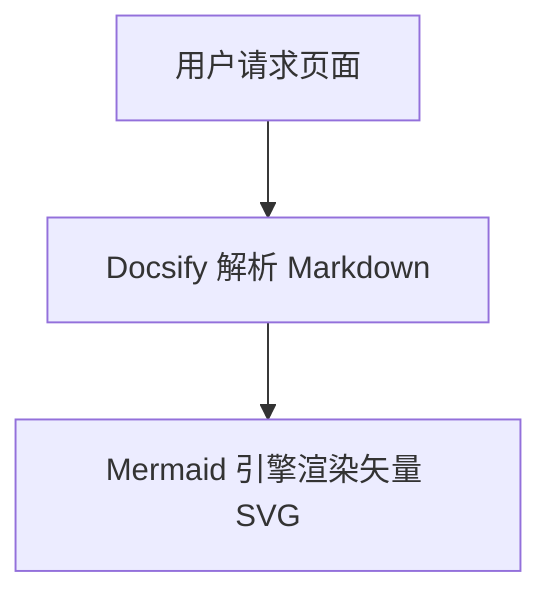
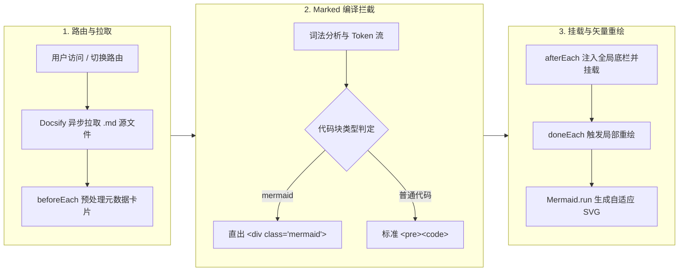
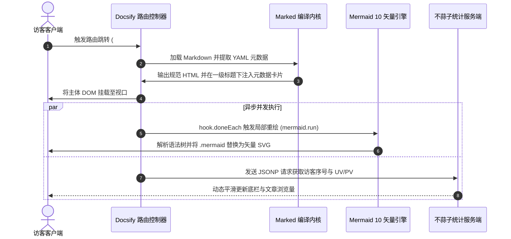
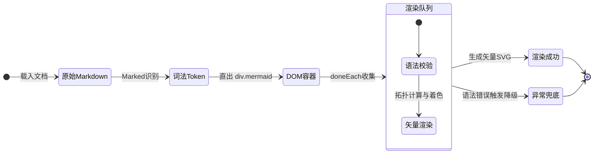
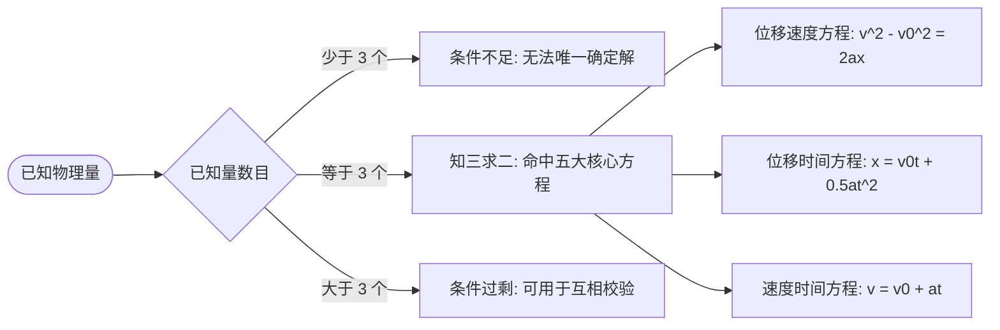

# Web Markdown 与 Docsify 中 Mermaid 图表渲染深度避坑指南：从源码解析到工程级落地

> 在技术写作、系统架构设计以及开源文档编写中，[Mermaid](https://mermaid.js.org/) 凭借“以代码绘制图表（Diagrams as Code）”的纯文本理念，已成为现代技术文档的标准利器。  
> 然而，许多开发者在基于 **Docsify** 或类似轻量 SPA（单页应用）搭建文档站点时，常常遭遇这样的尴尬场景：本地或 GitHub 预览一切正常，发布到网页后，流程图却变成了一截**生硬的灰色代码块**，甚至控制台报出一堆 `mermaid is not defined` 或 `mermaid.init is not a function`。  
> 本文将从底层编译管道、单页应用生命周期及 Mermaid 10 架构演进入手，深度剖析渲染失效的五大根因，并给出经过生产环境检验的工程级全套解决方案。

---

## 1. 现象复盘：为什么你的 Mermaid 图表无法渲染？

在 Markdown 文档中，我们习惯使用如下标准语法编写流程图：

````markdown

````

在未做专门扩展的 Web 环境下打开页面，浏览器往往表现为以下三种典型异常状态：

1. **直接降级为原始代码块**：页面上没有任何图表，仅以普通代码高亮的形式展示出 `flowchart TD...` 纯文本。
2. **控制台报错并中断执行**：
   - 报错 `TypeError: mermaid.init is not a function`（引入了旧版插件与新版 Mermaid 核心导致的 API 冲突）；
   - 报错 `Parse error on line X: ... expecting ...`（Marked 词法分析器对 `<`、`>`、`&` 等字符进行了 HTML 实体编码，破坏了 Mermaid 语法）。
3. **单页路由跳转后“图表失踪”**：初次刷新页面图表能正常展现，但在侧边栏点击其它文章后再点回来，图表彻底变为空白或报错。

要根治这些问题，我们必须先理清浏览器中从 Markdown 文本到矢量 SVG 图像的完整流水线。

---

## 2. 渲染机理：从 Markdown 源码到矢量 SVG 的演进管道

不同于 VitePress、Docusaurus 等在构建期预先编译成静态 HTML 的 SSG 框架，Docsify 是一套**完全运行在浏览器客户端（Client-side Runtime）**的轻量 SPA 框架。

下图清晰展示了 Docsify 与 Mermaid 在浏览器运行时内的生命周期协同流程：



整个管道环环相扣，只要在任一环节存在配置缺失或时序错位，流程图就会彻底失效。

---

## 3. Docsify 下 Mermaid 渲染失效的五大深层根因排查

### 根因一：Docsify 核心默认不包含任何图表解析器
Docsify 官方核心库为了保持轻量（gzip 压缩后仅约 20KB），默认仅内置了 **Marked**（Markdown 解析引擎）与基础的主题渲染器。  
Marked 在解析 ````mermaid` 代码块时，只会将其视作一个带有 `data-lang="mermaid"` 属性的标准代码片段：

```html
<!-- 默认生成结构：仅仅是一个 pre/code 代码块 -->
<pre data-lang="mermaid"><code class="lang-mermaid">flowchart TD
    A --> B
</code></pre>
```

没有引入 Mermaid 核心运行时与自定义拦截器，浏览器自然只能将其当成代码原样展示。

---

### 根因二：Mermaid v9 到 v10 的断崖式 API 破坏性升级
这是许多开发者按照往年教程（如安装 `docsify-mermaid@1.x` 或 `docsify-mermaid@2.x`）配置后依然报错的“隐形大坑”。

- **Mermaid 8/9 时代**：
  官方主推的排版触发 API 为 `mermaid.init(undefined, '.mermaid')` 或 `mermaid.initialize({ startOnLoad: true })`。
- **Mermaid 10 时代**：
  官方进行了彻底的模块化重构，`mermaid.init()` 被正式废弃，全面转向异步 Promise 驱动的 **`mermaid.run({ querySelector: '.mermaid' })`**。

```javascript
// ❌ Mermaid 10 下调用老 API 会直接抛出异常或静默失效
mermaid.init(undefined, document.querySelectorAll('.mermaid'));

// ✅ Mermaid 10 正确用法：支持指定 nodes 数组或 querySelector
await mermaid.run({
  nodes: document.querySelectorAll('.mermaid:not([data-processed="true"])'),
  suppressErrors: true
});
```

大量老旧的第三方 Docsify 插件在底层直接硬编码调用了 `mermaid.init`，一旦在 CDN 中引入了最新的 `mermaid@10`，整套流程直接崩溃。

---

### 根因三：Marked HTML 实体转义破坏语法标记
Marked 默认会对代码块中的特殊字符执行安全转义（HTML Entity Encoding）：
- 流程图箭头 `-->` 可能会被转义为 `--&gt;`；
- 双向箭头 `<-->` 会被转义为 `&lt;--&gt;`；
- 节点描述中的 `&` 符号会被转义为 `&amp;`。

当 Mermaid 解析器从 DOM 中提取 `textContent` 或 `innerHTML` 时，如果拿到的是已经被实体化的 `--&gt;`，Mermaid 词法分析器会直接抛出语法解析错误（`Parse error on line ... Lexical error`）。

---

### 根因四：SPA 单页路由与重绘时序脱节（重复挂载问题）
在传统的静态多页网站中，每次刷新页面浏览器都会从头执行一次 JS。  
但在 Docsify 这样的 SPA 中：
1. 用户在不同文章之间点击切换时，页面不会触发整页刷新；
2. Docsify 在路由切换时会销毁旧内容并挂载新的 Markdown；
3. **`data-processed="true"` 标记碰撞**：Mermaid 在完成一次渲染后，会在容器上标记 `data-processed="true"`。如果 DOM 处于半更新状态或者局部刷新，没有重置该属性会导致 Mermaid 误认为该节点已完成渲染而直接跳过。

---

### 根因五：移动端视口宽度被撑爆与自适应塌陷
当复杂流程图具有多个并列分支时，SVG 生成的实际像素宽度可能达到 800px 甚至 1200px。在手机或窄屏设备（通常宽度为 375px~420px）上访问时：
- 若外层容器缺少 `overflow-x: auto`，整篇博文的右侧基准线会被硬生生拉扯撑裂，造成恶劣的横向滚动翻页体验；
- 若 SVG 未配置 `max-width: 100% !important; height: auto !important;`，在部分浏览器中可能发生高宽比例失衡，节点文字互相重叠。

---

## 4. 工业级全套解决方案设计与落地实现

针对上述五大病灶，我们在本站（inkstar.org）设计并实施了**原生定制集成方案**，不依赖陈旧的外部第三方封装插件，保持完全自主可控。

### 方案关键步骤一：配置 Marked 拦截器直出纯净容器
在 `index.html` 的 `window.$docsify` 中扩展 `markdown.renderer.code`，拦截 `lang === 'mermaid'`，直接返回纯净的 `<div class="mermaid">`，彻底绕过 Marked 对 `<pre><code>` 的转义干扰：

```javascript
window.$docsify = {
  // ...其它配置
  markdown: {
    renderer: {
      code: function(code, lang) {
        if (lang === "mermaid") {
          return '<div class="mermaid">' + code + '</div>';
        }
        return this.origin.code.apply(this, arguments);
      }
    }
  }
};
```

---

### 方案关键步骤二：双重兜底转换（hook.afterEach）
为了防止某些混合排版（例如内联 HTML 或其它插件预先处理过的代码块）漏掉转换，在 `hook.afterEach` 增加兜底扫描：

```javascript
hook.afterEach(function(html, next) {
  if (html.indexOf('data-lang="mermaid"') !== -1) {
    var tempDiv = document.createElement('div');
    tempDiv.innerHTML = html;
    var mermaidPres = tempDiv.querySelectorAll('pre[data-lang="mermaid"]');
    if (mermaidPres.length > 0) {
      mermaidPres.forEach(function(pre) {
        var mDiv = document.createElement('div');
        mDiv.className = 'mermaid';
        mDiv.textContent = pre.textContent.trim();
        pre.parentNode.replaceChild(mDiv, pre);
      });
      html = tempDiv.innerHTML;
    }
  }
  next(html);
});
```

---

### 方案关键步骤三：精准幂等渲染与错误边界隔离（hook.doneEach）
在页面 DOM 挂载完成后的 `hook.doneEach` 钩子中：
- 严格筛选未被处理过的节点：`.mermaid:not([data-processed="true"])`；
- 传入 `suppressErrors: true`，即使某一个图表语法有瑕疵，也不会打崩整页其它正常图表；
- 使用 Promise 的 `.catch()` 建立全局错误边界：

```javascript
hook.doneEach(function() {
  if (window.mermaid) {
    try {
      window.mermaid.initialize({
        startOnLoad: false,
        theme: 'neutral',
        themeVariables: {
          primaryColor: '#e0f2fe',
          primaryTextColor: '#0369a1',
          primaryBorderColor: '#38bdf8',
          lineColor: '#64748b',
          secondaryColor: '#f0fdf4',
          tertiaryColor: '#f8fafc'
        },
        fontFamily: '-apple-system, BlinkMacSystemFont, "Segoe UI", Roboto, sans-serif',
        securityLevel: 'loose'
      });
      
      var unrendered = document.querySelectorAll('.mermaid:not([data-processed="true"])');
      if (unrendered.length > 0) {
        window.mermaid.run({
          nodes: unrendered,
          suppressErrors: true
        }).catch(function(err) {
          console.warn('Mermaid rendering error:', err);
        });
      }
    } catch (err) {
      console.warn('Mermaid init error:', err);
    }
  }
});
```

---

### 方案关键步骤四：响应式横向滚动与卡片化 CSS
在全局 `<style>` 中为 `.mermaid` 容器注入现代化卡片排版和视口安全滚动规则：

```css
/* Mermaid 流程图与架构图样式优化 */
.mermaid {
  display: flex;
  justify-content: center;
  align-items: center;
  background: #ffffff;
  border: 1px solid var(--border-color);
  border-radius: 8px;
  padding: 20px 16px;
  margin: 24px 0;
  box-shadow: 0 1px 3px rgba(0, 0, 0, 0.02);
  overflow-x: auto;
  -webkit-overflow-scrolling: touch;
}
.mermaid svg {
  max-width: 100% !important;
  height: auto !important;
}
```

---

### 方案关键步骤五：引入最新 Mermaid 10 核心运行时
在 `index.html` 底部引入官方最新发行包：

```html
<!-- Mermaid 10 流程图排版引擎 -->
<script src="//cdn.jsdelivr.net/npm/mermaid@10/dist/mermaid.min.js"></script>
```

---

## 5. 多类型图表实战演练与实时渲染测试

为全面检验本套解决方案的稳健性，以下展示三种不同维度的经典图表，并在当前页面由引擎实时光栅化渲染：

### 5.1 业务架构时序交互图（Sequence Diagram）
展示用户、前端 SPA、CDN 与后端数据中心之间的解耦时序流：



### 5.2 状态机生命周期流转图（State Diagram）
模拟一个图表节点从初始文本到最终呈现在屏幕上的有限状态机：



### 5.3 物理实验室解题模型决策树（Flowchart LR）



---

## 6. Web 图表工程化自检清单（Checklist）

上线前建议对照以下清单逐一核验，确保文档站图表体验坚如磐石：

- [ ] **API 版本对齐**：使用的是 Mermaid 10 的 `mermaid.run()` 还是已被废弃的 `mermaid.init()`？
- [ ] **自定义 Renderer**：是否配置了 `markdown.renderer.code` 拦截 `mermaid`，杜绝 Marked 的实体字符转义？
- [ ] **单页生命周期防重入**：是否通过 `.mermaid:not([data-processed="true"])` 保证了图表重绘时的幂等性？
- [ ] **错误边界保护**：是否配置了 `suppressErrors: true` 与 `.catch()`，防止单个语法失误引发全页崩溃？
- [ ] **移动端溢出安全**：容器是否配置了 `overflow-x: auto` 与 `-webkit-overflow-scrolling: touch`？
- [ ] **主题视觉一致性**：图表主色调与字体排印是否与主站风格（如 Vue 绿与科技蓝）深度契合？

---

## 7. 结语

在动态文档站中优雅地支持 Diagrams as Code，绝非简单地在 HTML 里挂一个 `<script>` 标签那么简单。它需要我们深入理解**词法解析器（Marked）、单页路由控制器（Docsify）以及矢量排版引擎（Mermaid）三者之间的生命周期时序协同**。

通过本文介绍的拦截器转换、生命周期隔离与响应式容器体系，你可以彻底消灭“图表变代码块”与“路由跳转移位”的顽疾，让技术博客与工程文档焕发出最清晰、最专业的视觉魅力。
