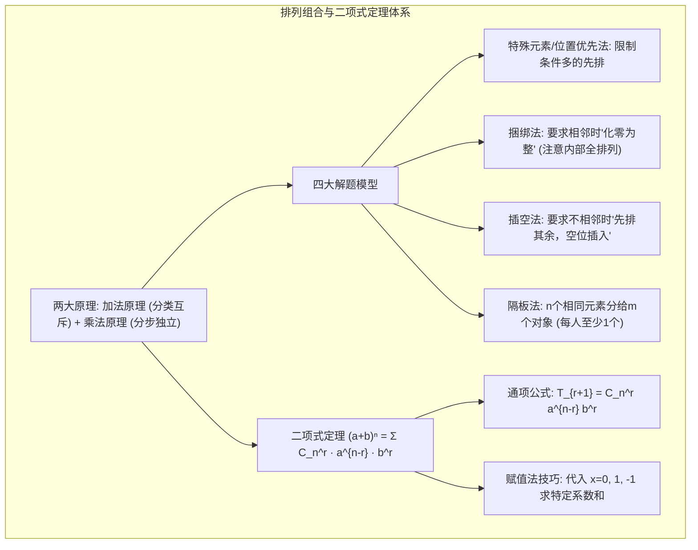
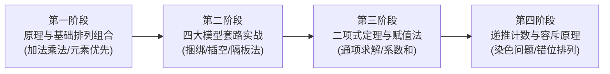

# 高中数学（沪教版）：计数原理、排列组合模型与二项式定理深度解析

> **“离散数学的灵魂始于计数。从有限集合的排列组合，到二项式展开与多项式系数，计数原理不仅构成了现代概率论的坚实基底，更是计算机密码学、离散算法与组合优化的核心源泉。”**  
> 在上海高考数学中，排列组合与二项式定理往往以四两拨千斤的形式出现（如填空题第 4 题常考二项式特定项系数或赋值法求和，选择题或综合题中频繁渗透隔板模型与分类讨论）。很多同学觉得排列组合“一做就漏、一算就重”，根本原因在于没有建立**“加法分类（互斥）、乘法分步（独立）”**的严密思维防线，以及缺乏对经典解题模型（捆绑、插空、隔板、元素优先）的模式识别。

本指南严格遵循 **`new_know`** 认知解构规范，系统提炼排列组合五大核心模型与二项式定理赋值秒杀秘籍：
1. **[📋 学习本专题所需的前置知识准备清单（Prerequisites）](#-学习本专题所需的前置知识准备prerequisites)**
2. **[💡 痛点溯源：为什么排列组合极容易“重复”与“遗漏”？](#一-痛点溯源从无序混乱到分类与分步思维防线)**
3. **[🧠 核心机制：四大排列组合解题模型与二项式定理展开](#二-核心机制四大经典组合模型与二项式定理)**
4. **[🚀 由浅入深四阶段系统化攻坚路线](#三-由浅入深四阶段系统化攻坚路线)**
5. **[🛠️ 现实应用展示：密码暴力破解复杂度评估与杨辉三角 Python 动态生成](#四-现实应用展示密码破译复杂度与-python-杨辉三角)**

---

## 📋 学习本专题所需的前置知识准备（Prerequisites）

排列组合与二项式定理是代数与逻辑的结合：

| 前置知识模块 | 关键考查概念 | 掌握标准与合格自测 | 查漏补缺指引 |
| :--- | :--- | :--- | :--- |
| **集合论基础** | 有限集基数（元素个数）、子集概念 | 理解包含 $n$ 个元素的集合其子集总数为 $2^n$。 | 本站[《集合与常用逻辑用语深度解析》](blog/highschool-sets-and-logic-guide.md)。 |
| **阶乘运算** | $n! = n \times (n-1) \times \dots \times 1$、$0! = 1$ | 熟练约分化简 $\frac{(n+1)!}{(n-1)!} = n(n+1)$。 | 初高中代数代换。 |
| **整除与多项式乘法** | 乘法分配律、完全平方与立方展开 | 能自主推导 $(a+b)^2$ 与 $(a+b)^3$ 的系数规律。 | 初中整式乘除。 |
| **函数与赋值法** | 恒等式性质、特殊值代入 | 理解若 $f(x) \equiv g(x)$ 对任意 $x$ 成立，则代入 $x=0, 1, -1$ 均成立。 | 本站[《函数概念、幂指对函数性质与增长模型》](blog/highschool-power-exp-log-functions-guide.md)。 |

### 🎯 1 分钟快速自测（Pre-flight Check）
> **自测题**：求 $(2x - 1)^5$ 展开式中所有项的系数之和，以及 $x^3$ 项的二项式系数和系数。  
> - **合格标准**：  
>   1. 系数之和令 $x=1$，直接得 $(2 \times 1 - 1)^5 = 1$；  
>   2. $x^3$ 项的二项式系数为 $C_5^2 = 10$；该项系数为 $C_5^2 (2)^3 (-1)^2 = 80$。

---

## 一、 痛点溯源：为什么排列组合极容易“重复”与“遗漏”？

### 1. 初学者的两大典型病因
1. **“分类”与“分步”混为一谈**：分类各事件必须**彼此互斥**（用加法，一步到位）；分步各阶段必须**彼此独立连续**（用乘法，步步相扣）。一旦分类中有重叠，结果必偏大；一旦分步有缺失，结果必偏小。
2. **“顺序”边界模糊（排列 vs 组合）**：取出 3 个人去扫地（与顺序无关，用组合 $C_n^3$）；取出 3 个人分别担任班长、学委、团支书（与顺序有关，用排列 $A_n^3$）。

### 2. 构建严密的双重防护网
- **加法原理（分类计数）**：完成一件事有 $n$ 类互斥办法，各类互不影响，总数等于各类方法数**相加**。
- **乘法原理（分步计数）**：完成一件事需连续经过 $m$ 个独立步骤，各步骤不可或缺，总数等于各步方法数**相乘**。

---

## 二、 核心机制：四大经典组合模型与二项式定理

### 1. 排列组合核心解题模型图谱



### 2. 四大经典解题模型详解

1. **特殊元素/位置优先法**：题目若有“某人必须排在首位”、“某数不能排在末位”，**立刻优先安排该特殊对象**，其余无限制对象再做全排列。
2. **捆绑法（相邻问题）**：若要求 $A, B$ 两人必须相邻，将 $A, B$ 看作一个大元素整体参与外部排列，**最后切勿遗忘乘上内部排列数 $A_2^2 = 2!$**。
3. **插空法（不相邻问题）**：若要求 3 名男生互不相邻，**先将女生排好**形成间隔空位（包括两端共有 $k+1$ 个空位），再将男生选空插入。
4. **隔板法（相同元素名额分配）**：将 $n$ 个完全相同的球分配给 $m$ 个不同盒子，**每个盒子至少分 1 个**：
   $$N = C_{n-1}^{m-1}$$
   > 💡 **变形技巧（允许盒子为空）**：若每个盒子可以分 0 个，采用“借球法”，先向每个盒子借 1 个球变成“每盒至少 1 个”，即求 $n+m$ 个球分给 $m$ 个盒子：$N = C_{n+m-1}^{m-1}$。

### 3. 二项式定理核心公式与赋值法神器

$$(a + b)^n = C_n^0 a^n + C_n^1 a^{n-1} b + \dots + C_n^r a^{n-r} b^r + \dots + C_n^n b^n$$
- **通项公式（第 $r+1$ 项）**：$T_{r+1} = C_n^r a^{n-r} b^r$（注意项数与组合数下标差 1）。
- **二项式系数 vs 项的系数**：
  - 二项式系数仅指组合数 $C_n^r$，与 $a, b$ 前的常数无关；
  - 项的系数指整理后未知数变量前的**全部纯数字乘积**。
- **赋值法奇效（上海高考填空第 4 题拿分必修）**：
  设 $(a_0 + a_1 x + a_2 x^2 + \dots + a_n x^n) = (1+2x)^n$：
  - 各项系数之和：代入 $x=1$ $\implies a_0 + a_1 + a_2 + \dots + a_n = 3^n$；
  - 常数项 $a_0$：代入 $x=0$ $\implies a_0 = 1^n = 1$；
  - 偶数项之和 $a_0 + a_2 + a_4 + \dots$：代入 $x=1$ 与 $x=-1$ 后相加除以 2；
  - 奇数项之和 $a_1 + a_3 + a_5 + \dots$：代入 $x=1$ 与 $x=-1$ 后相减除以 2。

---

## 三、 由浅入深四阶段系统化攻坚路线



### 阶段一：熟练区分排列与组合
- 强化训练：“排成一列”（有序，排列）与“组成小组”（无序，组合）的题意翻译。

### 阶段二：套路化识别四大模型
- 形成条件反射：看到“相邻”用捆绑，看到“不相邻”用插空，看到“相同元素分配”用隔板。

### 阶段三：二项式展开与多项式系数
- 熟练写出两式乘积如 $(x-1)(2x+1)^5$ 中 $x^3$ 项系数（拆分为常数乘 $x^3$ 与 $x$ 乘 $x^2$ 两项之和）。

### 阶段四：创新题型与错位排列
- 掌握经典错排公式 $D_n = (n-1)(D_{n-1} + D_{n-2})$（$D_1=0, D_2=1, D_3=2, D_4=9, D_5=44$），以及圆排列 $Q_n = (n-1)!$。

---

## 四、 现实应用展示：密码破译复杂度与 Python 杨辉三角

在现代网络安全中，评估密码遭受暴力破解（Brute-Force Attack）的抵抗时间，本质就是计算**带约束排列组合的状态空间基数**；而在算法设计中，二项式系数的计算正是动态规划（DP）与**杨辉三角**的经典实现。

以下 Python 脚本完整展示了二项式系数递归生成杨辉三角，并评估了常见密码策略下的排列组合空间复杂度与破解时间：

```python
import math

def generate_pascals_triangle(rows):
    """动态规划生成杨辉三角 (对应二项式定理展开系数 C_n^r)"""
    triangle = []
    for n in range(rows):
        row = [1] * (n + 1)
        for r in range(1, n):
            row[r] = triangle[n - 1][r - 1] + triangle[n - 1][r]
        triangle.append(row)
    return triangle

def password_brute_force_entropy(length, use_digits=True, use_lowercase=True, use_uppercase=True, use_special=True):
    """
    计算机安全：排列组合密码空间评估
    根据乘法分步原理计算状态空间与每秒 100 亿次 GPU 破解所需耗时
    """
    charset_size = 0
    if use_digits: charset_size += 10       # 0-9
    if use_lowercase: charset_size += 26    # a-z
    if use_uppercase: charset_size += 26    # A-Z
    if use_special: charset_size += 32      # 标点符号

    # 乘法原理: 每一位有 charset_size 种选择
    total_combinations = charset_size ** length
    
    # 假设每秒可测试 100 亿 (10^10) 次
    hashes_per_sec = 10**10
    seconds = total_combinations / hashes_per_sec
    years = seconds / (3600 * 24 * 365)
    
    return charset_size, total_combinations, years

print("=" * 65)
print("🔺 杨辉三角 (Pascal's Triangle) 动态生成 (前 6 行二项式系数):")
triangle = generate_pascals_triangle(6)
for i, row in enumerate(triangle):
    formatted_row = "  ".join(f"{x:2d}" for x in row)
    print(f"(a+b)^{i}: {formatted_row.center(35)}")

print("\n" + "=" * 65)
print("🔐 网络安全: 基于乘法原理的密码排列组合复杂度估算 (GPU 算力: 100 亿次/秒)")
cases = [
    (6, True, False, False, False, "6位纯数字 (银行卡密码)"),
    (8, True, True, False, False, "8位数字+小写字母"),
    (12, True, True, True, True, "12位数字+大小写+特殊字符 (推荐强密码)")
]

for length, d, l, u, s, label in cases:
    c_size, combs, yrs = password_brute_force_entropy(length, d, l, u, s)
    print(f"• 模式: {label}")
    print(f"  字符集大小: {c_size}, 组合总数: {combs:.2e}")
    if yrs < 1 / (365 * 24 * 60):
        print(f"  破译时间: < 1 秒 ❌ (极度危险)")
    elif yrs < 1:
        print(f"  破译时间: 约 {yrs * 365:.1f} 天 ⚠️")
    else:
        print(f"  破译时间: 约 {yrs:.1f} 年 ✅ (安全)")
print("=" * 65)
```

运行输出：
```text
=================================================================
🔺 杨辉三角 (Pascal's Triangle) 动态生成 (前 6 行二项式系数):
(a+b)^0:                  1                 
(a+b)^1:                1   1               
(a+b)^2:              1   2   1             
(a+b)^3:            1   3   3   1           
(a+b)^4:          1   4   6   4   1         
(a+b)^5:        1   5  10  10   5   1       

=================================================================
🔐 网络安全: 基于乘法原理的密码排列组合复杂度估算 (GPU 算力: 100 亿次/秒)
• 模式: 6位纯数字 (银行卡密码)
  字符集大小: 10, 组合总数: 1.00e+06
  破译时间: < 1 秒 ❌ (极度危险)
• 模式: 8位数字+小写字母
  字符集大小: 36, 组合总数: 2.82e+12
  破译时间: 约 0.0 天 ⚠️
• 模式: 12位数字+大小写+特殊字符 (推荐强密码)
  字符集大小: 94, 组合总数: 4.76e+23
  破译时间: 约 1509172.9 年 ✅ (安全)
=================================================================
```
