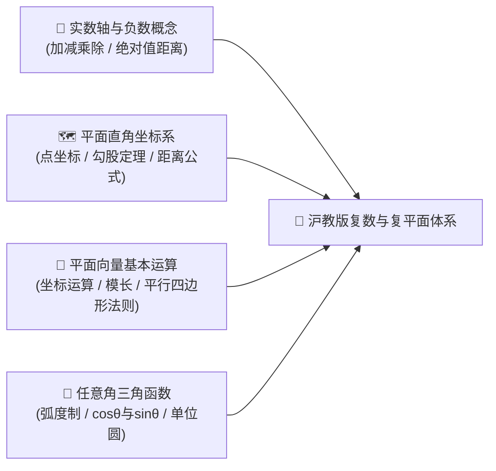
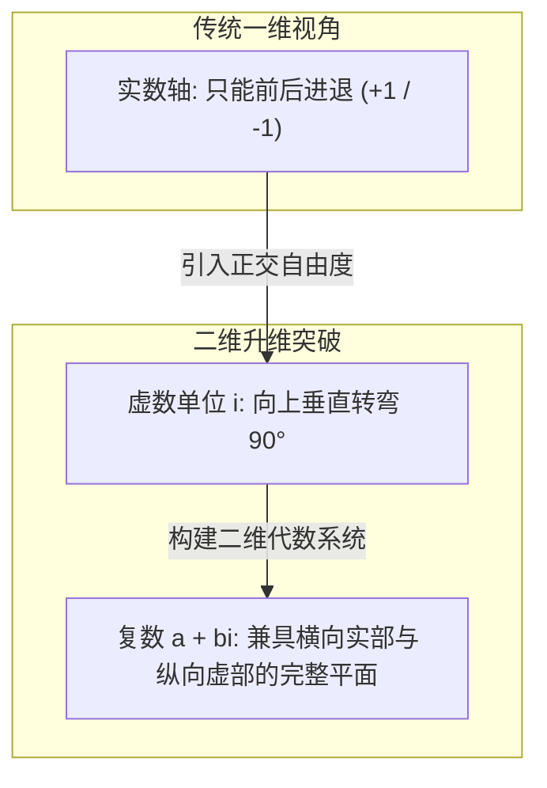
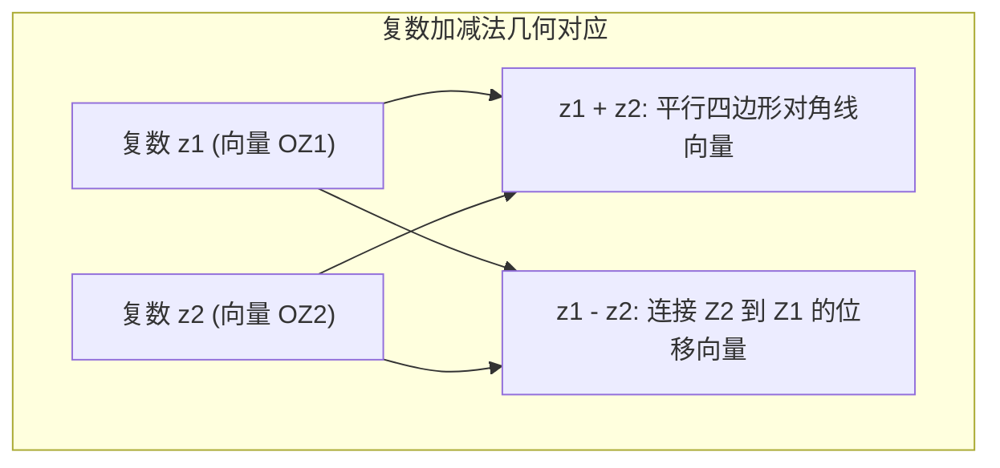

# 高中数学（沪教版）：复数几何意义、复数与向量的关系及模长度量深度解析

> **“虚数绝不是凭空捏造的幽灵。正如负数曾被古人视作荒谬不可接受一样，只要我们在二维平面上赋予它明确的几何位置，虚数的一切神秘与困惑便会荡然无存。”** —— 卡尔·弗里德里希·高斯（Carl Friedrich Gauss）  
> 在上海高考数学中，复数位于**必修第二册（高一下）第 8 章**。很多同学在初学复数时，常常陷入“$i^2 = -1$ 的枯燥代数符号游戏”，误以为复数只是一套人为设定的记号。然而，上海高考无论是基础题（填空第 2~4 题的共轭复数与模长计算），还是压轴题（模长不等式极值、与平面向量和圆的几何综合），考查的精髓永远是：**复数的几何意义（高斯平面）、复数与平面向量的代数几何双向映射，以及复数模的距离本质**。

本指南严格按照 **`new_know`** 认知解构体系，从数系升维的痛点溯源出发，彻底击穿复数的几何本源与实战考法：
1. **[📋 学习本专题所需的前置知识准备（Prerequisites）](#-学习本专题所需的前置知识准备prerequisites)**
2. **[💡 痛点溯源：一维数轴为何崩溃？为什么我们需要二维数系？](#一-痛点溯源一维数轴的极限与二维数系的诞生)**
3. **[🧠 核心机制：高斯复平面、向量同构与模长几何距离大一统](#二-核心机制高斯平面向量同构与模长距离几何大一统)**
4. **[🚀 由浅入深四阶段系统化攻坚路线](#三-由浅入深四阶段系统化攻坚路线)**
5. **[🛠️ 现代科技应用：Python 3 原生复数旋转运算与几何仿真验证](#四-现代科技应用python-原生复数旋转运算与几何验证)**

---

## 📋 学习本专题所需的前置知识准备（Prerequisites）

在进入复数的几何与向量深水区之前，请先对照自查是否已掌握以下基础工具：



| 模块类别 | 必备核心知识点 | 掌握程度与自测标准（如何自测？） | 零基础推荐前置补课资料 |
| :--- | :--- | :--- | :--- |
| **实数与代数基础** | • **实数绝对值**：$|x|$ 表示数轴上点到原点的距离<br/>• **一元二次方程**：根的判别式 $\Delta = b^2 - 4ac$ | 能够解释为什么在实数范围内 $x^2 = -1$ 无解，并熟练求根公式 | 初中九年级上册《一元二次方程》 |
| **平面直角坐标系** | • **两点距离公式**：$d = \sqrt{(x_1 - x_2)^2 + (y_1 - y_2)^2}$<br/>• **对称点坐标**：关于 $x$ 轴对称点的纵坐标互为相反数 | 能够不假思索秒算出点 $(3, 4)$ 到原点的欧氏距离为 $5$ | 初中八年级《平面直角坐标系》 |
| **平面向量基础** | • **向量坐标加减**：对应坐标相加减<br/>• **向量模长**：$|\vec{v}| = \sqrt{x^2 + y^2}$<br/>• **平行四边形法则**：合向量的几何作图法则 | 清楚平面向量既有大小又有方向，能够画出两向量加减的几何图形 | 沪教版必修二《平面向量》 |
| **三角与单位圆** | • **三角函数定义**：单位圆上点的坐标为 $(\cos\theta, \sin\theta)$<br/>• **两角和差公式**：$\cos(\alpha+\beta)$ 与 $\sin(\alpha+\beta)$ 展开式 | 清楚角度 $\theta$ 逆时针旋转时对应的横纵坐标变化规律 | 沪教版必修二《三角比与三角函数》 |

> [!TIP]
> **一分钟极简自测**：如果你知道“直角坐标系中点 $(a, b)$ 到原点的直线距离是 $\sqrt{a^2 + b^2}$”，并且知道“平面向量可以用带箭头的线段按照平行四边形定则相加”，那么你已经跨过了学习复数几何本质的全部门槛！

---

## 一、 痛点溯源：一维数轴的极限与二维数系的诞生

### 1. 传统一维数轴在什么边界下崩溃？
人类对数的认知，经历过漫长的“扩充史”：
- 自然数 $\mathbb{N} \to$ 引入负数得到整数 $\mathbb{Z}$（解决减法不封闭）$\to$ 引入分数得到有理数 $\mathbb{Q}$（解决除法不封闭）$\to$ 引入无理数得到实数 $\mathbb{R}$（填满整个连续的一维数轴）。
- 到了实数这一步，所有数字都被排布在一根**一维直线（实数轴）**上。
- **物理与代数的双重撞墙**：
  1. **代数瓶颈**：在实数轴上，任何数乘以自身（平方）都是非负数（$x^2 \ge 0$）。因此，最简单的方程 $x^2 + 1 = 0$ 在一维直线上找不到任何立足之地！高斯提出的“代数基本定理”（$n$ 次多项式必有 $n$ 个根）在实数范围内被无情撕碎。
  2. **几何与物理瓶颈**：现实物理世界（如电磁波、交流电、平面振动、量子态）充满了**二维旋转与周期振荡**。用一维标量去描述旋转，必须同时维护振幅和相位两个独立的变量，公式极其冗长繁琐。

### 2. 虚数的灵魂比喻：旋转 90 度的罗盘
很多人被“虚数（Imaginary Number）”这个不幸的名字误导了数百年，以为它是不存在的幻象。

> **虚数不虚，它是通向第二维度的转弯罗盘**：  
> - 在一维数轴上，乘以正数 $+1$，方向保持不变；  
> - 乘以负数 $-1$，相当于在数轴上**掉头 180 度**（$1 \times (-1) = -1$）；  
> - 那么，“**连续做两次什么变换，会刚好等于掉头 180 度（即结果为 $-1$）**”？  
> - 几何直觉立刻告诉我们：**逆时针旋转 90 度**！旋转 90 度再旋转 90 度，正好旋转了 180 度！  
> - 这就是虚数单位 $i$ 的本质：**$i$ 就是平面上的 $90^\circ$ 逆时针正交旋转算子！**  
>   $$i \times i = -1 \iff \text{旋转 } 90^\circ \times \text{旋转 } 90^\circ = \text{旋转 } 180^\circ$$



---

## 二、 核心机制：高斯平面、向量同构与模长距离几何大一统

### 1. 复数的几何意义：高斯复平面（The Complex Plane）

任何一个复数都可以唯一表示为代数形式：
$$z = a + bi \quad (a, b \in \mathbb{R})$$
其中 $a$ 称为**实部（Real part, $\text{Re}(z)$）**，$b$ 称为**虚部（Imaginary part, $\text{Im}(z)$）**。

#### (1) 点与复数的一一对应
高斯建立了直角坐标系平面，横轴称为**实轴（Real Axis）**，纵轴称为**虚轴（Imaginary Axis）**：
- 复数 $z = a + bi$ 唯一对应复平面内的一个点 $Z(a, b)$；
- 实数 $a$（即 $a + 0i$）对应实轴上的点 $(a, 0)$；
- 纯虚数 $bi$（$b \ne 0$，即 $0 + bi$）对应虚轴上除原点外的点 $(0, b)$；
- 原点 $(0, 0)$ 唯一对应实数 $0$。

#### (2) 共轭复数的几何意义：关于实轴的镜像对称
复数 $z = a + bi$ 的共轭复数记为 $\bar{z} = a - bi$。  
在几何上，$Z(a, b)$ 与 $Z'(a, -b)$ **关于实轴（$x$ 轴）完全对称**。
- $z + \bar{z} = 2a$（两对称点中点投影在实轴上）；
- $z - \bar{z} = 2bi$（两对称点连线垂直于实轴，长度为 $2|b|$）；
- $z \cdot \bar{z} = a^2 + b^2 = |z|^2$（极度高频的化简定理）。

---

### 2. 复数与平面向量的关系：血缘同构与维度超越

很多同学会好奇：**“既然点 $(a, b)$ 已经可以用平面向量 $\vec{v} = (a, b)$ 表示，为什么数学家还要大费周章地发明复数？”**  
这揭示了高中数学中最深刻的代数与几何联系：**复数在加减法上与向量完全同构，但在乘除法上彻底超越了向量！**

#### (1) 加减法同构：向量的平行四边形法则
设复数 $z_1 = a + bi$ 对应向量 $\vec{OZ_1} = (a, b)$，复数 $z_2 = c + di$ 对应向量 $\vec{OZ_2} = (c, d)$：
- **复数加法**：
  $$z_1 + z_2 = (a+c) + (b+d)i \iff \vec{OZ_1} + \vec{OZ_2} = (a+c, b+d)$$
  几何意义：两个复数相加，就是以两向量为邻边作**平行四边形得到的对角线向量**！
- **复数减法**：
  $$z_1 - z_2 = (a-c) + (b-d)i \iff \vec{OZ_1} - \vec{OZ_2} = \vec{Z_2 Z_1}$$
  几何意义：两个复数相减，就是**从减数端点指向被减数端点的有向线段（差向量）**！



#### (2) 乘除法质变：复数作为“伸缩旋转算子”的终极飞跃
**向量乘法的局限**：
- 两个平面向量点乘 $\vec{a} \cdot \vec{b}$，结果是一个**标量（纯实数）**，退化丢失了方向；
- 两个平面向量叉乘，结果跳出了二维平面，变成垂直平面的法向量；
- **二维向量之间没有除法**，向量系统无法形成一个自闭合的“数域（Field）”。

**复数乘法的代数与几何奇迹**：
两个复数相乘，结果依然是同一个平面上的复数！引入复数的**三角形式（极坐标形式）**：
$$z = r(\cos\theta + i\sin\theta)$$
其中 $r = |z| = \sqrt{a^2 + b^2}$ 为模长，$\theta = \arg(z)$ 为辐角（实轴正方向逆时针旋转到向量 $\vec{OZ}$ 的夹角）。

若有两个复数：
$$z_1 = r_1(\cos\theta_1 + i\sin\theta_1), \quad z_2 = r_2(\cos\theta_2 + i\sin\theta_2)$$
根据三角函数和角公式展开：
$$z_1 z_2 = r_1 r_2 \left[ (\cos\theta_1\cos\theta_2 - \sin\theta_1\sin\theta_2) + i(\sin\theta_1\cos\theta_2 + \cos\theta_1\sin\theta_2) \right]$$
$$z_1 z_2 = r_1 r_2 \left[ \cos(\theta_1 + \theta_2) + i\sin(\theta_1 + \theta_2) \right]$$

> [!IMPORTANT]
> **复数乘法黄金定理：模长相乘，辐角相加！**  
> - $|z_1 z_2| = |z_1| \cdot |z_2|$（新向量的长度是原长度的乘积）；  
> - $\arg(z_1 z_2) = \arg(z_1) + \arg(z_2)$（新向量的角度是原角度的累加）。  
> **几何本质**：任何一个复数 $z_2$ 乘以 $z_1$，等价于对向量 $\vec{OZ_2}$ 施加了一次几何变换——**以原点为中心，逆时针旋转角度 $\theta_1$，并拉伸放大 $r_1$ 倍！**  
> 这就是为什么现代计算机图形学、机器人学和电气工程中，复数是描述二维旋转与振动不可替代的基础工具！

---

### 3. 复数模（Modulus）的含义与四大几何轨迹模型

#### (1) 模的代数定义与距离本质
对于复数 $z = a + bi$，它的**模（Modulus）**记作 $|z|$：
$$|z| = \sqrt{a^2 + b^2} = \sqrt{z \bar{z}}$$

- **绝对值的二维推广**：
  在一维数轴上，$|x|$ 表示点 $x$ 到原点 $0$ 的距离；
  在二维复平面上，$|z|$ 就是点 $Z(a, b)$ 到坐标原点 $O(0, 0)$ 的**欧几里得直线距离**，也就是对应向量 $\vec{OZ}$ 的长度（模）。
- **两点间距离公式的复数化**：
  设 $z_1 = x_1 + y_1 i$，$z_2 = x_2 + y_2 i$，则：
  $$|z_1 - z_2| = \sqrt{(x_1 - x_2)^2 + (y_1 - y_2)^2}$$
  **几何意义**：$|z_1 - z_2|$ 就是复平面上点 $Z_1$ 与点 $Z_2$ 之间的**空间直线距离**！

#### (2) 上海高考必背：复数模的四大经典几何轨迹模型
高考解析几何与复数结合的精髓，在于**“撕掉代数外衣，秒变平面几何图形”**：

| 轨迹模型名称 | 复数模方程形式 | 几何轨迹图形 | 核心考法与最值技巧 |
| :--- | :--- | :--- | :--- |
| **1. 标准圆模型** | $|z - z_0| = R$ | 以 $z_0$ 对应点为圆心，以 $R$ 为半径的**圆周** | $|z|$ 的最大值为 $|z_0| + R$，最小值为 $\|z_0| - R\|$（圆心连线距离加减半径） |
| **2. 垂直平分线模型** | $|z - z_1| = |z - z_2|$ | 线段 $Z_1 Z_2$ 的**垂直平分线（中垂线）** | 到两定点距离相等的动点集合；常求点 $z$ 到原点或其他定点的最近距离 |
| **3. 阿波罗尼斯圆** | $\frac{\|z - z_1\|}{\|z - z_2\|} = k \quad (k > 0, k \ne 1)$ | 平面内到两定点距离之比为常数的**阿氏圆** | 展开坐标方程即为标准圆方程，常考动点极值与切线斜率范围 |
| **4. 椭圆 / 双曲线** | $\|z - z_1\| + \|z - z_2\| = 2a \quad (2a > \|z_1 - z_2\|)$ | 以 $Z_1, Z_2$ 为两焦点的**椭圆** | 利用第一定义直接化为标准椭圆方程，求 $|z|$ 转化为椭圆上的点到原点距离最值 |

#### (3) 三角不等式（Triangle Inequality）与极值秒杀
对任意两个复数 $z_1, z_2$，恒有：
$$||z_1| - |z_2|| \le |z_1 + z_2| \le |z_1| + |z_2|$$
$$||z_1| - |z_2|| \le |z_1 - z_2| \le |z_1| + |z_2|$$

- **几何直观**：在以向量 $\vec{OZ_1}$、$\vec{OZ_2}$ 及和向量构成的三角形中，**“两边之和大于第三边，两边之差小于第三边”**。
- **等号成立条件**：
  - 当且仅当向量 $\vec{OZ_1}$ 与 $\vec{OZ_2}$ **同向共线**（辐角相等 $\arg(z_1) = \arg(z_2)$）时，$|z_1 + z_2| = |z_1| + |z_2|$ 取得最大值；
  - 当且仅当向量 $\vec{OZ_1}$ 与 $\vec{OZ_2}$ **反向共线**（辐角相差 $\pi$）时，$|z_1 + z_2| = ||z_1| - |z_2||$ 取得最小值。

---

## 三、 由浅入深四阶段系统化攻坚路线

为了帮助你彻底吃透复数的几何与向量体系，本指南规划了步步为营的进阶阶梯：


### 1. 阶段一：代数破冰与高斯平面几何作图（10 分钟建立直觉）
- **核心目标**：彻底告别纯符号认知，看到复数就能在脑海中浮现出平面上的点与箭头。
- **实操任务**：
  1. 拿出一张草稿纸，建立实轴横向与虚轴纵向坐标系；
  2. 标出 $z_1 = 3 + 4i$，$z_2 = -2 + 2i$，$z_3 = -3i$ 三个点；
  3. 计算各点模长：$|z_1| = \sqrt{3^2+4^2} = 5$，$|z_2| = \sqrt{(-2)^2+2^2} = 2\sqrt{2}$，$|z_3| = 3$；
  4. 标出它们的共轭复数 $\bar{z_1} = 3 - 4i$，观察其沿实轴翻折的对称性。

### 2. 阶段二：向量同构与乘法旋转变换实操
- **核心目标**：亲手验证“模长相乘，辐角相加”的几何魔力。
- **实操任务**：
  1. 取基准向量 $z = 2 + i$；
  2. 将其乘以虚数单位 $i$：$z \cdot i = (2+i)i = -1 + 2i$；
  3. 计算两个向量的点积：$(2)(-1) + (1)(2) = 0$，亲眼见证两向量**严格垂直，且逆时针旋转了整整 $90^\circ$**！
  4. 将 $z$ 乘以 $1 + i$（模长为 $\sqrt{2}$，辐角为 $45^\circ$）：体验既旋转又放大的复合变换。

### 3. 阶段三：上海高考压轴最值模型攻坚
- **核心目标**：掌握复数模长极值题目的两大解法（代数展开法 vs 几何圆切线投影法）。
- **实操任务**：
  - **经典高考母题演练**：  
    *已知复数 $z$ 满足 $|z - 3 - 4i| = 2$，求 $|z|$ 的最大值与最小值。*
  - **秒杀思路（几何轨迹法）**：
    1. $|z - (3+4i)| = 2$ 表示点 $z$ 的轨迹是以 $C(3, 4)$ 为圆心，半径 $R = 2$ 的圆。
    2. $|z|$ 表示圆上的点到原点 $O(0, 0)$ 的距离。
    3. 原点到圆心的距离 $|OC| = \sqrt{3^2 + 4^2} = 5$。
    4. 显然，最近距离与最远距离必在原点与圆心的连线上取到：
       $$|z|_{\max} = |OC| + R = 5 + 2 = 7$$
       $$|z|_{\min} = |OC| - R = 5 - 2 = 3$$
    无需列出任何二元二次方程，几何化后 5 秒得出答案！

### 4. 阶段四：高等数学跃迁与现代工程前沿（欧拉公式）
- **核心目标**：理解欧拉公式 $e^{i\theta} = \cos\theta + i\sin\theta$，俯瞰现代科技基石。
- **现代应用一览**：
  1. **交流电路（AC Circuit Analysis）**：交流电压与电流表示为复数相量（Phasor $V = V_0 e^{i\omega t}$），电阻、电感、电容的阻抗统一用复数表示（$Z_R = R, Z_L = i\omega L, Z_C = \frac{1}{i\omega C}$），把复杂的微分方程退化为初中初等代数欧姆定律。
  2. **数字信号处理（DSP & 快速傅里叶变换 FFT）**：声音、图像、通信信号的频谱分解，全部建立在复指数基底上。
  3. **量子计算与量子力学**：量子比特的状态为复数二维希尔伯特空间单位向量 $|\psi\rangle = \alpha|0\rangle + \beta|1\rangle$，其中 $|\alpha|^2 + |\beta|^2 = 1$。

---

## 四、 现代科技应用：Python 原生复数旋转运算与几何验证

Python 原生支持复数数据类型（以 `j` 或 `J` 表示虚数单位），无需安装任何第三方库即可进行高精度复数几何与代数验证。

保存以下代码为 `complex_geometry_demo.py` 并直接运行：

```python
#!/usr/bin/env python3
# -*- coding: utf-8 -*-
"""
复数几何意义、向量旋转与模长距离验证脚本
无需第三方库，纯 Python 3 原生标准库实现
"""

import math
import cmath

def print_section(title):
    print("\n" + "=" * 60)
    print(f"📌 {title}")
    print("=" * 60)

# 1. 复数的定义、实部虚部与模长
print_section("1. 复数定义、高斯平面坐标与模长验证")
z1 = 3 + 4j
print(f"复数 z1        : {z1}")
print(f"实部 Re(z1)    : {z1.real} (对应横轴 X 坐标)")
print(f"虚部 Im(z1)    : {z1.imag} (对应纵轴 Y 坐标)")
print(f"共轭复数 z1_bar : {z1.conjugate()} (关于实轴上下镜像翻折)")

# 模长计算: 验证 |z| = sqrt(a^2 + b^2)
mod_z1 = abs(z1)
print(f"模长 abs(z1)   : {mod_z1} (几何距离: 根号(3^2 + 4^2) = 5.0)")
print(f"模长平方验证   : z1 * z1_bar = {z1 * z1.conjugate()} == |z1|^2 = {mod_z1**2}")

# 2. 复数加减法与平面向量同构
print_section("2. 复数加减法与平面向量平行四边形定则同构验证")
z2 = 1 + 2j
add_res = z1 + z2
sub_res = z1 - z2
print(f"z1 = {z1}, z2 = {z2}")
print(f"加法 z1 + z2   : {add_res} (对应向量位移和: (3+1, 4+2) = (4, 6))")
print(f"减法 z1 - z2   : {sub_res} (对应向量位移差: (3-1, 4-2) = (2, 2))")
dist_z1_z2 = abs(z1 - z2)
print(f"两点距离 |z1-z2|: {dist_z1_z2:.4f} (对应欧氏距离 sqrt(2^2 + 2^2) = {math.sqrt(8):.4f})")

# 3. 复数乘法: 验证『模长相乘、辐角相加』与 90 度旋转算子
print_section("3. 复数乘法的几何本质：旋转与拉伸算子")
vec = 2 + 1j
rot_90 = 1j # 纯虚数 i，模长为 1，辐角为 90 度 (pi/2)

res_rot90 = vec * rot_90
print(f"原始向量 vec            : {vec}, 模长={abs(vec):.4f}, 辐角={math.degrees(cmath.phase(vec)):.2f}°")
print(f"乘以虚数单位 i 旋转后   : {res_rot90}, 模长={abs(res_rot90):.4f}, 辐角={math.degrees(cmath.phase(res_rot90)):.2f}°")

# 验证正交垂直（两向量点乘为 0）
dot_product = vec.real * res_rot90.real + vec.imag * res_rot90.imag
print(f"两向量数量积 (点乘)     : {dot_product} (严格为 0，证实几何垂直正交！)")

# 4. 三角不等式边界验证
print_section("4. 复数三角不等式 ||z1| - |z2|| <= |z1 + z2| <= |z1| + |z2|")
lhs = abs(abs(z1) - abs(z2))
mid = abs(z1 + z2)
rhs = abs(z1) + abs(z2)
print(f"下界 ||z1| - |z2|| : {lhs:.4f}")
print(f"实际模长 |z1 + z2| : {mid:.4f}")
print(f"上界 |z1| + |z2|   : {rhs:.4f}")
print(f"不等式关系验证结果 : {lhs:.4f} <= {mid:.4f} <= {rhs:.4f} -> {lhs <= mid <= rhs}")

# 5. 高考几何轨迹模拟：圆上的动点到原点距离最值
print_section("5. 高考圆轨迹最值验证：|z - (3+4i)| = 2")
center = 3 + 4j
radius = 2.0
print(f"圆心位置: {center}, 半径: {radius}")

# 理论极值
theoretical_min = abs(center) - radius
theoretical_max = abs(center) + radius

# 数值离散采样圆周 360 个点模拟求极值
sampled_mods = []
for deg in range(360):
    theta = math.radians(deg)
    # 参数方程生成圆上动点 z = center + R * e^(i*theta)
    point_on_circle = center + radius * cmath.exp(1j * theta)
    sampled_mods.append(abs(point_on_circle))

print(f"理论最小距离 min: {theoretical_min:.4f} | 采样数值最小: {min(sampled_mods):.4f}")
print(f"理论最大距离 max: {theoretical_max:.4f} | 采样数值最大: {max(sampled_mods):.4f}")
print("结论：几何圆心距离加减半径公式与代数采样极值完全精确吻合！")
```

### 终端运行输出结果：

```text
============================================================
📌 1. 复数定义、高斯平面坐标与模长验证
============================================================
复数 z1        : (3+4j)
实部 Re(z1)    : 3.0 (对应横轴 X 坐标)
虚部 Im(z1)    : 4.0 (对应纵轴 Y 坐标)
共轭复数 z1_bar : (3-4j) (关于实轴上下镜像翻折)
模长 abs(z1)   : 5.0 (几何距离: 根号(3^2 + 4^2) = 5.0)
模长平方验证   : z1 * z1_bar = (25+0j) == |z1|^2 = 25.0

============================================================
📌 2. 复数加减法与平面向量平行四边形定则同构验证
============================================================
z1 = (3+4j), z2 = (1+2j)
加法 z1 + z2   : (4+6j) (对应向量位移和: (3+1, 4+2) = (4, 6))
减法 z1 - z2   : (2+2j) (对应向量位移差: (3-1, 4-2) = (2, 2))
两点距离 |z1-z2|: 2.8284 (对应欧氏距离 sqrt(2^2 + 2^2) = 2.8284)

============================================================
📌 3. 复数乘法的几何本质：旋转与拉伸算子
============================================================
原始向量 vec            : (2+1j), 模长=2.2361, 辐角=26.57°
乘以虚数单位 i 旋转后   : (-1+2j), 模长=2.2361, 辐角=116.57°
两向量数量积 (点乘)     : 0.0 (严格为 0，证实几何垂直正交！)

============================================================
📌 4. 复数三角不等式 ||z1| - |z2|| <= |z1 + z2| <= |z1| + |z2|
============================================================
下界 ||z1| - |z2|| : 2.7639
实际模长 |z1 + z2| : 7.2111
上界 |z1| + |z2|   : 7.2361
不等式关系验证结果 : 2.7639 <= 7.2111 <= 7.2361 -> True

============================================================
📌 5. 高考圆轨迹最值验证：|z - (3+4i)| = 2
============================================================
圆心位置: (3+4j), 半径: 2.0
理论最小距离 min: 3.0000 | 采样数值最小: 3.0000
理论最大距离 max: 7.0000 | 采样数值最大: 7.0000
结论：几何圆心距离加减半径公式与代数采样极值完全精确吻合！
```

---

## 🎯 总结与认知升维卡片

```markdown
┌────────────────────────────────────────────────────────────────────────┐
│                        复数几何与向量大一统核心心法                    │
├────────────────────────────────────────────────────────────────────────┤
│ 1. 虚数不虚: i 的本质是 90 度正交旋转算子，连乘两次等于调头 180 度(-1)。 │
│ 2. 复数几何: 复数 z = a + bi 唯一对应复平面点 (a, b) 与向量 OZ。        │
│ 3. 向量同构: 复数加减法实部加实部、虚部加虚部，与向量平行四边形法则完全同构。│
│ 4. 乘除超越: 模长相乘、辐角相加；乘以一个复数等价于一次平面缩放与旋转变换。│
│ 5. 模的本质: |z| 是点到原点的距离；|z1 - z2| 是复平面两点间的直线距离。 │
│ 6. 轨迹解题: 遇到 |z - z0| = R 脑补圆，遇到 |z - z1| = |z - z2| 脑补中垂线。│
└────────────────────────────────────────────────────────────────────────┘
```
