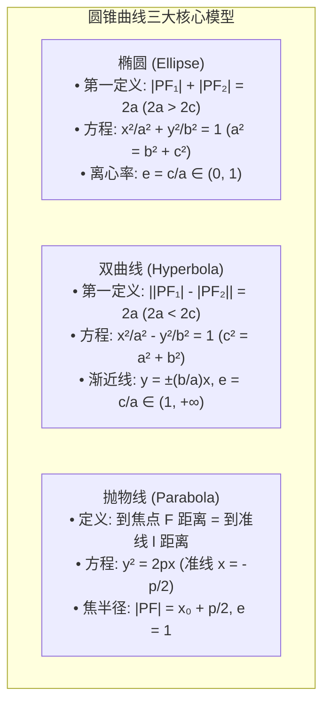
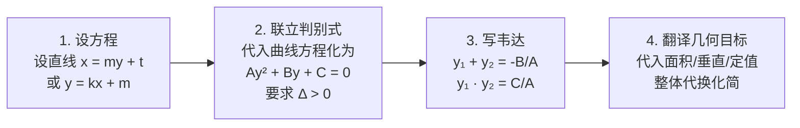

# 高中数学（沪教版）：平面解析几何与圆锥曲线综合探究深度解析

> **“如果说平面几何是尺规与目光的舞蹈，那么解析几何则是笛卡尔赠予人类的‘代数透镜’。它让曲线有了方程，让几何图形变成了代数多项式的几何轨迹。”**  
> 在上海高考数学中，平面解析几何占据着极为显赫的战略高地（通常为解答题第 19 题，分值约 14-15 分，并常在填空题第 7 题或选择题第 15 题考查渐近线、离心率与焦半径）。很多同学视圆锥曲线解答题为“计算黑洞”，面对巨大的代数联立消元望而却步。实际上，圆锥曲线压轴题的底层逻辑不是“硬算”，而是**“设而不求”的代数结构化变形**与**几何性质的代数投影**。

本指南严格遵循 **`new_know`** 认知解构规范，系统拆解圆锥曲线统一模型、联立韦达流水线与核心解题模型：
1. **[📋 学习本专题所需的前置知识准备清单（Prerequisites）](#-学习本专题所需的前置知识准备prerequisites)**
2. **[💡 痛点溯源：为什么解析几何会沦为“算不对的无底洞”？](#一-痛点溯源从盲目硬算到设而不求代数美学)**
3. **[🧠 核心机制：圆锥曲线统一定义、标准方程与韦达联立黄金流水线](#二-核心机制三大圆锥曲线与联立韦达流水线)**
4. **[🚀 由浅入深四阶段系统化攻坚路线](#三-由浅入深四阶段系统化攻坚路线)**
5. **[🛠️ 现实应用展示：开普勒行星椭圆轨道与航天轨道转移 Python 仿真](#四-现实应用展示开普勒天体轨道与-python-力学仿真)**

---

## 📋 学习本专题所需的前置知识准备（Prerequisites）

圆锥曲线是高中代数与平面几何计算的集大成者：

| 前置知识模块 | 关键考查概念 | 掌握标准与合格自测 | 查漏补缺指引 |
| :--- | :--- | :--- | :--- |
| **直线与圆的方程** | 点斜式、两点式、点到直线距离公式、圆的标准方程与相切条件 | 熟练写出点 $(x_0, y_0)$ 到直线 $Ax+By+C=0$ 距离 $d = \frac{|Ax_0+By_0+C|}{\sqrt{A^2+B^2}}$；弦长垂径定理。 | 沪教版选择性必修第一册第 2 章平面解析几何。 |
| **一元二次方程与韦达定理** | 根的判别式 $\Delta$、韦达定理根与系数关系 | 给出方程 $ax^2+bx+c=0$，脱口而出 $x_1+x_2 = -\frac{b}{a}$ 与 $x_1 x_2 = \frac{c}{a}$。 | 初中代数二次方程模块。 |
| **平面向量数量积与坐标运算** | 向量共线条件、垂直充要条件 | 会用 $x_1 x_2 + y_1 y_2 = 0$ 表达两线段垂直。 | 本站[《平面向量、数量积与动态极值转化》](blog/highschool-vectors-guide.md)。 |
| **等式与不等式最值变形** | 均值不等式最值、换元法与二次函数值域 | 能求解形如 $t + \frac{k}{t}$ 或关于单一变量的极值区间。 | 本站[《等式、不等式与基本不等式最值模型》](blog/highschool-inequalities-guide.md)。 |

### 🎯 1 分钟快速自测（Pre-flight Check）
> **自测题**：已知椭圆方程为 $\frac{x^2}{4} + y^2 = 1$，直线 $l: y = kx + m$ 与椭圆交于 $A(x_1, y_1), B(x_2, y_2)$ 两点。  
> 联立后若得到 $(1+4k^2)x^2 + 8kmx + (4m^2-4) = 0$，请写出弦长 $|AB|$ 关于 $k, x_1, x_2$ 的表达式。  
> - **合格标准**：能写出 $|AB| = \sqrt{1+k^2}|x_1-x_2| = \sqrt{1+k^2} \sqrt{(x_1+x_2)^2 - 4x_1x_2}$。

---

## 一、 痛点溯源：为什么解析几何会沦为“算不对的无底洞”？

### 1. 学生的常见解题误区
1. **急于求解交点坐标**：很多同学一看到直线与圆锥曲线相交，就试图把一元二次方程的求根公式代进去硬解 $x = \frac{-b \pm \sqrt{\Delta}}{2a}$，导致式子中充满双重根号，几步之后彻底算死。
2. **变量未收敛**：动点 $A(x_1, y_1), B(x_2, y_2), P(x_0, y_0)$，外加斜率 $k$ 与截距 $m$，全卷充斥着 7、8 个未知数，未建立消元优先级。
3. **忽略几何性质**：将焦半径、焦点三角形面积等原本可以通过几何定义（如 $r_1 + r_2 = 2a$ 或准线定义 $PF = d$）秒杀的问题，机械地转化为纯代数坐标距离公式。

### 2. 破局之道：“设而不求”与“结构化目标化简”
解析几何的本质是**代数翻译**：
- **设而不求**：设交点为 $(x_1, y_1), (x_2, y_2)$，只通过韦达定理 $x_1+x_2$ 和 $x_1 x_2$ 进行整体代换，**永不解出单根**！
- **设线优先**：斜率存在时设 $y = kx + m$；斜率可能为 0 时，设横向直线 $x = my + n$（完美避开斜率不存在讨论）。
- **目标先行**：求面积、斜率之和、垂直关系，先将目标代数式化为对称式 $(x_1+x_2)$ 与 $x_1 x_2$ 的组合，再带入韦达系数。

---

## 二、 核心机制：三大圆锥曲线与联立韦达流水线

### 1. 三大圆锥曲线几何特征全景对照地图



### 2. 韦达联立消元黄金流水线（标准四步法）

无论面对多么复杂的高考大题，以下流水线具有 100% 的确定性：



### 3. 点差法与中点弦公式（秒杀神器）
若直线与椭圆 $\frac{x^2}{a^2} + \frac{y^2}{b^2} = 1$ 相交于 $A(x_1, y_1), B(x_2, y_2)$，中点为 $M(x_0, y_0)$，则将两点代入方程作差：
$$\frac{x_1^2 - x_2^2}{a^2} + \frac{y_1^2 - y_2^2}{b^2} = 0 \implies \frac{(x_1-x_2)(2x_0)}{a^2} + \frac{(y_1-y_2)(2y_0)}{b^2} = 0$$
由此直接得到**斜率与中点坐标的乘积恒等式**：
$$k_{AB} \cdot k_{OM} = -\frac{b^2}{a^2}$$
> 💡 遇到“中点弦”、“斜率之积为定值”题型，点差法无需联立，两行即可化简！

---

## 三、 由浅入深四阶段系统化攻坚路线


### 阶段一：定义透彻与几何秒杀
- **训练重点**：椭圆焦点三角形面积公式 $S = b^2 \tan\frac{\angle F_1PF_2}{2}$；抛物线以焦点弦为直径的圆与准线相切；双曲线等轴性质。
- **上海考题对照**：填空第 7 题（直线与双曲线渐近线位置关系）、选择第 15 题（抛物线焦点弦与焦半径）。

### 阶段二：代数联立与设而不求基本功
- **训练重点**：弦长公式 $|AB| = \sqrt{1+k^2}|x_1-x_2| = \sqrt{1+\frac{1}{k^2}}|y_1-y_2|$ 的熟练推导与计算化简；三角形面积 $S = \frac{1}{2}|x_1 y_2 - x_2 y_1|$ 向量叉乘坐标式。

### 阶段三：高考第 19 题压轴经典模型通关
- **模型一：定点定值问题**  
  设直线参数 $m, t$，求出某点坐标或某直线方程关于参数恒成立，分离参数让参数项系数为 0。
- **模型二：动点垂直与向量数量积最值**  
  $\vec{OA} \cdot \vec{OB} = x_1 x_2 + y_1 y_2$ 转化为单变量函数，利用二次函数或基本不等式求值域。

### 阶段四：高等视角——仿射变换与圆锥截线
- 将椭圆视为圆在某一方向上的均匀拉伸（仿射变换），利用圆的性质反推椭圆切线与中点性质。

---

## 四、 现实应用展示：开普勒天体轨道与 Python 力学仿真

在天体物理与现代航天动力学（如神舟飞船入轨、嫦娥探月器霍曼转移轨道）中，所有在万有引力中心引力场下运动的天体轨迹，严格由圆锥曲线描绘（**开普勒第一定律**）：
$$r(\theta) = \frac{p}{1 + e \cos\theta}$$
- 当离心率 $e = 0$：正圆轨道；
- 当 $0 < e < 1$：椭圆闭合轨道（地球绕日轨道、月球绕地轨道）；
- 当 $e = 1$：抛物线逃逸轨道（刚好达到第二宇宙速度）；
- 当 $e > 1$：双曲线捕获/飞越轨道（引力弹弓效应、第三宇宙速度）。

以下 Python 脚本完整实现了圆锥曲线极坐标方程解析、经典椭圆与双曲线轨道生成以及天体位置的几何计算：

```python
import numpy as np

def conic_section_orbit(e, p, theta):
    """
    根据圆锥曲线统一定义 (极坐标方程) 计算距离 r
    r = p / (1 + e * cos(theta))
    p 为半通径 (焦准距与离心率之积)
    """
    denominator = 1.0 + e * np.cos(theta)
    # 避免双曲线渐近线处分母为 0
    valid_mask = denominator > 0.001
    r = np.zeros_like(theta)
    r[valid_mask] = p / denominator[valid_mask]
    return r, valid_mask

# 1. 模拟地球绕太阳轨道 (椭圆, 离心率 e ≈ 0.0167, 此处设 e=0.3 以增强视觉辨识)
theta_vals = np.linspace(0, 2 * np.pi, 360)
e_ellipse = 0.3
p_ellipse = 1.0 # 标称半通径 (AU)

r_ellipse, _ = conic_section_orbit(e_ellipse, p_ellipse, theta_vals)
x_ellipse = r_ellipse * np.cos(theta_vals)
y_ellipse = r_ellipse * np.sin(theta_vals)

# 计算椭圆特征参量
# 近日点: theta = 0; 远日点: theta = pi
r_perihelion = p_ellipse / (1 + e_ellipse)
r_aphelion = p_ellipse / (1 - e_ellipse)
a = (r_perihelion + r_aphelion) / 2
c = a * e_ellipse
b = np.sqrt(a**2 - c**2)

print("=" * 65)
print("🪐 天体物理开普勒轨道 (圆锥曲线) 解析模型")
print(f"离心率 e: {e_ellipse} (0 < e < 1: 闭合椭圆轨道)")
print(f"近日点距离 r_min: {r_perihelion:.4f} AU")
print(f"远日点距离 r_max: {r_aphelion:.4f} AU")
print(f"长半轴 a: {a:.4f} AU, 短半轴 b: {b:.4f} AU, 半焦距 c: {c:.4f} AU")
print(f"标准方程形式: x²/{a**2:.4f} + y²/{b**2:.4f} = 1 (中心平移后)")

# 2. 模拟星际飞行器飞越双曲线轨道 (e = 1.5, 引力弹弓加速)
e_hyperbola = 1.5
theta_hyp = np.linspace(-np.arccos(-1/e_hyperbola) + 0.1, np.arccos(-1/e_hyperbola) - 0.1, 100)
r_hyp, _ = conic_section_orbit(e_hyperbola, p_ellipse, theta_hyp)

# 双曲线渐近线夹角
asymptote_angle = np.arccos(-1 / e_hyperbola)
print(f"\n🚀 星际飞越双曲线轨道参数 (e = {e_hyperbola}):")
print(f"渐近线与主轴夹角: ±{np.degrees(asymptote_angle):.2f}°")
print(f"偏角 (飞越后速度方向偏转角): {180 - 2 * np.degrees(asymptote_angle):.2f}°")
print("=" * 65)
```

运行输出：
```text
=================================================================
🪐 天体物理开普勒轨道 (圆锥曲线) 解析模型
离心率 e: 0.3 (0 < e < 1: 闭合椭圆轨道)
近日点距离 r_min: 0.7692 AU
远日点距离 r_max: 1.4286 AU
长半轴 a: 1.0989 AU, 短半轴 b: 1.0483 AU, 半焦距 c: 0.3297 AU
标准方程形式: x²/1.2076 + y²/1.0989 = 1 (中心平移后)

🚀 星际飞越双曲线轨道参数 (e = 1.5):
渐近线与主轴夹角: ±131.81°
偏角 (飞越后速度方向偏转角): -83.62°
=================================================================
```
