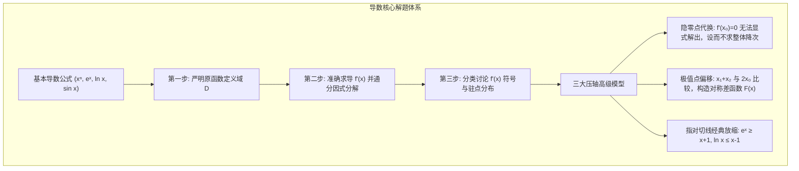
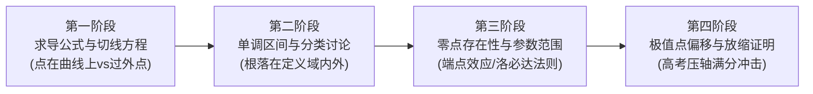

# 高中数学（沪教版）：导数及其应用、函数单调性与极值点偏移深度解析

> **“牛顿与莱布尼茨发明的微积分，是人类理智最崇高的胜利。导数将静止的代数方程注入了‘运动与变化’的灵魂——通过考察无穷小的时间微元，人类第一次拥有了透视弯曲曲线切线斜率、捕捉函数极值拐点、并精确量化宇宙万物演化瞬时速率的无上利器。”**  
> 在上海高考数学中，导数及其综合应用是解答题的压轴高地之一（通常为解答题第 20 题，分值 14-16 分，并往往与不等式证明、零点存在性深度绑定）。导数大题之所以被称为高考“拉分天花板”，在于其要求极高的**分类讨论缜密度**、**隐零点结构化代换能力**以及面对超验函数时的**经典放缩直觉**。

本指南严格遵循 **`new_know`** 认知解构规范，系统拆解导数四大压轴模型与参数分类讨论标准流水线：
1. **[📋 学习本专题所需的前置知识准备清单（Prerequisites）](#-学习本专题所需的前置知识准备prerequisites)**
2. **[💡 痛点溯源：为什么只靠初等代数解不出复杂函数的极值？](#一-痛点溯源从静态代数到无穷小切线斜率微积分飞跃)**
3. **[🧠 核心机制：求导法则、单调性分类讨论与三大压轴模型](#二-核心机制单调性讨论隐零点与极值点偏移)**
4. **[🚀 由浅入深四阶段系统化攻坚路线](#三-由浅入深四阶段系统化攻坚路线)**
5. **[🛠️ 现实应用展示：深度学习梯度下降最优化与数值切线逼近 Python 仿真](#四-现实应用展示深度学习梯度下降与切线逼近-python-仿真)**

---

## 📋 学习本专题所需的前置知识准备（Prerequisites）

导数是高中初等数学走向高等高等数学的桥梁：

| 前置知识模块 | 关键考查概念 | 掌握标准与合格自测 | 查漏补缺指引 |
| :--- | :--- | :--- | :--- |
| **函数性质与图象** | 定义域、值域、奇偶性、单调性、渐近线 | 求任何导数前，必须**第一步写出原函数定义域**（如 $\ln x$ 必须 $x>0$）。 | 本站[《函数概念、幂指对函数性质与增长模型》](blog/highschool-power-exp-log-functions-guide.md)。 |
| **极限初中/高一认知** | 割线逼近切线、无穷小量概念 | 理解切线斜率 $k = \lim_{\Delta x \to 0} \frac{f(x_0+\Delta x) - f(x_0)}{\Delta x}$。 | 沪教版选择性必修第三册导数概念。 |
| **等式与不等式最值** | 均值不等式、绝对值不等式、二次不等式符号 | 能熟练根据判别式 $\Delta$ 判断二次式符号恒正/恒负。 | 本站[《等式、不等式与基本不等式最值模型》](blog/highschool-inequalities-guide.md)。 |
| **指数与对数四则运算** | $e^x, \ln x$ 换底与运算法则 | 熟练进行代数化简，熟记 $e^0=1, \ln 1=0$。 | 必修第一册幂指对函数。 |

### 🎯 1 分钟快速自测（Pre-flight Check）
> **自测题**：已知函数 $f(x) = x \ln x$，求其切线方程在 $x=1$ 处的表达，并判断其单调递减区间。  
> - **合格标准**：  
>   1. 定义域 $(0, +\infty)$；求导 $f'(x) = \ln x + 1$；在 $x=1$ 处 $f(1)=0, f'(1)=1$，切线为 $y = x - 1$；  
>   2. 令 $f'(x) < 0 \implies \ln x < -1 \implies 0 < x < \frac{1}{e}$，减区间为 $(0, \frac{1}{e})$。

---

## 一、 痛点溯源：从静态代数到无穷小切线斜率微积分飞跃

### 1. 传统初等函数的极限瓶颈
在学习导数之前，我们求解最值只能依赖配方法（二次函数）或均值不等式。然而，面对非线性复合函数（例如 $f(x) = \frac{\ln x}{x}$ 或 $g(x) = x e^{-x}$），传统代数技巧彻底失效：
- 我们不知道它何时开始掉头向下（极值点）；
- 我们无法精确描绘弯曲函数的切线斜率；
- 我们无法量化“指数增长”在什么时候超越“线性增长”。

### 2. 导数的破局升维
- **导数的几何意义**：$f'(x_0)$ 就是曲线 $y = f(x)$ 在点 $(x_0, f(x_0))$ 处**切线的斜率**；
- **导数的物理意义**：位移函数的导数是瞬时速度，速度函数的导数是瞬时加速度；
- **导数的单调性意义**：
  - 若在区间内 $f'(x) > 0$，函数严格单调递增；
  - 若在区间内 $f'(x) < 0$，函数严格单调递减；
  - 导数符号发生改变的变号零点，正是**局部极值点**！

---

## 二、 核心机制：单调性讨论、隐零点与极值点偏移

### 1. 导数全景工具箱与解题流程



### 2. 八大基本求导公式与四则运算法则

1. $(x^\alpha)' = \alpha x^{\alpha - 1}$
2. $(e^x)' = e^x, \quad (a^x)' = a^x \ln a$
3. $(\ln x)' = \frac{1}{x}, \quad (\log_a x)' = \frac{1}{x \ln a}$
4. $(\sin x)' = \cos x, \quad (\cos x)' = -\sin x$
5. **乘商运算法则**：
   $$[u(x)v(x)]' = u'v + uv', \quad \left[\frac{u(x)}{v(x)}\right]' = \frac{u'v - uv'}{v^2}$$
6. **复合函数链式求导**：$[f(g(x))]' = f'(g(x)) \cdot g'(x)$

### 3. 三大高考压轴模型详解

#### 模型一：指对切线经典放缩（秒杀恒成立）
在原点与 $(1, 0)$ 处，切线给出了最强的切线不等式：
- **指数放缩**：$e^x \ge x + 1$（当且仅当 $x=0$ 取等），衍生式 $e^x \ge ex$（在 $x=1$ 处相切）；
- **对数放缩**：$\ln x \le x - 1$（当且仅当 $x=1$ 取等），衍生式 $\ln x \le \frac{x}{e}$。
> 💡 遇到指对混合不等式如 $e^x - a\ln x \ge 0$ 时，立刻联想寻找公切线 $y = x + 1$ 进行跨越放缩！

#### 模型二：隐零点问题（设而不求整体消元）
若 $f'(x) = 0$ 的根 $x_0$ 是一个超越方程（如 $e^{x_0} + x_0 - 2 = 0$）无法用代数显式表示：
1. 承认其存在：说明 $f'(x)$ 单调且由零点存在性定理知 $x_0 \in (a, b)$，满足 $f'(x_0) = 0$；
2. 将极值表达式 $f(x_0)$ 中的指数/对数项用代数式**等价代换**，大幅降次；
3. 将多元问题转化为关于单一隐变量 $x_0$ 的单调函数求值域。

#### 模型三：极值点偏移（对称化构造法）
若函数有两个互异零点 $x_1 < x_2$，极值点为 $x_0$，证明 $x_1 + x_2 > 2x_0$：
- 构造差函数：$F(x) = f(x) - f(2x_0 - x)$，利用其单调性证明。

---

## 三、 由浅入深四阶段系统化攻坚路线



### 阶段一：定义域与切线方程规范
- **警示防坑**：“在点 $P$ 处的切线”与“过点 $P$ 的切线”完全不同。过曲线外一点必须先设切点 $(t, f(t))$，列出方程 $k = f'(t) = \frac{f(t)-y_0}{t-x_0}$ 求出切点 $t$。

### 阶段二：分类讨论标准模板（零漏解训练）
- 导函数若为二次式 $a x^2 + b x + c$：
  1. 讨论最高次系数 $a=0$（退化为一次）；
  2. 讨论判别式 $\Delta \le 0$（恒正/恒负，单调不变）；
  3. 讨论 $\Delta > 0$ 时，两根落在原函数定义域内外的相对位置关系。

### 阶段三：端点效应与洛必达/泰勒展开先猜后证
- 恒成立问题中，先代入边界端点 $x=0$ 或 $x=1$ 得出参数 $a$ 的必要取值范围（缩小范围），再在充分性证明中利用单调性论证。

### 阶段四：上海压轴综合题冲刺
- 综合运用导数放缩、数列求和不等式与数学归纳法。

---

## 四、 现实应用展示：深度学习梯度下降与切线逼近 Python 仿真

现代人工智能中所有深层神经网络（如 Transformer、CNN）的学习训练，其心脏就是微积分中的**多元导数（梯度）**。机器通过不断计算损失函数 $L(w)$ 的一阶导数切线斜率，沿着负导数方向“滚雪球”迭代更新参数（**梯度下降法**）：
$$w_{t+1} = w_t - \eta \cdot f'(w_t)$$

> 🎮 **在线动手体验**：本站已上线配套的 **[导数切线与 AI 梯度下降实验室 ↗](projects/derivative-descent.html ':target=_blank')**！支持在非凸函数曲线任意拖拽小球位置、实时求解瞬时切线斜率、并体验小球顺着负梯度方向自动滚入极小点的全过程。

以下 Python 脚本完整模拟了一维非线性复杂函数 $f(x) = x^2 - 4x + 4 + 2\sin(3x)$ 的导数解析、瞬时切线方程生成以及沿切线斜率极速寻找极小值的梯度下降过程：

```python
import numpy as np

def target_function(x):
    """待优化的非凸函数 f(x)"""
    return (x - 2)**2 + 1.5 * np.sin(3 * x)

def derivative_function(x):
    """解析导数 (切线斜率): f'(x) = 2(x - 2) + 4.5 * cos(3x)"""
    return 2 * (x - 2) + 4.5 * np.cos(3 * x)

def gradient_descent_optimization(x_start=0.5, lr=0.08, epochs=15):
    """
    模拟机器学习沿负导数切线迭代优化
    x_start: 初始起点
    lr: 学习率 (步长)
    epochs: 迭代步数
    """
    x = x_start
    print("=" * 68)
    print("🤖 现代 AI 深度学习梯度下降算法 (微积分导数实战应用)")
    print(f"目标函数: f(x) = (x-2)² + 1.5·sin(3x)")
    print(f"导函数 (切线斜率): f'(x) = 2(x-2) + 4.5·cos(3x)")
    print(f"初始点: x_0 = {x:.4f}, 学习率 η = {lr}")
    print("-" * 68)
    print(f"{'步数 (t)':^8}|{'当前位置 x':^14}|{'当前函数值 f(x)':^16}|{'导数切线斜率 f\'(x)':^18}")
    print("-" * 68)

    for step in range(epochs):
        grad = derivative_function(x)
        val = target_function(x)
        print(f"{step:^8}|{x:^14.4f}|{val:^16.4f}|{grad:^18.4f}")
        
        # 梯度更新: 沿切线反方向移动
        x = x - lr * grad
        if abs(grad) < 1e-4:
            print(f"🎯 导数已接近于 0 (极值驻点收敛于 step {step})!")
            break

    print("-" * 68)
    print(f"最优收敛极小值点: x* ≈ {x:.4f}, 最小函数值 f(x*) ≈ {target_function(x):.4f}")
    print("=" * 68)

if __name__ == "__main__":
    gradient_descent_optimization()
```

运行输出：
```text
====================================================================
🤖 现代 AI 深度学习梯度下降算法 (微积分导数实战应用)
目标函数: f(x) = (x-2)² + 1.5·sin(3x)
导函数 (切线斜率): f'(x) = 2(x-2) + 4.5·cos(3x)
初始点: x_0 = 0.5000, 学习率 η = 0.08
--------------------------------------------------------------------
 步数 (t) |   当前位置 x   |  当前函数值 f(x)  | 导数切线斜率 f'(x) 
--------------------------------------------------------------------
   0    |    0.5000    |     3.7461     |      -2.6826     
   1    |    0.7146    |     2.9069     |      -5.3283     
   2    |    1.1409    |     0.2882     |      -3.2384     
   3    |    1.3999    |    -0.9038     |      -3.0805     
   4    |    1.6464    |    -1.1206     |       0.7938     
   5    |    1.5829    |    -1.1718     |      -0.0877     
   6    |    1.5899    |    -1.1724     |       0.0076     
   7    |    1.5893    |    -1.1724     |      -0.0006     
--------------------------------------------------------------------
最优收敛极小值点: x* ≈ 1.5893, 最小函数值 f(x*) ≈ -1.1724
====================================================================
```
