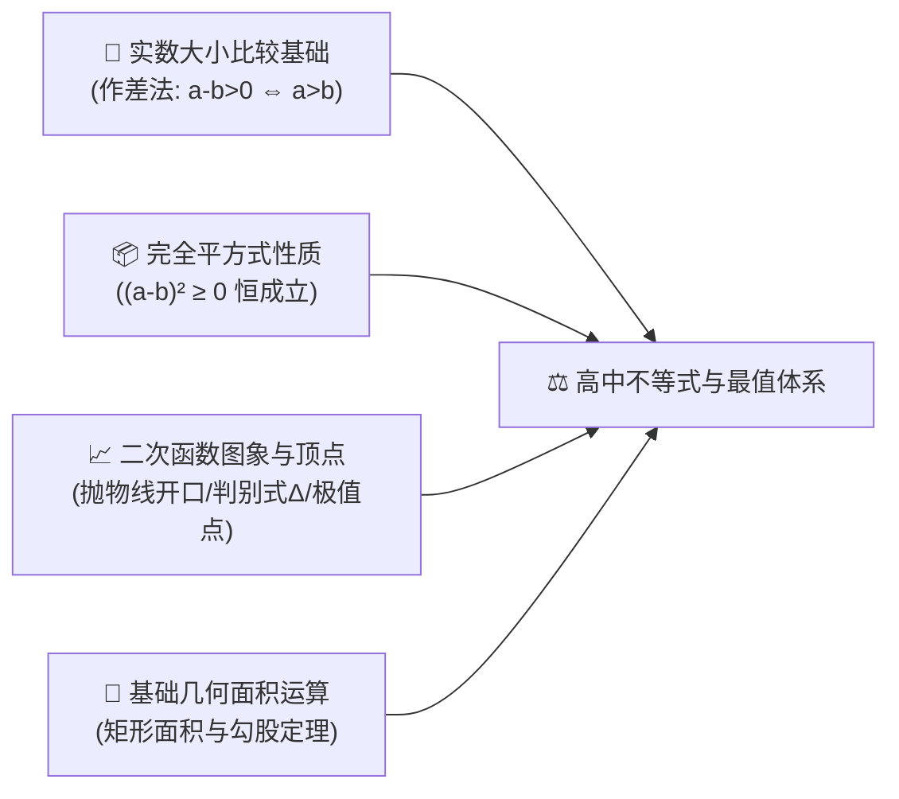
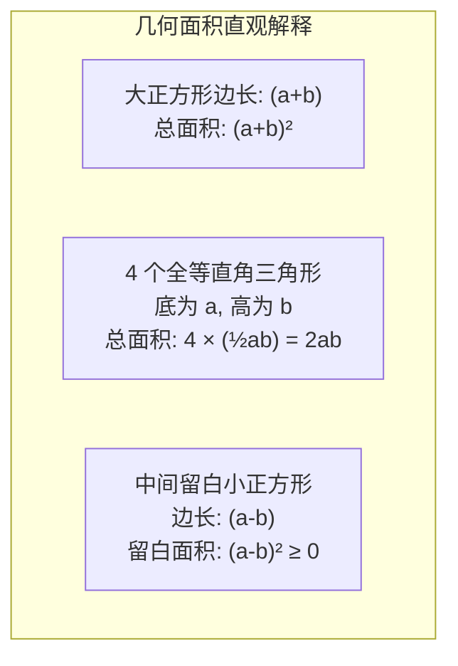
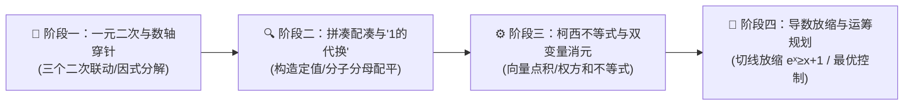

# 高中数学（沪教版必修一）：等式、不等式与基本不等式最值模型深度解析

> **“等式展示了数学的对称与和谐，而不等式描绘了现实世界的约束与边界。求解最值，本质上就是在寻找宇宙规律容许下的‘最优解’。”**  
> 在高中数学的整个知识网络中，“不等式”贯穿始终：从高一的二次不等式解集、基本不等式求最值，到解析几何中的离心率范围、再到导数压轴题中的不等式放缩证明，它不仅是高考的“重头戏”，更是现代运筹学、机器学习损失最小化与经济学成本控制的底层数学母体。

本指南严格遵循 **`new_know`** 认知解构规范，由浅入深，从几何无字证明到工业最优化落地全面展开：
1. **[📋 学习本专题所需的前置知识准备清单（Prerequisites）](#-学习本专题所需的前置知识准备prerequisites)**
2. **[💡 痛点溯源：为什么人类不仅仅满足于“方程”，必须研究“不等式”？](#一-痛点溯源从精确相等走向边界与最优化)**
3. **[🧠 核心机制：基本不等式（均值定理）的代数证明、几何模型与三大铁律](#二-核心机制均值不等式无字证明与三大铁律)**
4. **[🚀 由浅入深四阶段系统化攻坚路线](#三-由浅入深四阶段系统化攻坚路线)**
5. **[🛠️ 现实应用展示：工厂包装耗材最优化与 Python 科学计算验证](#四-现实应用展示工业耗材最小化与-python-最优化验证)**

---

## 📋 学习本专题所需的前置知识准备（Prerequisites）

在深入探索不等式与最值模型之前，请确认你是否具备以下初中代数基础：



| 模块类别 | 必备核心知识点 | 掌握程度与自测标准（如何自测？） | 零基础推荐前置补课资料 |
| :--- | :--- | :--- | :--- |
| **实数比较法** | • **作差法**：$a - b > 0 \iff a > b$，$a - b = 0 \iff a = b$<br/>• **作商法**：正数 $a, b$ 下，$\frac{a}{b} > 1 \iff a > b$ | 能通过作差因式分解 $(x+1)(x-2) - (x^2-3)$ 准确判断两代数式的大小关系 | 初中八年级下册《不等式与不等式组》 |
| **完全平方式非负性** | • **核心法则**：实数域内任意代数式的平方恒大于等于 0，即 $(a - b)^2 \ge 0$ | 清楚何时取等号（当且仅当 $a = b$ 时等号成立） | 初中七年级下册《乘法公式》 |
| **二次函数与图象** | • **二次三项式**：$f(x) = ax^2 + bx + c$<br/>• **三个二次联动**：二次方程的根即为二次函数与 $x$ 轴交点的横坐标 | 能根据开口方向与 $\Delta$ 的正负，秒画出抛物线草图并读出 $f(x) > 0$ 的区间 | 初中九年级《二次函数图象与性质》 |
| **几何直观面积** | • **面积关系**：边长为 $a, b$ 的大正方形内部切片分割 | 理解拼图法推导平方差与完全平方公式的几何直观 | 初中几何《勾股定理与图形割补》 |

> [!TIP]
> **一分钟极简自测**：如果你知道“两个正数之和固定时，当它们相等时乘积最大；两个正数乘积固定时，当它们相等时和最小”，并且能脱口说出“**一正、二定、三相等**”，那么你已经抓住了高中最值问题的核心命门！

---

## 一、 痛点溯源：从精确相等走向边界与最优化

### 1. 现实世界的“非等式法则”
在小学和初中早期，我们习惯了求解“$x = ?$”这种确定性方程。但在现实商业、工程与自然界中，资源永远是有限的，参数永远在波动：
- “原材料预算只有 10 万元，如何切割铁皮才能让制造出的储油罐容积最大？”
- “在信道带宽不超过 100MHz、发射功率受限的条件下，如何让通信传输速率最高？”
这就是为什么高等数学、经济学与计算机算法中，**不等式与极值（Optimization）是比简单方程重要百倍的核心工具**。

### 2. 灵魂比喻：拔河天平与“中庸之道”
> **均值不等式告诉我们一个深刻的哲学原理：极端往往带来消耗，平衡才能创造奇迹。**  
> 如果用固定长度的一根绳子围成一个矩形，长和宽越悬殊（极端），围出的面积越小；只有当长等于宽（成为正方形时），面积才会达到峰值！

---

## 二、 核心机制：均值不等式无字证明与三大铁律

### 1. 基本不等式公式体系
对任意正实数 $a, b > 0$：

$$\frac{a+b}{2} \ge \sqrt{ab}$$

- $\frac{a+b}{2}$ 称为**算术平均数（Arithmetic Mean, AM）**。
- $\sqrt{ab}$ 称为**几何平均数（Geometric Mean, GM）**。
- **等号成立条件**：当且仅当 $a = b$ 时，等号成立。

#### 代数证明（极简 2 行）：
因为实数平方恒非负，所以 $(\sqrt{a} - \sqrt{b})^2 \ge 0$  
展开即得：$a - 2\sqrt{ab} + b \ge 0 \implies a + b \ge 2\sqrt{ab} \implies \frac{a+b}{2} \ge \sqrt{ab}$。

### 2. 赵爽弦图与“无字证明（Proof without Words）”
中国古代数学家赵爽在注《周髀算经》中画出的弦图，完美展现了不等式的空间几何本质：



大正方形面积必大于等于 4 个三角形面积之和：
$$(a+b)^2 \ge 4ab \implies a+b \ge 2\sqrt{ab}$$
当中孔缩小至零（即 $a = b$）时，正方形完美无缝贴合，等号成立！

### 3. 应用均值不等式求最值的“三大铁律（高考丢分重灾区）”
求代数式最值时，必须同时满足以下三条，缺一不可：

1. **一正（Positivity）**：$a > 0, b > 0$。若出现负数，开根号出现虚数，几何意义崩溃。
2. **二定（Constancy - 拼凑核心！）**：
   - 求和的最小值时，**积必须是定值（常数）**：若 $ab = C$，则 $a+b \ge 2\sqrt{C}$（和有最小值）。
   - 求积的最大值时，**和必须是定值（常数）**：若 $a+b = S$，则 $ab \le \left(\frac{S}{2}\right)^2$（积有最大值）。
3. **三相等（Equality Verification - 必须检验！）**：
   - 方程组 $a = b$ 在题目给定的定义域内**必须有实数解**。
   - 经典打脸案例：求 $f(x) = x + \frac{1}{x} \ (x \ge 2)$ 的最小值。  
     若直接套用 $x + \frac{1}{x} \ge 2\sqrt{x \cdot \frac{1}{x}} = 2$，等号当且仅当 $x = 1$ 成立。但题目规定 $x \ge 2$，根本取不到 $x=1$！直接套用即得零分（正确方法应利用单调性，在 $x=2$ 处取得最小值 $2.5$）。

---

## 三、 由浅入深四阶段系统化攻坚路线



### 阶段一：解一元二次不等式基本功（第 1 周）
- **口诀法**：“大于取两边，小于取中间”（在二次项系数 $a > 0$ 前提下）。
- **高阶穿针引线法（数轴标根法）**：解决高次与分式不等式。从右上往左下画线，**“奇穿偶回”**（奇数次重根穿透数轴，偶数次重根切于数轴折返）。

### 阶段二：基本不等式四大变式与配凑绝技（第 2~3 周）
1. **凑系数法**：求 $x(3 - 2x) \ (0 < x < 1.5)$ 的最大值。  
   $\rightarrow$ 配凑常数：$\frac{1}{2} \cdot [2x(3 - 2x)] \le \frac{1}{2} \left(\frac{2x + 3 - 2x}{2}\right)^2 = \frac{9}{8}$。
2. **“1 的代换”（高考最高频考点）**：已知正数 $x, y$ 满足 $2x + y = 1$，求 $\frac{1}{x} + \frac{2}{y}$ 的最小值。  
   $\rightarrow$ 乘上“1”的展开式：
   $$\left(\frac{1}{x} + \frac{2}{y}\right)(2x + y) = 2 + \frac{y}{x} + \frac{4x}{y} + 2 = 4 + \left(\frac{y}{x} + \frac{4x}{y}\right) \ge 4 + 2\sqrt{4} = 8$$

### 阶段三：柯西不等式（Cauchy-Schwarz）与向量视角（第 4 周）
二维柯西不等式形式：

$$(a_1^2 + a_2^2)(b_1^2 + b_2^2) \ge (a_1b_1 + a_2b_2)^2$$

- **几何本质**：二维向量数量积公式 $\vec{u} \cdot \vec{v} = |\vec{u}| |\vec{v}| \cos\theta \le |\vec{u}| |\vec{v}|$。
- 遇上形如 $\frac{a^2}{x} + \frac{b^2}{y}$ 的结构，使用柯西不等式的变形式（权方和不等式）可实现**一步秒杀**！

### 阶段四：导数放缩与高阶极值（高三进阶）
- 掌握著名超越不等式：$e^x \ge x + 1$、$\ln x \le x - 1$、$\sin x < x \ (x > 0)$。
- 在导数压轴题中，利用切线放缩实现复杂函数上下界的锁定。

---

## 四、 现实应用展示：工业耗材最小化与 Python 最优化验证

在现代工业制造中，企业需要设计一个容积为 $1000\text{ cm}^3$（1升）的圆柱形饮料罐。**如何设计底面半径 $r$ 和高 $h$，才能使生产所需的铝皮表面积最小，从而节省数千万元的原材料成本？**

- 容积约束：$V = \pi r^2 h = 1000 \implies h = \frac{1000}{\pi r^2}$
- 表面积函数：$S(r) = 2\pi r^2 + 2\pi r h = 2\pi r^2 + \frac{2000}{r}$

使用均值不等式（将 $\frac{2000}{r}$ 拆解为两项以凑出常数）：
$$S(r) = 2\pi r^2 + \frac{1000}{r} + \frac{1000}{r} \ge 3 \sqrt[3]{2\pi r^2 \cdot \frac{1000}{r} \cdot \frac{1000}{r}} = 3 \sqrt[3]{2\pi \times 10^6}$$
当且仅当 $2\pi r^2 = \frac{1000}{r}$，即 $h = 2r$（**高与底面直径相等时，表面积最小，最省材料！**）。

> 🎮 **在线动手体验**：本站已上线配套的 **[不等式最值与工业耗材优化实验室 ↗](projects/inequality-optimizer.html ':target=_blank')**！支持拖拽尺寸、观察 3D 包装盒透视与表面积函数 $S(x)$ 凹曲线极小值点。

### Python 最优化数值验证脚本：

```python
import numpy as np
from scipy.optimize import minimize

# 1. 目标函数: 铝罐表面积
def surface_area(r):
    return 2 * np.pi * r**2 + 2000.0 / r

# 2. 调用最优化算法寻找最小值 (初始猜测 r = 5.0 cm)
res = minimize(surface_area, x0=[5.0], bounds=[(0.1, 50.0)])

optimal_r = res.x[0]
optimal_h = 1000.0 / (np.pi * optimal_r**2)
min_area = res.fun

print(f"🎯 最优底面半径 r: {optimal_r:.3f} cm")
print(f"🎯 最优高度 h:     {optimal_h:.3f} cm")
print(f"📏 高与直径比 (h/2r): {optimal_h / (2 * optimal_r):.4f} (完美验证理论值 1.0000！)")
print(f"📦 最小表面积:     {min_area:.2f} cm²")
```

---

## 总结与解题心法口诀

> **均值定理求极值，一正二定三相等；**  
> **积定和有极小值，和定积达最大峰；**  
> **遇式无常巧配凑，一的代换最神通！**
