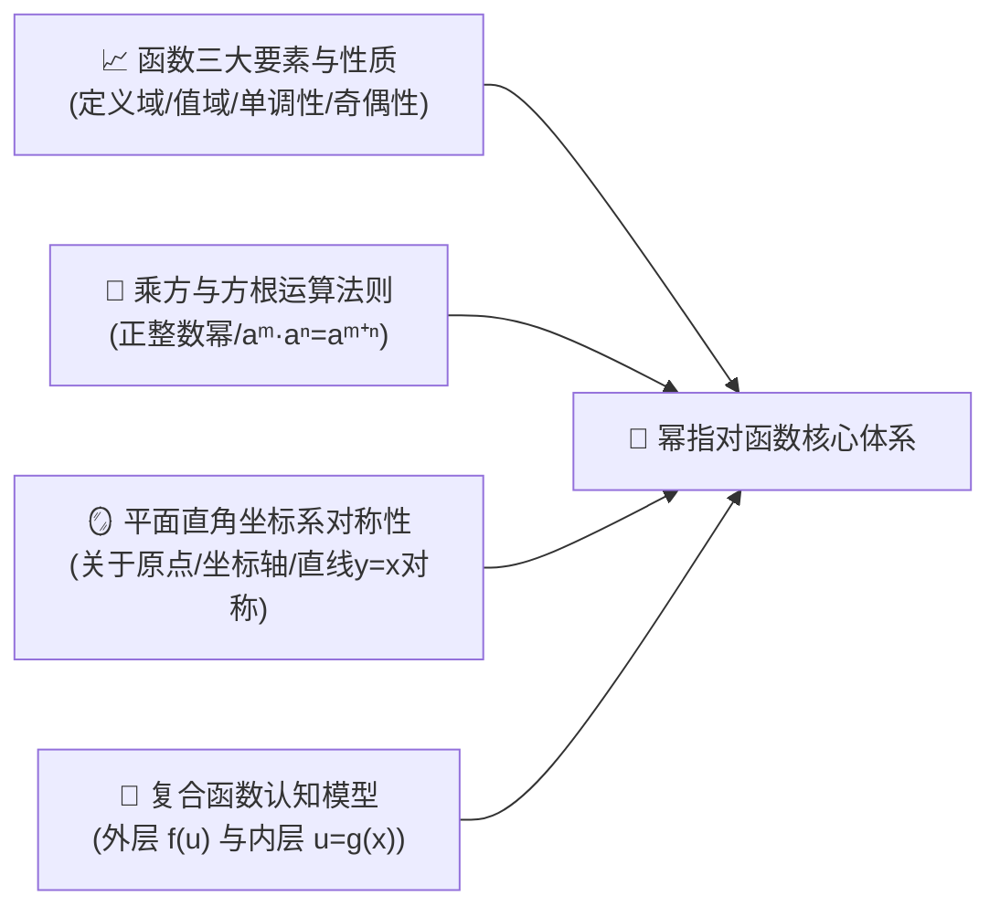
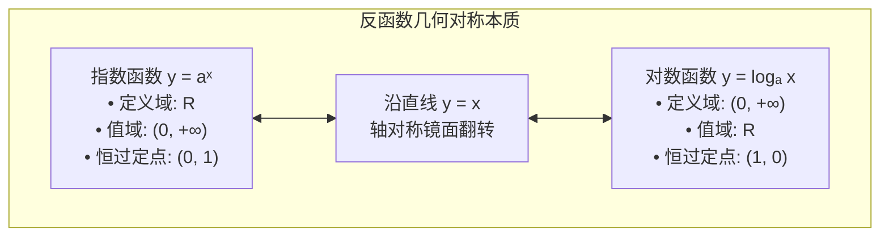
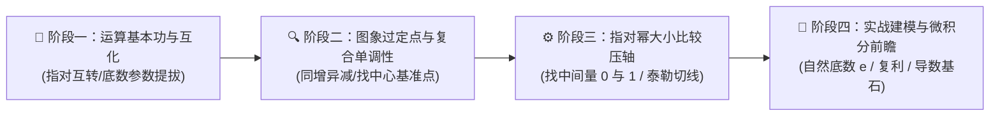

# 高中数学（沪教版必修一）：函数概念、幂指对函数性质与增长模型深度解析

> **“如果说多项式函数是平铺直叙的代数大地，那么指数函数就是拔地而起的摩天大厦，而对数函数则是丈量宇宙星汉的广角透镜。”**  
> 幂函数、指数函数与对数函数，并称为高中数学三大基本初等函数。从病毒裂变式的爆炸增长，到放射性碳-14 测年法；从衡量地震强度的里氏震级、人耳听觉的声音分贝，到现代计算机科学与密码学，处处闪烁着“幂、指、对”的深邃智慧。

本指南严格遵循 **`new_know`** 认知解构规范，由浅入深，从数理本质、图象对称到现实科学建模全面展开：
1. **[📋 学习本专题所需的前置知识准备清单（Prerequisites）](#-学习本专题所需的前置知识准备prerequisites)**
2. **[💡 痛点溯源：人类感官与宇宙尺度为什么是“对数”的？](#一-痛点溯源为什么我们需要指数与对数)**
3. **[🧠 核心机制：三大基本初等函数的图象骨架、反函数对称与换底神器](#二-核心机制三大函数图象互为反函数与换底公式)**
4. **[🚀 由浅入深四阶段系统化攻坚路线](#三-由浅入深四阶段系统化攻坚路线)**
5. **[🛠️ 现实应用展示：碳-14 考古测年模型与 Python 仿真计算器](#四-现实应用展示碳-14-考古测年与-python-仿真)**

---

## 📋 学习本专题所需的前置知识准备（Prerequisites）

在探索幂指对函数家族之前，请确认你是否具备以下初中代数与高中集合函数基本功：



| 模块类别 | 必备核心知识点 | 掌握程度与自测标准（如何自测？） | 零基础推荐前置补课资料 |
| :--- | :--- | :--- | :--- |
| **函数基本概念** | • **三要素**：定义域（使解析式有意义的自变量取值）、值域、对应法则<br/>• **基本性质**：单调递增/递减定义、奇偶性定义（$f(-x) = f(x)$ 或 $-f(x)$） | 能准确说出“奇函数图象关于原点对称且若在 $x=0$ 处有定义则 $f(0)=0$” | 人教版必修一《函数的概念与性质》 |
| **幂的运算法则** | • **初中幂运算**：$a^m \cdot a^n = a^{m+n}$、$(a^m)^n = a^{mn}$、$(ab)^n = a^n b^n$<br/>• **负整数与零指数**：$a^0 = 1 \ (a \neq 0)$，$a^{-n} = \frac{1}{a^n}$ | 能在 3 秒内算出 $2^{-3} = \frac{1}{8}$ 和 $16^{\frac{1}{2}} = 4$ | 初中七年级下册《整式的乘除》 |
| **分数指数幂与根式** | • **有理数指数幂**：$\sqrt[n]{a^m} = a^{\frac{m}{n}} \ (a > 0)$，把开方统一转化为分数乘方 | 看到 $\frac{1}{\sqrt[3]{x^2}}$ 能立刻改写为 $x^{-\frac{2}{3}}$ | 高中数学必修一《指数幂的拓展》 |
| **几何对称映射** | • **平面解析几何**：点 $(x, y)$ 关于直线 $y = x$ 的对称点坐标是 $(y, x)$ | 理解自变量与因变量互换在几何上对应沿对角线折叠翻转 | 初中几何《轴对称与坐标变化》 |

> [!TIP]
> **一分钟极简自测**：如果你知道“$\log_a b = c$ 本质上就是 $a^c = b$ 的同义词表达（只是为了把指数 $c$ 显式解出来）”，并且知道对数的底数必须满足 $a > 0$ 且 $a \neq 1$，真数必须 $b > 0$，你就可以毫无障碍地掌握本专题的精髓！

---

## 一、 痛点溯源：为什么我们需要指数与对数？

### 1. 现实世界的“极端跨度”与对数尺度的诞生
人类生存在三维宏观世界，但大自然的尺度跨度令人瞠目结舌：
- 宇宙可观测半径约为 $10^{26}$ 米；
- 原子核内部夸克的尺寸约为 $10^{-18}$ 米；
两者相差了整整 **44 个数量级**！如果在普通坐标纸上绘制，夸克和银河系根本无法放在同一张图纸上。

**对数（Logarithm）就是苏格兰数学家纳皮尔（John Napier）为解决极端跨度而发明的“降维神器”**：
- 它将宇宙浩瀚的“乘除法”降维为平易近人的“加减法”：$\log(xy) = \log x + \log y$。
- **人类神经感知天生是对数的（韦伯-费希纳定律）**：声音能量增加 10 倍，人耳感觉到的音量只增加 1 档（分贝 dB）；地震能量释放扩大 1000 倍，里氏震级仅上升 2 级。

### 2. 灵魂比喻：正向膨胀与逆向寻根
> **指数函数是“时间的加速器”（给定时间求未来裂变数量）；**  
> **对数函数是“历史的测年仪”（给定现存数量逆推所历经的年代时光）。**  
> 它们是一体两面的双生镜像，是宏观宇宙与微观世界最优雅的数学诗篇。

---

## 二、 核心机制：三大函数图象、互为反函数与换底公式

### 1. 指数函数 $y = a^x$ 与对数函数 $y = \log_a x$ 的双生镜像



#### 底数 $a$ 对单调性的决定性支配：
- **当 $a > 1$ 时**：指数与对数函数**均在各自定义域内严格单调递增**。
- **当 $0 < a < 1$ 时**：指数与对数函数**均在各自定义域内严格单调递减**。

### 2. 换底公式（对数运算的“万能转换插头”）
面对底数各异的复杂对数式，最强大的化简法则就是**换底公式（Change of Base Formula）**：

$$\log_a b = \frac{\log_c b}{\log_c a} \quad (a, c > 0, \ a, c \neq 1, \ b > 0)$$

#### 核心推论衍生工具：
1. **倒数互化**：$\log_a b = \frac{1}{\log_b a}$
2. **幂次提拔**：$\log_{a^m} b^n = \frac{n}{m} \log_a b$（底数指数跑分母，真数指数跑分子）
3. **链式乘法**：$\log_a b \cdot \log_b c \cdot \log_c d = \log_a d$

### 3. 幂函数 $y = x^\alpha$ 家族第一象限图象法则
幂函数的自变量在底数位置，其在第一象限（$x > 0$）的形态取决于指数 $\alpha$：
- **$\alpha > 1$（如 $y = x^2, x^3$）**：下凸增长，单调递增，增长越来越快。
- **$\alpha = 1$（$y = x$）**：通过原点的斜 45 度基准射线。
- **$0 < \alpha < 1$（如 $y = x^{\frac{1}{2}} = \sqrt{x}$）**：上凸增长，单调递增，增长越来越慢。
- **$\alpha < 0$（如 $y = x^{-1} = \frac{1}{x}$）**：单调递减，以坐标轴为渐近线的双曲线形态。

### 4. 增长速度大对决（高考大小比较秒杀利器）
当自变量 $x \to +\infty$ 时，三大函数的终极增长速度呈现压倒性的层级差距：

$$a^x \gg x^n \gg \log_a x \quad (a > 1, n > 0)$$

- 指数函数是**绝对的增长王者**（指数爆炸）；
- 幂函数居于中游；
- 对数函数是**极其迟钝的乌龟漫步**（但永远在攀升）。

---

## 三、 由浅入深四阶段系统化攻坚路线



### 阶段一：指对运算“肌肉记忆”磨砺（第 1 周）
- 目标：杜绝混淆运算符号。
- **常见翻车点警示**：
  - 严禁乱写：$\log(x + y) \neq \log x + \log y$！
  - 正确运算法则：真数相乘等于对数相加 $\log(xy) = \log x + \log y$。

### 阶段二：复合函数的单调性法则（第 2 周）
- 求解复合函数 $y = f(g(x))$ 的单调区间，遵循跨越千年的八字黄金法则：
  > **“同增异减”**（内外层单调性相同时，复合函数单调递增；一增一减相异时，复合函数单调递减）。
- **必须注意的前提**：一切性质的讨论，**必须在内层函数 $u = g(x)$ 使得外层函数合法的定义域内进行**！

### 阶段三：大小比较秒杀大法（高考前三道单选必考）
面对类似比较 $a = 2^{0.3}, b = 0.3^2, c = \log_{0.3} 2$ 的题型，执行 **“三步定位标杆法”**：
1. **第一标尺：找 0 和 1 作为分水岭**：
   - $a = 2^{0.3} > 2^0 = 1$；
   - $b = 0.3^2 \in (0, 1)$；
   - $c = \log_{0.3} 2 < \log_{0.3} 1 = 0$。
2. 结论秒杀：$c < 0 < b < 1 < a \implies c < b < a$。

### 阶段四：自然底数 $e$ 与高等微积分衔接（进阶）
- 认识自然常数 $e \approx 2.71828$（复利极限 $\lim_{n \to \infty} (1 + \frac{1}{n})^n$）。
- 理解为什么科学计算统一采用以 $e$ 为底的自然对数 $\ln x$：因为只有在以 $e$ 为底时，其导数才会是极其优美的 $(e^x)' = e^x$ 与 $(\ln x)' = \frac{1}{x}$。

---

## 四、 现实应用展示：碳-14 考古测年与 Python 仿真

考古学家在三星堆遗址发现了一批古代木炭。已知生物存活时体内碳-14（$^{14}\text{C}$）与碳-12 的比例保持恒定；当生物死亡后，碳-14 以固定的**指数衰减模型**蜕变，其半衰期（Half-life）约为 **5730 年**。

衰减公式为：
$$N(t) = N_0 \cdot \left(\frac{1}{2}\right)^{\frac{t}{T_{1/2}}}$$

通过检测，木炭残存的碳-14 含量仅为原始含量的 **$68.5\%$**。**如何利用对数函数计算该文物的距今年代？**

两边取自然对数，逆解时间 $t$：
$$\frac{N(t)}{N_0} = 0.685 = (0.5)^{\frac{t}{5730}} \implies \ln(0.685) = \frac{t}{5730} \ln(0.5) \implies t = 5730 \times \frac{\ln(0.685)}{\ln(0.5)}$$

### Python 计算器脚本：

```python
import math

# 1. 物理常数与实测数据
half_life = 5730.0     # 半衰期: 5730 年
ratio_remaining = 0.685 # 实测残存比例: 68.5%

# 2. 对数逆推年代 (利用换底原理)
years_ago = half_life * (math.log(ratio_remaining) / math.log(0.5))

print(f"🌲 样本中残存的碳-14 比例: {ratio_remaining * 100:.1f}%")
print(f"⏳ 经对数反函数年代计算，该古遗迹距今约: {years_ago:.0f} 年")
print(f"🏛️ 对应历史历史时期: 约为商朝晚期至西周早期 (公元前 1100 年左右)！")
```

---

## 总结与解题心法口诀

> **指数爆炸对数慢，同底反函数线对称；**  
> **换底公式拔高低，指比大小标杆零一；**  
> **复合单调看内外，同增异减莫忘定义域！**
