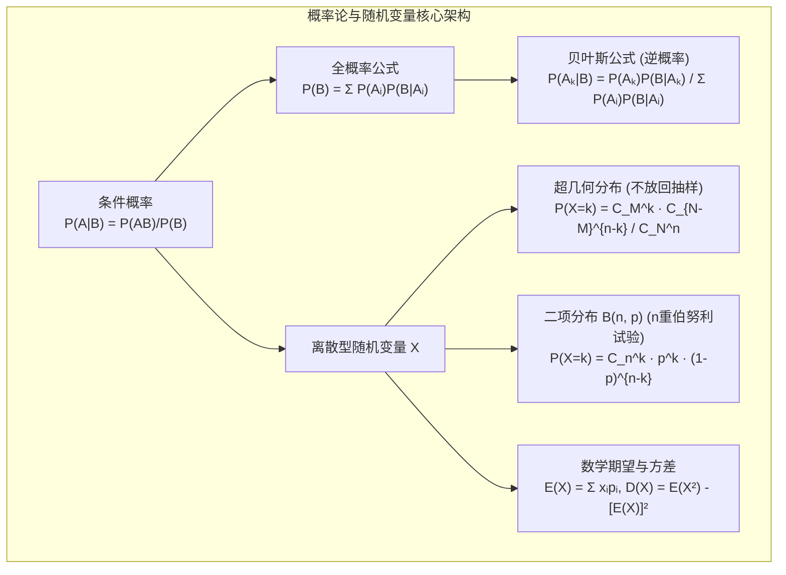
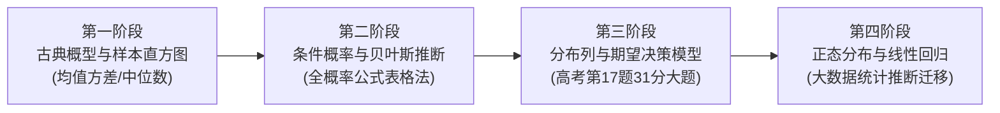

# 高中数学（沪教版）：概率论、数理统计与随机变量分布深度解析

> **“上帝不掷骰子，但人类必须用概率的语言与不确定性的宇宙对话。从赌徒的分赌本协议，到现代人工智能分类器的置信度与医学诊断决策，概率统计让直觉偏见让位于理性的数学期望。”**  
> 在上海高考数学中，概率与统计占据着前所未有的超高权重（在近年的解答题中，概率统计大题往往位于第 17 题，分值甚至高达 20-31 分，填空题第 6 题也稳定考查样本数字特征）。上海高考命题尤其注重考查“真实生活情境建模”——如药品双盲实验、工厂零件良品率检验、条件概率与**全概率/贝叶斯逆概率推断**。

本指南严格遵循 **`new_know`** 认知解构规范，由浅入深，系统构建概率与随机变量认知大厦：
1. **[📋 学习本专题所需的前置知识准备清单（Prerequisites）](#-学习本专题所需的前置知识准备prerequisites)**
2. **[💡 痛点溯源：为什么人类的直觉在概率面前极容易犯错？](#一-痛点溯源为什么直觉会欺骗我们从辛普森悖论到条件概率)**
3. **[🧠 核心机制：两大基石公式与三大经典离散分布列](#二-核心机制全概率贝叶斯与三大分布列)**
4. **[🚀 由浅入深四阶段系统化攻坚路线](#三-由浅入深四阶段系统化攻坚路线)**
5. **[🛠️ 现实应用展示：医疗试剂假阳性贝叶斯逆推与蒙特卡洛 Python 仿真](#四-现实应用展示医疗真假阳性贝叶斯推断与-python-模拟)**

---

## 📋 学习本专题所需的前置知识准备（Prerequisites）

概率统计依赖集合运算、排列组合与代数求和能力：

| 前置知识模块 | 关键考查概念 | 掌握标准与合格自测 | 查漏补缺指引 |
| :--- | :--- | :--- | :--- |
| **集合论基础** | 子集、交集、并集、补集、德·摩根律 | 能用集合符号表示事件关系（如 $AB = \emptyset$ 表示互斥事件）。 | 本站[《集合与常用逻辑用语深度解析》](blog/highschool-sets-and-logic-guide.md)。 |
| **计数原理与组合数** | 分步/分类计数、组合数公式 $C_n^k = \frac{n!}{k!(n-k)!}$ | 能准确计算古典概型的样本点总数 $N$ 与有利事件数 $m$。 | 沪教版选择性必修第二册计数原理。 |
| **数列与求和** | 等差等比数列通项、有限项求和 | 熟练计算离散随机变量分布列的概率和 $\sum P(X=x_i) = 1$。 | 本站[《数列通项求和、数学归纳法与递推创新》](blog/highschool-sequences-induction-guide.md)。 |
| **统计图表初中基础** | 频率分布直方图、中位数、平均数 | 知道直方图纵轴为“频率/组距”，所有小矩形面积和为 1。 | 初中与高中必修第二册统计初步。 |

### 🎯 1 分钟快速自测（Pre-flight Check）
> **自测题**：袋中有 3 个红球和 2 个白球，每次不放回摸出 1 球，连续摸两次。  
> 设事件 $A$ 为“第一次摸到红球”，事件 $B$ 为“第二次摸到红球”。试问：$P(B|A)$ 和 $P(AB)$ 分别是多少？  
> - **合格标准**：能区分条件概率与联合概率：$P(B|A) = \frac{2}{4} = \frac{1}{2}$；$P(AB) = P(A)P(B|A) = \frac{3}{5} \times \frac{1}{2} = \frac{3}{10}$。

---

## 一、 痛点溯源：为什么人类的直觉在概率面前极容易犯错？

### 1. 人类大脑的典型认知偏差
1. **将“独立试验”混同为“平衡补偿”（赌徒谬误）**：连续抛出 5 次正面硬币后，人们直觉倾向于下一次出现反面的概率更大，殊不知独立抛硬币毫无记忆性。
2. **忽视“基本比率”（Base Rate Neglect）**：某种罕见病发病率只有 0.1%，检测试剂准确率 99%。如果某人检测呈阳性，他真正患病的概率是多少？绝大多数人脱口而出“99%”，而根据贝叶斯公式，其实际患病概率**连 10% 都不到**！
3. **放回与不放回混淆**：把超几何分布（不放回）错误当成二项分布（放回抽样）计算。

### 2. 数学抽象的建立
- **随机事件** $\to$ 样本空间 $\Omega$ 的子集
- **概率** $\to$ 柯尔莫哥洛夫公理体系（非负性、规范性 $P(\Omega)=1$、可列可加性）
- **随机变量 $X$** $\to$ 将抽象随机试验结果映射到实数轴上的实值函数！

---

## 二、 核心机制：全概率、贝叶斯与三大分布列

### 1. 概率递进逻辑核心图谱



### 2. 贝叶斯公式（执果索因逆推神器）
已知原因事件集 $A_1, A_2, \dots, A_n$ 构成样本空间的一个完备划分，且发生结果事件 $B$，则在结果 $B$ 发生的条件下，溯源至由特定原因 $A_k$ 导致的后验概率为：
$$P(A_k|B) = \frac{P(A_k) P(B|A_k)}{\sum_{i=1}^n P(A_i) P(B|A_i)}$$
> 💡 **考情直击**：上海高考近年新课标多次在大题中引入贝叶斯诊断背景，熟练掌握两项划分（患病 vs 不患病、正品 vs 次品）的列阵表格计算是拿满分的关键。

### 3. 两大离散型分布列精炼对比表

| 分布类型 | 试验背景 | 分布列公式 | 期望 $E(X)$ | 方差 $D(X)$ |
| :--- | :--- | :--- | :--- | :--- |
| **超几何分布** | 容量为 $N$ 的总体中有 $M$ 个次品，**不放回**任取 $n$ 件中的次品数 $X$ | $P(X=k) = \frac{C_M^k C_{N-M}^{n-k}}{C_N^n}$ | $n \cdot \frac{M}{N}$ | $n \frac{M}{N} (1-\frac{M}{N}) \frac{N-n}{N-1}$ |
| **二项分布 $B(n, p)$** | 单次成功率 $p$ 的伯努利试验，**独立重复（放回）**进行 $n$ 次的成功次数 $X$ | $P(X=k) = C_n^k p^k (1-p)^{n-k}$ | $n p$ | $n p (1-p)$ |

> 📌 **期望统一性绝招**：超几何分布的数学期望公式与二项分布**完全形式相同**（设成功率 $p = \frac{M}{N}$，则均为 $E(X) = np$），这一性质在解答题求期望时能帮助你秒速验算！

---

## 三、 由浅入深四阶段系统化攻坚路线



### 阶段一：统计量基本功与古典概型
- **训练重点**：加权平均数 $\bar{x} = \sum p_i x_i$；方差公式 $s^2 = \frac{1}{n} \sum (x_i - \bar{x})^2 = \frac{1}{n} \sum x_i^2 - \bar{x}^2$；双组数据合并方差公式（上海填空第 6 题常考点）。

### 阶段二：全概率与贝叶斯列阵法
- **解题流水线**：
  1. 明确设出完备事件 $A$（如“检测者真实患病”）与结果事件 $B$（如“试剂检测为阳性”）。
  2. 提取四元参数：先验 $P(A)$、假阴性率 $P(\bar{B}|A)$、假阳性率 $P(B|\bar{A})$。
  3. 用分母全概率公式计算总阳性率，分子计算真阳性联合概率，完成比值。

### 阶段三：高考第 17 题分布列与期望最优化
- **解题流水线**：
  1. 列出 $X$ 的所有可能取值（注意下界从 0 还是从 1 开始）。
  2. 计算对应概率并确保 $\sum P = 1$（极速排查计算失误）。
  3. 计算期望与方差，并在最后一问根据期望值大小给出决策建议（如选择方案 A 还是方案 B 收益更高）。

### 阶段四：正态分布 $N(\mu, \sigma^2)$ 与回归分析
- **核心法则**：$3\sigma$ 原则（区间 $[\mu-\sigma, \mu+\sigma]$ 占 $68.27\%$，$[\mu-2\sigma, \mu+2\sigma]$ 占 $95.45\%$，$[\mu-3\sigma, \mu+3\sigma]$ 占 $99.73\%$）。

---

## 四、 现实应用展示：医疗真假阳性贝叶斯推断与 Python 模拟

> 🎮 **在线动手体验**：本站已上线配套的 **[贝叶斯真假阳性与蒙特卡洛概率实验室 ↗](projects/bayesian-prob.html ':target=_blank')**！支持滑动调节人群发病率、试剂灵敏度与假阳性率，直观呈现 10,000 人群比例矩形树图与贝叶斯逆概率推导。

以下 Python 脚本完整模拟了现代医学筛查中著名的**贝叶斯逆概率推断**，并使用 100,000 次蒙特卡洛随机模拟来印证大数定律与理论公式的完美契合：

```python
import numpy as np

def bayesian_medical_test(population_size=100000, disease_rate=0.005, sensitivity=0.98, false_alarm=0.02):
    """
    贝叶斯医疗诊断模拟 (真假阳性)
    - disease_rate: 真实人群发病率 P(D) = 0.5%
    - sensitivity (灵敏度/真阳率): P(Test+ | D) = 98%
    - false_alarm (假阳性率): P(Test+ | No_D) = 2%
    """
    # 1. 理论贝叶斯计算
    p_d = disease_rate
    p_no_d = 1.0 - p_d
    p_pos_given_d = sensitivity
    p_pos_given_no_d = false_alarm

    # 全概率公式计算总检测阳性率 P(Test+)
    p_pos_total = (p_d * p_pos_given_d) + (p_no_d * p_pos_given_no_d)
    
    # 贝叶斯公式逆推: 阳性结果下真实患病概率 P(D | Test+)
    p_d_given_pos = (p_d * p_pos_given_d) / p_pos_total

    print("=" * 65)
    print("🔬 医疗试剂筛查中的贝叶斯逆概率计算 (理论值)")
    print(f"人群基础发病率 P(患病): {p_d * 100:.2f}%")
    print(f"试剂灵敏度 (真实患病检出阳性率): {p_pos_given_d * 100:.1f}%")
    print(f"试剂假阳性率 (无病误报阳性率): {p_pos_given_no_d * 100:.1f}%")
    print(f"全人群总检出阳性率 P(阳性): {p_pos_total * 100:.3f}%")
    print(f"👉 核心结论: 测出阳性后，真正患病的后验概率 P(患病 | 阳性) = {p_d_given_pos * 100:.2f}%\n")

    # 2. 蒙特卡洛 100,000 人群随机抽样模拟
    np.random.seed(42)
    # 真实患病状态: 1=患病, 0=健康
    has_disease = (np.random.rand(population_size) < p_d).astype(int)
    
    # 测试结果模拟
    test_positive = np.zeros(population_size, dtype=int)
    # 患病人群测试
    test_positive[has_disease == 1] = (np.random.rand(np.sum(has_disease == 1)) < p_pos_given_d).astype(int)
    # 健康人群测试 (假阳性)
    test_positive[has_disease == 0] = (np.random.rand(np.sum(has_disease == 0)) < p_pos_given_no_d).astype(int)

    # 统计阳性总人数与真阳性人数
    total_pos_count = np.sum(test_positive == 1)
    true_pos_count = np.sum((test_positive == 1) & (has_disease == 1))
    simulated_prob = true_pos_count / total_pos_count if total_pos_count > 0 else 0

    print("🎲 100,000 人蒙特卡洛随机试验大数统计验证:")
    print(f"总模拟人数: {population_size} 人")
    print(f"真实患病人数: {np.sum(has_disease == 1)} 人")
    print(f"试剂测出阳性总人数: {total_pos_count} 人 (其中误报假阳性人数: {total_pos_count - true_pos_count} 人)")
    print(f"实验统计后验概率: {simulated_prob * 100:.2f}%")
    print("=" * 65)

if __name__ == "__main__":
    bayesian_medical_test()
```

运行输出：
```text
=================================================================
🔬 医疗试剂筛查中的贝叶斯逆概率计算 (理论值)
人群基础发病率 P(患病): 0.50%
试剂灵敏度 (真实患病检出阳性率): 98.0%
试剂假阳性率 (无病误报阳性率): 2.0%
全人群总检出阳性率 P(阳性): 2.480%
👉 核心结论: 测出阳性后，真正患病的后验概率 P(患病 | 阳性) = 19.76%

🎲 100,000 人蒙特卡洛随机试验大数统计验证:
总模拟人数: 100000 人
真实患病人数: 497 人
试剂测出阳性总人数: 2476 人 (其中误报假阳性人数: 1989 人)
实验统计后验概率: 19.67%
=================================================================
```
