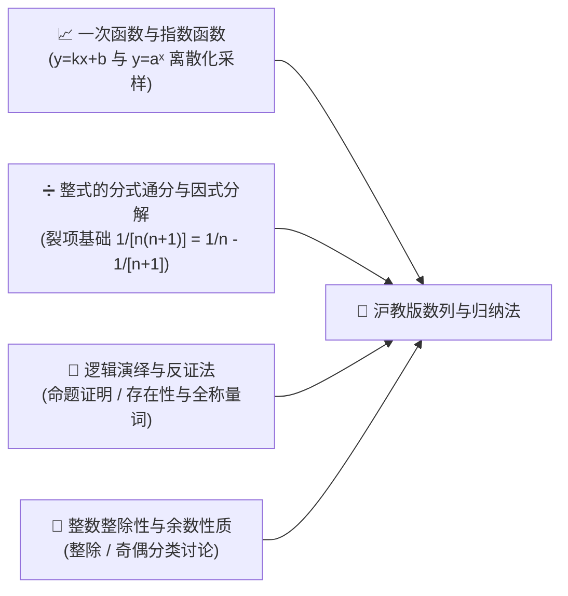
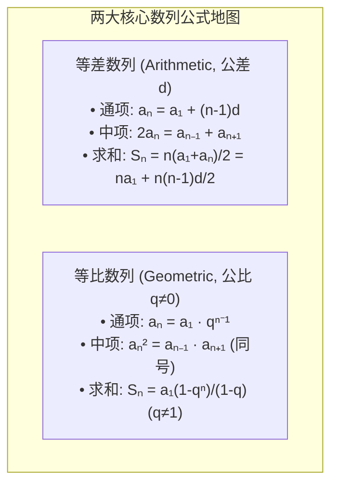

# 高中数学（沪教版）：数列通项求和、数学归纳法与创新递推深度解析

> **“如果说函数是连续流动的时间长河，那么数列就是这长河中按节拍泛起的离散涟漪。而数学归纳法，则是人类理性推倒无限多米诺骨牌的最高智慧。”**  
> 在上海高考数学命题体系中，数列模块占据着极具特色的战略地位。根据《上海数学学情分析》，**填空第 3 题（分值 4 分）常年考查等差/等比数列求和基础（★基础题，要求 100% 零失误）**；而**选择第 16 题（分值 5 分，压轴选择题）则以“数列创新定义与整数解限制”**（如 2024 年反例构造、2025 年构成三角形条件）著称。此外，**“数学归纳法”在沪教版中单独成节**，是上海高考生必须攻克的演绎推理必修课。

本指南严格遵循 **`new_know`** 认知解构规范，紧扣沪教版教材脉络与上海高考试题特征展开：
1. **[📋 学习本专题所需的前置知识准备清单（Prerequisites）](#-学习本专题所需的前置知识准备prerequisites)**
2. **[💡 痛点溯源：为什么连续的函数不能代替离散的“数列”？](#一-痛点溯源离散世界的生长规律与多米诺骨牌效应)**
3. **[🧠 核心机制：两大经典数列公式地图、四大求和通法与数学归纳法严谨骨架](#二-核心机制两大数列公式地图与数学归纳法骨架)**
4. **[🚀 由浅入深四阶段系统化攻坚路线](#三-由浅入深四阶段系统化攻坚路线)**
5. **[🛠️ 现代金融科技应用：等额本息房贷模型与 Python 数列仿真计算](#四-现代金融应用等额本息房贷模型与-python-递推仿真)**

---

## 📋 学习本专题所需的前置知识准备（Prerequisites）

在进入数列与数学归纳法学习之前，请确认你是否具备以下初高中基础：



| 模块类别 | 必备核心知识点 | 掌握程度与自测标准（如何自测？） | 零基础推荐前置补课资料 |
| :--- | :--- | :--- | :--- |
| **函数的离散视角** | • **离散自变量**：理解数列是“定义在正整数集 $\mathbb{N}^*$ 上的特殊函数” | 清楚等差数列点集位于一条直线上，等比数列点集位于指数曲线之上 | 沪教版必修一《函数的概念》 |
| **代数变形与裂项** | • **分式拆分**：熟练运用 $\frac{1}{n(n+1)} = \frac{1}{n} - \frac{1}{n+1}$<br/>• **根式有理化**：$\frac{1}{\sqrt{n} + \sqrt{n+1}} = \sqrt{n+1} - \sqrt{n}$ | 看到 $\frac{1}{(2n-1)(2n+1)}$ 能瞬间写出 $\frac{1}{2}(\frac{1}{2n-1} - \frac{1}{2n+1})$ | 初中八年级下册《分式运算》 |
| **逻辑演绎与符号** | • **全称量词**：对任意正整数 $n \in \mathbb{N}^*$ 都成立的严格证明意识 | 理解为什么举出 100 万个真例也不能代替普遍成立的逻辑证明 | 沪教版必修一《常用逻辑用语》 |
| **初等整数性质** | • **整数约束**：项数 $n$ 必须是正整数，若涉及边长或个数需保证 $a_n \in \mathbb{Z}^+$ | 在求解方程后，具备主动检验“$n$ 是否为正整数”的本能直觉 | 初中七年级《整数与因数》 |

> [!TIP]
> **一分钟极简自测**：如果你能口算德国数学王子高斯 10 岁时解决的 $1 + 2 + \dots + 100 = \frac{(1+100) \times 100}{2} = 5050$ 并理解其“首尾倒序相加”的对称哲学，那么你已经领悟了数列求和最核心的本质！

---

## 一、 痛点溯源：离散世界的生长规律与多米诺骨牌效应

### 1. 现实世界的大量“离散按步跳跃”
微积分擅长处理如水流、赛车速度这种连绵不绝的连续过程。然而，自然与商业世界充斥着大量**离散步进过程**：
- 房贷月供、银行复利生息（每月/每年结算一次，不是按微秒连续扣款）；
- 计算机算法的时间复杂度（步数 $n$ 必须是整数）；
- 生物细胞的逐代分裂繁殖（第 1 代、第 2 代……不存在第 1.5 代）。
这些过程必须由**数列（Sequence）**这一专用数学语言来精准度量。

### 2. 数学归纳法的灵魂比喻：无限多米诺骨牌
如何证明一个涉及无限自然数 $n \in \mathbb{N}^*$ 的命题永远成立？人类生命有限，不可能从 $n=1$ 检验到 $n=10^{1000}$。
> **数学归纳法（Mathematical Induction）就是数学界的“多米诺骨牌”**：
> 1. **第一步（推倒第一张牌）**：证明当 $n=1$ 时命题成立；
> 2. **第二步（牌距传递性）**：证明只要第 $k$ 张牌倒下，就必然能撞倒第 $k+1$ 张牌！
> 结论：整排由无穷无尽张骨牌组成的阵列，将不可阻挡地全部倒下！

---

## 二、 核心机制：两大数列公式地图与数学归纳法骨架

### 1. 等差数列与等比数列核心公式对照地图



> ⚠️ **上海卷填空第 3 题零失误防坑警告**：  
> 在使用等比数列求和公式时，**第一反应必须先讨论公比 $q = 1$ 的情况（此时 $S_n = n a_1$）**！若题目未指明 $q \neq 1$，直接除以 $1 - q$ 将直接扣除该小题全部步骤分！

### 2. 高中四大经典求和通法
1. **公式法**：纯等差或等比数列直接套公式。
2. **错位相减法（乘公比相减）**：用于求解形如 $a_n = (\text{等差}) \times (\text{等比})$ 的数列（如 $a_n = n \cdot 2^n$）。两边同乘公比 $q$，下移一位对齐相减。
3. **裂项相消法（消去中间项）**：用于求解分式数列。中间项正负对消，最终仅保留首尾若干项。
4. **分组求和法**：将非标准数列拆解为已知等差与等比数列的叠加。

### 3. 沪教版特色：数学归纳法的严谨四步书写骨架
在上海高考中，数学归纳法证明题必须严格遵循以下**“四步八股格式”**：

- **第一步（奠基步）**：证明当 $n = 1$ 时，左边 $=\dots$，右边 $=\dots$，左边 $=$ 右边，命题成立。
- **第二步（假设步）**：假设当 $n = k \ (k \ge 1, k \in \mathbb{N}^*)$ 时命题成立，即：  
  *(完整写出 $n=k$ 时的代数式成立假设)*
- **第三步（递推步 - 最关键！）**：证明当 $n = k + 1$ 时：  
  左边 $= \dots \ (\text{必须显式运用归纳假设进行替换代入}) \dots =$ 右边，即 $n = k + 1$ 时命题也成立。
- **第四步（结论步）**：综合（1）（2），对一切 $n \in \mathbb{N}^*$，命题均成立。

---

## 三、 由浅入深四阶段系统化攻坚路线


### 阶段一：公式地图与首项公差公比基本功（第 1 周）
- 确立“知三求二”方程思想：在 $a_1, d, n, a_n, S_n$ 五个基本量中，只要知道任意三个，就能列方程求出剩余两个。

### 阶段二：错位相减与裂项相消流水线（第 2 周）
- **错位相减细节防坑**：最后减出的末项带有负号（$- a_n \cdot q$），切忌漏掉减号！

### 阶段三：规范化训练数学归纳法（第 3 周）
- 专项突破不等式与整除性归纳证明。牢记递推步中**“目标导向法”**：先把 $n=k+1$ 的目标结果写在草稿纸上，然后从左边向目标拼凑变形。

### 阶段四：上海高考第 16 题创新题专项攻坚（高三冲刺）
根据《上海数学学情分析》，第 16 题常以新定义数列为载体，考查**“数列与几何边长结合（三角形构成条件：两边之和大于第三边）”**或**“整数解约束”**：
- **破局核心战术**：
  1. **枚举前几项寻找规律**：代入 $n=1, 2, 3$ 计算具体数值，消除畏难心理；
  2. **将抽象条件转化为不等式组**：例如利用 $a_n + a_{n+1} > a_{n+2}$ 建立不等式，寻找正整数 $n$ 的取值上界。

---

## 四、 现代金融应用：等额本息房贷模型与 Python 递推仿真

在日常生活中买房贷款时，银行提供的**“等额本息还款法”**（每月偿还相同的固定金额 $X$），其底层本质就是一个经典的**一阶线性递推数列**：

- 设贷款本金为 $P_0$，月利率为 $r$，还款月数为 $N$，每月还款额为 $X$。
- 经过 $n$ 个月后，剩余欠款本息 $P_n$ 满足递推关系：
  $$P_n = P_{n-1}(1 + r) - X$$
  经过迭代与等比数列求和公式展开：
  $$P_N = P_0(1+r)^N - X \cdot \frac{(1+r)^N - 1}{r}$$
- 当贷款在第 $N$ 个月全部还清时，$P_N = 0$，解得每月月供 $X$ 的精确公式：
  $$X = P_0 \cdot \frac{r(1+r)^N}{(1+r)^N - 1}$$

### Python 房贷月供与本息递推仿真脚本：

```python
def calculate_mortgage(principal, annual_rate, years):
    """
    基于等比数列求和模型，计算等额本息贷款的每月还款额与利息总额
    """
    monthly_rate = annual_rate / 12.0
    total_months = years * 12
    
    # 核心数列求和公式计算每月还款额 X
    factor = (1.0 + monthly_rate) ** total_months
    monthly_payment = principal * (monthly_rate * factor) / (factor - 1.0)
    total_repayment = monthly_payment * total_months
    total_interest = total_repayment - principal
    
    return monthly_payment, total_repayment, total_interest

P0 = 3000000.0  # 贷款 300 万元
rate = 0.035    # 年利率 3.5%
years = 30      # 30 年还款期

x, total_pay, interest = calculate_mortgage(P0, rate, years)

print(f"🏠 贷款总额: {P0/10000:.1f} 万元 | 贷款年限: {years} 年 | 年利率: {rate*100:.2f}%")
print(f"💳 经等比数列模型计算，每月应还月供: {x:.2f} 元")
print(f"💰 30 年累计还款总额: {total_pay/10000:.2f} 万元 (其中累计支付利息: {interest/10000:.2f} 万元)")
```

---

## 总结与解题口诀

> **等差一次线，等比指数连；**  
> **求和公比莫忘一，错位相减两边变；**  
> **归纳四步多米诺，假设递推是真言！**
