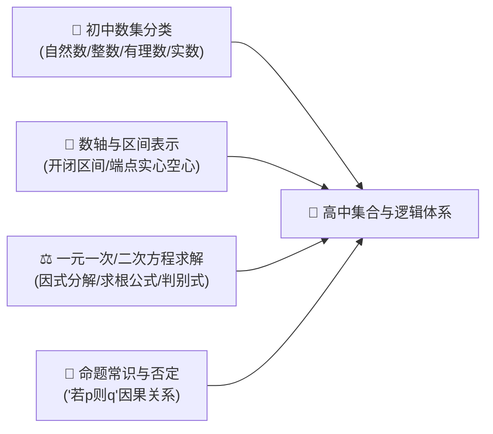
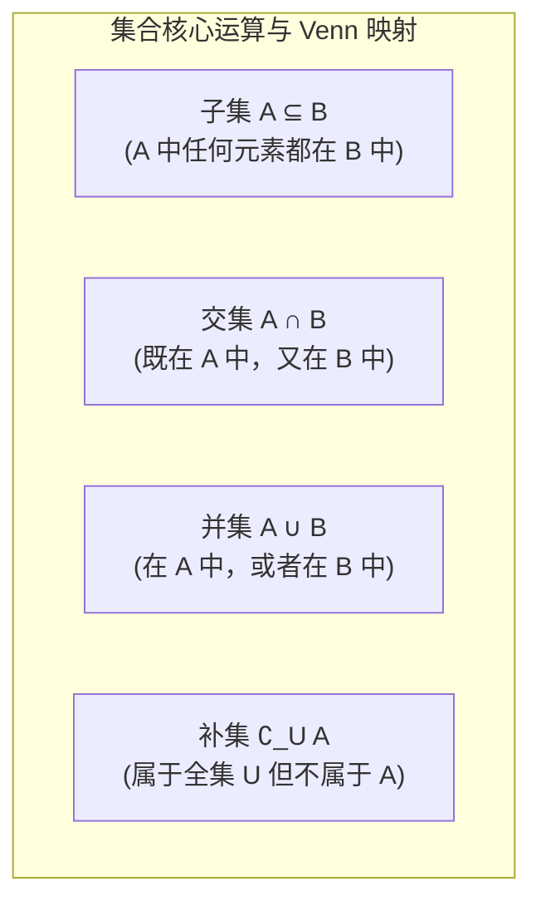
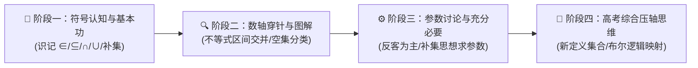

# 高中数学核心专题：集合与常用逻辑用语全景解析与思维跃迁指南

> **“集合是现代整个数学大厦的基石语言，而逻辑用语是这门语言严丝合缝的语法体系。”**  
> 很多同学步入高中，翻开数学课本第一章《集合与常用逻辑用语》，往往误以为这章“极其简单、只有几个符号概念”。然而，高考命题专家往往借由集合的外壳，考查方程根的分布、不等式解集、分类讨论思想以及真假命题转化，成为高一第一道极具隐蔽性的“陷阱关卡”。

本指南严格遵照 **`new_know`** 认知解构规范，由浅入深，从数理本质、命题避坑到计算机与现代科学应用全面展开：
1. **[📋 学习本专题所需的前置知识准备清单（Prerequisites）](#-学习本专题所需的前置知识准备prerequisites)**
2. **[💡 痛点溯源：为什么高中数学第一课必须是“集合”？](#一-痛点溯源数学大厦为什么需要统一的集合论基石)**
3. **[🧠 核心机制：集合三大特性、运算规律与逻辑命题本质](#二-核心概念深度解析三大特性四种运算与逻辑量词)**
4. **[🚀 由浅入深四阶段系统化攻坚路线](#三-由浅入深四阶段系统化攻坚路线)**
5. **[🛠️ 现代科技应用与 Python 集合集合论交互实战](#四-现实应用展示计算机布尔搜索与-python-集合论验证)**

---

## 📋 学习本专题所需的前置知识准备（Prerequisites）

在开启高中集合与逻辑的学习之前，请检查你是否具备以下初中数学常识：



| 模块类别 | 必备核心知识点 | 掌握程度与自测标准（如何自测？） | 零基础推荐前置补课资料 |
| :--- | :--- | :--- | :--- |
| **数系分类与代号** | • **初中数系**：自然数 $\mathbb{N}$、正整数 $\mathbb{N}^*$、整数 $\mathbb{Z}$、有理数 $\mathbb{Q}$、实数 $\mathbb{R}$ | 能够迅速判断 $\sqrt{2} \in \mathbb{R}$ 且 $\sqrt{2} \notin \mathbb{Q}$，能分清“有理数是可以表示为两个整数相除的数” | 人教版初中数学七年级上册第一章《有理数》 |
| **数轴与不等式解集** | • **数轴刻度与区间**：在数轴上绘制实心点（包含边界 $\le, \ge$）与空心点（不含边界 $<, >$） | 能在数轴上准确画出 $-1 \le x < 3$ 的重叠覆盖区域 | 初中数学八年级《一元一次不等式组》 |
| **方程与根的判别式** | • **一元二次方程**：根的判别式 $\Delta = b^2 - 4ac$ 的三种情况（正、零、负） | 能在 3 秒内说出 $x^2 - 2x + 3 = 0$ 在实数范围内是否有解（$\Delta < 0$，无实根） | 初中数学九年级上册《一元二次方程》 |
| **命题与日常思维** | • **命题结构**：能区分“条件（若……”与“结论（则……” | 理解“原命题为真，其否命题不一定为真”（如：如果是苹果则是水果 $\Rightarrow$ 不是苹果不代表不是水果） | 《逻辑思维通识讲义》 |

> [!TIP]
> **一分钟极简自测**：如果你知道“空集 $\varnothing$ 是任何集合的子集，且在解含参集合问题时绝不能遗忘空集”，那么你已经具备了通关本章压轴题最关键的警惕心！

---

## 一、 痛点溯源：数学大厦为什么需要统一的集合论基石？

### 1. 自然语言的歧义灾难
在 19 世纪末康托尔（Georg Cantor）创立集合论之前，数学家们使用自然语言交流时经常产生灾难性的歧义：
- “大于 1 且接近 1 的所有数”——到底包不包含 1.0001？包含多小的值？
- “所有著名的数学家组成的团体”——到底算不算一个数学对象？
因为**没有明确的判定边界**，数学推理无法进入公理化严谨证明阶段。

### 2. 集合论的灵魂比喻
> **集合（Set）就像一个带智能感应锁的“收纳箱”**：  
> 任何一个物体要进入这个箱子，收纳箱只有两个回答：“属于（$\in$）”或者“不属于（$\notin$）”，绝不存在“有点属于”的中间地带。

通过集合，数学家把数、点、函数、图形、解空间全部统一为“元素在特定空间内的分布与归属”，奠定了现代泛函分析、微积分乃至计算机科学（关系型数据库与布尔代数）的基础语言。

---

## 二、 核心概念深度解析：三大特性、四种运算与逻辑量词

### 1. 集合的三大铁律（高考最爱命题陷阱）
1. **确定性（Determinacy）**：任何对象必须能够明确断定是或不是该集合的元素。“著名的科学家”不能构成集合，“获得诺贝尔奖的科学家”能构成集合。
2. **互异性（Distinctness - 第一大坑！）**：集合中的元素必须互不相同。
   > 💡 **高考真题经典设坑**：若集合 $A = \{1, a, a^2 - a\}$，求实数 $a$ 的取值范围。  
   > 常见错误：只顾着满足其他条件，**忘记检验 $a \neq 1$ 且 $a^2 - a \neq 1$ 且 $a^2 - a \neq a$**！一旦元素出现重复，该集合在数学定义上立即非法！
3. **无序性（Disorder）**：$\{1, 2\} = \{2, 1\}$，集合内元素没有前后次序。

### 2. 集合间的核心关系与四大运算
设全集为 $U$，集合 $A, B$ 的常见操作如下：



- **德·摩根定律（De Morgan's Laws - 补运算的逆转神器）**：
  $$\complement_U (A \cap B) = (\complement_U A) \cup (\complement_U B)$$
  $$\complement_U (A \cup B) = (\complement_U A) \cap (\complement_U B)$$
  *直观记忆：“交集的补等于补集的并；并集的补等于补集的交。”*
- **子集与真子集个数公式**：
  若集合包含 $n$ 个元素，则其子集共有 $2^n$ 个，非空子集有 $2^n - 1$ 个，真子集有 $2^n - 1$ 个，非空真子集有 $2^n - 2$ 个。

### 3. 常用逻辑用语：充分、必要条件的集合化降维

许多高中生经常分不清“谁是谁的充分条件，谁是谁的必要条件”。**破解这个痛点的终极心智模型是：“化命题为集合包含关系”**：

设命题 $p$ 对应的解集为 $P$，命题 $q$ 对应的解集为 $Q$：


| 逻辑关系 | 符号表述 | 集合视角本质 | 通俗口诀（降维记忆） |
| :--- | :--- | :--- | :--- |
| **充分不必要条件** | $p \Rightarrow q$ 且 $q \nRightarrow p$ | $P \varsubsetneqq Q$（$P$ 是 $Q$ 的真子集） | **“小推大”**：在小集合里必定在大集合里 |
| **必要不充分条件** | $q \Rightarrow p$ 且 $p \nRightarrow q$ | $Q \varsubsetneqq P$（$Q$ 是 $P$ 的真子集） | **“大难推小”**：在大集合里未必能缩小进小集合 |
| **充要条件** | $p \iff q$ | $P = Q$（两集合完全等价） | **“同生共死”** |
| **既不充分也不必要** | $p \nRightarrow q$ 且 $q \nRightarrow p$ | $P$ 与 $Q$ 互不包含（存在交叉或独立） | **“互不相干”** |

### 4. 全称量词 $\forall$ 与存在量词 $\exists$ 的否定法则
- **全称命题** $p: \forall x \in M, P(x)$  
  其否定 $\neg p: \exists x \in M, \neg P(x)$（**“所有的全变成存在一个，结论取反”**）
- **特称命题** $p: \exists x \in M, P(x)$  
  其否定 $\neg p: \forall x \in M, \neg P(x)$（**“存在一个全变成所有的，结论取反”**）

---

## 三、 由浅入深四阶段系统化攻坚路线



### 阶段一：概念扎实与符号规范（1~2 天）
- 目标：不混淆元素属于集合（$\in, \notin$）与集合包含集合（$\subseteq, \varsubsetneqq$）。
- 重点：牢记三大特性，每次写出答案后第一件事**检查互异性**。

### 阶段二：数轴化与数形结合（3~5 天）
- 目标：将所有连续变量集合（如不等式解集）迅速转化为数轴上的几何区间。
- 核心战术：**端点值验证法则**——画出区间后，必须把端点数字代入原式检验“能不能取到等号”。

### 阶段三：含参分类讨论与“空集刺客”防御（1 周）
- 核心防坑模型：若题目给出 $A \subseteq B$，且 $A = \{x \mid ax + 1 = 0\}$：
  - **第一步永远讨论：$A = \varnothing$**（此时 $a = 0$ 满足 $A = \varnothing \subseteq B$）。
  - **第二步再讨论：$A \neq \varnothing$**。90% 的丢分都是因为漏掉了空集情况！

### 阶段四：新定义集合与高等数学思维跃迁（长期拓展）
- 高考压轴题经常定义一个新名词（如“和谐集”、“等和子集”、“距离封闭集”）。
- 解题破局点：剥除唬人的新定义外壳，将其翻译为熟悉的代数方程或几何坐标约束。

---

## 四、 现实应用展示：计算机布尔搜索与 Python 集合论验证

集合论不仅是考试考点，它还是**现代搜索引擎、关系型数据库（SQL）和权限访问控制（RBAC）**的底层代码本质：

```python
# 1. 模拟电商平台的标签筛选系统
users_who_like_ai = {"张三", "李四", "王五", "赵六"}
users_who_paid = {"李四", "赵六", "钱七"}

# 2. 交集运算 (A ∩ B)：既喜欢 AI 又付过费的高净值用户
vip_ai_users = users_who_like_ai & users_who_paid
print(f"💎 交集 A ∩ B: {vip_ai_users}")  # {'李四', '赵六'}

# 3. 并集运算 (A ∪ B)：全量触达用户池
all_market_users = users_who_like_ai | users_who_paid
print(f"🌐 并集 A ∪ B: {all_market_users}")

# 4. 差集/相对补集 (A \ B)：喜欢 AI 但尚未付费的潜在转化用户
potential_users = users_who_like_ai - users_who_paid
print(f"🎯 潜在转化用户 A - B: {potential_users}")  # {'张三', '王五'}

# 5. 子集检验 (A ⊆ B)：判断是否所有付费用户都喜欢 AI
is_all_paid_like_ai = users_who_paid.issubset(users_who_like_ai)
print(f"❓ 付费用户是否全部喜欢 AI: {is_all_paid_like_ai}")  # False (钱七不喜欢)
```

---

## 总结与解题心法口诀

> **集合问题莫轻心，互异空集两陷阱；**  
> **交并补集画数轴，实心空心看等号；**  
> **充分必要辨清楚，小推大者是充分！**
