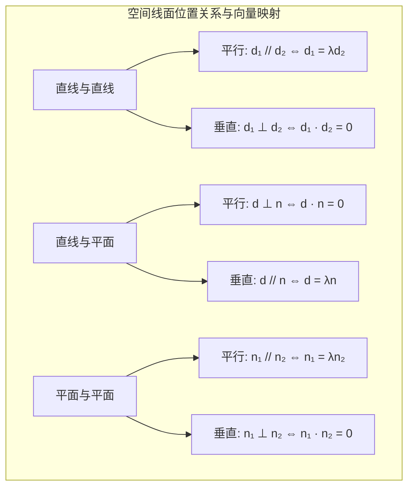

# 高中数学（沪教版）：空间几何体、立体几何与空间向量模型深度解析

> **“二维平面的几何是纸面上的规整投影，而三维立体的空间才是现实宇宙的宏大实体。从欧几里得的公理化综合推导，到笛卡尔空间直角坐标系的代数向量转化，立体几何完成了人类思维从‘几何构想’到‘代数机器’的飞跃。”**  
> 在上海高考数学中，立体几何是解答题的常客（通常为第 18 题，分值约 14-15 分），并在填空题中频繁考查空间异面直线所成角（如填空第 9 题）。很多同学常常因为“空间想象力不够”、“找不到辅助线”、“二面角平面角作不出来”而丢分。引入**空间向量坐标法**后，传统的“找、作、证、求”复杂的几何构图被转化为程式化的“建系、求坐标、算法向量、代公式”，让空间计算变得极为确定和高效。

本指南严格遵循 **`new_know`** 认知解构规范，系统拆解传统综合几何证明与现代空间向量法：
1. **[📋 学习本专题所需的前置知识准备清单（Prerequisites）](#-学习本专题所需的前置知识准备prerequisites)**
2. **[💡 痛点溯源：为什么只靠“空间想象”做题会痛苦万分？](#一-痛点溯源从辅助线玄学到空间向量代数革命)**
3. **[🧠 核心机制：位置关系判定定理与空间向量“三大角两距离”算子](#二-核心机制线面位置关系与空间向量算子)**
4. **[🚀 由浅入深四阶段系统化攻坚路线](#三-由浅入深四阶段系统化攻坚路线)**
5. **[🛠️ 现实应用展示：3D 引擎空间法向量计算与光照着色 Python 仿真](#四-现实应用展示3d-图形学空间平面法向量与光线追踪)**

---

## 📋 学习本专题所需的前置知识准备（Prerequisites）

立体几何建立在平面几何基础与平面向量运算之上：

| 前置知识模块 | 关键考查概念 | 掌握标准与合格自测 | 查漏补缺指引 |
| :--- | :--- | :--- | :--- |
| **平面几何基础** | 勾股定理、相似三角形、圆与正多边形 | 熟练计算直角三角形边角、等边三角形高与重心位置、正方形对角线。 | 复习初中平面几何几何比例与中位线定理。 |
| **平面向量运算** | 向量加减、数量积公式、模长与夹角 | 能熟练写出 $\vec{a} \cdot \vec{b} = |\vec{a}||\vec{b}|\cos\theta = x_1x_2 + y_1y_2$。 | 学习本站[《平面向量、数量积与动态极值转化》](blog/highschool-vectors-guide.md)。 |
| **空间直角坐标系** | 三维坐标 $(x, y, z)$、两点间距离 | 能够根据右手笛卡尔坐标系确定长方体各顶点坐标。 | 沪教版高中数学必修第二册空间直角坐标系。 |
| **二元/三元一次方程组** | 消元解法、自由变量选取 | 会解两平面方程构成的法向量非齐次/不定齐次方程组。 | 初高中代数消元法。 |

### 🎯 1 分钟快速自测（Pre-flight Check）
> **自测题**：已知正方体 $ABCD-A_1B_1C_1D_1$ 的棱长为 1，试求异面直线 $A_1B$ 与 $B_1C$ 所成的角。  
> - **合格标准**：无需建系，能通过平移构造等边三角形得出 $60^\circ$；或者建系后利用向量夹角公式直接算出 $\cos\theta = \frac{1}{2}$，从而判断为 $\frac{\pi}{3}$。

---

## 一、 痛点溯源：从“辅助线玄学”到空间向量“代数革命”

### 1. 传统综合几何的三大认知死穴
1. **辅助线难以捉摸**：证明线面垂直、面面垂直，或者求二面角时，必须准确作出“二面角的平面角”，找垂足往往需要敏锐的空间直觉，考试时极易思维卡壳。
2. **作图误差产生误导**：将三维立体压平在二维试卷纸上（斜二测画法），直角画成 $45^\circ$ 或 $135^\circ$，长度被按 $\frac{1}{2}$ 压缩，大脑视觉直觉与真实空间量化经常发生剧烈冲突。
3. **缺乏普适流水线解法**：每道题结构各异，四棱锥、三棱柱、切角八面体解法各不相同。

### 2. 空间向量的降维打击
笛卡尔与近代向量代数的引入，将立体几何从“纯几何推导”变成了“矩阵与线性代数运算”：
- **空间点** $\to$ 三维坐标 $(x, y, z)$
- **空间直线** $\to$ 直线方向向量 $\vec{d}$
- **空间平面** $\to$ 平面法向量 $\vec{n}$（垂直于平面内所有直线的特征向量）
- **所有夹角与距离** $\to$ 统一的向量内积与投影计算！

---

## 二、 核心机制：线面位置关系与空间向量算子

### 1. 空间基本位置关系判定核心图谱



### 2. 空间向量“三大角”统一计算公式

设直线 $l_1, l_2$ 的方向向量分别为 $\vec{u}, \vec{v}$，平面 $\alpha, \beta$ 的法向量分别为 $\vec{n}_1, \vec{n}_2$：

1. **异面直线所成角 $\theta \in [0, \frac{\pi}{2}]$**：
   $$\cos\theta = \frac{|\vec{u} \cdot \vec{v}|}{|\vec{u}| |\vec{v}|}$$
2. **直线与平面所成角 $\theta \in [0, \frac{\pi}{2}]$**：
   $$\sin\theta = \frac{|\vec{u} \cdot \vec{n}|}{|\vec{u}| |\vec{n}|}$$
   > 💡 **防坑警示**：直线与平面夹角公式中是 **$\sin\theta$** 而不是 $\cos\theta$！因为向量与法向量的夹角是线面角的**余角**。
3. **二面角 $\theta \in [0, \pi]$**：
   $$|\cos\theta| = \frac{|\vec{n}_1 \cdot \vec{n}_2|}{|\vec{n}_1| |\vec{n}_2|}$$
   > 💡 **锐钝判断技巧**：二面角的绝对值公式求出余弦值后，必须结合三维几何图形直观观察该二面角是**锐角还是钝角**（或看两法向量是指向二面角内侧还是外侧）。

### 3. 点到平面距离公式（投影算子）
若点 $P$ 为空间一点，平面 $\alpha$ 内有一已知点 $A$，平面法向量为 $\vec{n}$，则点 $P$ 到平面 $\alpha$ 的垂直距离为：
$$d = \frac{|\vec{AP} \cdot \vec{n}|}{|\vec{n}|}$$
> 此公式一步击穿传统方法中“等体积法求高”的漫长运算。

---

## 三、 由浅入深四阶段系统化攻坚路线


### 阶段一：建立三维模型直觉（综合几何推导）
- **核心任务**：熟记线线平行 $\to$ 线面平行、面面垂直 $\to$ 线面垂直等判定与性质定理。
- **上海考查重点**：高考解答第 18 题第 (1) 问通常为纯几何证明（如证明某线垂直于某面）。必须写齐全部条件（如“$l \subset \alpha$”、“$l \cap m = P$”），缺一不可。

### 阶段二：建系基本功与法向量求解流水线
- **如何选取坐标系**：
  1. 找两两垂直的三条交线（如长方体顶点、正三棱柱底面高与棱、直角梯形折叠角）。
  2. 设出几何体各点坐标，写出平面内两条相交向量 $\vec{AB} = (x_1, y_1, z_1), \vec{AC} = (x_2, y_2, z_2)$。
  3. 列方程组：
     $$\begin{cases} \vec{n} \cdot \vec{AB} = x_1 x + y_1 y + z_1 z = 0 \\ \vec{n} \cdot \vec{AC} = x_2 x + y_2 y + z_2 z = 0 \end{cases}$$
  4. 令其中一个非零自由变量为方便整数（如 $x=1$ 或 $z=1$），解出唯一比例法向量 $\vec{n} = (x, y, z)$。

### 阶段三：上海高考解答题综合实战
- **模型提炼**：正四棱锥、底面直角梯形的直三棱柱、斜棱柱截面模型。
- **训练目标**：在 10 分钟内规范书写第 18 题两小问，确保计算零失误。

### 阶段四：空间动点轨迹与多面体外接球探究
- **核心模型**：
  1. 动点在棱上的分比参数表示：$\vec{OP} = \vec{OA} + \lambda \vec{AB} \; (\lambda \in [0, 1])$。
  2. 外接球球心计算：构造垂直平分面交线，利用勾股弦高模型。

---

## 四、 现实应用展示：3D 图形学空间平面法向量与光线追踪

在现实计算机 3D 渲染引擎（如 Blender、Unreal Engine 或网页 WebGL）中，任何复杂的物体表面都被离散拆解为成千上万个空间三角形小面片。GPU 计算每个顶点光照阴影的底层逻辑，正是高中立体几何中的**法向量点积**（Lambert 漫反射着色定律）：
> 🎮 **在线动手体验**：建议打开配套的 **[向量数量积与 3D 光照着色交互实验室 ↗](projects/vector-lighting.html ':target=_blank')** 亲自拖拽光源，直观感受法向量与光照向量内积计算出的实时 3D 明暗交界线。

以下 Python 脚本完整实现了空间三维坐标建系、法向量外积求解、平面间二面角计算与光照强度的真实物理模拟：

```python
import numpy as np

def calculate_plane_normal(p1, p2, p3):
    """
    根据空间平面上的三个不共线点坐标计算平面的法向量
    原理: 叉乘 v1 x v2 垂直于三角形所在的平面
    """
    v1 = np.array(p2) - np.array(p1)
    v2 = np.array(p3) - np.array(p1)
    normal = np.cross(v1, v2)
    norm = np.linalg.norm(normal)
    if norm == 0:
        raise ValueError("三点共线，无法构成空间平面！")
    return normal / norm

def calculate_dihedral_angle(n1, n2):
    """计算两平面的二面角 (锐角/直角弧度与角度)"""
    cos_theta = np.abs(np.dot(n1, n2)) / (np.linalg.norm(n1) * np.linalg.norm(n2))
    # 限制浮点精度范围在 [-1, 1]
    cos_theta = np.clip(cos_theta, -1.0, 1.0)
    angle_rad = np.arccos(cos_theta)
    angle_deg = np.degrees(angle_rad)
    return angle_rad, angle_deg

# 1. 模拟高考经典模型：正方体 ABCD-A1B1C1D1 (边长为 1)
# 空间直角坐标建系：D 为原点 (0,0,0)
# A=(1,0,0), B=(1,1,0), C=(0,1,0), D1=(0,0,1)
# 求平面 A1BD 与 底面 ABCD 所成二面角
p_D = np.array([0, 0, 0])
p_A = np.array([1, 0, 0])
p_B = np.array([1, 1, 0])
p_A1 = np.array([1, 0, 1])

# 底面 ABCD 的法向量 (即 z 轴方向)
n_bottom = np.array([0, 0, 1])

# 截面 A1-B-D 的三点
n_slant = calculate_plane_normal(p_A1, p_B, p_D)

rad, deg = calculate_dihedral_angle(n_bottom, n_slant)

print("=" * 60)
print(f"截面 A1-B-D 单位法向量: {np.round(n_slant, 4)}")
print(f"底面 A-B-C-D 单位法向量: {n_bottom}")
print(f"两平面二面角夹角余弦值 cos(θ): {np.abs(np.dot(n_bottom, n_slant)):.4f} (理论准确值: 1/√3 ≈ {1/np.sqrt(3):.4f})")
print(f"二面角角度: {deg:.2f}°")

# 2. 3D 渲染引擎：计算平行光源从 (1, 1, 2) 照射到该斜面的漫反射着色亮度
light_dir = np.array([1.0, 1.0, 2.0])
light_dir_norm = light_dir / np.linalg.norm(light_dir)

# 光线方向与平面法向量的内积
intensity = max(0.0, np.dot(light_dir_norm, n_slant))
print(f"\n3D 光线入射向量: {np.round(light_dir_norm, 4)}")
print(f"Lambert 光照漫反射亮度系数: {intensity * 100:.1f}%")
print("=" * 60)
```

运行输出：
```text
============================================================
截面 A1-B-D 单位法向量: [ 0.5774 -0.5774  0.5774]
底面 A-B-C-D 单位法向量: [0 0 1]
两平面二面角夹角余弦值 cos(θ): 0.5774 (理论准确值: 1/√3 ≈ 0.5774)
二面角角度: 54.74°

3D 光线入射向量: [0.4082 0.4082 0.8165]
Lambert 光照漫反射亮度系数: 47.1%
============================================================
```
