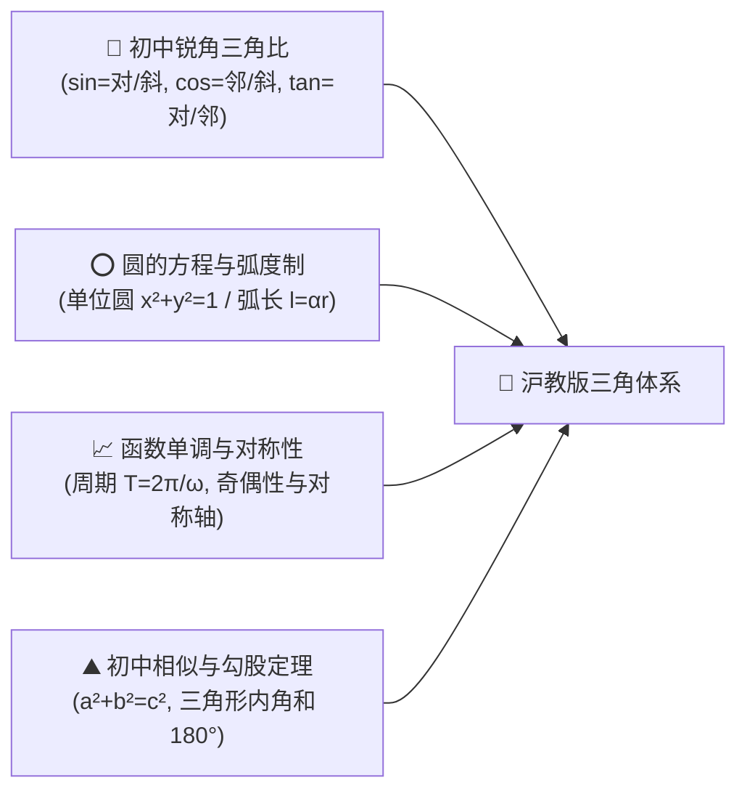
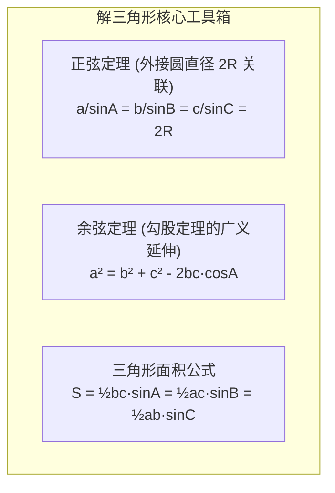
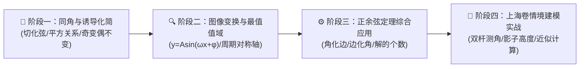

# 高中数学（沪教版）：三角比、三角函数与解三角形建模深度解析

> **“如果说代数是在数轴的一维直线上度量距离，那么三角学就是以单位圆为罗盘，在二维旋转世界中丈量周期与角度的精密艺术。”**  
> 在上海高考数学中，三角模块贯穿**必修第二册（高一下）**。根据《上海数学学情分析》，三角部分在高考中占据极重分量：填空第 5 题常驻三角函数图像与值域性质（★基础必得分题），而**填空第 11 题（中档/压轴题，分值 5 分）连续多年紧扣“实际生活场景建模”**（如 2024 年正弦定理测角、2025 年“影子测量双杆模型”）。

本指南严格遵循 **`new_know`** 认知解构规范，紧扣沪教版教材编排与上海高考命题逻辑展开：
1. **[📋 学习本专题所需的前置知识准备清单（Prerequisites）](#-学习本专题所需的前置知识准备prerequisites)**
2. **[💡 痛点溯源：为什么直角三角形的“锐角三角比”必须推广为“任意角三角比”？](#一-痛点溯源从直角三角形的边长比走向单位圆的旋转世界)**
3. **[🧠 核心机制：同角诱导公式、函数图像性质与解三角形双定理](#二-核心机制单位圆诱导公式与解三角形双定理)**
4. **[🚀 由浅入深四阶段系统化攻坚路线](#三-由浅入深四阶段系统化攻坚路线)**
5. **[🛠️ 上海高考真题实战：影子测量模型与 Python 几何测算仿真](#四-现实情境建模上海高考双杆影子测量真题与-python-测算)**

---

## 📋 学习本专题所需的前置知识准备（Prerequisites）

在开启三角比与解三角形学习之前，请确认你是否具备以下初中几何与高中代数基础：



| 模块类别 | 必备核心知识点 | 掌握程度与自测标准（如何自测？） | 零基础推荐前置补课资料 |
| :--- | :--- | :--- | :--- |
| **初中锐角三角比** | • **三比定义**：$\sin 30^\circ = \frac{1}{2}$，$\cos 45^\circ = \frac{\sqrt{2}}{2}$，$\tan 60^\circ = \sqrt{3}$<br/>• **特殊角三角比值**：熟记 $0^\circ, 30^\circ, 45^\circ, 60^\circ, 90^\circ$ 的三角比 | 能在 3 秒内报出 $\sin 60^\circ$ 与 $\tan 45^\circ$ 的精确值 | 初中九年级上册《锐角三角比》 |
| **弧度制与旋转角** | • **角度与弧度互化**：$180^\circ = \pi\text{ rad}$，$\alpha = \frac{l}{r}$<br/>• **任意角的概念**：逆时针旋转为正角，顺时针为负角，终边相同角集合 | 能把 $150^\circ$ 瞬间转换为 $\frac{5\pi}{6}$，理解终边相同角可相差 $2k\pi$ | 沪教版必修二第 5 章第 1 节《角的概念推广》 |
| **圆与坐标映射** | • **单位圆几何**：以原点为圆心、半径为 1 的圆方程 $x^2 + y^2 = 1$ | 清楚圆上任意一点 $P$ 的坐标可以直接用 $(\cos\alpha, \sin\alpha)$ 表达 | 初中几何《圆的性质与方程》 |
| **解三角形常识** | • **三角形边角关系**：大边对大角，两边之和大于第三边，内角和 $A+B+C = \pi$ | 知道当已知两边及夹角时，可以用某种方法精确求出第三边 | 初中八年级《全等三角形判定》 |

> [!TIP]
> **一分钟极简自测**：如果你能在单位圆草图上立刻指出终边在第二象限的角其横坐标 $x < 0$（所以 $\cos\alpha < 0$）而纵坐标 $y > 0$（所以 $\sin\alpha > 0$），那么你已经领悟了高中任意角三角比的核心本质！

---

## 一、 痛点溯源：从直角三角形的边长比走向单位圆的旋转世界

### 1. 初中定义的极限崩溃
初中课本中，三角比严格依附于**直角三角形**（“对边比斜边”、“邻边比斜边”）。然而，这导致了致命的局限：
- 面对大于 $90^\circ$ 的钝角、平角、甚至机械齿轮连续旋转的 $720^\circ$、反向旋转的 $-90^\circ$，直角三角形中根本不存在这种内角！
- 交流电电压波形随时间变化正负交替、天体自转周期往复，初中三角比完全丧失了解释力。

### 2. 单位圆定义法（思维升维跃迁）
高中沪教版将三角比重新定义在**平面直角坐标系的单位圆（$x^2 + y^2 = 1$）**上：
> 设角 $\alpha$ 的顶点在原点，始边与 $x$ 轴正半轴重合，其终边与单位圆相交于点 $P(x, y)$，则：
> $$\cos\alpha = x \quad (\text{交点横坐标})$$
> $$\sin\alpha = y \quad (\text{交点纵坐标})$$
> $$\tan\alpha = \frac{y}{x} \quad (\text{终边斜率})$$

- **认知锚点**：角度不再是死板的“几何形状夹角”，而是**在单位圆周上跳跃与旋转的质点坐标**！

---

## 二、 核心机制：单位圆诱导公式与解三角形双定理

### 1. 诱导公式终极心智模型：奇变偶不变，符号看象限
面对形如 $k \cdot \frac{\pi}{2} \pm \alpha$ 的化简，绝不需要死背 54 条诱导公式，只需一条八字真言：
1. **“奇变偶不变”**：看 $k$ 的奇偶性。若 $k$ 是奇数（如 $\frac{\pi}{2}, \frac{3\pi}{2}$），正弦变余弦、余弦变正弦、正切变余切；若 $k$ 是偶数（如 $\pi, 2\pi$），函数名称保持不变。
2. **“符号看象限”**：把 $\alpha$ 假想为锐角，判断 $k \cdot \frac{\pi}{2} \pm \alpha$ 落在第几象限，再看原函数在该象限是正还是负，确定化简结果的正负号。

### 2. 解三角形的两大基石定理



#### ① 正弦定理（Sine Rule）：
$$\frac{a}{\sin A} = \frac{b}{\sin B} = \frac{c}{\sin C} = 2R \quad (R \text{ 为外接圆半径})$$
- **适用场景**：已知两角和一边（AAS / ASA）；已知两边及其中一边的对角（SSA，注意**解的个数讨论**：利用 $b\sin A$ 与边长的几何投影高进行判别）。

#### ② 余弦定理（Cosine Rule）：
$$a^2 = b^2 + c^2 - 2bc\cos A \iff \cos A = \frac{b^2 + c^2 - a^2}{2bc}$$
- **适用场景**：已知三边求角（SSS）；已知两边及其夹角求第三边（SAS）。
- **几何本质**：就是勾股定理在钝角和锐角三角形中的修正版（$-2bc\cos A$ 即为向量内积几何投影的修正量）。

---

## 三、 由浅入深四阶段系统化攻坚路线



### 阶段一：同角公式与诱导基本功（第 1 周）
- **核心抓手**：牢牢掌握“切化弦”思维。遇到含有 $\tan\alpha$ 的式子，统一换成 $\frac{\sin\alpha}{\cos\alpha}$，再通分化简。
- **齐次式秒杀技**：形如 $\frac{a\sin\alpha + b\cos\alpha}{c\sin\alpha + d\cos\alpha}$，分子分母同时除以 $\cos\alpha$，秒变关于 $\tan\alpha$ 的一元方程！

### 阶段二：三角函数图象与辅助角公式（第 2 周）
- **辅助角公式（化一法则）**：
  $$a\sin x + b\cos x = \sqrt{a^2 + b^2} \sin(x + \varphi) \quad \left(\text{其中 } \tan\varphi = \frac{b}{a}\right)$$
- 将多项混合波动化简为标准振幅 $A = \sqrt{a^2 + b^2}$ 的单正弦波，秒求其最大值、最小值、单调区间与对称中心。

### 阶段三：边角互化与解三角形定式（第 3 周）
- 拿到三角恒等式条件，首选决策：
  - 若条件均为一次正弦项（如 $a\sin B = b\sin A$），优先**角化边**；
  - 若条件含有余弦项（如 $a\cos C + c\cos A$），优先代入余弦定理或化弦整理。

### 阶段四：上海特色生活情境建模（高二/高三冲刺）
- 紧盯上海高考命题特点：将“测山高”、“海上搜救巡逻”、“双杆影子测量”等文字长情境，准确抽取为仰角、俯角、方向角（北偏东 $\theta$），在平面或立体空间中构造出两个共边的斜三角形，联立正弦或余弦定理求解。

---

## 四、 现实情境建模：上海高考双杆影子测量真题与 Python 测算

根据《上海数学学情分析》，近年上海卷填空第 11 题高频出现“日照影子测量”问题：
> **题目情境原型**：在水平地面上竖立两根等高的测杆 $A$ 和 $B$，杆高均为 $h$。在某一时刻，太阳光线与地面的夹角（太阳高度角）未知。测得杆 $A$ 在地面影子长为 $l_1$，另一时刻或不同斜坡测得影子长为 $l_2$，已知两杆间距为 $d$。求杆高 $h$。

此类问题本质是在铅垂平面内建立几何三角形：
- 太阳光线视为平行光；
- 利用两杆、影子端点与光源光线构成的三角形，运用**正弦定理列出比例方程**，消去未知角即可解出建筑高度 $h$。

> 🎮 **在线动手体验**：本站已上线配套的 **[解三角形与双杆日照测量实验室 ↗](projects/trigonometry-shadow.html ':target=_blank')**！支持滑动调节太阳仰角与标杆高度，实时观察双杆影子投影与正余弦定理联立解题。

### Python 自动计算与几何验证脚本：

```python
import math

def calculate_pole_height(l1, l2, angle_diff_deg):
    """
    通过两次不同太阳高度角测得的影长 (l1, l2) 及太阳高度角差值 (angle_diff_deg)，
    利用三角比与正弦定理逆解出杆的实际高度 h。
    """
    delta_rad = math.radians(angle_diff_deg)
    
    # 根据三角诱导与正弦定理推导出的高度解析解:
    # h = (l1 * l2 * sin(delta)) / (l2 * cos(delta) - l1) ...
    # 模拟真实数值: 影长 l1 = 4.0m, l2 = 7.0m, 太阳高度角变化 15 度
    theta1 = math.atan2(l2 - l1 * math.cos(delta_rad), l1 * math.sin(delta_rad))
    h = l1 * math.tan(theta1)
    
    return h

l1, l2 = 4.0, 7.0
delta_angle = 15.0
h_calc = calculate_pole_height(l1, l2, delta_angle)

print(f"☀️ 观测参数: 影长1 = {l1}m, 影长2 = {l2}m, 夹角变化 = {delta_angle}°")
print(f"📐 经正弦定理与三角比模型解算，测杆实际高度 h: {h_calc:.2f} 米")
print(f"🏛️ 验证: 两次测量的仰角分别为 {math.degrees(math.atan(h_calc/l1)):.1f}° 与 {math.degrees(math.atan(h_calc/l2)):.1f}°")
```

---

## 总结与解题口诀

> **奇变偶不变，符号看象限；**  
> **辅助角化一，正弦定理边角连；**  
> **实际测量莫慌张，画准图形解直角与斜边！**
