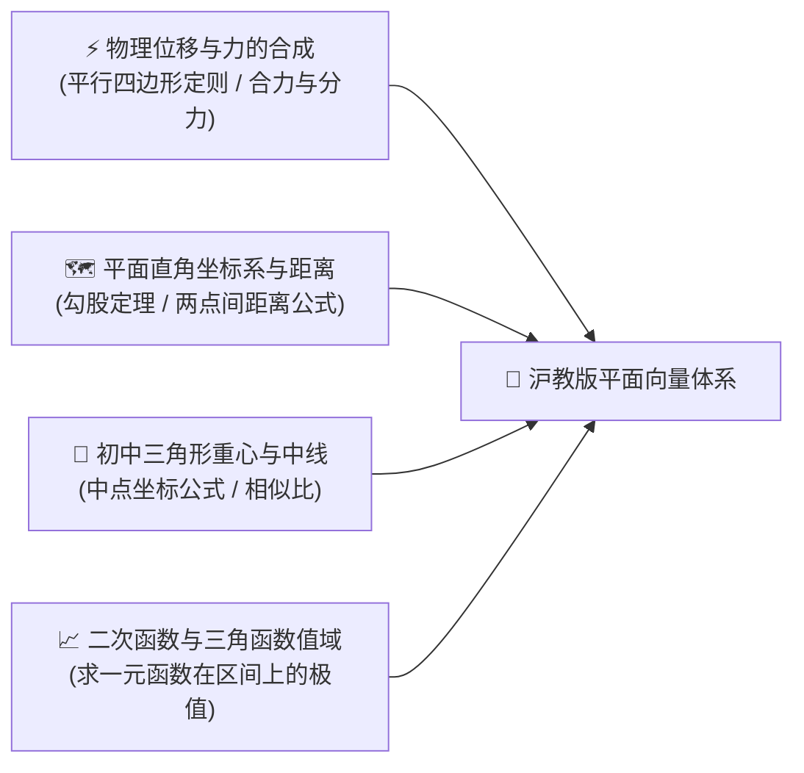
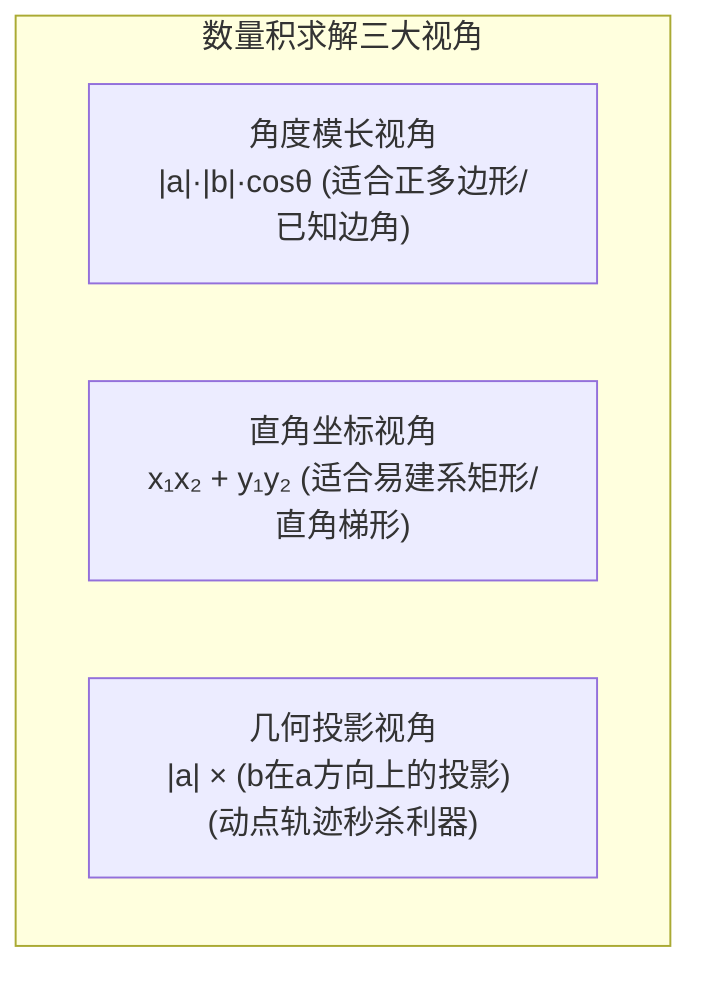
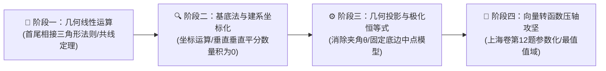

# 高中数学（沪教版）：平面向量、数量积与动态极值转化深度解析

> **“如果说数是静止在刻度尺上的孤立点，那么向量就是穿透空间的带箭头的流动的力。它是代数与几何最完美的混血儿。”**  
> 在上海高考数学中，平面向量位于**必修第二册（高一下）第 7 章**。根据《上海数学学情分析》，**向量综合题长年雄踞填空第 12 题（压轴小题，分值 5 分）**（如 2024 年单位向量范围、2025 年动态模长极值）。试题重点考查从**“几何投影”到“向量函数化（参数化）”**的抽象转化能力，是区分 110 分与 120+ 高分考生的关键分水岭。

本指南严格遵循 **`new_know`** 认知解构规范，紧密围绕沪教版教材脉络与上海高考试题特点展开：
1. **[📋 学习本专题所需的前置知识准备清单（Prerequisites）](#-学习本专题所需的前置知识准备prerequisites)**
2. **[💡 痛点溯源：为什么标量数学不够用？向量如何联通数与形？](#一-痛点溯源从标量相加到带有方向的力的合成)**
3. **[🧠 核心机制：基底分解、数量积的三大视角与极化恒等式神技](#二-核心机制数量积的三大视角与极化恒等式)**
4. **[🚀 由浅入深四阶段系统化攻坚路线](#三-由浅入深四阶段系统化攻坚路线)**
5. **[🛠️ 现代科技应用：计算机 3D 光照着色与 Python 向量点积运算实战](#四-现实科技应用3d-图形光照渲染与-python-向量仿真)**

---

## 📋 学习本专题所需的前置知识准备（Prerequisites）

在进入平面向量学习之前，请确认你是否具备以下初中平面几何与解析几何基本功：



| 模块类别 | 必备核心知识点 | 掌握程度与自测标准（如何自测？） | 零基础推荐前置补课资料 |
| :--- | :--- | :--- | :--- |
| **物理力的合成** | • **平行四边形定则**：互成角度的两个力的合成与分解方法 | 清楚两个大小均为 5N 且夹角为 $90^\circ$ 的力，其合力大小为 $5\sqrt{2}\text{ N}$ | 初中八年级下册物理《力与运动》 |
| **平面解析几何** | • **两点距离公式**：$d = \sqrt{(x_2 - x_1)^2 + (y_2 - y_1)^2}$<br/>• **中点坐标公式**：$(\frac{x_1+x_2}{2}, \frac{y_1+y_2}{2})$ | 能够根据两点坐标秒写出线段中点和线段长度 | 初中八年级《平面直角坐标系》 |
| **三角与几何投影** | • **锐角/钝角三角比**：$\cos\theta$ 在钝角时为负、直角时为 0、锐角时为正 | 理解一条线段在另一条直线上正交投影的代数符号含义 | 沪教版必修二《三角比》 |
| **函数最值意识** | • **一元变量转化**：将几何动点位置用单一参数（如角度 $\theta$ 或横坐标 $t$）表示 | 具备把几何求最值问题翻译为“求 $f(t) = at^2 + bt + c$ 最值”的转化直觉 | 高中必修一《函数的基本性质》 |

> [!TIP]
> **一分钟极简自测**：如果你知道“两个垂直向量的数量积（点积）等于 0，即 $\vec{a} \perp \vec{b} \iff \vec{a} \cdot \vec{b} = 0$”，并且知道点积运算的结果是一个**纯实数标量**而不是向量，那么你已经掌握了向量代数的核心门槛！

---

## 一、 痛点溯源：从标量相加到带有方向的力的合成

### 1. 纯代数标量的表达瓶颈
在只有实数的数学世界里，“$1 + 1 = 2$”是不容置疑的真理。然而在现实物理世界中：
- 两个人以相同的力 $100\text{ N}$ 拉同一艘船，如果两人同向拉，合力是 $200\text{ N}$；如果背道而驰反向拉，合力是 $0\text{ N}$；如果成 $120^\circ$ 角拉，合力竟然只有 $100\text{ N}$！
- 现实中的“位移、速度、加速度、电场强度”都兼具**大小（模长）**与**方向**。标量代数面对多维方向问题显得无能为力。

### 2. 向量的灵魂比喻：数与形的超级桥梁
> **向量是带着罗盘指针的有向线段**：  
> 它既拥有**几何的直观形态**（可以平移、旋转、缩放、投影），又拥有**代数的严密逻辑**（可以像数字一样进行坐标加减与数量积乘法）。它是高中数学中“数形结合”思想最直接的物化载体。

---

## 二、 核心机制：数量积的三大视角与极化恒等式

### 1. 平面向量基本定理（向量世界的“DNA 双螺旋”）
> 如果 $\vec{e}_1, \vec{e}_2$ 是同一平面内的两个**不共线**向量，那么对于这一平面内的任意向量 $\vec{a}$，有且仅有一对实数 $\lambda_1, \lambda_2$，使得：
> $$\vec{a} = \lambda_1 \vec{e}_1 + \lambda_2 \vec{e}_2$$

- **解题启示（基底法）**：遇到复杂几何图形中的未知向量，只要选定两个互相独立的主干边作为基底（如平行四边形的两条邻边），平面内的所有线段与动点都可以被**唯一线性表示**！

### 2. 数量积（点积，Dot Product）的三大解读视角

$$\vec{a} \cdot \vec{b} = |\vec{a}| |\vec{b}| \cos\theta = x_1 x_2 + y_1 y_2$$

在解高考压轴题时，高手会根据题目条件在以下三个视角中自如切换：



- **投影视角的无敌威力**：若向量 $\vec{a}$ 是固定不变的线段，无论动点 $B$ 如何运动，**$\vec{a} \cdot \vec{b}$ 的大小完全取决于 $B$ 点在 $\vec{a}$ 所在直线上的垂足位置！** 垂足越远，数量积越大；垂足在线段反向延长线上，数量积为负！

### 3. 极化恒等式（上海高考中点最值“核武器”）
在 $\triangle ABC$ 中，$M$ 为底边 $BC$ 的中点，则向量数量积 $\vec{AB} \cdot \vec{AC}$ 满足：

$$\vec{AB} \cdot \vec{AC} = |\vec{AM}|^2 - |\vec{BM}|^2 = |\vec{AM}|^2 - \frac{1}{4}|\vec{BC}|^2$$

- **口诀记忆**：“**中线平方减去半底平方**”。
- **威力场景**：当底边 $BC$ 长度固定，而顶点 $A$ 在圆或直线上动态游走时，原题求“两边数量积的最值”，瞬间被降维为**“求中线 $AM$ 距离的最值”**！

---

## 三、 由浅入深四阶段系统化攻坚路线



### 阶段一：三角形法则与共线定理（第 1 周）
- **三角形法则口诀**：“首尾相连，始到终”；减法则口诀：“共起点，指被减”。
- **三点共线充要条件**：若 $\vec{OP} = x\vec{OA} + y\vec{OB}$，且 $A, P, B$ 三点共线，则必有 $x + y = 1$！

### 阶段二：坐标建系法（第 2 周）
- 遇到正方形、矩形、等腰直角三角形或带有直角坐标网格的试题，毫不犹豫**建立直角坐标系**，将抽象图形问题暴力转化为纯代数运算。

### 阶段三：极化恒等式与投影秒杀（第 3 周）
- 专项攻克几何图形中的动点数量积。画出垂足或中线，利用“点积即定长乘以投影长”快速锁定极值点位置，省去 80% 的代数草稿量。

### 阶段四：上海高考第 12 题“向量 $\to$ 函数”转化攻坚（高二/高三冲刺）
根据《上海数学学情分析》，第 12 题常考查单位向量与动点几何约束下的取值范围：
- **破局核心通法**：
  1. 设角参数（如令单位向量与坐标轴夹角为 $\theta \in [0, 2\pi)$）；
  2. 将复杂向量式全部展开为关于 $\theta$ 的三角函数 $f(\theta) = A\sin\theta + B\cos\theta$ 或关于动点坐标 $t$ 的二次函数；
  3. 转化为求解连续函数在闭区间上的最大值与最小值。

---

## 四、 现实科技应用：3D 图形光照渲染与 Python 向量仿真

在现代 3D 游戏引擎（如 Unreal 虚幻引擎、Unity）与电影特效中，**物体表面的明暗光照着色计算（Lambert 漫反射定律），其核心算法就是向量点积**：
- 设物体表面某点的**法向量**为 $\vec{N}$（单位向量）；
- 光线照射方向的**光照向量**为 $\vec{L}$（单位向量）；
- 该点接收到的光线反射亮度，恰好等于法向量与光向量的点积：
  $$\text{Brightness} = \max(0, \ \vec{N} \cdot \vec{L}) = \max(0, \ \cos\theta)$$
> 🎮 **在线动手体验**：本站已上线配套的 **[向量数量积与 3D 光照着色交互实验室 ↗](projects/vector-lighting.html ':target=_blank')**！支持在浏览器中自由拖拽光源位置，实时观察法向量、光照向量投影与 3D 球体像素级着色。

### Python 3D 光照着色模拟脚本：

```python
import numpy as np

def calculate_light_intensity(surface_normal, light_direction):
    """
    使用平面向量/空间向量数量积，计算 3D 图形像素点的光照漫反射强度
    """
    n = np.array(surface_normal, dtype=float)
    l = np.array(light_direction, dtype=float)
    
    # 归一化为单位向量
    n_unit = n / np.linalg.norm(n)
    l_unit = l / np.linalg.norm(l)
    
    # 核心向量数量积运算 (Dot Product)
    dot_product = np.dot(n_unit, l_unit)
    
    # 只有当夹角小于 90 度时才有反射光照
    intensity = max(0.0, dot_product)
    angle_deg = np.degrees(np.arccos(np.clip(dot_product, -1.0, 1.0)))
    
    return intensity, angle_deg

# 模拟：法向量竖直向上 (0, 1)，测试三组不同方向的光线
lights = {
    "正午垂直顶光 (0, 1)": [0, 1],
    "黄昏斜射侧光 (1, 1)": [1, 1],
    "完全背光照射 (0, -1)": [0, -1]
}

print("🎮 现代 3D 引擎 Shader 核心：平面向量点积光照计算模拟")
for name, light in lights.items():
    brightness, angle = calculate_light_intensity([0, 1], light)
    print(f"💡 光源场景: {name:20s} | 夹角: {angle:5.1f}° | 最终明暗着色亮度: {brightness:.3f}")
```

---

## 总结与解题口诀

> **平行四边形定基底，坐标建系算得清；**  
> **中点出现极化法，中线平方减半底；**  
> **压轴动点莫心慌，投影定点化函数！**
