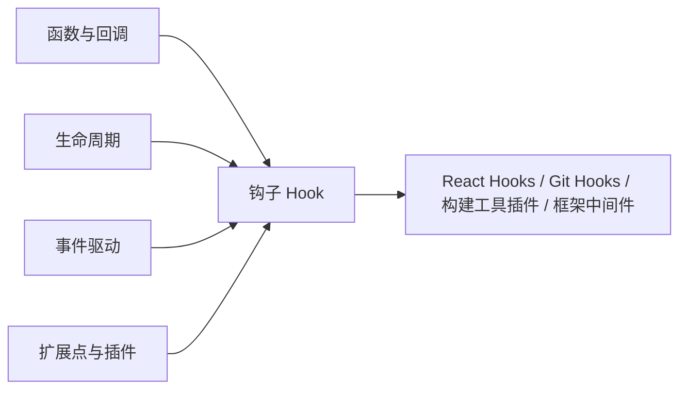
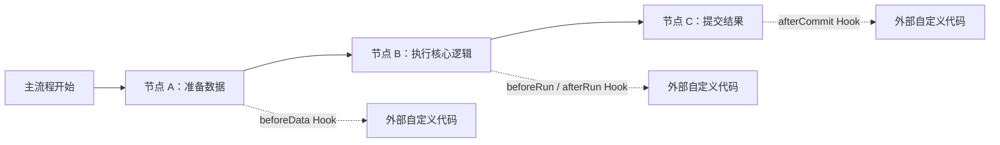
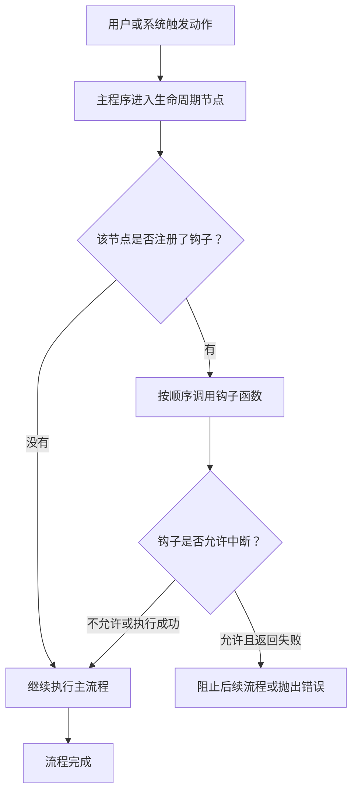
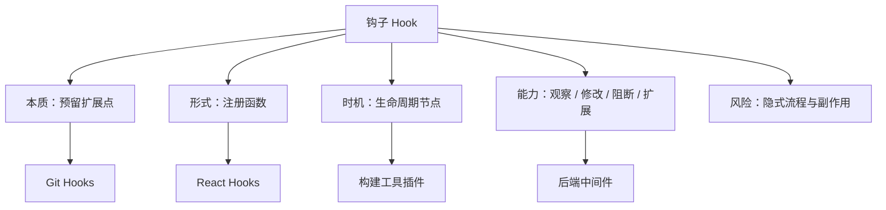

# 钩子 Hooks 核心概念深度解析与系统化学习路径

> “钩子”不是某一个框架独有的黑话，而是一种非常通用的软件设计思想：**系统在关键流程节点预留一个扩展入口，让外部代码在合适的时机插进来执行。**
>
> 你在 React 里写 `useEffect`，在 Git 里写 `pre-commit`，在 Webpack/Vite/Babel 插件里写生命周期函数，甚至在操作系统、浏览器事件、测试框架、登录鉴权流程里注册回调，本质上都在使用“钩子”。

---

## 1. 前置知识矩阵：理解钩子之前需要知道什么



> [!TIP]
> **一分钟极简自测**：如果你知道“把一个函数传给另一个函数，稍后由对方调用”是什么意思，并且能看懂最基础的 JavaScript 函数，你就可以毫无门槛地通读本指南。

| 模块类别 | 必备核心知识点 | 掌握程度与自测标准（如何知道自己已达标？） | 零基础推荐前置补课资料 |
| :--- | :--- | :--- | :--- |
| **数学/理论基础** | 流程、状态、前置条件、后置结果 | 能画出“开始 -> 检查 -> 执行 -> 结束”的简单流程图 | 任意流程图入门教程，重点理解顺序、分支、循环 |
| **编程/数据结构** | 函数、回调函数、闭包、模块 | 能写出 `run(() => console.log("hello"))` 这种把函数当参数传入的代码 | JavaScript 函数基础、MDN Function 文档 |
| **领域上下文** | 生命周期、事件驱动、插件机制 | 能解释“按钮点击事件为什么不是立刻执行，而是点击时才执行” | 浏览器事件模型、React 生命周期入门 |
| **环境与工具** | Node.js、Git、浏览器控制台 | 能运行 `node -v`、`git --version`，并能打开浏览器 DevTools | Node.js 官网 Getting Started、Git 官方教程 |

---

## 2. 一句话理解：钩子到底是什么？

**钩子 Hook = 主流程预留的扩展插槽。**

可以把一个软件系统想象成一条自动化流水线：



正常情况下，系统自己知道该怎么跑。但有些位置经常需要被外部定制，例如：

- 提交代码前自动格式化；
- 页面渲染后请求数据；
- 打包开始前读取配置；
- 用户登录成功后记录审计日志；
- 请求进入业务代码前校验权限。

于是系统设计者会说：“我在这里留一个点，你可以把自己的函数挂上来。等流程跑到这里，我来帮你调用。”

这个“预留点”就是钩子。

---

## 3. 痛点溯源：为什么软件系统需要钩子？

### 3.1 没有钩子时，扩展只能改源码

假设 Git 没有 `pre-commit` 钩子。你想在每次提交前自动跑格式化和测试，就只能：

1. 记得每次手动运行命令；
2. 修改 Git 本身源码；
3. 写一个包住 `git commit` 的外部脚本。

这三种方式都不理想：手动执行容易忘，改源码不可维护，外部脚本又容易绕过真正流程。

钩子的价值在于：**不破坏主系统，又能让你在主系统的关键时刻插入自己的逻辑。**

### 3.2 一句话灵魂比喻

**钩子就像电影院门口的检票口：电影怎么播放由影院负责，但入场前查票、验身份、发 3D 眼镜这些动作，可以被安排在固定入口自动发生。**

主流程保持稳定，扩展逻辑按约定接入。

---

## 4. 输入输出黑盒：钩子如何工作？



一个典型钩子系统通常包含四个角色：

| 角色 | 含义 | 例子 |
| :--- | :--- | :--- |
| **宿主系统** | 提供主流程的软件 | React、Git、Vite、Express |
| **钩子点** | 可插入逻辑的生命周期位置 | `pre-commit`、`useEffect`、`buildStart` |
| **钩子函数** | 开发者写的自定义代码 | 检查代码风格、请求接口、打印日志 |
| **调度规则** | 何时调用、能否异步、能否阻断 | 顺序执行、并行执行、失败中断 |

---

## 5. 常见钩子类型横向对比

| 场景 | 钩子名称示例 | 触发时机 | 主要用途 |
| :--- | :--- | :--- | :--- |
| **Git Hooks** | `pre-commit`、`commit-msg`、`pre-push` | 提交、写提交信息、推送前 | 格式化、Lint、测试、提交规范校验 |
| **React Hooks** | `useState`、`useEffect`、`useMemo` | 组件渲染与状态变化期间 | 管理状态、副作用、缓存计算结果 |
| **Vue 生命周期** | `mounted`、`updated`、`unmounted` | 组件挂载、更新、卸载时 | 操作 DOM、请求数据、清理资源 |
| **构建工具插件** | `buildStart`、`transform`、`generateBundle` | 打包流水线不同阶段 | 改代码、生成资源、注入变量 |
| **后端中间件** | request hook、response hook | 请求进入或响应返回前 | 鉴权、日志、限流、异常处理 |
| **测试框架** | `beforeEach`、`afterEach` | 每个测试用例前后 | 初始化数据、清理环境 |

注意：这些东西名字不一定都叫 Hook，但思想高度一致：**在主流程的固定节点注册外部逻辑。**

---

## 6. 以 Git Hooks 为例：最直观的钩子

Git Hooks 是理解“钩子”的好入口，因为它非常接近字面意思。

当你执行：

```bash
git commit -m "add feature"
```

Git 并不是立刻把提交写进去，而是会检查 `.git/hooks/` 目录里有没有对应脚本：

```text
.git/hooks/
├── pre-commit
├── commit-msg
└── pre-push
```

如果存在 `pre-commit` 且脚本可执行，Git 会先运行它。脚本返回 `0` 表示通过，返回非 `0` 表示失败，提交会被阻止。

最小示例：

```bash
#!/bin/sh
echo "running pre-commit checks..."
npm test
```

这就是典型的“前置拦截型钩子”：主流程愿意继续之前，先让你做检查。

---

## 7. 以 React Hooks 为例：为什么前端里的钩子更抽象？

React Hooks 里的“钩子”稍微特殊，因为它不只是生命周期回调，还承担了函数组件里的状态管理能力。

```jsx
import { useEffect, useState } from "react";

function Counter() {
  const [count, setCount] = useState(0);

  useEffect(() => {
    document.title = `count: ${count}`;
  }, [count]);

  return <button onClick={() => setCount(count + 1)}>{count}</button>;
}
```

这里有两个关键点：

- `useState`：把状态“挂”到当前组件实例上；
- `useEffect`：把副作用函数“挂”到渲染完成后的执行阶段。

React Hooks 的设计目标是：**让函数组件也能接入 React 的状态系统和渲染生命周期。**

所以 React 中的 Hook 更像是“接入 React 内部调度系统的 API”，而不只是“某个时刻调用一个回调”。

---

## 8. 底层机制：一个极简 Hook 系统长什么样？

下面用 JavaScript 写一个最小钩子调度器：

```javascript
class HookSystem {
  constructor() {
    this.hooks = {};
  }

  on(name, fn) {
    if (!this.hooks[name]) this.hooks[name] = [];
    this.hooks[name].push(fn);
  }

  async emit(name, context) {
    const fns = this.hooks[name] || [];
    for (const fn of fns) {
      await fn(context);
    }
  }
}

async function main() {
  const app = new HookSystem();

  app.on("beforeSave", async (ctx) => {
    ctx.content = ctx.content.trim();
    console.log("trim content");
  });

  app.on("afterSave", async (ctx) => {
    console.log(`saved: ${ctx.content}`);
  });

  const context = { content: "  hello hooks  " };

  await app.emit("beforeSave", context);
  console.log("saving...");
  await app.emit("afterSave", context);
}

main();
```

预期输出：

```text
trim content
saving...
saved: hello hooks
```

这个例子虽然简陋，但已经包含了钩子的核心骨架：

- `on(name, fn)`：注册钩子；
- `emit(name, context)`：触发钩子；
- `context`：让钩子读取或修改上下文；
- `await`：支持异步扩展。

---

## 9. 钩子的工程权衡：它不是免费午餐

钩子很强大，但滥用后也会让系统变得难调试。

| 优点 | 风险 |
| :--- | :--- |
| 扩展性强，不必修改宿主源码 | 流程变隐式，问题来源不直观 |
| 解耦主流程和定制逻辑 | 多个钩子顺序冲突时难排查 |
| 适合插件化生态 | 异步钩子可能拖慢主流程 |
| 能统一横切逻辑，如日志、鉴权、校验 | 钩子里偷偷改上下文，容易产生副作用 |

工程上要牢记一句话：**钩子适合扩展流程，不适合隐藏核心业务。**

核心业务如果全塞进钩子里，代码会变成“明面上看不见逻辑，运行时到处冒逻辑”的状态，维护成本很高。

---

## 10. 四阶段系统化学习路线


### 阶段一：感性上手，先理解“插入点”

目标：知道钩子不是神秘语法，而是“在某个时机执行你的函数”。

建议行动：

- 写一个 `beforeEach` / `afterEach` 测试钩子；
- 写一个 Git `pre-commit` 脚本；
- 在 React 组件里写一个最简单的 `useEffect`。

### 阶段二：机制拆解，理解注册与触发

目标：能解释“谁保存了钩子函数，谁负责调用它，调用顺序是什么”。

建议行动：

- 手写本文第 8 节的 `HookSystem`；
- 尝试给它加上错误中断机制；
- 区分同步钩子、异步钩子、可阻断钩子、不可阻断钩子。

### 阶段三：工程实战，建立边界感

目标：知道哪些逻辑适合放进钩子，哪些逻辑应该显式写在主流程里。

建议行动：

- 用 Husky + lint-staged 配置 Git Hooks；
- 写一个 Vite 或 Rollup 插件，观察 `transform` 钩子；
- 在后端框架里用中间件处理鉴权、日志、错误。

### 阶段四：架构掌控，设计自己的扩展系统

目标：能为一个应用或框架设计稳定的扩展点。

建议行动：

- 明确每个钩子的命名、触发时机、参数结构、返回值约定；
- 设计钩子的执行顺序和错误策略；
- 为插件开发者写清楚“哪些上下文可以改，哪些不能改”。

---

## 11. 最小自闭环：本地跑一个钩子系统

新建文件 `hooks-demo.js`：

```javascript
class Hooks {
  constructor() {
    this.map = new Map();
  }

  tap(name, fn) {
    const list = this.map.get(name) || [];
    list.push(fn);
    this.map.set(name, list);
  }

  async call(name, payload) {
    const list = this.map.get(name) || [];
    for (const fn of list) {
      const result = await fn(payload);
      if (result === false) {
        throw new Error(`Hook "${name}" stopped the flow`);
      }
    }
  }
}

async function saveArticle(article) {
  const hooks = new Hooks();

  hooks.tap("beforeSave", (draft) => {
    draft.title = draft.title.trim();
  });

  hooks.tap("beforeSave", (draft) => {
    if (!draft.title) return false;
  });

  hooks.tap("afterSave", (draft) => {
    console.log(`Article saved: ${draft.title}`);
  });

  await hooks.call("beforeSave", article);
  console.log("Writing article to database...");
  await hooks.call("afterSave", article);
}

saveArticle({ title: "  What is Hook?  " }).catch((err) => {
  console.error(err.message);
});
```

运行：

```bash
node hooks-demo.js
```

预期输出：

```text
Writing article to database...
Article saved: What is Hook?
```

如果把标题改成空字符串：

```javascript
saveArticle({ title: "   " })
```

就会得到：

```text
Hook "beforeSave" stopped the flow
```

这说明钩子不仅能“旁路执行逻辑”，也可以在被允许的情况下中断主流程。

---

## 12. 最后总结：一张图记住钩子



一句话收束：

**钩子就是软件系统对外开放的“可编程时机”。掌握它，你就能理解很多框架、工具和插件生态为什么能在不改源码的情况下完成深度扩展。**
