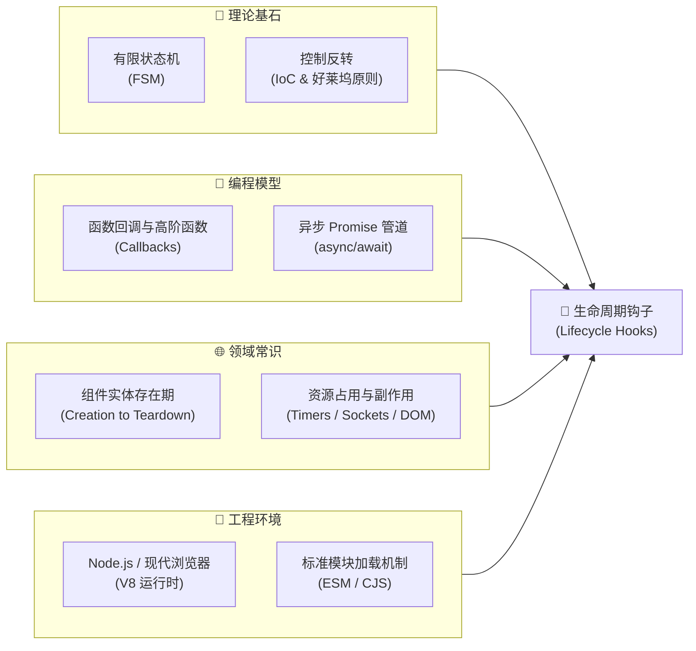
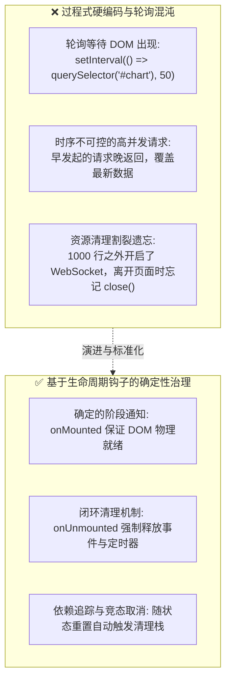
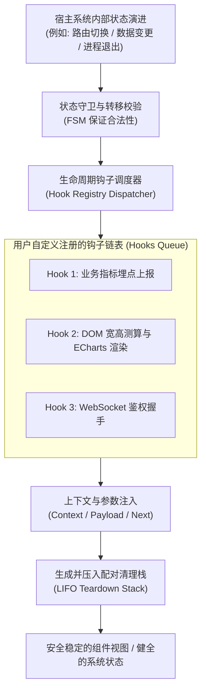
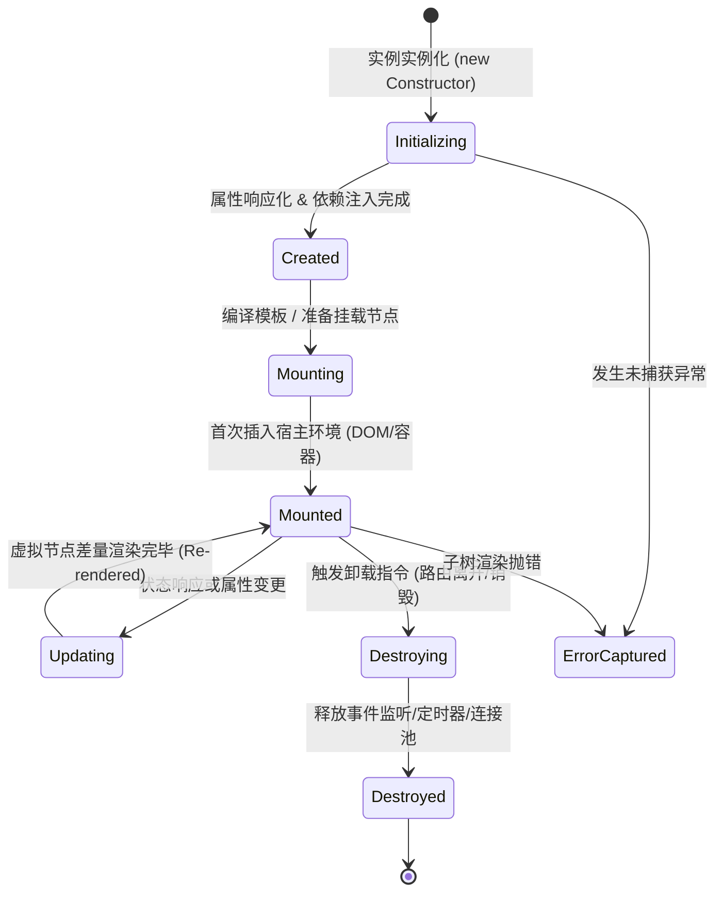
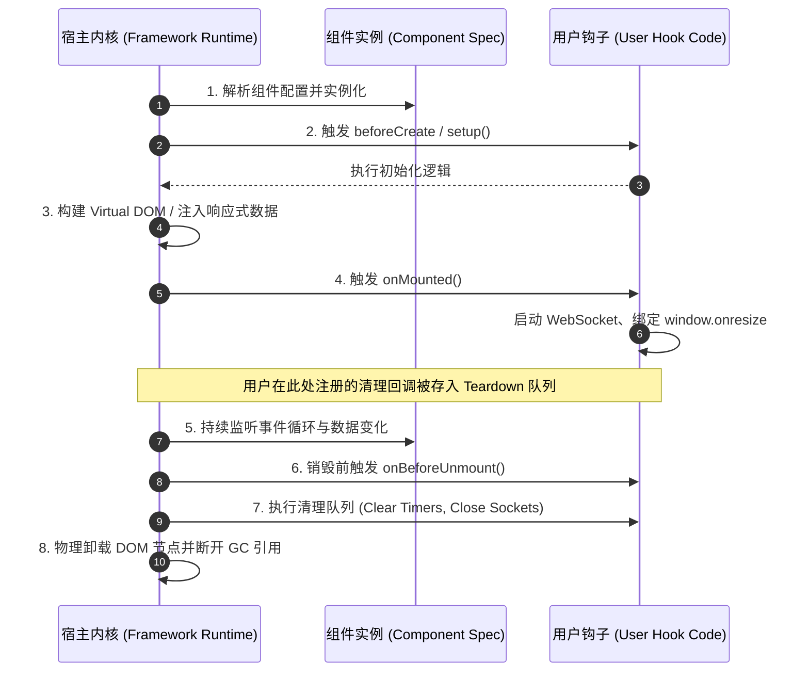
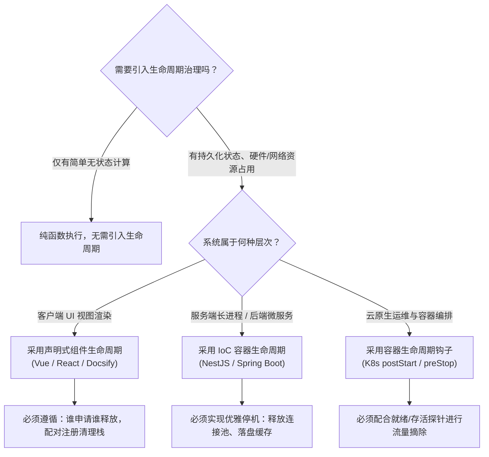
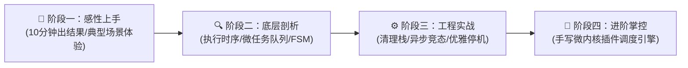

# 生命周期钩子（Lifecycle Hooks）核心机制深度解析与系统化学习路径

> **“软件工程中最昂贵的 Bug，往往不是逻辑写错了，而是在错误的时间做了看似正确的事。”**  
> 在现代软件系统（从浏览器组件、单页应用路由，到后端微服务框架、Kubernetes 容器编排）中，一个对象或服务从诞生、初始化、响应变化，直至最终被销毁，都处于一条不可逆的时空演进流中。**生命周期钩子（Lifecycle Hooks）**，正是宿主系统在这些关键时间节点对外开放的精准控制插槽。

---

## 📋 第一维：前置知识多维解构与极简自测（Prerequisite Matrix）

为了让任何层次的开发者都能平滑建立清晰的认知基座，本指南将学习生命周期钩子所需的全部前置要素拆解为四个象限：



### 1. 前置依赖标准矩阵

| 模块类别 | 必备核心知识点 | 掌握程度与自测标准（如何知道自己已达标？） | 零基础推荐前置补课资料 |
| :--- | :--- | :--- | :--- |
| **数学/理论基础** | 有限状态机（FSM）、控制反转（IoC）与好莱坞原则 | 能准确画出一个三状态机（如：待机 $\to$ 运行 $\to$ 停止）并解释为什么状态转移必须单向受控。 | 《图解设计模式：模板方法与观察者》、《自动机与离散数学基础》 |
| **编程/数据结构** | 函数作为一等公民、Callback 回调列表、Promise 异步链路与闭包 | 能手写一个支持注册多个回调并依次通过 `Promise.all` 顺序执行的数组调度函数。 | MDN 官方文档《JavaScript 回调与 Promise 异步执行模型》 |
| **领域上下文** | DOM 挂载时机、组件树渲染、长连接或定时器的生命期管理 | 能说明为什么“在组件尚未插入 DOM 树前读取其宽高”一定会抛出异常或返回 0。 | 前端架构设计原理、《深入浅出 Vue.js / React 核心思想》 |
| **环境与工具** | 现代浏览器控制台或 Node.js 18+ 终端运行环境 | 能够打开终端输入 `node -v` 并在 5 秒内执行任意 `.js` 脚本。 | Node.js 官方新手指南（Getting Started） |

> [!TIP]
> **一分钟极简自测**：如果你理解“函数可以作为参数存入数组，并在特定事件发生时被依次调用”，并且本地已安装了 Node.js（或拥有现代浏览器控制台），你就可以毫无门槛地通读本指南并跑通全部实战代码！

---

## 💡 第二维：痛点溯源与思维认知锚定（The "Why" & Mental Model）

### 1. 传统过程式代码在什么边界下崩溃？（The Breaking Point）

在生命周期钩子机制普及之前，或者在初学者编写的面条式代码中，管理“时序相关的副作用”通常面临三大无法逾越的物理瓶颈：



- **痛点一：暴力轮询与脆弱的延时（Timing Guessing）**  
  在传统代码中，如果逻辑依赖外部资源（如父容器渲染、SDK 脚本加载、DOM 节点计算），开发者往往写出 `setTimeout(initChart, 300)` 或 `setInterval` 轮询。这种方案不仅浪费 CPU，而且在低端设备或弱网环境下必定因为竞态条件（Race Condition）而彻底崩溃。
- **痛点二：关注点错位与上帝函数（Monolithic Entanglement）**  
  主业务流程充斥着大量无关的初始化与清理逻辑。比如一个图表组件的核心业务是“根据数据画线”，但它的主函数里却塞满了“监听窗口 resize、等待主题配置下发、页面切换前手动销毁 canvas”等杂质。
- **痛点三：生产级头号杀手——隐蔽的内存泄漏（Resource Leakage）**  
  没有生命周期规范的系统，对象的创建容易追踪，但对象的死亡过程却常常处于“无法律监管”状态。未注销的全局 EventListener、未清空的 `setInterval`、未挂起的 RxJS Subject，在页面单页应用（SPA）长时间运行后，会导致内存占用指数级飙升直至浏览器标签卡死崩溃。

### 2. 核心灵魂比喻：航空起降检查清单与人生的阶段仪式（The Cognitive Anchor）

> **一句话灵魂比喻**：  
> **“生命周期钩子就像民航客机飞行手册上的阶段检查清单（Checklist）与人生关键仪式——飞行员不需要重新发明飞机的喷气引擎控制系统，只需在滑行、起飞前、巡航、进近与着陆滑跑等确定阶段执行特定的核验与切换动作。”**

- **滑行阶段（Created）**：飞机通电自检、载入飞行计划，但轮子尚未离地（对应组件数据已初始化，但未接触真实 DOM）。
- **起飞离地（Mounted）**：机轮收起、开启自动驾驶（对应组件已正式插入 DOM 树，可以安全测量视口宽高或挂载 ECharts）。
- **气流颠簸与航线微调（Updated）**：根据气象雷达动态调整航向（对应 Props 或响应式数据变化，触发差量重绘）。
- **降落滑行与断电离机（Unmounted / Teardown）**：关闭引擎、释放气压、旅客下机（对应清空定时器、关闭长连接、解除全局事件监听）。

### 3. 输入-处理-输出黑盒拆解（Input-Process-Output Flowchart）

宿主环境（调度引擎）与用户注册的生命周期钩子之间的协作模型如下：



---

## 🧠 第三维：底层核心原理与关键机制图解（Underlying Mechanics）

### 1. 有限状态机模型（Finite State Machine, FSM）

生命周期钩子的数学本质是一个**具有严格单向转移约束的有限状态机**。任何一个实体在其生命历程中，不能越级跳转，更不能发生逻辑逆流：



> **状态转移原则**：
> 1. **单向不可逆性**：一个已经进入 `Destroyed` 状态的实例，不能“复活”直接回到 `Mounted`，必须重新经历 `Initializing` 流程分配新的内存与上下文。
> 2. **执行守卫保证**：在 `Mounted` 之前访问底层物理资源（如宿主 DOM、系统文件句柄）必定返回未定义；在 `Destroyed` 之后触发的任何异步回调，必须被拦截或自动失效（防止“僵尸回调”操作已释放的内存）。

### 2. 控制反转（IoC）与模板方法设计模式（Template Method Pattern）

生命周期钩子体现了经典的面向对象设计模式——**模板方法模式（Template Method Pattern）**以及体系架构级别的**好莱坞原则（"Don't call us, we'll call you"）**。

在传统面向库编程（Library）中，由你的业务代码主动调用库的 API；而在现代框架（Framework）中，掌控主循环运行权的是框架本身，框架在运行骨架中硬编码了生命周期的调度时序：



### 3. 钩子调度执行模型：同步、瀑布流与异步流水线

生命周期钩子并非仅是简单的数组遍历，根据设计目标的不同，主要分为以下三种执行模型：

1. **同步通知型（Sync Notification）**：宿主仅负责通知，不等待钩子返回，钩子内部必须是纯同步操作（如 Vue 3 的 `onMounted` 虽然允许在函数内写 `async`，但框架不会 `await` 它的 Promise，后续渲染不会等待异步操作结束）。
2. **异步瀑布流水线（Async Waterfall Pipeline）**：前一个钩子的返回值作为后一个钩子的输入，宿主严格按 `await` 顺序等待。典型代表是 Docsify 的 `beforeEach(content, next)` 插件系统或 Webpack 编译钩子。
3. **熔断阻断型（Bail / Interceptor）**：钩子具有决定宿主主流程走向的能力。例如路由前置守卫 `beforeRouteEnter` 或容器的 `preStop` 钩子，如果钩子返回 `false` 或抛出异常，宿主主流程将立即中止或执行回滚。

### 4. 生产全景对比矩阵（Ecosystem Comparison Matrix）

生命周期钩子不是前端独有的专利，它是所有复杂分层系统中的通用工程模式。以下是跨生态的横向对比：

| 框架 / 系统 | 诞生 / 初始化阶段 | 就绪 / 挂载阶段 | 状态更新阶段 | 销毁 / 清理阶段 | 错误捕获阶段 |
| :--- | :--- | :--- | :--- | :--- | :--- |
| **Vue 3** | `setup()` | `onMounted` | `onBeforeUpdate`<br>`onUpdated` | `onBeforeUnmount`<br>`onUnmounted` | `onErrorCaptured` |
| **React Hooks** | 函数体本身首次执行 | `useEffect(() => {}, [])`<br>`useLayoutEffect` | `useEffect(() => {}, [deps])` | `useEffect` 返回的<br>清理函数 `return () => {}` | Error Boundary (`componentDidCatch`) |
| **Docsify (本站)** | `hook.init(fn)` | `hook.mounted(fn)`<br>`hook.ready(fn)` | `hook.beforeEach`<br>`hook.afterEach` | SPA 虚拟路由切换时的卸载清理 | 运行时控制台报警捕获 |
| **NestJS / Spring** | `onModuleInit`<br>`@PostConstruct` | `onApplicationBootstrap` | 依赖重新注入 / 刷新作用域 | `onModuleDestroy`<br>`@PreDestroy` | Exception Filter / `@ExceptionHandler` |
| **Kubernetes Pod** | 镜像拉取与 Init Containers | `postStart` 探针 | 滚动升级与配置重载 | `preStop` 钩子<br>(SIGTERM $\to$ 超时 SIGKILL) | Pod CrashLoopBackOff |



---

## 🚀 第四维：由浅入深四阶段系统化学习路线（4-Stage Progressive Journey）

掌握生命周期钩子绝不能停留在死记硬背 API 名称，必须按照从感性体验到架构设计的阶梯步步为营：



### 阶段一：感性上手与典型场景体验（Quickstart & Intuition）
- **核心目标**：10 分钟内在熟悉的框架中写出第一个生命周期钩子，建立“在对的时间做对的事”的直观反馈。
- **关键行动**：
  - 在 Vue/React 组件中分别体验“在未挂载时获取 `document.getElementById` 返回 `null`”与“在 `mounted` 后顺利拿到元素”的区别。
  - 在 Docsify 中利用 `hook.beforeEach` 在每篇文章顶部自动附加一段动态版权声明。
- **阶段验收标准**：能够脱稿解释为什么网络数据请求通常放在 `onMounted` / `useEffect` 而不是类构造器中。

### 阶段二：核心机制与时序深剖（Deep Dive & Internal Timing）
- **核心目标**：透彻理解浏览器的渲染管道（Parse $\to$ Layout $\to$ Paint）与事件循环微任务、宏任务在生命周期各个钩子间的穿插时序。
- **关键行动**：
  - 探究 React 中 `useEffect`（异步宏任务/微任务交替、不阻断屏幕绘制）与 `useLayoutEffect`（在浏览器 Paint 之前同步触发、可避免闪烁但阻断主线程）的本质差别。
  - 绘制父子组件嵌套时的生命周期级联时序：理解为什么**“先创建父后创建子，但先挂载子后挂载父”**的洋葱模型规律。
- **阶段验收标准**：在纸上能精准推演两层嵌套组件挂载与卸载时 8 个生命周期钩子的实际打印顺序。

### 阶段三：生产工程实战与避坑指南（Production & Anti-Patterns）
- **核心目标**：具备排查和彻底避免生产环境内存泄漏、异步竞态与无限循环死锁的实战能力。
- **关键避坑清单**：
  1. **防范异步竞态（Race Condition）**：用户快速点击切换 Tab 时，前一次 Tab 请求由于网络慢在后一次之后返回，造成数据显示串门。必须在生命周期更新或卸载时使用 `AbortController` 优雅取消旧请求。
  2. **严格配对清理（The Teardown Invariant）**：凡是调用了 `addEventListener`、`setInterval`、`new WebSocket`、`new ResizeObserver` 的地方，必须强制在同一个闭包的销毁钩子中显式反向注销。
  3. **避免在更新钩子中触发无保护的状态变更**：在 `onUpdated` 中直接修改响应式状态且没有终止条件判断，会引发 CPU 100% 的无限递归重绘。
- **阶段验收标准**：使用 Chrome DevTools Memory 面板进行 Heap Snapshot 堆快照对比，证明反复切换组件 20 次后内存无残留（Detached DOM Tree 归零）。

### 阶段四：进阶掌控与自研内核（Advanced Mastery & Engine Internals）
- **核心目标**：脱离任何外部三方框架，具备从零手写微内核插件系统、高可靠状态机与分布式优雅停机治理的架构掌控力。
- **关键行动**：
  - 为团队内部的通用 SDK、脚手架或复杂表单设计轻量级生命周期系统（支持 `beforeValidate`, `afterValidate`, `beforeSubmit`, `cleanup`）。
  - 在后端 Node.js 进程中捕获 `SIGTERM` 与 `SIGINT` 信号，编写支持超时熔断的优雅停机队列。
- **阶段验收标准**：能独立设计并实现一套支持同步与异步、支持生命周期守卫和自动清理栈的微型生命周期管理器。

---

## 🛠️ 第五维：最小自闭环可执行实战（Minimal Runnable Verification）

本实战无需安装任何第三方 npm 依赖，仅使用 Node.js 原生 ES 标准语法。我们通过手写一个完整的微型**“生命周期引擎（LifecycleManager）”**，完整复刻状态机迁移、前置/后置钩子执行、上下文传递与自动逆向清理栈机制。

### 1. 完整可执行代码（`lifecycle-demo.js`）

在本地创建文件并运行：

```javascript
/**
 * 极简生命周期调度引擎 (Minimal Lifecycle Engine)
 * 具备: 1. 单向有限状态机 (FSM) 2. 异步流水线调度 3. 自动配对清理栈
 */

class LifecycleManager {
  constructor(name) {
    this.name = name;
    // 1. 定义合法的状态演进序列
    this.validTransitions = {
      'idle': ['created'],
      'created': ['mounted'],
      'mounted': ['updated', 'destroyed'],
      'updated': ['updated', 'destroyed'],
      'destroyed': []
    };
    this.currentState = 'idle';
    this.hooks = new Map(); // 存储各个生命周期的回调队列
    this.cleanupStack = []; // 逆向清理栈 (LIFO)
  }

  // 注册生命周期钩子
  hook(stage, callback) {
    if (!this.hooks.has(stage)) {
      this.hooks.set(stage, []);
    }
    this.hooks.get(stage).push(callback);
    return this; // 支持链式调用
  }

  // 注册清理副作用函数
  onCleanup(teardownFn) {
    this.cleanupStack.push(teardownFn);
  }

  // 驱动状态机流转并触发对应阶段的钩子流水线
  async transitionTo(nextState, context = {}) {
    const allowed = this.validTransitions[this.currentState] || [];
    if (!allowed.includes(nextState)) {
      throw new Error(
        `[FSM 守卫拦截] 非法状态流转: 无法从 "${this.currentState}" 直接跃迁至 "${nextState}"!`
      );
    }

    console.log(`\n⏳ [${this.name}] 状态转移中: ${this.currentState} ===> ${nextState}`);
    this.currentState = nextState;

    // 触发当前状态绑定的全部钩子 (支持异步流水线)
    const callbacks = this.hooks.get(nextState) || [];
    for (const fn of callbacks) {
      await fn(context, this);
    }

    // 若状态演进到销毁状态，自动触发逆向清理栈
    if (nextState === 'destroyed') {
      console.log(`🧹 [${this.name}] 触发全量资源清理栈 (共 ${this.cleanupStack.length} 个任务)...`);
      while (this.cleanupStack.length > 0) {
        const cleanup = this.cleanupStack.pop();
        try {
          await cleanup();
        } catch (err) {
          console.error(`清理任务抛错:`, err);
        }
      }
      console.log(`✨ [${this.name}] 资源安全释放完毕，实例生命周期终结。`);
    }
  }
}

// ==========================================
// 模拟真实业务组件：具备定时器与网络长连接
// ==========================================
async function runVerification() {
  console.log('🚀 开始验证生命周期钩子机制与清理闭环...');
  
  const component = new LifecycleManager('WeatherCardComponent');

  // 注册 1: 创建阶段钩子
  component.hook('created', async (ctx, mgr) => {
    console.log('  📌 [Hook: created] 初始化内存数据与配置:', ctx.city);
  });

  // 注册 2: 挂载阶段钩子 (模拟定时拉取天气 & 自动登记清理)
  component.hook('mounted', async (ctx, mgr) => {
    console.log('  📌 [Hook: mounted] DOM 节点就绪，开启模拟气象轮询与 WebSocket 监听...');
    
    // 模拟启动一个长效定时器
    const timerId = setInterval(() => {
      console.log(`    🛰️ [Background Polling] 定时刷新城市 [${ctx.city}] 气温...`);
    }, 500);

    // 关键核心：在挂载期登记清理机制（谁申请，谁注册释放）
    mgr.onCleanup(() => {
      console.log('    🛑 [Cleanup Action] 成功停止后台轮询定时器 (Timer Cleared)');
      clearInterval(timerId);
    });

    mgr.onCleanup(() => {
      console.log('    🛑 [Cleanup Action] 成功断开长连接 WebSocket (Socket Closed)');
    });
  });

  // 注册 3: 更新阶段钩子
  component.hook('updated', async (ctx) => {
    console.log('  📌 [Hook: updated] 监测到属性变更，重绘视图组件:', ctx);
  });

  // 注册 4: 销毁阶段钩子
  component.hook('destroyed', async () => {
    console.log('  📌 [Hook: destroyed] 离开当前路由页面，准备清理底层宿主容器。');
  });

  // ------------------------------------------
  // 按照生命周期时序正式执行演进
  // ------------------------------------------
  await component.transitionTo('created', { city: 'Shanghai' });
  await component.transitionTo('mounted', { city: 'Shanghai' });

  // 模拟运行 1200ms，触发 2 次后台定时任务
  await new Promise(resolve => setTimeout(resolve, 1200));

  // 模拟状态属性发生变化
  await component.transitionTo('updated', { city: 'Shanghai', temperature: 24 });

  // 模拟非法状态跃迁（尝试逆流跃迁回到 created，验证 FSM 状态守卫）
  try {
    await component.transitionTo('created');
  } catch (err) {
    console.log(`  🛡️ [预期防御命中]: ${err.message}`);
  }

  // 离开页面，触发销毁与清理流水线
  await component.transitionTo('destroyed');
}

runVerification();
```

### 2. 运行方法与预期输出

在终端中执行：
```bash
node lifecycle-demo.js
```

**预期终端打印日志**：
```text
🚀 开始验证生命周期钩子机制与清理闭环...

⏳ [WeatherCardComponent] 状态转移中: idle ===> created
  📌 [Hook: created] 初始化内存数据与配置: Shanghai

⏳ [WeatherCardComponent] 状态转移中: created ===> mounted
  📌 [Hook: mounted] DOM 节点就绪，开启模拟气象轮询与 WebSocket 监听...
    🛰️ [Background Polling] 定时刷新城市 [Shanghai] 气温...
    🛰️ [Background Polling] 定时刷新城市 [Shanghai] 气温...

⏳ [WeatherCardComponent] 状态转移中: mounted ===> updated
  📌 [Hook: updated] 监测到属性变更，重绘视图组件: { city: 'Shanghai', temperature: 24 }
  🛡️ [预期防御命中]: [FSM 守卫拦截] 非法状态流转: 无法从 "updated" 直接跃迁至 "created"!

⏳ [WeatherCardComponent] 状态转移中: updated ===> destroyed
  📌 [Hook: destroyed] 离开当前路由页面，准备清理底层宿主容器。
🧹 [WeatherCardComponent] 触发全量资源清理栈 (共 2 个任务)...
    🛑 [Cleanup Action] 成功断开长连接 WebSocket (Socket Closed)
    🛑 [Cleanup Action] 成功停止后台轮询定时器 (Timer Cleared)
✨ [WeatherCardComponent] 资源安全释放完毕，实例生命周期终结。
```

> [!NOTE]
> 注意观察清理栈的执行顺序：后注册的 WebSocket 清理任务先执行，先注册的定时器任务后执行（严格的 LIFO 栈顺序）。这种逆向释放顺序能够有效防止“底层依赖已被销毁但上层应用仍尝试访问”的经典 NullPointer 或悬垂指针异常。

---

## 🧭 总结与全景心法（Summary & Mental Checklist）

生命周期钩子不仅是一种 API 设计规范，更是一种**将时间维度结构化与契约化的系统工程思想**。在今后的架构设计或日常开发中，请牢记以下三条铁律心法：

1. **时机严谨性（Right Time, Right Thing）**：绝不靠 `setTimeout` 盲猜时机，把对宿主资源的访问牢牢限定在 `Mounted` 与 `Unmounted` 之间的安全窗口。
2. **闭环对称性（Symmetric Cleanup）**：编写任何挂载或初始化逻辑时，第一反应必须是“它的反向销毁逻辑写在哪里”。没有清理保障的代码，在生产环境中就是定时炸弹。
3. **状态幂等性（Idempotent Transitions）**：生命周期流转必须单向受控，利用有限状态机拦截一切非法的逆序调用与重复销毁。
