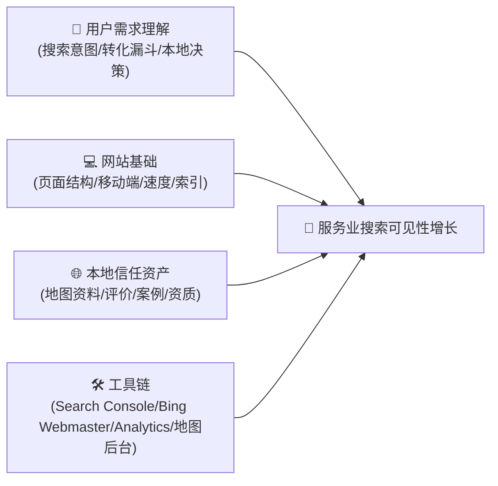
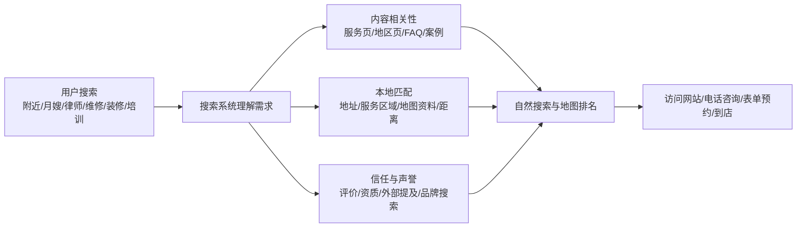
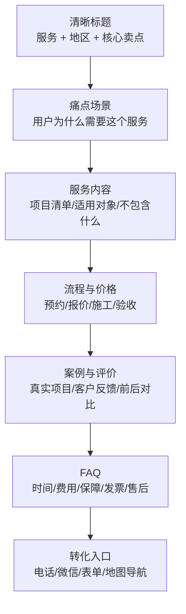
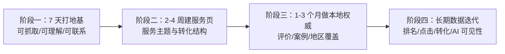

# 服务业本地 SEO 与 AI 搜索可见性增长指南：从搜索排名到用户触达

> **“服务业网站不是电子传单，而是搜索引擎眼里的数字门店、接待员、销售顾问和口碑档案。”**  
> 在搜索引擎、地图、本地生活平台与 AI 摘要共同重塑流量入口的时代，服务业公司想触达更多用户，不能再只靠“堆关键词”或“发几篇泛泛而谈的软文”。真正有效的策略，是让搜索系统确信：你是真实、专业、可信、离用户近，并且能解决一个明确的本地服务需求。

本指南严格遵循 **`new_know`** 认知解构规范，面向本地生活、教育培训、家政保洁、装修维修、法律咨询、医疗美容、企业服务等服务业公司，系统拆解现代 SEO 与 AI 搜索可见性的增长方法：

1. **[📋 学习本指南所需的前置知识准备清单（Prerequisites）](#-学习本指南所需的前置知识准备prerequisites)**
2. **[🧠 搜索排名的底层机制与本地服务增长逻辑](#一-为什么传统-seo-在服务业增长里越来越不够用)**
3. **[🚀 由浅入深的四阶段执行路线与最小验证闭环](#五-服务业搜索可见性四阶段增长路线)**

---

## 📋 学习本指南所需的前置知识准备（Prerequisites）

在开始为服务业公司做 SEO 与搜索可见性增长之前，建议先具备以下基础认知。如果某一块暂时不熟，也可以边做边补。



| 模块类别 | 必备核心知识点 | 掌握程度与自测标准 | 零基础推荐前置补课资料 |
| :--- | :--- | :--- | :--- |
| **理论与增长基础** | 搜索意图、转化漏斗、本地排名、品牌信任 | 能区分“保洁公司价格”“附近保洁”“办公室深度清洁方案”分别属于价格比较、即时本地需求和方案型决策 | [Google SEO Starter Guide](https://developers.google.com/search/docs/fundamentals/seo-starter-guide) |
| **网站与内容基础** | 页面标题、H1、URL、内链、移动端、页面速度、可抓取性 | 能检查一个服务页是否有唯一 H1、清晰 title、可点击电话按钮、可被搜索引擎抓取 | [Google Search Central](https://developers.google.com/search) |
| **本地服务上下文** | 服务半径、服务项目、客户评价、案例、资质、售后保障 | 能用 3 句话讲清楚客户为什么应该选择这家公司，而不是隔壁竞争对手 | [Google Business Profile 本地排名说明](https://support.google.com/business/answer/7091?hl=en) |
| **环境与工具链** | Google Search Console、Bing Webmaster Tools、地图商家后台、Analytics | 能提交 sitemap，并查看哪些查询词带来曝光、点击与电话咨询 | [Bing Webmaster Tools](https://www.bing.com/webmasters) |

> [!TIP]
> **一分钟极简自测**：如果你知道“客户会用哪些词搜索你的服务”，并且你能编辑网站页面标题、正文内容和地图商家资料，你就已经具备启动服务业 SEO 增长的最低门槛。

---

## 一、为什么传统 SEO 在服务业增长里越来越不够用？

过去很多网站做 SEO，靠的是三件事：堆关键词、批量发低质文章、购买或交换外链。这个阶段的搜索优化更像是在“讨好机器”。但当搜索引擎越来越强调用户体验、真实专业度、本地匹配和内容可信度之后，这套方法的边际收益迅速下降。

尤其是服务业，用户搜索时通常不是为了“学习一个概念”，而是带着非常明确的现实任务：

1. 我附近有没有靠谱的公司？
2. 价格大概是多少？
3. 能不能今天/本周上门？
4. 有没有真实案例和客户评价？
5. 这家公司是否有资质、售后和明确流程？
6. 我能不能马上打电话、加微信、提交表单或导航到店？

Google 官方对 SEO 的定义并不神秘：帮助搜索引擎理解你的内容，也帮助用户找到你并判断是否访问你的网站。对于本地搜索，Google 还明确说明本地结果主要受 **相关性（Relevance）**、**距离（Distance）** 与 **知名度/声誉（Prominence）** 影响；评价数量与评分、外部链接和品牌提及都会参与“知名度”的判断。

因此，服务业 SEO 的核心不是“写更多文章”，而是构建一个完整的数字信任系统：



一句话认知锚点：

> **现代服务业 SEO = 网站内容相关性 + 本地实体可信度 + 客户口碑证据 + 可转化的页面体验。**

---

## 二、核心机制：搜索引擎、地图与 AI 摘要到底在判断什么？

### 1. 相关性：你是否真的提供这个服务？

相关性不是在页面上重复 50 次“上海保洁公司”，而是让机器和用户同时看懂以下信息：

- 你提供哪些具体服务：家庭保洁、办公室保洁、开荒保洁、地毯清洗、玻璃清洁。
- 你服务哪些人群：家庭用户、写字楼、商铺、学校、连锁门店。
- 你解决什么问题：搬家后深度清洁、装修粉尘、长期托管、节假日突击保洁。
- 你在哪些地区服务：城市、行政区、商圈、服务半径。
- 你如何收费与交付：价格区间、影响价格因素、预约流程、验收标准。

对于服务业网站，最常见的错误是“一个首页承载所有服务”。这会导致搜索引擎无法判断每个服务的主题深度，也让用户无法快速做决策。

更稳的结构是：

| 页面类型 | 作用 | 示例 |
| :--- | :--- | :--- |
| 首页 | 说明品牌、核心服务、服务城市、信任背书 | `上海 XX 保洁服务公司` |
| 服务页 | 每个核心服务一个页面，承接高意图关键词 | `办公室保洁服务`、`开荒保洁服务` |
| 地区页 | 覆盖真实服务区域，承接本地长尾词 | `徐汇区办公室保洁`、`浦东开荒保洁` |
| 案例页 | 用真实项目证明服务能力 | `某写字楼夜间深度清洁案例` |
| FAQ/知识页 | 回答客户决策前的问题 | `开荒保洁包括哪些项目？` |

### 2. 距离：你是否靠近用户或能服务用户所在区域？

距离是本地搜索天然的硬约束。用户搜索“附近牙科诊所”“附近家电维修”“附近托育中心”时，搜索引擎必须考虑地理位置。

这意味着服务业公司必须认真维护以下资产：

- Google Business Profile、Bing Places、百度地图、高德地图、Apple Business Connect 等商家资料。
- 公司名称、地址、电话（NAP）在不同平台保持一致。
- 明确服务区域，而不是模糊写“全国服务”。
- 添加真实门店、团队、服务过程和案例照片。
- 正确设置营业时间、节假日时间、服务类别和预约链接。

如果一个公司在线下真实存在，但线上地图资料混乱、电话不一致、地址过期、图片陈旧，搜索系统会自然降低对它的信任。

### 3. 知名度与声誉：别人是否也认为你可信？

搜索引擎无法亲自体验一次保洁、咨询或维修服务，所以它会寻找外部信号：

- 客户评价数量与评分。
- 评价内容是否提到具体服务与地区。
- 本地媒体、行业协会、合作伙伴是否提及你。
- 是否有高质量目录网站、行业平台、社交账号与官网互相印证。
- 用户是否直接搜索你的品牌名。
- 网站是否呈现真实资质、团队、案例、合同与售后政策。

对服务业来说，评价不是“锦上添花”，而是本地 SEO 和转化率的核心燃料。

### 4. AI 搜索：你的内容是否足够清晰到能被答案系统引用？

2026 年之后，越来越多用户不只看传统蓝色链接，还会阅读搜索引擎的 AI 摘要、AI Mode、智能问答和浏览器内置答案。Google 已经发布面向生成式 AI 搜索功能的官方优化指南，核心仍然是：内容要高质量、可抓取、结构清晰、对用户有帮助，而不是为 AI 写特殊暗号。

适合 AI 摘要引用的服务业内容通常具备这些特征：

- 直接回答问题，例如“开荒保洁一般多少钱？”。
- 分步骤说明流程，例如“预约、勘察、报价、施工、验收”。
- 有明确条件判断，例如“如果面积超过 200 平米，建议先预约现场评估”。
- 有 FAQ、表格、清单、案例和可验证事实。
- 品牌、地址、服务范围、联系方式稳定一致。

---

## 三、服务业 SEO 的增长资产矩阵

| 增长板块 | 核心动作 | 为什么影响排名与转化 |
| :--- | :--- | :--- |
| 关键词与搜索意图 | 按“服务 + 地区 + 痛点 + 价格 + 场景”建立词库 | 覆盖客户从发现问题到准备下单的完整搜索路径 |
| 服务页体系 | 每个核心服务单独建页，标题、H1、正文、案例围绕同一主题 | 帮助搜索引擎明确页面主题，也帮助用户快速判断是否匹配 |
| 本地商家资料 | 完善地图资料、营业时间、服务区域、照片、预约入口 | 承接“附近”“本地”“到店/上门”类高转化搜索 |
| 评价与口碑 | 建立服务后邀评 SOP，持续回复评价 | 提升本地知名度和用户信任，增强点击与转化 |
| 案例内容 | 发布真实服务过程、前后对比、客户问题与解决方案 | 证明经验与专业度，减少用户决策焦虑 |
| 技术 SEO | sitemap、robots、结构化数据、速度、移动端体验 | 确保页面能被抓取、索引并良好展示 |
| 外部权威 | 本地媒体、行业平台、合作伙伴、商会、目录网站提及 | 让搜索系统从第三方信号确认品牌真实性 |
| AI 搜索适配 | FAQ、表格、步骤、摘要、结构化信息 | 更容易被 AI 摘要和问答系统理解与引用 |

---

## 四、页面结构：一个能排名也能成交的服务页应该长什么样？

一个服务页不要只写“我们专业、诚信、价格优惠”。这些词几乎没有信息量。更好的服务页应该按用户决策顺序组织：



### 服务页标题模板

```text
{城市}{服务项目}公司｜{核心卖点1}、{核心卖点2}、{服务保障}｜{品牌名}
```

示例：

```text
上海办公室保洁公司｜夜间清洁、地毯清洗、长期托管服务｜XX保洁
```

### 服务页正文最小结构

1. **首屏说明**：你是谁，提供什么服务，服务哪些区域，用户能怎么联系你。
2. **适用场景**：哪些客户最需要这个服务。
3. **服务内容清单**：明确包含什么，不包含什么。
4. **服务流程**：预约、沟通、报价、执行、验收、售后。
5. **价格区间与影响因素**：面积、时间、难度、材料、距离。
6. **真实案例**：客户背景、问题、解决方案、结果。
7. **客户评价**：最好包含具体服务关键词和地区。
8. **FAQ**：回答客户最可能犹豫的问题。
9. **行动入口**：电话、微信、表单、地图导航。

---

## 五、服务业搜索可见性四阶段增长路线



### 阶段一：7 天内打好搜索地基

核心目标：让搜索引擎知道你是谁、做什么、服务哪里，并且能顺利抓取你的网站。

推荐行动：

1. 配置 Google Search Console、Bing Webmaster Tools、百度搜索资源平台。
2. 提交 `sitemap.xml`。
3. 检查首页 `title`、`description`、H1 是否清晰。
4. 完善 Google Business Profile、Bing Places、百度地图、高德地图等商家资料。
5. 确保移动端电话按钮、表单、地图导航可用。
6. 修复打不开、加载慢、404、重复标题、无索引等基础问题。

阶段验收标准：

```text
site:你的域名
```

能搜到核心页面；Search Console 能看到索引状态；地图商家资料能正常展示电话、营业时间和服务区域。

### 阶段二：2-4 周建立服务页体系

核心目标：让每个核心服务都有独立页面承接高意图搜索。

推荐行动：

1. 列出 5-10 个最重要的服务项目。
2. 每个服务建立一个独立页面。
3. 每页围绕一个主关键词和 5-10 个长尾问题展开。
4. 加入价格区间、服务流程、案例、FAQ 和 CTA。
5. 从首页、导航、底部和相关文章给服务页做内链。

示例词库：

| 主服务 | 地区词 | 痛点词 | 决策词 |
| :--- | :--- | :--- | :--- |
| 办公室保洁 | 上海、徐汇、浦东 | 地毯脏、玻璃高空、夜间清洁 | 多少钱、哪家好、长期托管 |
| 家电维修 | 附近、上门、本地 | 空调不制冷、洗衣机漏水 | 价格、电话、当天上门 |
| 留学咨询 | 日本、美国、英国 | 申请材料、语言成绩、选校 | 中介费用、成功案例、规划方案 |

### 阶段三：1-3 个月建立本地权威

核心目标：从“有页面”升级为“在本地服务领域可信”。

推荐行动：

1. 每周发布 1-2 篇客户真实问题导向内容。
2. 建立评价 SOP：服务完成后 24 小时内邀请客户评价。
3. 发布真实案例：问题、过程、结果、客户反馈。
4. 与本地合作方、行业平台、商会、媒体建立真实提及。
5. 检查各平台 NAP 信息是否一致。
6. 为重点服务区域创建高质量地区页，避免复制粘贴换地名。

高质量地区页必须包含真实差异，例如：

- 该区域服务范围与到达时间。
- 该区域真实案例。
- 该区域客户类型。
- 该区域常见需求差异。
- 对应顾问、门店或服务团队信息。

### 阶段四：持续优化排名、点击与转化

核心目标：用数据迭代，而不是凭感觉改网站。

每月重点看 6 个指标：

| 指标 | 看什么 | 下一步动作 |
| :--- | :--- | :--- |
| 曝光量 | 哪些关键词开始出现 | 为 5-20 名关键词补充内容深度 |
| 点击率 | 曝光高但点击低的页面 | 优化 title 和 description |
| 平均排名 | 哪些页面卡在第二页 | 增加案例、FAQ、内链和外部提及 |
| 转化率 | 哪些页面带来电话/表单 | 强化首屏 CTA、价格和信任背书 |
| 地图互动 | 电话、路线、访问量变化 | 更新照片、服务、帖子和评价回复 |
| 品牌搜索 | 是否有人搜索品牌名 | 增强线下口碑与跨平台曝光 |

---

## 六、最小自闭环可执行实战

以下是一个不依赖复杂工具的 10 步闭环。只要完整做完，就能让一个服务业网站从“几乎不可见”进入“可抓取、可理解、可转化”的状态。

```text
1. 列出 10 个核心服务
2. 列出 10 个核心服务区域
3. 组合出 50 个高意图关键词
4. 为每个核心服务建立独立页面
5. 每个页面写清楚价格、流程、案例、FAQ
6. 完善 Google/Bing/百度/高德/Apple 等商家资料
7. 添加 LocalBusiness 或 Service 结构化数据
8. 提交 sitemap
9. 每周新增 1 篇客户真实问题导向文章
10. 每月根据 Search Console 优化曝光高但点击低的页面
```

### 结构化数据示例

如果你的网站允许编辑页面代码，可以在服务页加入类似下面的 JSON-LD。实际使用时需要替换为真实公司名称、地址、电话、服务区域与 URL。

```html
<script type="application/ld+json">
{
  "@context": "https://schema.org",
  "@type": "LocalBusiness",
  "name": "XX 办公室保洁服务",
  "url": "https://example.com/office-cleaning",
  "telephone": "+86-21-0000-0000",
  "address": {
    "@type": "PostalAddress",
    "addressLocality": "上海市",
    "addressCountry": "CN"
  },
  "areaServed": ["徐汇区", "浦东新区", "黄浦区"],
  "makesOffer": {
    "@type": "Offer",
    "itemOffered": {
      "@type": "Service",
      "name": "办公室保洁与地毯清洗服务"
    }
  }
}
</script>
```

### 一页检查清单

发布每个服务页前，逐项确认：

- [ ] title 是否包含城市、服务项目和核心卖点？
- [ ] H1 是否唯一且与页面主题一致？
- [ ] 首屏是否能看懂服务对象、服务区域和联系方式？
- [ ] 是否说明价格区间或影响价格的因素？
- [ ] 是否有真实案例或客户评价？
- [ ] 是否有 FAQ？
- [ ] 是否有电话、微信、表单或地图导航入口？
- [ ] 是否从首页或相关页面获得内链？
- [ ] 是否已提交到 sitemap？
- [ ] 是否能在移动端顺畅阅读和点击？

---

## 七、常见误区与纠偏

### 误区一：只追求排名，不关心转化

排名只是中间指标。服务业真正要的是电话、表单、到店、预约和成交。如果一个页面排名上去了，但用户看完仍然不知道价格、流程、保障和联系方式，这个页面就没有完成商业任务。

### 误区二：批量生成地区页

“上海保洁”“徐汇保洁”“浦东保洁”如果只是换了地名，其他内容完全相同，这类页面很容易被判断为低质量内容。地区页必须有真实信息差。

### 误区三：评价只求数量

评价内容比单纯数量更重要。好的评价会自然提到服务项目、区域、具体体验和结果，例如“徐汇办公室地毯清洗很及时，晚上施工不影响上班”。这比“很好，推荐”更有搜索与转化价值。

### 误区四：把 AI 搜索当成新玄学

AI 搜索不是另一套完全独立的魔法。它仍然依赖可抓取内容、清晰结构、权威来源和用户价值。所谓 AEO/GEO，本质上仍然离不开扎实的内容工程、实体可信度和结构化表达。

---

## 八、总结：服务业搜索增长的优先级

对服务业公司来说，SEO 与 AI 搜索可见性的优先级应该是：

1. **先做本地搜索**：地图资料、评价、地址电话一致性、服务区域。
2. **再做服务页**：每个服务一页，每页都能解决客户决策问题。
3. **再做内容**：围绕客户真实问题，而不是泛泛写行业科普。
4. **再做权威**：案例、评价、资质、合作方、媒体提及。
5. **最后做 AI 搜索适配**：清晰问答、结构化信息、可信来源、品牌一致性。

最终判断标准非常简单：

> **如果一个陌生客户看完你的页面，还需要打电话问“你们到底做什么、多少钱、靠不靠谱、能不能到我这里”，这个页面就还没有完成 SEO 的第一使命。**

真正好的服务业 SEO，不是把搜索引擎骗进来，而是把客户最关心的问题提前回答清楚，让搜索引擎愿意展示你，也让真实用户愿意选择你。
