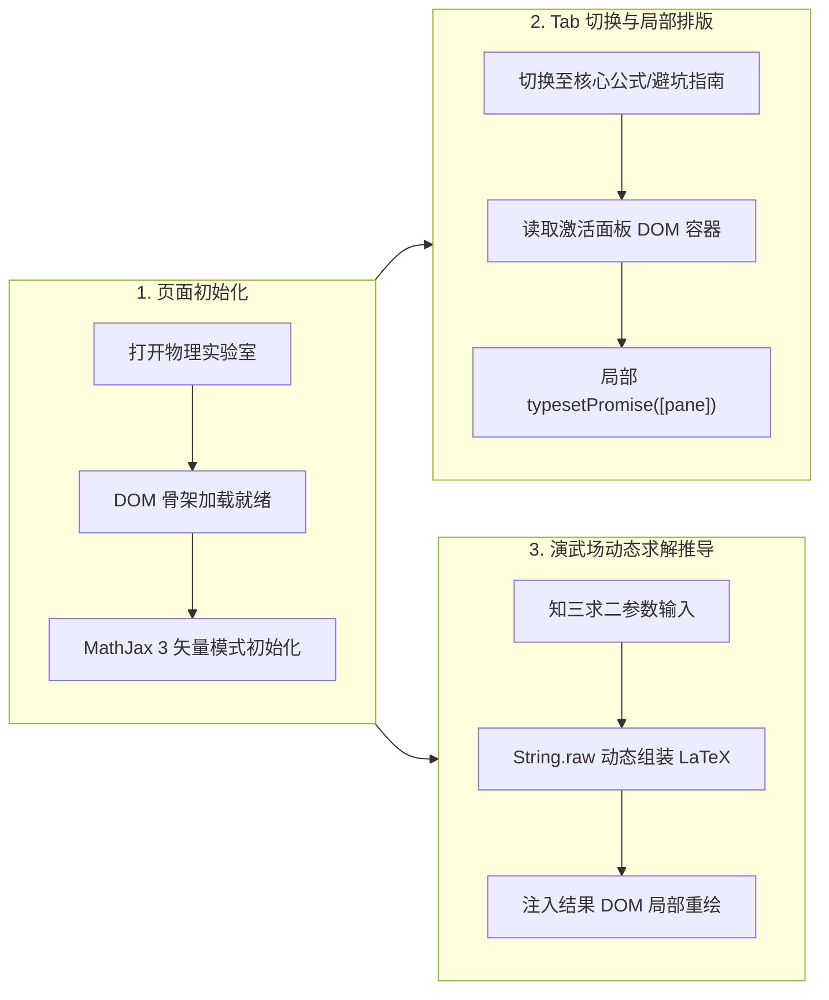

# Web 现代数学公式渲染避坑全指南：从 LaTeX 源码到像素级呈现

> 当你在现代 Web 应用、交互式教育课件、题库系统或技术博客中排版复杂的数学公式时，大概率遇到过这些离奇现象：满屏生硬未解析的 `$$...$$` 源码、切换 Tab 后公式缩成一团或彻底空白、行内公式与正文基线歪斜上下跳动、移动端长公式把整个网页撑裂横向滚动……  
> 本文将从底层排版引擎原理出发，深度复盘 Web 数学公式渲染的技术全景，并提供经过实战验证的系统化避坑指南。

---

## 1. 为什么 Web 公式排版如此艰难？

在印刷出版界，Donald Knuth（高德纳）早在 1978 年就发明了 **$\TeX$** 系统，其排版算法精细入微（包括盒子与粘连模型、换行动态规划算法、光学字体缩放等）。

然而，万维网（Web）的基础——**HTML 与 CSS**，诞生之初完全是为超文本段落、表格与常规媒体流设计的：

1. **MathML 的漫长难产**：虽然 W3C 很早就制定了 MathML 规范，但各家浏览器内核实现割裂长达数十年（Chrome 甚至曾一度将 MathML 原生支持彻底移除，直到 Chromium 109 才重新接纳 MathML Core）。即使在今天，原生 MathML 在不同操作系统和字体环境下的排版一致性仍然难以满足高精度需求。
2. **符号与基线对齐（Baseline）**：数学公式中有大量的分式 $\frac{a}{b}$、根号 $\sqrt{x}$、上下标 $x_i^2$、积分与求和符号 $\sum_{i=1}^n$。它们的垂直对齐中心往往与普通拉丁字母的文字基线存在几何偏移，稍有不慎就会导致整行文字行高崩塌、上下抖动。
3. **现代 SPA 与动态 DOM 的冲突**：前端框架（Vue, React, Docsify 等）大行其道，页面内容往往在生命周期中被动态挂载、异步加载或通过 `display: none` 进行选项卡切换。而传统的数学渲染库习惯于在页面 `DOMContentLoaded` 时执行一次全量扫描，二者的时序矛盾是多数“公式失踪” Bug 的罪魁祸首。

---

## 2. 选型对决：KaTeX vs MathJax 3 深度解构

在目前 Web 前端领域，事实上的两大工业级解决方案是 **KaTeX** 与 **MathJax 3**。二者在设计哲学上有着鲜明的分水岭：

| 维度 | KaTeX (Khan Academy) | MathJax 3 (NumFOCUS) |
| :--- | :--- | :--- |
| **设计首要目标** | **极致性能与首屏渲染速度** | **学术级标准与 100% 语法完整度** |
| **渲染机制** | 同步纯 HTML + CSS 字体拼接 | 异步 AST 解析 + 矢量 SVG / CommonHTML |
| **渲染耗时** | 极快（通常单式渲染在 1ms 内） | 较快（MathJax 3 相比 v2 重构提速 10-20 倍） |
| **包体积** | 轻量（JS 约 280KB, CSS 约 25KB） | 较重（完整模块包可达 1MB+） |
| **服务端渲染 (SSR)** | 原生支持 `renderToString()`，无 DOM 依赖 | 原生支持 NodeJS 端渲染 |
| **高级语法与宏** | 支持绝大部分常见公式，但缺部分冷门环境 | 几乎完整支持 AMS-LaTeX、mhchem 化学公式、physics 宏包 |
| **响应式异步 API** | 偏静态，需手动重新扫描 DOM | 具备强大的 `MathJax.typesetPromise()` Promise 链 |

### 选型决策准则

- **选择 KaTeX 的场景**：个人博客、轻量文档站、Docsify / VitePress 文档、注重首屏极速加载的静态页面，公式多为常见高中或大学数理内容。
- **选择 MathJax 3 的场景**：包含复杂选项卡（Tabs）、动态答题/公式编辑器、交互式物理/数学实验室（如本站的[匀变速直线运动全景实验室](projects/uniform-linear-motion.html)）、涉及复杂多行联立方程组、化学方程式或需要导出高保真 SVG 矢量的应用。

---

## 3. 五大经典“翻车”深坑与终极解决方案

### 坑一：定界符（Delimiters）陷阱——为什么行内单 `$` 不被渲染？

很多初学者将 LaTeX 公式写为 `$v = v_0 + at$`，页面加载后却发现它原样显示为带有美元符号的文本。

#### 💣 根因分析
在默认配置下，不管是 KaTeX 还是 MathJax，**出于安全性与日常文本兼容性考虑，默认不会开启单 `$` 作为行内定界符**。这是为了防止作者在写类似于“`iPhone 15 售价 $799，降价了 $50`”时，两段文字中间的内容被误识别为 LaTeX 公式导致全局排版崩坏。

#### 🛠️ 终极解法
必须在初始化配置中显式注册行内定界符，并合理配置反斜杠转义：

```javascript
// MathJax 3 现代配置
window.MathJax = {
  tex: {
    // 显式开启行内单 $ 与 \( \)
    inlineMath: [['$', '$'], ['\\(', '\\)']],
    // 块级公式开启 $$ 与 \[ \]
    displayMath: [['$$', '$$'], ['\\[', '\\]']],
    processEscapes: true // 允许 \$ 输出纯文本美元符号
  },
  svg: { fontCache: 'global' }
};
```

如果使用 KaTeX 的自动渲染扩展（Auto-render Extension）：
```javascript
renderMathInElement(document.body, {
  delimiters: [
    { left: '$$', right: '$$', display: true },
    { left: '$', right: '$', display: false },
    { left: '\\(', right: '\\)', display: false },
    { left: '\\[', right: '\\]', display: true }
  ],
  throwOnError: false
});
```

---

### 坑二：隐藏 DOM 与 Tab 切换——看不见的元素没有几何尺寸

在交互式课件或仪表盘中，我们常把公式分布在不同的 Tab 选项卡中。例如：
- Tab 1: 实验小车动画
- Tab 2: 核心公式与推导
- Tab 3: 知三求二演武场

页面初次加载时用户在 Tab 1，但当点击切换到 Tab 2 时，**Tab 2 内的公式要么空白，要么公式中的分式横线和根号缩成一团，排版彻底错乱**。

#### 💣 根因分析
这是排版引擎最底层的机制导致的：未激活的 Tab 通常设置了 `display: none`。  
在 CSS 规范中，**处于 `display: none` 状态的元素，在浏览器渲染树（Render Tree）中不产生几何布局，其 `offsetWidth`、`offsetHeight` 与 `getBoundingClientRect()` 均为 0**。  
当 MathJax 或 KaTeX 尝试在初始阶段排版这些隐藏公式时，无法读取到父级容器的真实像素宽度，无法根据字体字形大小计算分子分母的水平居中位置以及根号横线的伸缩长度，最终只能以 0 尺寸输出或者中断。

#### 🛠️ 终极解法

**方案 A（推荐）：监听 Tab 切换，激活后局部响应式重绘**

利用 MathJax 3 的 Promise 接口，在 Tab 变为可见（`display: block`）后的下一微任务周期，对该 Tab 容器执行单独的精确排版：

```javascript
function switchTab(tabId) {
  // 1. 显示目标 Tab 面板
  document.querySelectorAll('.tab-pane').forEach(el => el.style.display = 'none');
  const targetPane = document.getElementById(tabId);
  targetPane.style.display = 'block';

  // 2. 触发该面板内公式的按需排版
  if (window.MathJax && window.MathJax.typesetPromise) {
    // 传入局部容器，避免全量扫描，性能极致
    MathJax.typesetPromise([targetPane]).catch(err => {
      console.warn('MathJax typesetting failed:', err);
    });
  }
}
```

**方案 B：使用非破坏性隐藏替代 `display: none`**

如果公式数量较少，不想编写切换监听逻辑，可以使用“尺寸可度量”的隐藏样式：
```css
/* 隐藏时保留 DOM 几何尺寸计算能力 */
.tab-pane.hidden {
  position: absolute;
  visibility: hidden;
  pointer-events: none;
  z-index: -999;
}
.tab-pane.active {
  position: static;
  visibility: visible;
  pointer-events: auto;
}
```

---

### 坑三：SPA 单页应用与异步 Markdown 渲染的时序脱节

在 Docsify、VuePress、Nuxt 或 React SPA 应用中，页面在点击左侧导航菜单切换路由时，**URL 哈希（Hash）发生改变，但整页并没有刷新**，新的 Markdown 文件是通过 `fetch` 异步拉取并插入到 `<div id="app">` 中的。

#### 💣 根因分析
公式渲染脚本在首次加载页面时已经执行完毕；当用户切换到另一篇文章时，新注入的 DOM 节点从未经过排版引擎处理，导致公式以生硬的 `$$...$$` 裸文本留在页面上。

#### 🛠️ 终极解法：接入 SPA 框架的生命周期钩子

以 Docsify 为例，必须利用 `hook.doneEach`（每次页面 DOM 渲染完毕后触发的钩子）：

```javascript
window.$docsify = {
  plugins: [
    function(hook, vm) {
      hook.doneEach(function() {
        // 当每次页面异步加载完后，重新排版公式
        if (window.MathJax && window.MathJax.typesetPromise) {
          MathJax.typesetPromise().catch(console.error);
        } else if (window.renderMathInElement) {
          renderMathInElement(document.getElementById('main'));
        }
      });
    }
  ]
};
```

---

### 坑四：JS 模板字符串中的“反斜杠吞噬”黑洞

如果你需要在前端 JavaScript 中动态生成或者拼接公式（例如：“知三求二”计算器动态展示解题过程公式）：

```javascript
// ❌ 错误示范：
const formula = `v = v_0 + a \times t`;
const decay = `x(t) = e^{-\tau t}`;
```

#### 💣 根因分析
在 JavaScript 的字符串字面量中，反斜杠 `\` 是专用的**转义指示符**：
- `\t` 被解释为制表符（Tab 键，ASCII 9）
- `\n` 被解释为换行符（ASCII 10）
- `\f`（如 `\frac`）会被解释为换页符（Form Feed，ASCII 12）

于是，传入公式引擎的字符串变成了 `v = v_0 + a [TAB]imes t`，LaTeX 解析器遇到非法的制表符和未定义命令，立即报错并中断渲染！

#### 🛠️ 终极解法

1. **双反斜杠转义**：
   ```javascript
   const formula = `v = v_0 + a \\times t`;
   const frac = `\\frac{v^2 - v_0^2}{2a}`;
   ```
2. **使用 ES6 `String.raw` 模板标签**（保持原始斜杠，无需手动翻倍）：
   ```javascript
   const formula = String.raw`x = v_0 t + \frac{1}{2} a t^2`;
   ```

---

### 坑五：移动端公式横向溢出与字体抗锯齿

复杂的物理数学公式（如多重求和、矩阵或带推导步骤的分数）在桌面端显示正常，但在宽度只有 375px 的手机屏幕上，常常会把整页的宽度撑出视口，造成严重的横向晃动。

#### 🛠️ 终极解法：响应式滚动容器 + 字体微调

在全局 CSS 中对块级公式容器添加自适应滚动和字体微调：

```css
/* 让块级公式在超出屏幕宽度时拥有平滑的局部横向滚动，而不撑爆外层容器 */
.katex-display, 
.MathJax_Display,
mjx-container[display="true"] {
  max-width: 100% !important;
  overflow-x: auto !important;
  overflow-y: hidden !important;
  padding: 8px 0;
  -webkit-overflow-scrolling: touch;
}

/* 优化行内公式与中英文字符的垂直对齐基线 */
.katex, .MathJax {
  font-size: 1.05em;
  vertical-align: -0.05em;
}
```

---

## 4. 真实工程实战：高中物理全景实验室公式架构演进

在构建本站的[《物理·匀变速直线运动全景实验室》](projects/uniform-linear-motion.html)过程中，我们经历了一套从**纯静态 KaTeX** 到 **MathJax 3 矢量架构**的完整演进：



### 核心收益
1. **彻底消除公式闪烁**：SVG 矢量格式在 Retina 高分屏上放大 400% 依然锐利清晰，没有位图发虚或字体缺失问题。
2. **毫秒级局部重绘**：通过限定 `typesetPromise([container])` 的范围，避免了对整个长页面的无效重绘，动画帧率始终保持在 60 FPS。
3. **零公式源码外露**：无论网速快慢或动态计算多频次，公式始终以平滑优雅的动效渐入。

---

## 5. Web 现代公式排版自检清单（Checklist）

上线前对照以下 7 项清单，可消灭 99% 的排版故障：

- [ ] **定界符检验**：行内 `$formula$` 与块级 `$$formula$$` 是否均已显式配置并测试生效？
- [ ] **隐藏 Tab 检验**：所有非默认展示的 Tab 面板或抽屉组件，在展开后公式是否完好？
- [ ] **JS 字符串转义**：代码中拼接的公式是否使用了双斜杠 `\\` 或 `String.raw`，排查 `\t`, `\n`, `\f` 隐性转义？
- [ ] **移动端横屏与竖屏**：在 360px 宽度视口下测试超长公式，确认是否有局部滚动条且不撑破整体页面？
- [ ] **单页路由跳转**：在 SPA 站内连续切换 3-4 个不同页面，确认后退、前进时公式能否自动重新排版？
- [ ] **错误边界兜底**：是否配置了 `throwOnError: false`，避免由于单个公式书写有误导致整页白屏？
- [ ] **CDN 容灾回退**：公式库脚本是否有国内与海外稳定的 CDN 分发源与容灾备份？

---

## 6. 结语

数学公式的渲染，表面上看只是给网页嵌入几个特殊符号，实则是对**排版几何学、字体排印学、浏览器布局管道（Layout Pipeline）以及现代单页应用生命周期**的综合考验。

掌握了上述原理与避坑方法后，无论面对多么复杂的公式体系，你都能游刃有余地在网页上呈现出媲美科技出版物级别的优雅排版！
