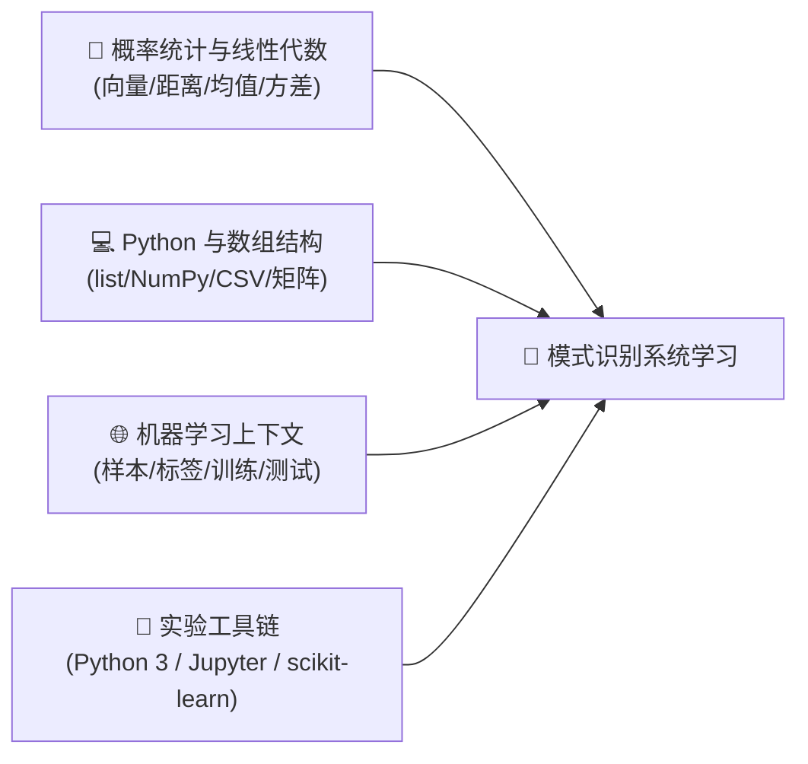
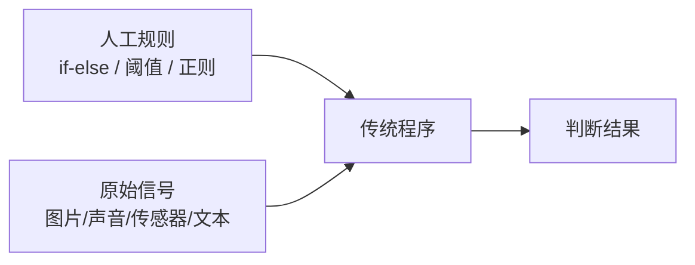
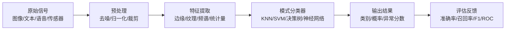
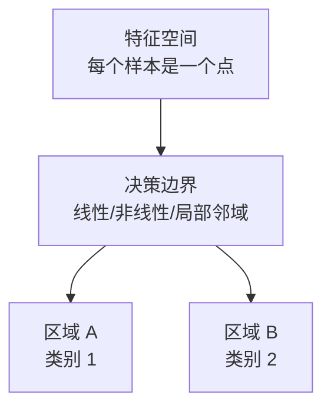
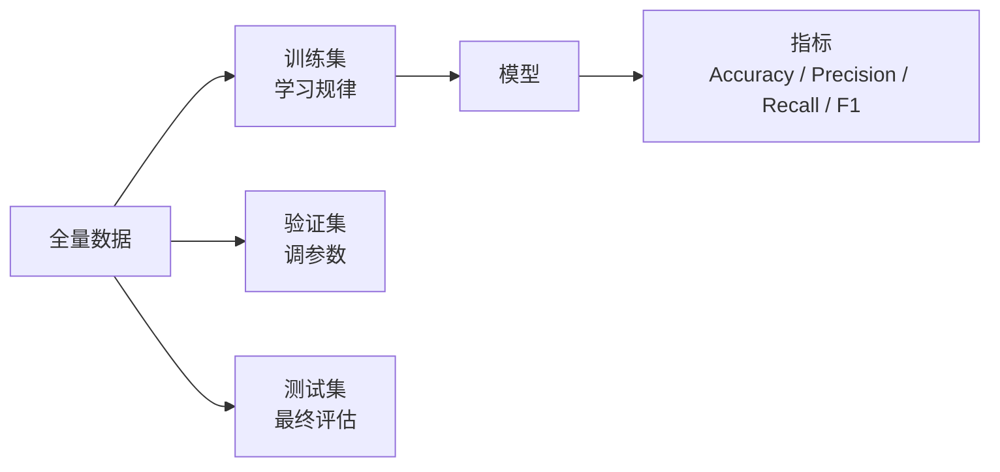
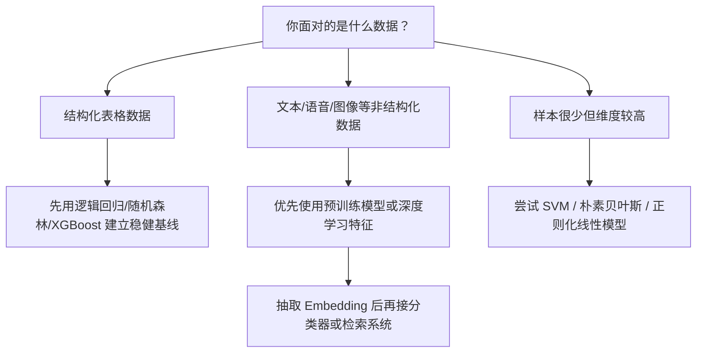

# 模式识别核心概念深度解析与系统化学习路径

> **“模式识别是人工智能的感官系统：它把混乱的现实信号，压缩成机器可以判断、分类与决策的结构化证据。”**
> 在深度学习和大模型成为显学之前，模式识别长期承担着“让机器看懂世界”的基础任务：识别人脸、手写数字、语音片段、医学影像、工业异常、用户行为序列。今天学习模式识别，不是回到过时算法，而是补齐现代机器学习、计算机视觉、推荐系统与 AI 工程的底层骨架。

本指南严格遵循 **`new_know`** 认知解构规范，旨在帮助学习者从“样本、特征、度量、分类器、泛化”五个核心概念出发，建立一套可迁移到现代 AI 系统的模式识别学习路径。全文结构如下：
1. **[📋 学习本指南所需的前置知识准备清单（Prerequisites）](#-学习本指南所需的前置知识准备prerequisites)**
2. **[💡 痛点溯源：为什么机器不能直接理解现实世界？](#一-为什么需要模式识别与解决的核心痛点)**
3. **[🧠 核心机制：模式识别系统的五段式流水线](#二-核心概念与底层机制)**
4. **[🧭 经典算法与现代生态选型](#三-生态全景与横向对比选型)**
5. **[🚀 由浅入深的四阶段系统化学习路线](#四-系统化四阶段学习路线)**
6. **[🛠️ 纯 Python 最小自闭环实战](#五-最小自闭环可运行上手实战hello-world)**

---

## 📋 学习本指南所需的前置知识准备（Prerequisites）

在深入学习模式识别之前，建议你已经具备以下基础认知。如果某些知识点存在盲区，可按推荐资料快速补齐：



| 模块类别 | 必备核心知识点 | 掌握程度与自测标准（如何知道自己达标？） | 零基础推荐前置补课资料 |
| :--- | :--- | :--- | :--- |
| **理论与数学基础** | • 向量、点积、欧氏距离、余弦相似度<br/>• 均值、方差、概率分布、贝叶斯公式<br/>• 线性可分、决策边界、过拟合直觉 | 能够手算两个二维点之间的欧氏距离；能解释“均值描述中心，方差描述分散程度”；能用自己的话说明训练集和测试集为什么要分开 | 3Blue1Brown《线性代数的本质》；Khan Academy 概率统计入门；Christopher Bishop《Pattern Recognition and Machine Learning》前两章 |
| **编程与数据结构** | • Python 基础语法、函数、列表推导式<br/>• NumPy 数组、二维矩阵、CSV 数据读取<br/>• 字典计数、简单排序、Top-K 选择 | 能独立写一个 Python 函数，输入一组二维点，返回离目标点最近的前 3 个样本 | 廖雪峰 Python 教程；NumPy 官方 Quickstart；Kaggle Python 入门微课 |
| **领域常识与上下文** | • 样本（Sample）、特征（Feature）、标签（Label）<br/>• 分类、回归、聚类三类任务<br/>• 特征工程与端到端深度学习的区别 | 能举出三个模式识别场景：如手写数字识别、垃圾邮件识别、设备异常检测；能说清“特征不是原始数据本身，而是可用于判断的压缩证据” | 吴恩达 Machine Learning 课程前两周；scikit-learn User Guide 中的 supervised learning 章节 |
| **环境与工具链** | • Python 3.10+、`pip`、虚拟环境<br/>• Jupyter Notebook 或 VSCode<br/>• `numpy`, `scikit-learn`, `matplotlib` | 能在终端运行 `python -c "import numpy; print(numpy.__version__)"` 并正常输出版本号 | Python 官方安装指南；JupyterLab Getting Started；scikit-learn Installing 文档 |

> [!TIP]
> **一分钟极简自测**：如果你知道“一个样本可以被表示成一组特征数字”，并且本地能运行 Python，你就可以毫无门槛地通读本指南的全部内容！

---

## 一、 为什么需要模式识别与解决的核心痛点？

### 1. 传统规则系统在什么边界下崩溃？

人类很擅长在混乱信号中识别模式：看到几笔弯曲线条就知道是数字 8，听到一句含糊语音也能猜出对方在说什么，医生能从影像纹理中判断病灶风险。但传统程序只擅长执行明确规则：



这种方法在两个边界上会迅速崩溃：

- **变化太多**：同一个数字会有无数种写法，同一张人脸会受光照、角度、遮挡、表情影响。
- **规则太脆**：写死阈值也许能处理实验室样本，一旦来到真实世界，就会被噪声、异常值和分布漂移击穿。
- **维度太高**：一张 100 x 100 的灰度图就有 10,000 个像素维度，人类无法手写出覆盖所有组合的规则。

### 2. 一句话灵魂比喻

> **模式识别像一台“证据压缩机”：它不试图记住世界的全部细节，而是把原始信号压缩成足以做判断的特征证据。**

一个优秀的模式识别系统，本质上解决三件事：

1. 从原始数据中抽取稳定特征。
2. 用数学度量比较样本之间的相似与差异。
3. 学出一条尽量能泛化到新样本的决策边界。

### 3. 输入输出黑盒拆解



---

## 二、 核心概念与底层机制

### 1. 样本、特征与标签：模式识别的三块积木

| 概念 | 直观解释 | 例子 |
| :--- | :--- | :--- |
| **样本 Sample** | 一个待识别对象 | 一张手写数字图片、一封邮件、一段设备震动信号 |
| **特征 Feature** | 从样本中提取出的判断证据 | 笔画方向、词频、频谱峰值、均值方差 |
| **标签 Label** | 样本对应的正确答案 | 数字 0~9、垃圾/正常、故障/健康 |
| **模型 Model** | 从特征到标签的函数 | KNN、朴素贝叶斯、SVM、随机森林、神经网络 |

数学上，一个样本通常被表示为特征向量：

$$\mathbf{x} = [x_1, x_2, \dots, x_d]$$

分类模型要学习的是一个映射函数：

$$f(\mathbf{x}) \rightarrow y$$

其中 $\mathbf{x}$ 是输入特征，$y$ 是类别标签。模式识别的核心任务，就是让 $f$ 在没见过的新样本上也能给出可靠判断。

### 2. 特征空间与决策边界

把每个样本看作特征空间中的一个点，分类就是在空间里划分区域：



- **线性分类器**：用一条直线、一个平面或高维超平面划分类别，速度快、解释性强。
- **非线性分类器**：用曲线、树结构、核函数或神经网络拟合复杂边界，表达能力强但更容易过拟合。
- **局部邻域方法**：如 KNN，不显式训练全局边界，而是看“离我最近的邻居们是什么类别”。

### 3. 距离度量：机器判断“像不像”的尺子

模式识别离不开相似度度量。常见距离如下：

| 度量方式 | 公式 | 适用场景 |
| :--- | :--- | :--- |
| **欧氏距离** | $d(\mathbf{x}, \mathbf{z}) = \sqrt{\sum_i (x_i - z_i)^2}$ | 数值特征尺度统一、几何距离有意义的场景 |
| **曼哈顿距离** | $d(\mathbf{x}, \mathbf{z}) = \sum_i |x_i - z_i|$ | 稀疏特征、网格路径、异常值影响要稍弱的场景 |
| **余弦相似度** | $\cos(\theta)=\frac{\mathbf{x}\cdot\mathbf{z}}{\|\mathbf{x}\|\|\mathbf{z}\|}$ | 文本向量、方向比绝对大小更重要的场景 |
| **马氏距离** | $d_M(\mathbf{x})=\sqrt{(\mathbf{x}-\mu)^T S^{-1}(\mathbf{x}-\mu)}$ | 特征之间相关性明显、需要考虑协方差结构的场景 |

> [!NOTE]
> **关键工程直觉**：距离度量不是数学装饰，而是模型的世界观。特征是否归一化、量纲是否一致、异常值是否被处理，都会直接改变模型认为“谁和谁更像”。

### 4. 泛化、过拟合与评估指标

模式识别不是把训练样本背下来，而是学到能迁移到新样本的规律。



常见评估指标：

- **Accuracy 准确率**：总体判断对了多少，适合类别较均衡的场景。
- **Precision 精确率**：模型判为正例的样本中，有多少真的为正。
- **Recall 召回率**：真实正例中，有多少被模型找出来。
- **F1 Score**：精确率与召回率的调和平均，适合类别不均衡任务。
- **ROC-AUC**：评估模型在不同阈值下区分正负样本的能力。

---

## 三、 生态全景与横向对比选型

### 1. 经典算法对比矩阵

| 方案 / 算法 | 核心优势 | 潜在短板 | 适用业务场景 |
| :--- | :--- | :--- | :--- |
| **KNN（K 近邻）** | 原理极直观、无需显式训练、适合教学入门 | 预测阶段慢；高维空间容易失效；依赖距离度量和特征缩放 | 小规模分类、推荐原型、异常样本邻域分析 |
| **朴素贝叶斯** | 训练快、对小数据友好、文本分类表现稳定 | 特征独立性假设较强，复杂非线性表达有限 | 垃圾邮件识别、文本分类、基线模型 |
| **逻辑回归** | 解释性强、输出概率、工业界稳健基线 | 线性边界能力有限，需要特征工程 | 风控评分、转化预测、医学二分类 |
| **SVM** | 小中型数据强大，核函数可处理非线性边界 | 大规模训练成本高，参数调优敏感 | 图像分类早期方案、生物信息、小样本高维分类 |
| **决策树 / 随机森林** | 可解释性较好，能处理非线性与特征交互 | 单棵树容易过拟合；森林模型体积更大 | 表格数据、规则挖掘、业务分类器 |
| **神经网络 / 深度学习** | 可端到端自动学习特征，适合图像语音文本 | 数据与算力需求高，可解释性弱 | 计算机视觉、语音识别、自然语言、多模态识别 |

### 2. 选型决策树



> [!NOTE]
> **选型决策建议**：学习阶段先从 KNN 和逻辑回归建立直觉，工程阶段优先做一个可解释、可评估的基线模型，再决定是否上深度学习。没有强基线的复杂模型，往往只是更昂贵的黑盒。

### 3. 模式识别与现代 AI 的关系

| 现代方向 | 模式识别提供的底层能力 |
| :--- | :--- |
| **计算机视觉** | 图像预处理、特征提取、边缘纹理、分类与检测评估 |
| **语音识别** | 声学特征、频谱分析、序列模式匹配 |
| **推荐系统** | 用户行为模式、相似用户、相似物品、异常行为检测 |
| **大模型应用** | Embedding 相似度、RAG 检索、意图分类、工具路由 |
| **工业智能** | 传感器异常检测、故障诊断、质量缺陷识别 |

---

## 四、 系统化四阶段学习路线


### 阶段一：感性认知与极速上手（Day 1 ~ Day 3）

- **核心目标**：10 分钟内跑通第一个分类器，看到“输入特征 -> 输出类别”的完整闭环。
- **推荐行动清单**：
  1. 用 scikit-learn 跑通 Iris 鸢尾花分类。
  2. 用 KNN 手写一个“最近邻投票”小脚本。
  3. 画出二维散点图，观察不同类别在特征空间中的分布。

### 阶段二：核心机制与原理深剖（Week 1 ~ Week 2）

- **核心目标**：理解模式识别不是“调库魔法”，而是特征、距离、边界、泛化之间的权衡。
- **推荐行动清单**：
  1. 学习欧氏距离、余弦相似度、马氏距离的适用边界。
  2. 对比 KNN、逻辑回归、SVM、决策树在同一数据集上的决策边界。
  3. 掌握混淆矩阵、Precision、Recall、F1，理解类别不均衡为什么会欺骗 Accuracy。

### 阶段三：工程实战与生产避坑（Week 3 ~ Month 1）

- **核心目标**：能够把模式识别用于真实业务数据，并处理噪声、缺失值、异常值和数据漂移。
- **推荐行动清单**：
  1. 建立数据切分规范：训练集、验证集、测试集严格隔离。
  2. 使用标准化、归一化、缺失值填补、异常值裁剪构建特征流水线。
  3. 使用交叉验证和网格搜索调参，记录每次实验的指标与配置。
  4. 建立上线前检查：类别分布、阈值选择、误判样本分析、漂移监控。

### 阶段四：进阶掌控与架构设计（Month 2+）

- **核心目标**：从经典模式识别过渡到现代深度学习与多模态 AI 系统。
- **推荐行动清单**：
  1. 学习 CNN 如何从像素中自动学习边缘、纹理与语义特征。
  2. 学习 Transformer / Embedding 如何把文本、图像、语音映射到统一向量空间。
  3. 研究开放集识别、异常检测、少样本学习、持续学习等真实系统难题。
  4. 设计“特征抽取模型 + 向量检索 + 轻量分类器 + 人工复核”的生产架构。

---

## 五、 最小自闭环可运行上手实战（Hello World）

下面用纯 Python 写一个极简 KNN 分类器，不依赖任何机器学习框架。任务是根据二维特征判断一个水果更像“苹果”还是“香蕉”：

- 特征 1：颜色偏红程度（0~10）
- 特征 2：形状细长度（0~10）

### 步骤 1：保存并运行代码

```bash
python pattern_knn_demo.py
```

```python
from math import sqrt
from collections import Counter


samples = [
    # (颜色偏红, 形状细长, 标签)
    (9.0, 2.0, "苹果"),
    (8.5, 2.5, "苹果"),
    (7.8, 3.0, "苹果"),
    (2.0, 8.5, "香蕉"),
    (2.5, 9.0, "香蕉"),
    (3.0, 7.8, "香蕉"),
]


def distance(a, b):
    return sqrt((a[0] - b[0]) ** 2 + (a[1] - b[1]) ** 2)


def knn_predict(point, k=3):
    ranked = sorted(samples, key=lambda row: distance(point, row))
    neighbors = ranked[:k]
    votes = Counter(label for _, _, label in neighbors)
    return votes.most_common(1)[0][0], neighbors


if __name__ == "__main__":
    unknown = (8.2, 2.8)
    label, neighbors = knn_predict(unknown, k=3)

    print(f"待识别样本: {unknown}")
    print("最近邻样本:")
    for item in neighbors:
        print(f"  特征=({item[0]}, {item[1]}), 标签={item[2]}")
    print(f"预测类别: {label}")
```

### 预期输出与自测检查点

```text
待识别样本: (8.2, 2.8)
最近邻样本:
  特征=(8.5, 2.5), 标签=苹果
  特征=(7.8, 3.0), 标签=苹果
  特征=(9.0, 2.0), 标签=苹果
预测类别: 苹果
```

如果运行失败，优先检查：

- 是否使用了 Python 3。
- 文件名是否保存为 `pattern_knn_demo.py`。
- 代码里中文引号是否被输入法替换成了弯引号。

这个小实验虽然简单，却已经包含了模式识别的完整闭环：样本、特征、距离度量、邻域投票、预测输出。把二维水果特征换成图像边缘、文本词频、传感器频谱，思想仍然成立。

---

## 六、 总结与结语

模式识别的价值，不在于背诵某个单独算法，而在于建立一种稳定的工程思维：

- 现实世界的原始信号必须被清洗、编码和压缩成特征。
- 模型判断依赖距离、概率、边界或神经网络表示。
- 好模型不是训练集上分数最高的模型，而是能在新样本、噪声和分布变化中保持可靠的模型。
- 现代深度学习并没有抛弃模式识别，而是把“人工设计特征”的部分交给神经网络自动学习。

学懂模式识别，相当于补上现代 AI 的底层感知课。它会让你在面对计算机视觉、语音识别、推荐系统、异常检测、RAG 检索和多模态模型时，不再只看到一堆框架 API，而能看见背后的共同结构：**从信号到特征，从特征到模式，从模式到决策。**
