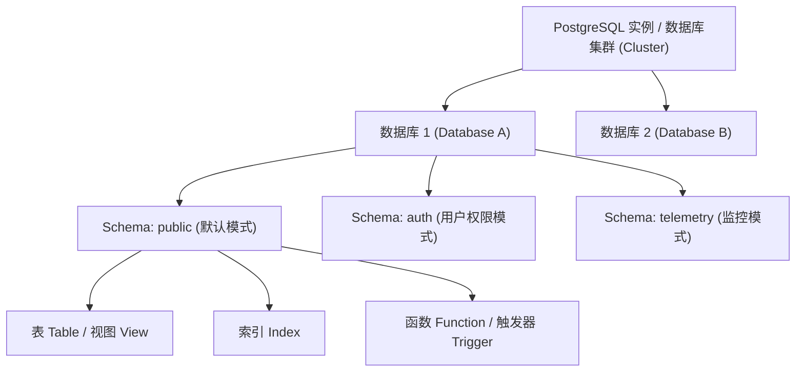
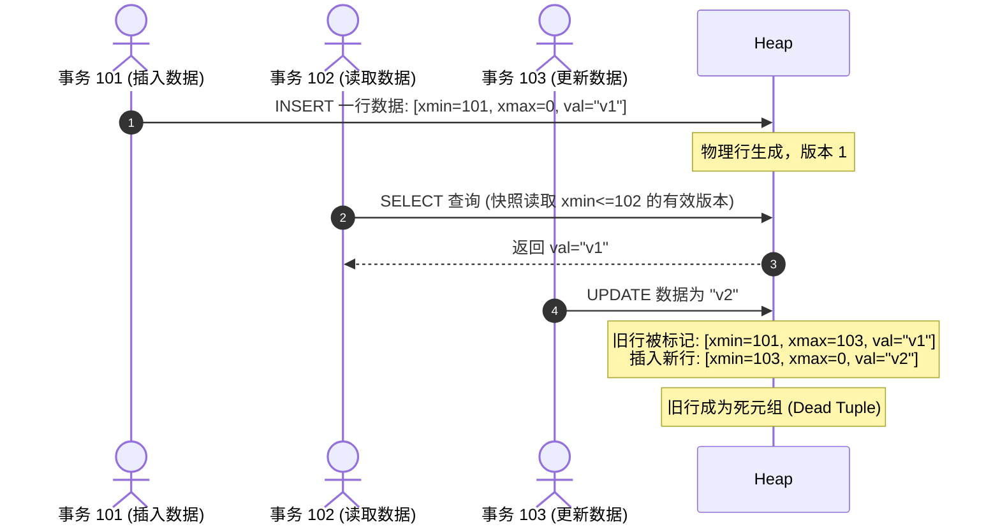
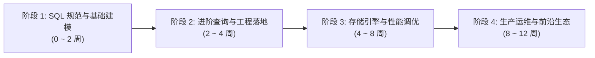

# PostgreSQL 核心概念深度解析与系统化学习路径指南

> **“世界上最先进的开源关系型数据库”**（The World's Most Advanced Open Source Relational Database）。
> 从加州大学伯克利分校图灵奖得主 Michael Stonebraker 主导的 Postgres 研发，到今日支撑全球顶尖科技企业高并发事务、复杂分析与现代 AI 应用（如 `pgvector` 与 Supabase），PostgreSQL 凭借其严谨的 SQL 标准遵从度、卓越的 ACID 事务可靠性以及无与伦比的插件化可扩展性，已成为现代软件工程师和架构师的必修核心技能。

本指南旨在为初学者与进阶开发者建立一套**成体系、有深度、可实操**的 PostgreSQL 认知模型。文章分为两大部分：
1. **核心基础概念与底层架构深度解析**（不仅知其然，更知其所以然）
2. **由浅入深的四阶段系统化学习路线**（从 SQL 语法到存储调优与生产架构）

---

## 一、 为什么在今天首选 PostgreSQL？

在当今技术选型中，MySQL 与 PostgreSQL 常被同时提及。为什么越来越多的初创团队、独角兽以及金融/科研机构将核心底座迁移至 PostgreSQL？

1. **更严谨且纯正的 SQL 标准支持**：对 SQL:2016 标准的完备支持度业界领先，严格遵循类型与约束规范，行为可预测。
2. **混合多模数据模型（Multi-Model）**：原生支持二进制 `JSONB`、多维数组（Arrays）、Key-Value（Hstore）、范围类型（Range Types）、全文检索，一个数据库兼顾关系型与文档型能力。
3. **极强且开放的可扩展生态（Extensions）**：
   - 向量数据库：`pgvector`（支撑现代 LLM RAG 应用的首选）
   - 地理空间信息：`PostGIS`（GIS 领域事实上的工业标准）
   - 时序数据库：`TimescaleDB`
   - 分布式水平横向扩展：`Citus`
4. **纯粹且商业友好的开源协议**：PostgreSQL License（类 MIT/BSD 许可），没有任何商业公司控制或版权“传染”隐患，长盛不衰。

---

## 二、 核心基础概念与底层架构剖析

### 1. 逻辑存储层级架构（Logical Hierarchy）

理解 PostgreSQL 的首要步骤是明晰其多层次逻辑命名空间。很多接触过 MySQL 的开发者经常混淆 Database 与 Schema 的概念。



- **实例 / 集群（Database Cluster）**：运行在单个服务器或容器上的一组后台进程，共享同一个数据目录（`PGDATA`）。一个 Cluster 可以包含多个互相独立的 Database。
- **数据库（Database）**：对象隔离的顶层边界。通常跨数据库无法直接进行 SQL JOIN（除非使用 `dblink` 或 `postgres_fdw` 外部数据包装器）。
- **模式（Schema）**：**数据库内部的逻辑命名空间**（类似于操作系统中的文件夹）。同一数据库内不同 Schema 下可以有同名表，通过 `search_path` 决定解析顺序。
- **对象（Database Objects）**：表（Table）、索引（Index）、视图（View）、序列（Sequence）、函数（Function）等。

---

### 2. 物理存储模型与页结构（Physical Storage & Pages）

PostgreSQL 磁盘存储的核心单元是 **Page（数据块/页面）**，默认大小为 **8 KB**。

- **堆表（Heap Table）**：PostgreSQL 中的普通表以堆文件方式存储，行数据（Tuple）无序插入到有可用空间的 Page 中。
- **Page 内部解剖**：
  - **Page Header（页头）**：记录页面校验和、空闲空间上下界指针（24 字节）。
  - **Line Pointers（行指针/ItemID）**：位于页面开头，由前往后增长，记录每个元组在页面内的偏移量和大小。
  - **Free Space（空闲空间）**：行指针与实际元组之间的空隙。
  - **Tuples（行元组数据）**：从页面底部由后往前追加存储。
- **元组标识符（`ctid`）**：每一行物理存储位置由 `(block_number, tuple_index)` 确定（如 `(0, 1)` 表示第 0 个数据块的第 1 个行指针）。

---

### 3. 多版本并发控制（MVCC）与 VACUUM 机制

PostgreSQL 实现事务隔离与高并发的核心是 **MVCC（Multi-Version Concurrency Control）**，遵循**“读不阻塞写，写不阻塞读”**原则。

#### 核心区别：PostgreSQL vs MySQL InnoDB
- **MySQL (InnoDB)**：原地更新行数据，将旧版本存入回滚段（Undo Log），通过回滚段链表构建历史可见版本。
- **PostgreSQL**：**新旧版本元组全部存储在堆表（Heap）中**。无论是 UPDATE 还是 DELETE，旧行不会立刻被物理覆盖或清除，而是将旧行标记为过期，并在原地或新页插入新行。

#### 元组头部状态字段（Tuple Header）
每一行数据内部都带有隐式字段：
- `xmin`：创建（插入）该元组的事务 ID（Transaction ID, XID）。
- `xmax`：更新或删除该元组的事务 ID（如果元组有效，则通常为 0）。



#### 表膨胀（Table Bloat）与 VACUUM
- **死元组（Dead Tuple）**：当已提交的事务删除了某行，且没有任何活跃事务再需要读取该历史版本时，该行就成了“死元组”。
- **VACUUM 的职责**：
  - 清理死元组占用的空间，将其标记为可用空间（Free Space Map, FSM），供后续 INSERT 复用（普通 VACUUM **不退还磁盘空间给操作系统**）。
  - **VACUUM FULL**：重写整张表以释放物理磁盘空间，但会加严苛的排他锁（ACCESS EXCLUSIVE），生产环境应尽量避免。
  - **AUTOVACUUM（自动清理守护进程）**：生产环境中至关重要的后台引擎，定期根据死元组比例阈值（`autovacuum_vacuum_scale_factor`）自动触发清理，防止表膨胀与事务回绕（Wraparound）。

---

### 4. 预写日志（WAL）与数据持久性（Crash Recovery）

为了在保证 ACID 的“持久性”（Durability）的同时避免频繁随机写磁盘，PostgreSQL 采用了 **ARIES 架构的 WAL（Write-Ahead Logging）**。

1. **基本准则**：任何对数据页的修改（INSERT/UPDATE/DELETE）必须**先将对应的 Redo 日志顺序追加写入 WAL 缓冲区并刷盘（fsync）**，之后才允许将内存中变脏的数据页（Dirty Pages）刷写到磁盘。
2. **Checkpointer（检查点进程）**：定期触发检查点，将内存中的所有脏页全部刷写落盘，并在 WAL 中记录检查点位置。如果数据库意外崩溃断电，重启时只需从最近一次成功的 Checkpoint 开始向后重放 WAL 日志即可快速恢复一致性状态。
3. **高可用底座**：PostgreSQL 的物理流复制（Streaming Replication）与归档备份（PITR，时间点恢复）完全基于 WAL 日志流传输。

---

### 5. 丰富的索引大家族（Beyond B-Tree）

PostgreSQL 不仅具备业界最稳定的 B-Tree 索引，还针对不同维度的数据特征提供了多种原生索引算法：

| 索引类型 | 适用场景 | 核心优势与底层原理 | 典型示例 |
| :--- | :--- | :--- | :--- |
| **B-Tree** | 常规等值与范围查询（默认） | 经典平衡树，支持 `<`, `<=`, `=`, `>=`, `>`, `BETWEEN`, `IN`, `ORDER BY` | 主键、数值、创建时间、外键 |
| **GIN** (通用倒排索引) | 包含复合项的数据：JSONB、数组、全文搜索 | 拆解元素建立倒排字典，支持包含操作符 `@>`, `?`, `?&` | `WHERE tags @> '{"db"}'`，JSONB 字段 |
| **GiST** (通用搜索树) | 空间几何、地理位置、范围区间 | 允许自定义树结构，支持几何重叠 `&&`、包含、距离最近邻（KNN） | PostGIS 地图坐标、时间区间重叠排查 |
| **BRIN** (块范围索引) | 海量时序日志、自然有序只增数据 | 仅记录连续数据块区间的极小值与极大值，索引体积仅为 B-Tree 的 1%~5% | 百亿级日志表按 `created_at` 范围检索 |
| **Hash** | 仅纯等值查找 `=` | O(1) 查找开销（PG 10+ 已全面支持崩溃安全 WAL） | 长字符串 MD5/UUID 纯等值比对 |

---

### 6. 现代核心特性：JSONB 与分析型高级函数

#### JSONB 二进制高效存储
不同于普通的 `JSON`（仅做文本语法校验并保留空格与重复键），`JSONB` 解析为结构化二进制格式，写入时预解析，支持直接创建 GIN 倒排索引：

```sql
-- 创建带 JSONB 字段的表
CREATE TABLE users (
    id SERIAL PRIMARY KEY,
    profile JSONB NOT NULL
);

-- 为 JSONB 全字段建立 GIN 倒排索引
CREATE INDEX idx_users_profile ON users USING GIN (profile);

-- 高效秒级查询：利用 @> 操作符命中 GIN 索引
SELECT * FROM users 
WHERE profile @> '{"role": "admin", "settings": {"theme": "dark"}}';
```

#### 窗口函数（Window Functions）与递归 CTE
窗口函数允许在不聚合（不折叠行记录）的情况下进行分组排名与移动计算：

```sql
-- 典型场景：计算每个部门内薪资最高的前三名员工
SELECT department, employee_name, salary,
       RANK() OVER (PARTITION BY department ORDER BY salary DESC) as rank
FROM employees
QUALIFY rank <= 3;
```

---

## 三、 PostgreSQL 四阶段系统化学习路径

为了避免初学者“面对庞杂概念无从下手”或“停留在简单 CRUD 无法应对高并发运维”，我们规划了一条系统进阶路线图：



### 阶段一：SQL 规范与模式设计建模（0 ~ 2 周）
- **核心目标**：熟练掌握标准 SQL 语法，精通数据类型选择，规范设计模式。
- **重点清单**：
  1. **数据类型选型**：明确 `NUMERIC`（高精度货币）vs `DOUBLE PRECISION`、`TIMESTAMPTZ`（带时区时间，强烈推荐）vs `TIMESTAMP`、`TEXT` vs `VARCHAR(n)`（在 PG 底层性能无区别，首选 `TEXT`）。
  2. **约束设计（Constraints）**：`PRIMARY KEY`、`FOREIGN KEY`、`UNIQUE`、`NOT NULL`、以及强大的自定义布尔表达式约束 `CHECK (price > 0)`。
  3. **Schema 隔离与权限**：规划 `public`、业务 Schema，理解角色的继承机制（Role & Grant）。
- **实操任务**：在本地设计一个支持多租户、包含用户、订单与日志的电商核心表结构。

---

### 阶段二：进阶查询与工程开发最佳实践（2 ~ 4 周）
- **核心目标**：解决实际业务中的复杂数据处理，掌握事务隔离级别与锁机制。
- **重点清单**：
  1. **高级 SQL 技法**：
     - CTE（公用表表达式）与 `WITH RECURSIVE` 树形递归遍历（如多级分类树、组织架构）。
     - 窗口函数：`ROW_NUMBER()`, `LEAD()`, `LAG()`, `DENSE_RANK()`。
     - `UPSERT`（原子插入或更新）：`INSERT INTO ... ON CONFLICT (id) DO UPDATE SET ...`。
  2. **JSONB 实操**：熟练运用 `->`, `->>`, `#>`, `@>`, `jsonb_build_object()`。
  3. **事务与锁机制**：
     - 4 种事务隔离级别（Read Committed, Repeatable Read, Serializable）的差异与脏读/不可重复读/幻读防御。
     - 行级锁（`FOR UPDATE`, `FOR SHARE`, `SKIP LOCKED` 实现高性能分布式任务队列）。
- **实操任务**：基于 `SELECT ... FOR UPDATE SKIP LOCKED` 实现一个可靠的无死锁轻量级数据库消息任务消费队列。

---

### 阶段三：存储引擎、执行计划与性能调优（4 ~ 8 周）
- **核心目标**：具备诊断慢查询、优化查询瓶颈、保障数据库健康运行的能力。
- **重点清单**：
  1. **执行计划阅读器（`EXPLAIN ANALYZE`）**：
     - 掌握 `EXPLAIN (ANALYZE, BUFFERS, COSTS, VERBOSE)`。
     - 识别常见算子：`Seq Scan`（全表扫描）、`Index Scan` vs `Index Only Scan`（覆盖索引扫描）、`Bitmap Index/Heap Scan`、`Nested Loop` vs `Hash Join` vs `Merge Join`。
  2. **索引优化策略**：
     - 复合索引的最左前缀与列顺序考量。
     - **部分索引（Partial Index）**：仅对有效或特定状态的数据建立索引（如 `WHERE is_deleted = false`），大幅降低体积并加速检索。
     - **表达式索引（Expression Index）**：`CREATE INDEX ON users (LOWER(email))`。
  3. **MVCC 运维与 Autovacuum 调优**：
     - 查询表膨胀度，监控 `pg_stat_user_tables` 中的 `n_dead_tup` 与 `n_live_tup`。
     - 针对大写入量表精细化调整表级 autovacuum 参数。
- **实操任务**：对一张千万级数据表制造慢查询场景，使用 `EXPLAIN (ANALYZE, BUFFERS)` 分析并建立合适的部分索引或覆盖索引，使执行耗时从数秒降至毫秒级。

---

### 阶段四：生产架构、高可用集群与前沿生态（8 ~ 12 周）
- **核心目标**：应对企业级生产环境，设计高可用容灾与现代 AI 架构。
- **重点清单**：
  1. **备份与恢复体系**：
     - 逻辑备份：`pg_dump` 与 `pg_restore`。
     - 物理备份与 PITR：`pg_basebackup` 与现代云原生备份工具（`WAL-G`、`pgBackRest`）。
  2. **高可用与负载均衡架构**：
     - 主从物理流复制（Streaming Replication，同步 vs 异步）。
     - 生产级高可用自动化故障转移方案：`Patroni` + `etcd` + `HAProxy`。
     - 数据库连接池（Connection Pooler）：为什么高并发下必须前置 `PgBouncer` 或 `Odyssey`？（PG 的进程模型创建连接较重，需连接池削峰填谷）。
  3. **前沿扩展与 AI 向量集成**：
     - `pgvector`：在 PostgreSQL 内部直接存储高维浮点向量（`vector(1536)`），构建 HNSW / IVFFlat 向量索引，一站式整合业务元数据与语义向量检索。
     - 分布式水平分片：理解 `Citus` 插件如何将单机 PG 转变为横向扩展的分布式数据库集群。

---

## 四、 快速上手实操：Docker 环境与 psql 必备指令

### 1. 5 秒快速启动本地 PostgreSQL 实例

借助 Docker，你可以无需污染本地系统直接启动一个标准的 PostgreSQL 环境：

```bash
docker run -d \
  --name postgres-lab \
  -e POSTGRES_USER=postgres \
  -e POSTGRES_PASSWORD=postgres \
  -e POSTGRES_DB=playground \
  -p 5432:5432 \
  postgres:16-alpine
```

### 2. `psql` 命令行终端高频命令清单

熟练掌握 `psql` 元命令（以反斜杠 `\` 开头）是每一位资深 PG 工程师的标志：

| 命令 | 含义与用法 |
| :--- | :--- |
| `\l` 或 `\l+` | 列出当前实例下所有数据库及编码大小 |
| `\c dbname` | 切换连接至指定数据库 |
| `\dn` | 列出当前数据库中的所有 Schema（模式） |
| `\dt` 或 `\dt+` | 列出当前模式下的所有表及其物理尺寸 |
| `\d tablename` | 详细查看表的列结构、数据类型与约束 |
| `\d+ tablename` | 深入查看表结构、索引信息、触发器与存储参数 |
| `\di` | 列出所有索引 |
| `\x` | 切换扩展显示模式（将行记录转为垂直展示，极大提升宽表字段的可读性） |
| `\timing` | 打开/关闭 SQL 语句执行耗时自动统计 |
| `\?` | 查看所有 psql 客户端元命令帮助 |

---

## 五、 推荐学习资源与经典书目

1. **官方权威文档**：
   - [PostgreSQL Official Documentation](https://www.postgresql.org/docs/)：业界公认编写最详尽、最标准的数据库官方手册。
2. **经典殿堂级著作**：
   - 📘 《The Internals of PostgreSQL》（Hironobu Suzuki）：全网最权威的内核架构与物理存储图解指南。
   - 📘 《PostgreSQL 14 高性能与架构设计》/ 《PostgreSQL 实战》
   - 📘 《Designing Data-Intensive Applications》（数据密集型应用系统设计）：理解数据系统原理与 MVCC/WAL 的必读书目。
3. **交互式演练与调试工具**：
   - 客户端工具：**DBeaver**（免费开源通用）、**DataGrip**（JetBrains出品，语法补全极佳）、**pgAdmin 4**。
   - 在线执行计划可视化：[explain.depesz.com](https://explain.depesz.com/) 或 [explain.dalibo.com](https://explain.dalibo.com/)。

---

## 六、 总结

PostgreSQL 不仅仅是一个满足简单读写的数据仓库，它是一套**经久耐用、设计典雅且具备无限扩展潜力的数据基础设施操作系统**。

从理解清晰的 Schema 逻辑层次开始，洞悉 8KB Page 与 MVCC 堆表更新的运行机理，熟练运用 GIN/BRIN 等多元索引与 JSONB/窗口函数，再到掌舵生产环境的 Autovacuum、WAL 复制与高可用集群，依照本指南的学习路线踏实演练，你将完全具备掌控企业级数据中枢的核心硬实力。
