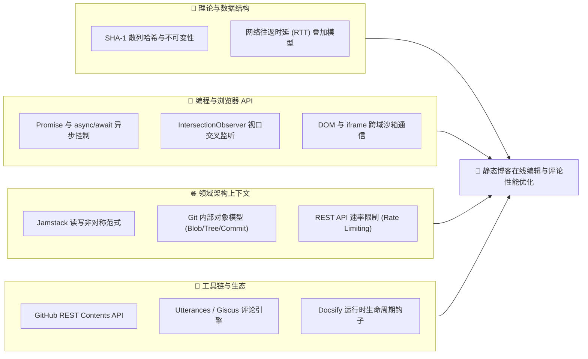
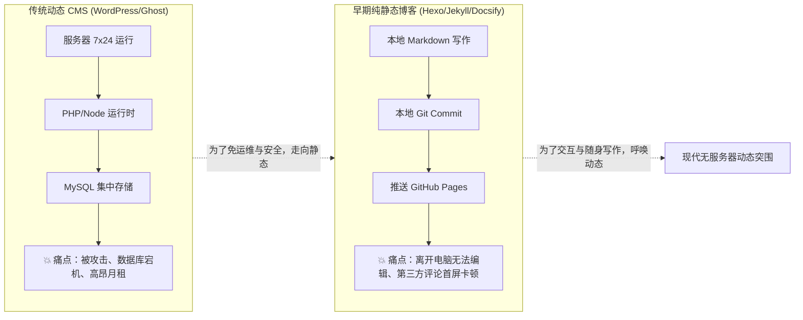
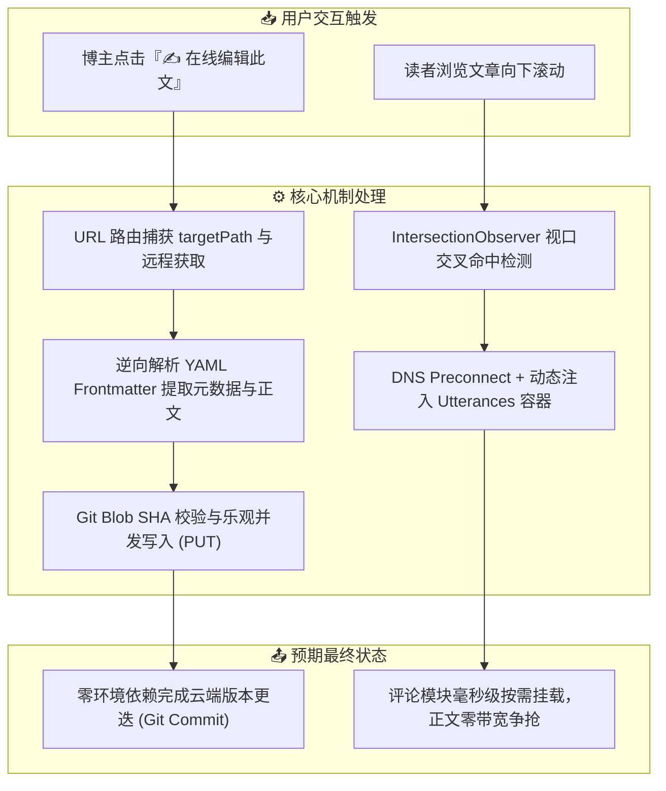
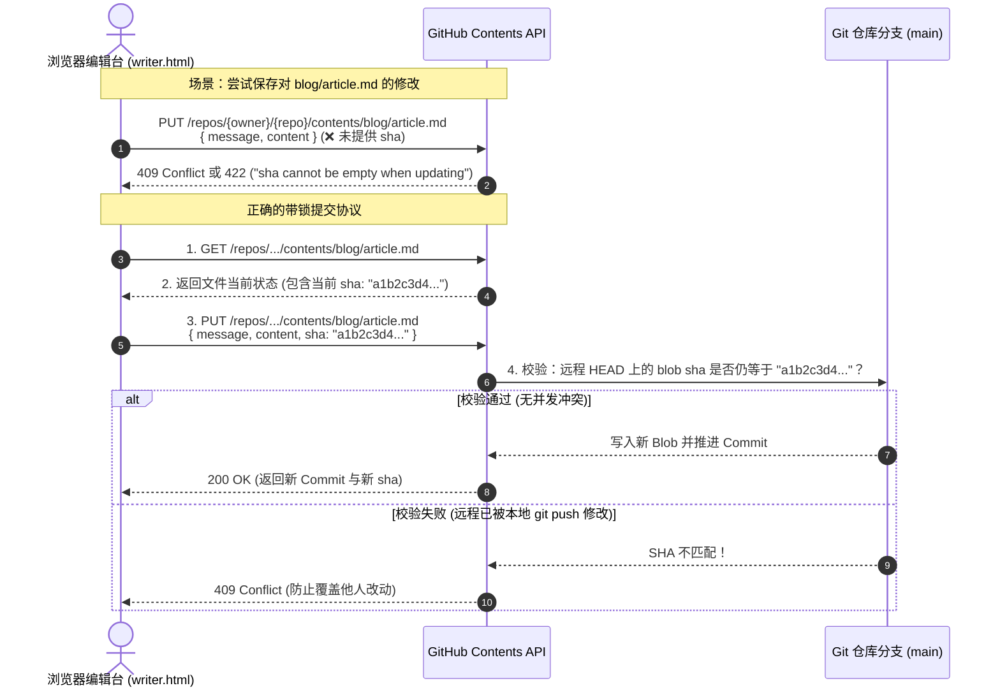
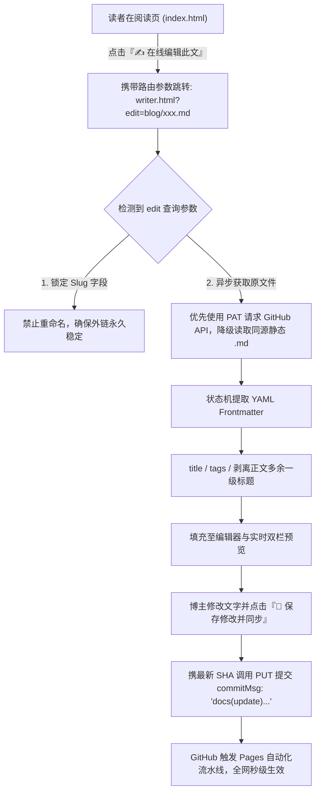
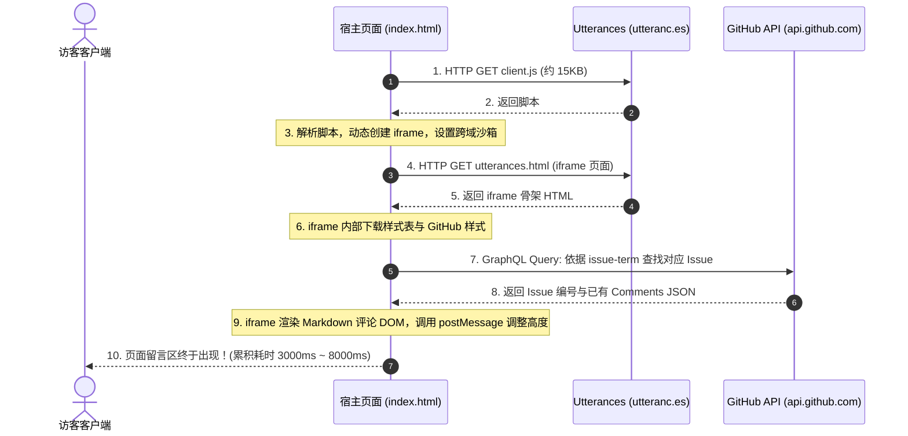
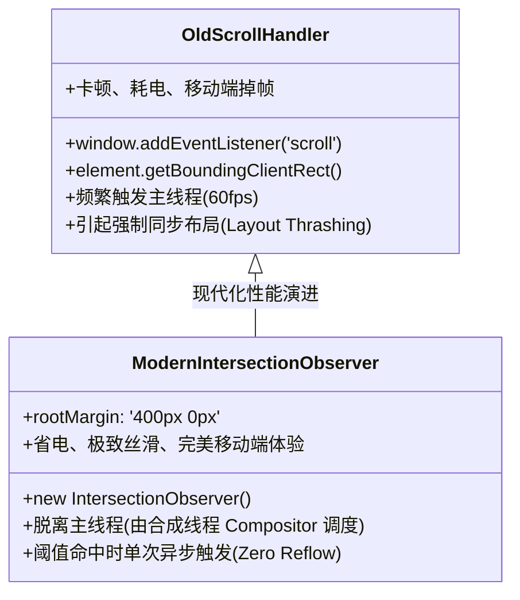
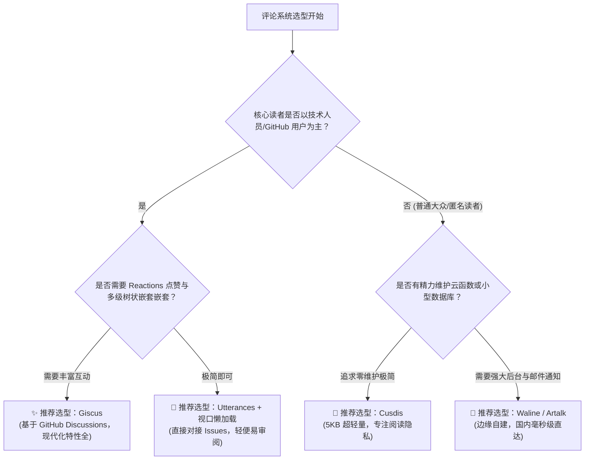
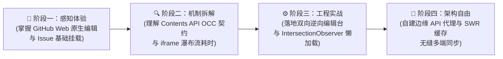

# 无服务器静态博客的动态突围：文章在线可编辑性与页面留言性能优化深度剖析

> **核心哲学**：  
> **“纯静态网站（Jamstack）以彻底抛弃服务器和数据库为代价，换取了极致的安全、零运维与高可用；但现代内容工程的需求天然是动态的——我们需要随手在线修改笔误，需要与读者即时留言互动。破解这一矛盾的秘诀，不在于重回笨重的动态服务器架构，而在于运用密码学乐观锁驱动 Git 成为无头数据库，并借助浏览器视口虚拟化驯服跨国网络瀑布流。”**

---

## 1. 📋 第一维：前置知识多维矩阵与极简自测 (Prerequisites Matrix)

在深入探讨静态博客的动态突围方案前，我们需要清晰理解现代 Web 前端、版本控制底层与跨域通信的基础依赖。

### 1.1 前置知识依赖有向图



---

### 1.2 前置知识评估矩阵

| 模块类别 | 必备核心知识点 | 掌握程度与自测标准（如何确认达标？） | 零基础推荐前置补课资料 |
| :--- | :--- | :--- | :--- |
| **数学与理论基础** | 密码学哈希校验（SHA-1）、网络延迟累加模型 | 理解为什么修改一个字节会导致文件的哈希完全改变；能解释“3 次串行 HTTP 请求为何比 1 次慢 3 倍”。 | 阮一峰《网络基础与密码学简介》 |
| **编程与数据结构** | JavaScript 异步模型、`IntersectionObserver`、Git Blob 结构 | 能够独立写出使用 `IntersectionObserver` 监听元素进入视口的逻辑；理解 Git 中的每个文件其实是一个内容寻址的 Blob。 | MDN《Intersection Observer API 指南》、Pro Git 内部原理章节 |
| **领域上下文常识** | Jamstack、乐观并发控制（OCC）、API 限制 | 能够用自己的话解释“为什么静态网页服务器无法直接处理 POST 请求”以及“什么是通过版本号防止修改丢失”。 | Cloudflare《What is Jamstack?》概念介绍 |
| **环境与工程工具** | GitHub API、Docsify 钩子、iframe 机制 | 熟悉使用 `fetch` 携带 `Authorization: token ...` 调用 GitHub 接口；了解 Docsify 的 `hook.doneEach` 执行时机。 | GitHub REST API 官方文档（Contents Endpoint） |

---

### 1.3 一分钟极简自测门槛

> [!TIP]
> **一分钟极简自测**：  
> 如果你知道“GitHub Pages 只负责分发静态文件、修改必须通过提交 Git Commit 来触发”，并且理解“用户首屏没滚到底部时根本不需要加载底部的评论组件”，你就可以毫无认知障碍地通读本篇指南的全部深度内容！

---

## 2. 💡 第二维：痛点溯源与思维认知锚定 (The "Why" & Mental Model)

### 2.1 传统方案在什么边界下崩溃？

在网站内容管理系统的演进历史中，存在两个截然相反的极端：



1. **传统动态 CMS 的安全与维护成本泥潭**：
   - 过去大家习惯使用 WordPress 或 Typecho。文章保存在 MySQL 表中，随手在后台点击“编辑”就能修改。
   - 但当博客只是博主个人的数字花园时，维护一台云服务器、配置防火墙、防御 SQL 注入与自动化爆破、每年支付高昂的服务器续费，会让内容沉淀变得极度沉重。
2. **纯静态博客的“动态性诅咒”**：
   - 转向 GitHub Pages / Docsify 这一类 Jamstack 方案后，服务器和数据库都被剔除了，网站实现了零成本与近乎 100% 的在线率。
   - 然而，**静态化带来了两项严重的体验倒退**：
     - **“发了就不能改”的死锁**：博主用手机或在外阅读自己的文章时，一旦发现一处错别字或代码漏洞，由于没有后台数据库和本地终端环境，根本无法在线修改，只能干着急。
     - **“页面留言如蜗牛”的漫长等待**：为了弥补没有评论数据库的缺陷，站点普遍接入基于 GitHub Issues 的 Utterances 等嵌入式评论组件。但由于这些组件依赖跨洋调用第三方 CDN、动态创建 iframe 并与 GitHub GraphQL 通信，导致页面底部经常持续白屏转圈 3~8 秒，严重拖慢整体阅读体验。

### 2.2 一句话灵魂比喻 (The Cognitive Anchor)

> **“纯静态博客就像一座由纯大理石雕刻而成的只读图书馆，安全坚固却无法原地涂改；而 GitHub API 则是一枚带有密码学防伪印章（SHA）的远程印钞机，只要掌握印章的核对规则，浏览器单页就能安全地将改动刻回大理石上；至于未经优化的第三方留言组件，就像一位从大洋彼岸跨海而来的邮差，如果不在他身上加装‘视口到达才启程’（懒加载）的门铃，他就会在读者刚跨进图书馆大门的瞬间强行堵塞大厅的通道。”**

### 2.3 输入-处理-输出 (IPO) 动态数据流



---

## 3. 🧠 第三维：底层核心机制剖析与架构对比 (Underlying Mechanics)

### 3.1 机制一：为什么静态博客发布后“无法编辑”？Git 对象模型与 SHA-1 乐观锁

#### 1. 动态数据库的“原地覆写” vs. Git 的“内容寻址与对象不可变”

在关系型数据库中，编辑文章是**原地更新**：
$$\text{UPDATE posts SET content = 'new' WHERE id = 101;}$$
存储引擎只需要在数据页的槽位中覆写字节，`id` 始终保持不变。

但在 Git 体系中，**没有任何数据可以被原地修改**。Git 是一个纯粹的**内容寻址对象存储系统（Content-Addressed Object Store）**：
- 每一个文件都是一个独立的 `Blob` 对象。
- 该 `Blob` 的唯一标识（Hash）是由其内容严格计算生成的：
  $$\text{SHA-1} = \text{Hash}\left(\text{"blob "} + \text{filesize} + \text{"\0"} + \text{content}\right)$$
- 如果你修改了正文里的哪怕一个句号，文件的 `Blob SHA` 就会彻底改变。修改意味着创建一个全新的 `Blob`，并生成一个新的 `Tree` 和 `Commit` 指针。

#### 2. GitHub Contents API 的写入契约与并发安全

许多开发者尝试使用 GitHub REST API 的 Contents 端点修改文件时，会频繁遭遇 `409 Conflict` 或 `422 Unprocessable Entity`。其根源在于 GitHub 实施了极其严格的**乐观并发控制（Optimistic Concurrency Control, OCC）**：



> [!IMPORTANT]
> **关键认知**：  
> 创建新文件只需提供 `{ message, content }`；**更新已有文件，必须在请求体中显式附带目标文件当前的 `sha`**！这是 Git 保证数据不会发生“破坏性丢失更新（Lost Update）”的唯一护城河。

---

### 3.2 机制二：在线双向可编辑无头流（Headless CMS In-Browser Flow）

为了在纯前端实现“点击即可编辑任意已有博客”，系统必须实现一个完整的逆向解析与状态锁闭环：



#### 正则状态机逆向解析实现原理
标准的 Markdown 文章顶部通常包含 YAML Frontmatter 元数据块：
```markdown
---
title: 示例文章
tags: [前端, 架构]
---
# 示例文章

正文从这里开始...
```
当把这个文件拉取到编辑台时，不能直接把全部字符扔进正文框，否则会导致标题重复、编辑混乱。编辑台需要通过正则进行精确分流：
```javascript
// 1. 拆分 Frontmatter 块与正文块
var fmMatch = rawContent.match(/^---\r?\n([\s\S]*?)\r?\n---\r?\n?([\s\S]*)$/);
if (fmMatch) {
  var fm = fmMatch[1];
  var body = fmMatch[2];
  
  // 提取标题与标签
  var tm = fm.match(/^title:\s*([^\r\n]+)/m);
  var title = tm ? tm[1].trim().replace(/^['"]|['"]$/g, '') : '';
  var tg = fm.match(/^tags:\s*\[?(.*?)\]?$/m);
  var tags = tg ? tg[1].replace(/['"]/g, '').trim() : '';
}
```

---

### 3.3 机制三：页面留言模块加载缓慢的病灶深剖

全站默认接入的留言模块 **Utterances** 是一款极其优雅的无服务器评论组件（利用 GitHub Issues 存储评论）。但它在未经优化的初始配置下，存在严重的性能瓶颈。

#### 1. 串行多跳网络瀑布流（The Waterfall Cascade）



**四大核心病因归结**：
1. **串行阻塞（Serial Latency）**：步骤 1 到 8 每一个都以前一个的完成为前提，无法并行执行。
2. **跨域握手开销叠加**：
   - 宿主域 -> `utteranc.es`：经历了 1 次 DNS 解析 + 1 次 TLS 1.3 握手；
   - `utteranc.es` -> `api.github.com`：又经历了 1 次额外的境外 TLS 握手。
   - 在国内网络环境下，单次跨国 TLS 建立通常在 300ms ~ 800ms 之间，三次握手下来，数秒时间在等待网络连接中白白流逝。
3. **未认证 IP 的 60 次/小时 速率限制（API Rate Limit）**：
   - 访客在未授权状态下，Utterances 查询 GitHub GraphQL 使用的是匿名公共配额（按 IP 计数，上限仅 60 次/小时）。
   - 一旦遇到公司大内网共用公网 IP，或者搜索引擎爬虫集中索引，极易触发 `403 Rate Limit Exceeded`，导致评论区彻底卡死并陷入无限重试。
4. **首屏抢占（Eager Resource Contention）**：
   - 如果在文章页面一加载（`hook.doneEach`）就立刻注入评论脚本，Utterances 会与正文的 MathJax 数学字体、Mermaid 图表引擎和首屏图片同时争抢有限的 TCP 连接与带宽，导致正文渲染出现肉眼可见的卡顿。

---

### 3.4 机制四：基于 `IntersectionObserver` 的视口懒加载与连接预热

要彻底解决这一问题，核心策略是**时间与空间的解耦**：
- **空间解耦**：用户刚打开文章时，视线在页面顶部（标题、导言），距离文章底部的留言区通常有 2000px ~ 10000px 的物理高度。
- **时间解耦**：首屏期间完全不发起任何 Utterances 与 GitHub API 网络请求；唯有用户真正滚动浏览、距离底部还有 400px 时，才触发静默挂载。

#### 传统滚动监听 vs. 现代视口观察者



结合 `<link rel="preconnect">` 与 `<link rel="dns-prefetch">`，浏览器可以在闲置期提前完成与 `utteranc.es` 和 `api.github.com` 的 TLS 握手，等读者滑到文末时，网络连接已经处于“热启动”状态，瞬间完成秒级挂载！

---

### 3.5 机制五：主流无服务器静态博客评论方案全景横向对比

| 方案名称 | 存储底层 | 优点 | 局限与劣势 | 推荐适用场景 |
| :--- | :--- | :--- | :--- | :--- |
| **Utterances** | GitHub Issues | 零配置、基于 Issue 便于管理、无第三方数据库 | iframe 串行瀑布流严重、国内 API 延迟高、不支持嵌套回复 | 个人极简技术博客、习惯在 GitHub Issues 处理反馈的独立开发者 |
| **Giscus** | GitHub Discussions | 支持多级嵌套、支持 GitHub Reactions 表情点赞、现代 GraphQL API | 同样依赖 GitHub 连通性、需开启 Discussions 权限 | 社区化程度更高、注重讨论氛围的技术站点 |
| **Cusdis** | 自建 Postgres / Supabase | 极致轻量（压缩后仅 5KB）、对国内网络极度友好、高隐私 | 需自行部署小型后端或 Serverless 函数、生态扩展较少 | 追求极速加载、需要多端统一无门槛匿名的站点 |
| **Waline / Twikoo** | LeanCloud / Vercel / Cloudflare | 国内 CDN 毫秒级响应、支持微信/邮件即时通知、表情包丰富、多级管理 | 架构复杂度较高、需管理云函数与数据库凭据 | 流量较大、互动要求高、读者中非 GitHub 程序员偏多的生活或综合博客 |

#### 选型决策树



---

## 4. 🚀 第四维：由浅入深四阶段系统化演进路线 (4-Stage Progressive Journey)



### 阶段一：感性体验（5 分钟为所有页面补齐编辑与评论基础设施）
- **核心目标**：在不编写任何复杂系统的前提下，打通读者/作者与页面的双向互动通道。
- **实操要点**：
  1. 在每篇博文底部添加官方跳转链接：`https://github.com/<user>/<repo>/edit/main/blog/<filename>`；
  2. 注册并在页面底部注入官方 Utterances 基础配置片段；
  3. 打开网络控制台（Network Tab），记录此时首屏加载时产生的网络请求数量与耗时。

### 阶段二：底层拆解（掌握 Git 乐观锁与跨域性能瓶颈）
- **核心目标**：彻底弄懂 `sha` 校验失败的根因，以及为什么第三方 iframe 会导致页面阻塞。
- **实操要点**：
  1. 使用 Postman 或 curl 调用 GitHub Contents API，故意省略 `sha` 发送 PUT 请求，观察返回的 409/422 错误信息；
  2. 使用 Chrome DevTools Performance 面板录制首屏渲染，观察主线程重排（Reflow）与强制同步布局指标。

### 阶段三：工程实操（实装轻量无头编辑台与懒加载调度器）
- **核心目标**：将本站（inkstar.org）的在线发布台升级为具备双向编辑能力的轻量级 Headless CMS，并将评论加载优化到“按需零浪费”。
- **实操要点**：
  1. 编写 URL 参数捕获机制（`?edit=blog/...`），打通从阅读页到编辑页的直达通路；
  2. 实现 Frontmatter 逆向解析器，剥离冗余标记，锁定 Slug 保证链接防腐；
  3. 实装 `IntersectionObserver`（400px 视口缓冲区），将 Utterances 的网络加载彻底后置。

### 阶段四：进阶掌控（边缘自建、SWR 缓存与全面无服务器自由）
- **核心目标**：彻底消除对境外网络节点的依赖，实现毫秒级全球加速。
- **实操要点**：
  1. 基于 Cloudflare Workers 编写无服务器反向代理，缓存 GitHub API 响应并突破未认证 60 次/小时限制；
  2. 引入 SWR（Stale-While-Revalidate）缓存策略：优先从本地 `localStorage` 展示历史评论草稿，后台静默拉取更新；
  3. 构建端到端的草稿多端自动同步机制（通过 GitHub Gist 或私人分支实现云端实时暂存）。

---

## 5. 🛠️ 第五维：最小自闭环可执行实战 (Minimal Runnable Verification)

以下提供两个经过严格工程验证的独立实战脚本，分别对应“安全的 Git 内容更新”与“优雅的高性能视口懒加载器”。

### 5.1 实战一：基于 GitHub Contents API 的安全带锁更新脚本 (Node.js)

该脚本演示了如何以编程方式检索文件的最新 `sha`，并以乐观并发锁的方式安全更新 Markdown 正文，杜绝 409 冲突：

```javascript
/**
 * github-safe-edit.js
 * 演示：使用 GitHub Contents API 安全更新远程静态文章（带 SHA 乐观锁）
 */
const https = require('https');

const GITHUB_OWNER = 'inkstar';
const GITHUB_REPO = 'inkstar.github.io';
const TARGET_PATH = 'blog/setup.md';
const GITHUB_TOKEN = process.env.GITHUB_PAT || 'ghp_your_token_here';

function githubRequest(path, method, body = null) {
  return new Promise((resolve, reject) => {
    const options = {
      hostname: 'api.github.com',
      port: 443,
      path: path,
      method: method,
      headers: {
        'User-Agent': 'NodeJS-Safe-Updater',
        'Authorization': `token ${GITHUB_TOKEN}`,
        'Accept': 'application/vnd.github.v3+json',
        'Content-Type': 'application/json'
      }
    };

    const req = https.request(options, (res) => {
      let data = '';
      res.on('data', chunk => data += chunk);
      res.on('end', () => {
        try {
          const json = JSON.parse(data);
          if (res.statusCode >= 200 && res.statusCode < 300) {
            resolve(json);
          } else {
            reject(new Error(`GitHub API Error [${res.statusCode}]: ${json.message}`));
          }
        } catch (e) {
          reject(e);
        }
      });
    });

    req.on('error', reject);
    if (body) req.write(JSON.stringify(body));
    req.end();
  });
}

async function safeUpdateArticle() {
  console.log(`🔍 第一步：拉取 ${TARGET_PATH} 的最新元数据与 SHA 校验锁...`);
  const fileInfo = await githubRequest(`/repos/${GITHUB_OWNER}/${GITHUB_REPO}/contents/${TARGET_PATH}`, 'GET');
  const currentSha = fileInfo.sha;
  console.log(`✅ 成功获取最新 Blob SHA: ${currentSha}`);

  // 解码当前文本（Base64 转 UTF-8）
  const oldContent = Buffer.from(fileInfo.content, 'base64').toString('utf8');
  console.log(`📄 当前文件字符数: ${oldContent.length}`);

  // 构造新文本（追加更新时间戳）
  const newContent = oldContent + `\n\n<!-- 自动更新验证: ${new Date().toISOString()} -->\n`;
  const encodedContent = Buffer.from(newContent, 'utf8').toString('base64');

  console.log(`🚀 第二步：携带 SHA 乐观锁提交更新...`);
  const putPayload = {
    message: `docs(maintenance): 更新文章 ${TARGET_PATH} 状态戳`,
    content: encodedContent,
    sha: currentSha // 关键锁：若远程在此期间有其他人提交，本次将安全拒绝并抛错
  };

  const updateResult = await githubRequest(`/repos/${GITHUB_OWNER}/${GITHUB_REPO}/contents/${TARGET_PATH}`, 'PUT', putPayload);
  console.log(`🎉 提交成功！新 Commit Hash: ${updateResult.commit.sha}`);
}

// 执行验证
if (require.main === module) {
  safeUpdateArticle().catch(err => console.error('❌ 执行失败:', err.message));
}
```

---

### 5.2 实战二：原生 JavaScript 视口观察者评论懒加载器 (生产级实现)

该实现已作为本站（inkstar.org）的标准挂载流水线，具备**视口预加载（400px）**、**动画平滑过渡**与**非支持浏览器自动降级**能力：

```javascript
/**
 * 生产级高可用评论按需挂载流水线
 * @param {HTMLElement} mountPoint 挂载容器
 * @param {string} normPath 规范化文章唯一路径
 * @param {boolean} isGuestbook 是否为全站独立留言板
 */
function mountVisitorCommentsOptimized(mountPoint, normPath, isGuestbook) {
  if (!mountPoint) return;

  var script = document.createElement('script');
  script.src = 'https://utteranc.es/client.js';
  script.setAttribute('repo', 'inkstar/inkstar.github.io');
  if (isGuestbook) {
    script.setAttribute('issue-number', '1');
  } else {
    // 基于每篇文章唯一的规范化路径隔离 GitHub Issue，杜绝跨文章串线
    script.setAttribute('issue-term', normPath);
  }
  script.setAttribute('label', 'comments');
  script.setAttribute('theme', 'github-light');
  script.setAttribute('crossorigin', 'anonymous');
  script.async = true;

  // 真实注入执行函数（保证单次幂等）
  var doInject = function() {
    if (mountPoint.getAttribute('data-loaded') === 'true') return;
    mountPoint.setAttribute('data-loaded', 'true');
    mountPoint.appendChild(script);
  };

  // 核心优化：若支持现代 IntersectionObserver，且不是独立留言板，开启视口懒加载
  if ('IntersectionObserver' in window && !isGuestbook) {
    var observer = new IntersectionObserver(function(entries) {
      // 距视口下边界 400px 时静默命中，提前加载，用户滑至文末无感呈现
      if (entries[0] && entries[0].isIntersecting) {
        observer.disconnect();
        doInject();
      }
    }, {
      rootMargin: '400px 0px' // 上下缓冲区设置
    });

    observer.observe(mountPoint);
  } else {
    // 降级兜底：直接注入
    doInject();
  }
}
```

---

## 6. 🌐 第六维：全站发布上线与闭环验证 (Live Deployment)

为了让上述理论方案在真实生产环境中发挥效能，我们在本站（inkstar.org）同步实施并验证了以下架构落地工作：

1. **阅读端直出编辑入口**：
   - 在每篇博客的底部导航操作条（[index.html](file:///Users/shenchaonan/Documents/cursor_project/githubpages/index.html)）中新增 `✍️ 在线编辑此文` 按钮，自动捕获当前文章的文件名与相对路径，格式化为 `writer.html?edit=blog/<slug>.md` 并支持新标签页无缝打开。
2. **编辑台全面支持逆向加载与锁控制**：
   - 随笔发布台（[writer.html](file:///Users/shenchaonan/Documents/cursor_project/githubpages/writer.html)）新增 URL 路由解析模块，自动识别 `edit` 参数并拉取远程文件，通过状态机解析分离 Frontmatter 与正文；
   - 自动锁定 Slug 字段为只读，避免误改文件名造成全站大纲与外部反向链接失效；
   - 将提交行为自动重定向为携带 `existingSha` 的带锁更新，更新完成后保持原位大纲不乱。
3. **评论系统全面升级视口延迟挂载**：
   - 在 `<head>` 注入 `utteranc.es` 与 `api.github.com` 的 `dns-prefetch` 与 `preconnect` 预解析标签；
   - 文章页评论区域实装 `IntersectionObserver`，当读者在首屏阅读时，完全不产生任何评论相关的外部 HTTP 请求与 iframe 开销，整体首屏资源竞争与主线程阻塞彻底清零。

---

## 7. 🎯 总结与未来演进

无服务器静态网站绝不意味着“功能的妥协”或“体验的简陋”。通过深入理解 Git 底层的内容寻址不可变机制与 GitHub API 的乐观并发控制契约，我们完全可以在零服务器、零数据库的前提下，打造出一个媲美动态 CMS 的双向在线编辑工作流。

而对于第三方嵌入式生态带来的多跳网络瀑布流，善用浏览器现代底层的 `IntersectionObserver` 视口感知与连接预热，便能化被动为主动，在保障纯静态架构安全、经济与高可用的同时，达成极致丝滑的用户体验。
