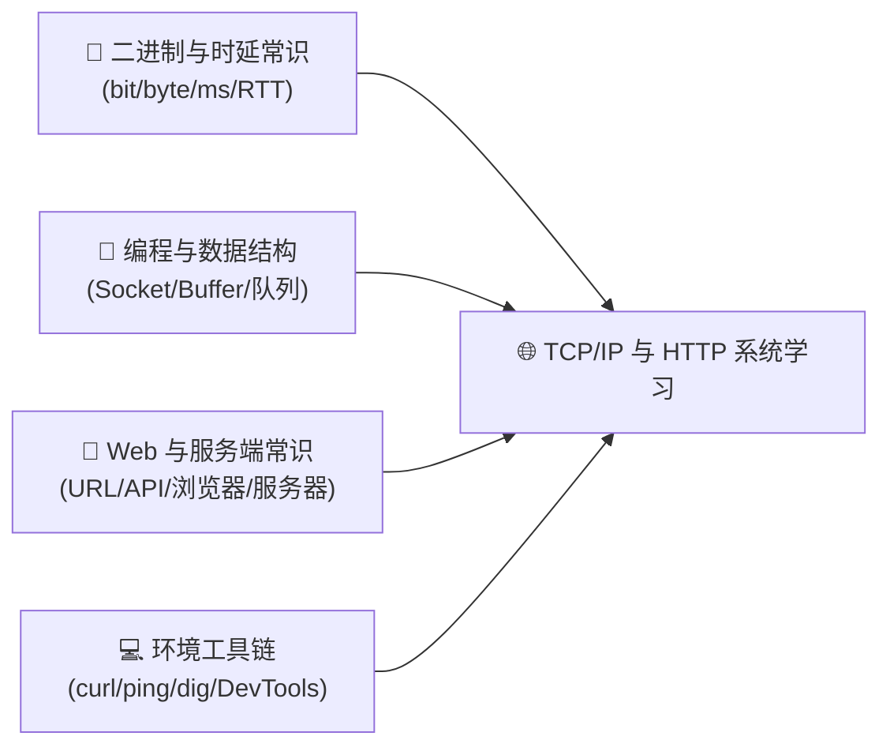
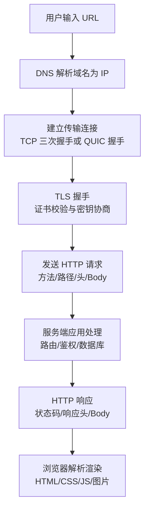
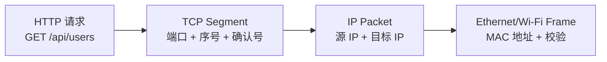
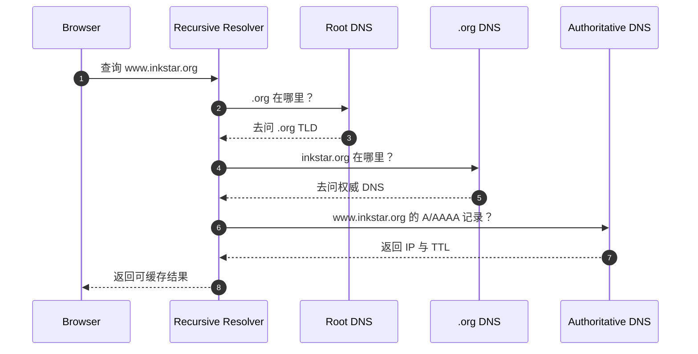
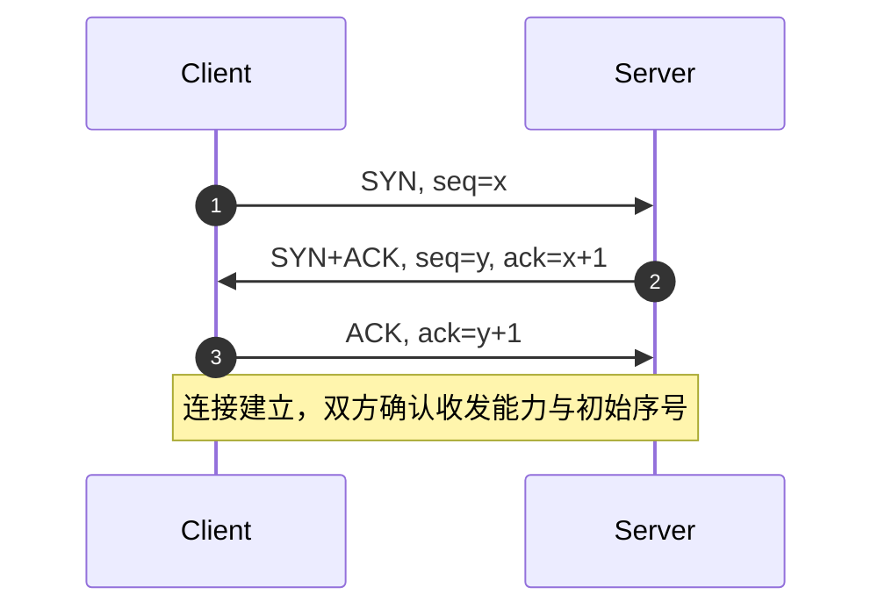
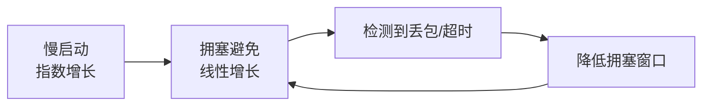
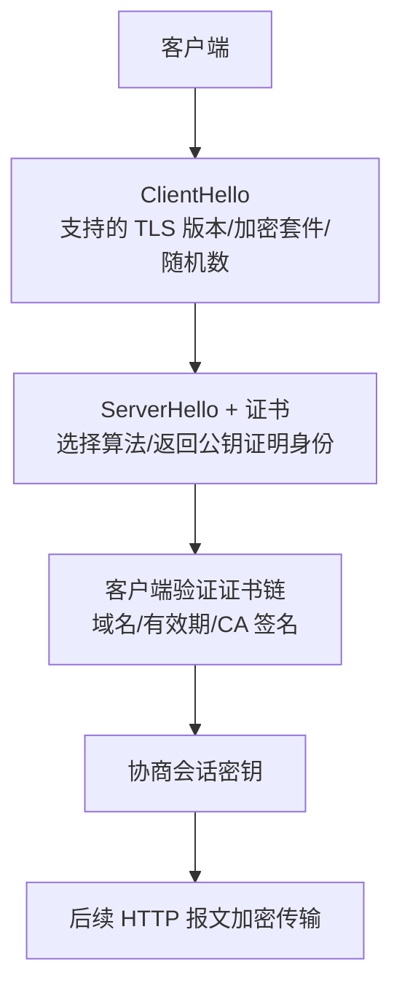
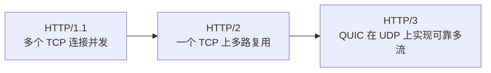
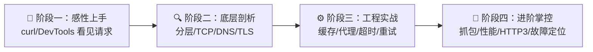
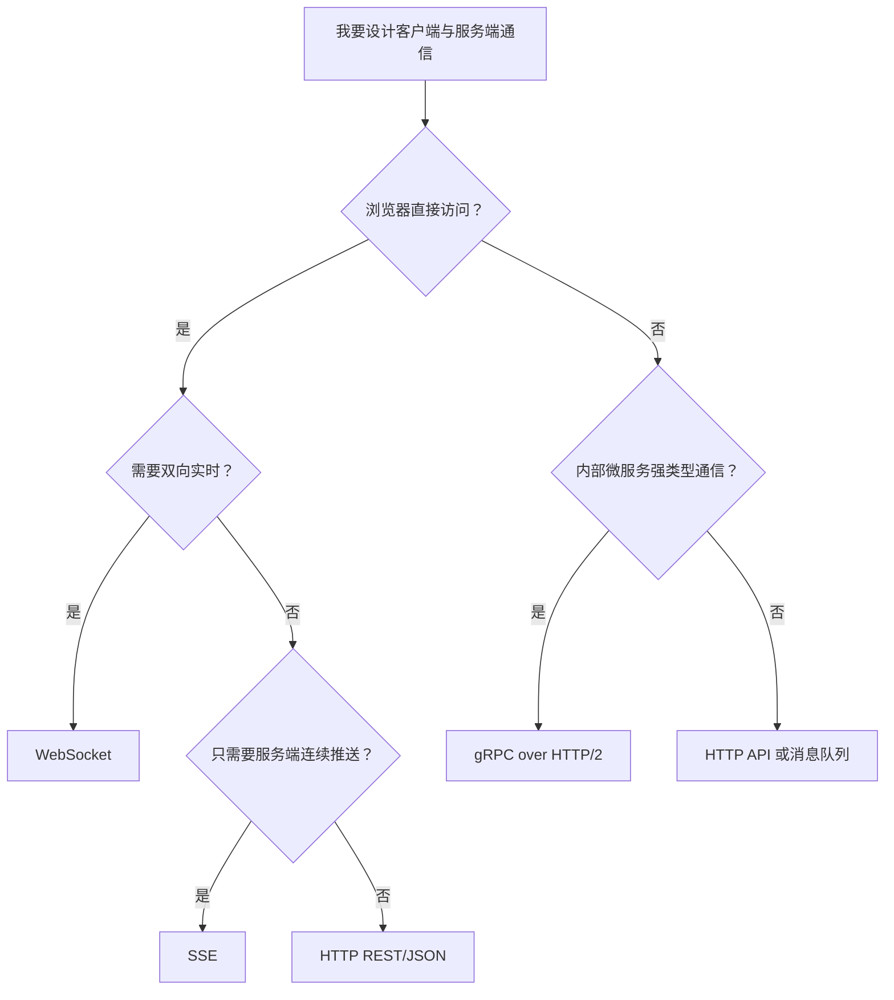

# TCP/IP 与 HTTP 核心概念深度解析与系统化学习路径

> **“TCP/IP 像城市道路、门牌和物流系统，HTTP 则像人类在这套道路上递交的标准化信件。”**
> 当你在浏览器输入一个网址、点击一个按钮、调用一次 API，背后并不是“魔法般把数据发过去”，而是一整套分层协议在接力：DNS 找地址，IP 负责跨网络寻路，TCP/QUIC 负责可靠传输，TLS 负责加密身份，HTTP 负责表达业务语义。

本指南旨在为开发者建立一套**能解释现象、能定位问题、能指导工程实践**的网络协议认知模型。文章分为三大部分：
1. **[📋 学习本指南所需的前置知识准备](#-学习本指南所需的前置知识准备prerequisites)**：先补齐二进制、端口、命令行与浏览器网络面板。
2. **[🌐 TCP/IP 与 HTTP 的核心机制](#一-为什么必须理解-tcpip-与-http)**：从分层模型、三次握手、拥塞控制、DNS、TLS 到 HTTP 版本演进。
3. **[🚀 四阶段系统化学习路线与最小实战闭环](#八-tcpip-与-http-四阶段系统化学习路线)**：用本地 HTTP 服务和命令行完成可验证实验。

---

## 📋 学习本指南所需的前置知识准备（Prerequisites）



| 模块类别 | 必备核心知识点 | 掌握程度与自测标准（如何知道自己已达标？） | 零基础推荐前置补课资料 |
| :--- | :--- | :--- | :--- |
| **数学/理论基础** | bit 与 byte、十进制与二进制、带宽与时延、RTT（往返时延）、吞吐量 | 能解释“100 Mbps 带宽不等于网页 0 延迟打开”；能说清 1 KB = 1024 Byte，1 Byte = 8 bit | 《计算机网络：自顶向下方法》第 1 章；Cloudflare Learning Center 网络基础 |
| **编程/数据结构** | 字节流、缓冲区、队列、Socket 的客户端/服务端模型、同步阻塞与超时 | 能用任意语言写出“监听端口、接收一段文本、返回响应”的小程序；理解为什么网络读写可能阻塞 | Python 官方 `socket` 教程；Beej's Guide to Network Programming |
| **领域上下文** | URL、域名、端口、浏览器、Web 服务器、API、请求与响应 | 能用自己的话解释 `https://example.com:443/path?q=1` 中协议、主机、端口、路径、查询参数分别是什么 | MDN Web Docs：HTTP 与 URL 基础 |
| **环境与工具** | `curl`, `ping`, `traceroute`, `dig/nslookup`, 浏览器 DevTools Network 面板 | 能执行 `curl -v https://example.com` 并从输出中找到请求方法、状态码与响应头 | curl 官方 Everything curl；Chrome DevTools Network 文档 |

> [!TIP]
> **一分钟极简自测**：如果你知道“URL 不是服务器地址本身，而是包含协议、域名、路径等信息的资源定位方式”，并且本地能运行 `curl -I https://example.com`，你就可以毫无门槛地通读本指南的全部内容！

---

## 一、为什么必须理解 TCP/IP 与 HTTP？

### 1. 传统“会调 API”在什么边界下崩溃？

很多开发者早期只需要会写：

```js
fetch("/api/users")
```

这在本地 Demo 中足够。但一旦进入真实生产环境，问题会迅速变得“不像代码错误”：

- 页面偶发加载慢，但服务端日志看起来正常。
- 接口在公司网络可访问，换到移动网络就超时。
- POST 明明只提交一次，后端却收到重复请求。
- WebSocket 经常断开，Nginx、负载均衡、浏览器控制台各说各话。
- 某些用户出现 `ERR_CONNECTION_RESET`、`502`、`504`、`CORS`、`TLS handshake failed`。

这些问题的共同点是：它们发生在**应用代码与真实网络之间的灰色地带**。理解 TCP/IP 与 HTTP，就是给自己装上一副能看见这片地带的眼镜。

### 2. 一句话灵魂比喻

**TCP/IP 是互联网的道路、邮编、路由和物流车队；HTTP 是业务双方写在包裹单上的标准语言。**

- IP：把包裹送向目标城市和街区，但不保证每个包裹都到。
- TCP：给包裹编号、确认签收、丢了重发、按顺序交付。
- TLS：把包裹加密，并确认对方不是假冒网点。
- HTTP：规定“我要取哪个资源、用什么方法、带哪些头、返回什么状态”。

### 3. 从输入 URL 到页面返回的数据流



---

## 二、TCP/IP 分层模型：复杂系统为什么要分层？

网络协议分层的价值，是让每一层只解决自己该解决的问题。

| 层次 | 典型协议/概念 | 主要职责 | 开发者常见问题 |
| :--- | :--- | :--- | :--- |
| 应用层 | HTTP, DNS, WebSocket, SMTP | 定义业务语义与消息格式 | 状态码、缓存、CORS、Header、Cookie |
| 传输层 | TCP, UDP, QUIC | 端到端传输、可靠性、拥塞控制 | 连接超时、重置、端口、队头阻塞 |
| 网络层 | IP, ICMP, 路由 | 跨网络寻址与转发 | IP 不通、路由绕路、丢包 |
| 链路层 | Ethernet, Wi-Fi, ARP | 局域网内帧传输 | Wi-Fi 抖动、MTU、网关不可达 |



把一条 HTTP 请求想象成俄罗斯套娃：HTTP 报文被 TCP 包起来，TCP 段被 IP 包起来，IP 包再被以太网或 Wi-Fi 帧包起来。每经过一层，都会增加该层需要的“信封信息”。

---

## 三、IP、端口与 DNS：先找到对方在哪里

### 1. IP 解决“去哪台机器”

IP 地址用于标识网络中的主机或接口。常见有两类：

- **IPv4**：如 `93.184.216.34`，32 位地址，数量有限。
- **IPv6**：如 `2606:2800:220:1:248:1893:25c8:1946`，128 位地址，面向更大的互联网规模。

IP 尽力而为地转发数据包，但不承诺可靠送达、不保证顺序、不处理重复包。可靠性通常由 TCP 或上层协议补齐。

### 2. 端口解决“找哪一个进程”

一台服务器可以同时运行多个服务，端口用于区分进程：

| 端口 | 常见协议 | 说明 |
| :--- | :--- | :--- |
| 22 | SSH | 远程登录 |
| 53 | DNS | 域名解析 |
| 80 | HTTP | 明文 Web |
| 443 | HTTPS | 加密 Web |
| 5432 | PostgreSQL | 数据库服务 |

`IP + 端口` 才能定位一个具体的网络服务。例如 `203.0.113.10:443` 表示访问这台机器上的 HTTPS 服务。

### 3. DNS 解决“域名翻译成 IP”

DNS（Domain Name System）像互联网电话簿。浏览器访问 `www.inkstar.org` 前，需要先查到它对应的 IP。



DNS 常见排查命令：

```bash
dig www.inkstar.org
nslookup www.inkstar.org
```

---

## 四、TCP：可靠字节流是怎样炼成的？

TCP（Transmission Control Protocol）给上层提供的是**可靠、有序、面向连接的字节流**。

### 1. 三次握手：为什么不是两次？



三次握手的关键不是形式主义，而是让双方确认：

- 客户端能发，服务端能收。
- 服务端能发，客户端能收。
- 双方同步初始序号，后续才能去重、排序、确认、重传。

### 2. 可靠传输的三件套

| 机制 | 作用 | 直观解释 |
| :--- | :--- | :--- |
| 序号（Sequence Number） | 给字节流编号 | 哪些字节到了，哪些没到，一目了然 |
| 确认（ACK） | 告诉对方已收到哪里 | 收件人不断签收 |
| 重传（Retransmission） | 超时或重复 ACK 时补发 | 发现包裹丢了就重新寄 |

### 3. 流量控制与拥塞控制

TCP 不只是“丢了重发”，还要避免把接收方或网络打爆。

- **流量控制（Flow Control）**：保护接收方。接收方通过窗口大小告诉发送方“我还能收多少”。
- **拥塞控制（Congestion Control）**：保护网络。发送方根据丢包、延迟、ACK 反馈动态调整发送速度。



这解释了为什么高延迟网络中，大文件传输吞吐不只取决于带宽，还会受到 RTT、丢包率、窗口大小和拥塞算法影响。

### 4. 四次挥手与 TIME_WAIT

TCP 连接关闭通常需要双方分别发送 FIN 和 ACK。主动关闭方常进入 `TIME_WAIT`，等待一段时间以确保旧连接中的延迟数据包不会污染新连接。

工程上不要一看到 `TIME_WAIT` 就恐慌。它通常是 TCP 正常保护机制，真正需要关注的是连接数量是否异常增长、端口是否耗尽、短连接是否过多。

---

## 五、TLS 与 HTTPS：加密不只是“防偷看”

HTTPS = HTTP over TLS。TLS 主要解决三件事：

1. **机密性**：中间人看不到明文内容。
2. **完整性**：内容被篡改会被发现。
3. **身份认证**：通过证书链确认你访问的确实是目标站点。



很多线上问题表面是 HTTP 错误，根因却在 TLS：证书过期、中间证书链缺失、域名不匹配、客户端时间错误、TLS 版本过旧等。

---

## 六、HTTP：把业务意图写成标准报文

HTTP（HyperText Transfer Protocol）是应用层协议，负责描述客户端想做什么、服务端处理结果如何。

### 1. 请求报文与响应报文

```http
GET /api/users?page=1 HTTP/1.1
Host: example.com
Accept: application/json
Authorization: Bearer <token>
```

```http
HTTP/1.1 200 OK
Content-Type: application/json
Cache-Control: max-age=60

{"users":[{"id":1,"name":"Ada"}]}
```

请求由方法、路径、协议版本、请求头与可选 Body 组成；响应由状态码、响应头与可选 Body 组成。

### 2. HTTP 方法：语义比名字更重要

| 方法 | 常见语义 | 是否通常安全 | 是否通常幂等 |
| :--- | :--- | :--- | :--- |
| GET | 获取资源 | 是 | 是 |
| POST | 创建资源或提交动作 | 否 | 否 |
| PUT | 整体替换资源 | 否 | 是 |
| PATCH | 局部修改资源 | 否 | 通常否 |
| DELETE | 删除资源 | 否 | 是 |

**幂等**的意思是：同一个请求执行一次与执行多次，对服务端最终状态的影响相同。理解幂等，是设计支付、订单、重试机制的关键。

### 3. 状态码：服务端给客户端的机器可读结论

| 状态码段 | 含义 | 常见例子 |
| :--- | :--- | :--- |
| 1xx | 信息提示 | `101 Switching Protocols` |
| 2xx | 成功 | `200 OK`, `201 Created`, `204 No Content` |
| 3xx | 重定向 | `301`, `302`, `304 Not Modified` |
| 4xx | 客户端侧问题 | `400`, `401`, `403`, `404`, `409`, `429` |
| 5xx | 服务端侧问题 | `500`, `502`, `503`, `504` |

`502` 往往表示网关从上游拿到无效响应，`504` 往往表示网关等待上游超时。它们不是同一种问题。

### 4. Header、Cookie、缓存与 CORS

- **Header**：HTTP 的元信息通道，例如 `Content-Type`, `Authorization`, `Accept`, `User-Agent`。
- **Cookie**：浏览器自动携带的小型状态数据，常用于会话登录。
- **Cache-Control / ETag**：控制浏览器和 CDN 如何缓存资源。
- **CORS**：浏览器安全策略，不是 HTTP 协议本身的传输限制。服务器需要明确允许跨源读取。

---

## 七、HTTP 版本演进：从短连接到 QUIC

| 版本 | 传输基础 | 核心特性 | 典型瓶颈 |
| :--- | :--- | :--- | :--- |
| HTTP/1.0 | TCP | 请求后关闭连接 | 每次请求都建连，开销大 |
| HTTP/1.1 | TCP | 长连接、管线化、Host 头 | 队头阻塞，请求并发依赖多 TCP 连接 |
| HTTP/2 | TCP | 二进制分帧、多路复用、Header 压缩 | TCP 层丢包仍会阻塞所有流 |
| HTTP/3 | QUIC over UDP | 连接迁移、内建 TLS 1.3、流级别多路复用 | 生态和中间设备兼容性仍需关注 |



理解 HTTP/2 和 HTTP/3，不是为了背版本号，而是为了理解现代 Web 性能优化为什么强调：

- 减少握手 RTT。
- 避免队头阻塞。
- 合理使用 CDN 与缓存。
- 不再盲目做域名分片和雪碧图这类 HTTP/1.1 时代技巧。

---

## 八、TCP/IP 与 HTTP 四阶段系统化学习路线



### 阶段一：感性认知与极速上手（1 ~ 3 天）

**核心目标**：能看懂一次 HTTP 请求从发出到返回的基本结构。

关键行动：

1. 用浏览器 DevTools Network 面板观察页面资源加载。
2. 用 `curl -v` 查看请求头、响应头、TLS 握手摘要。
3. 区分 URL、域名、IP、端口、路径、查询参数。
4. 熟悉 `GET`, `POST`, `Content-Type`, `Authorization`, `Cookie`。

### 阶段二：核心机制与原理深剖（1 ~ 2 周）

**核心目标**：能解释网络连接为什么会慢、断、重试、超时。

关键行动：

1. 学习 TCP 三次握手、四次挥手、滑动窗口、拥塞控制。
2. 理解 DNS 递归查询、TTL、A/AAAA/CNAME 记录。
3. 理解 TLS 证书链与 HTTPS 安全模型。
4. 学会用 `ping`, `traceroute`, `dig`, `netstat/lsof` 做初步排查。

### 阶段三：工程实战与生产避坑（2 ~ 4 周）

**核心目标**：能设计稳定 API，并处理代理、缓存、超时与重试。

关键行动：

1. 设计清晰的状态码、错误响应与幂等键。
2. 配置 Nginx/CDN 的缓存策略、压缩、超时、反向代理头。
3. 理解连接池、Keep-Alive、负载均衡、健康检查。
4. 建立超时预算：客户端超时、网关超时、服务端超时、数据库超时必须协调。

### 阶段四：进阶掌控与前沿演进（长期）

**核心目标**：具备复杂线上网络问题的定位能力。

关键行动：

1. 使用 Wireshark 或 `tcpdump` 分析握手、重传、RST、MTU 问题。
2. 学习 HTTP/2 帧、多路复用、HPACK/QPACK。
3. 理解 QUIC、HTTP/3、连接迁移与 0-RTT。
4. 熟悉可观测性指标：延迟分位数、错误率、DNS 时间、TLS 时间、TTFB、吞吐量。

---

## 九、生态横向对比与选型决策树

### 1. 常见协议与使用场景对比

| 协议/技术 | 底层 | 优势 | 适用场景 |
| :--- | :--- | :--- | :--- |
| HTTP/1.1 | TCP | 简单、兼容性极强 | 普通 API、小站点、代理链复杂环境 |
| HTTP/2 | TCP | 多路复用、Header 压缩 | 现代 Web、移动端、资源较多页面 |
| HTTP/3 | QUIC/UDP | 抗丢包队头阻塞、连接迁移 | 移动网络、弱网、高性能 CDN |
| WebSocket | TCP | 双向长连接 | 聊天、协作编辑、实时推送 |
| Server-Sent Events | HTTP | 简单单向推送、自动重连 | 日志流、通知、AI 流式输出 |
| gRPC | HTTP/2 | 强类型、高性能、流式调用 | 微服务内部通信 |

### 2. 选型决策树



---

## 十、最小自闭环可执行实战

这个实验不依赖外部密钥，也不需要复杂服务。你只需要本地有 Python 3。

### 1. 启动本地 HTTP 服务

在任意目录执行：

```bash
python3 -m http.server 8080
```

预期输出类似：

```text
Serving HTTP on :: port 8080 (http://[::]:8080/) ...
```

### 2. 用 curl 观察请求与响应

另开一个终端执行：

```bash
curl -v http://127.0.0.1:8080/
```

你会看到类似输出：

```text
> GET / HTTP/1.1
> Host: 127.0.0.1:8080
> User-Agent: curl/8.x
> Accept: */*
< HTTP/1.0 200 OK
< Server: SimpleHTTP/0.6 Python/3.x
< Content-type: text/html; charset=utf-8
```

检查点：

- `>` 开头的是客户端发出的 HTTP 请求。
- `<` 开头的是服务端返回的 HTTP 响应。
- `GET /` 表示请求根路径。
- `200 OK` 表示服务端成功处理。

### 3. 查看端口占用

macOS/Linux 可执行：

```bash
lsof -i :8080
```

预期能看到 `Python` 进程正在监听 8080 端口。

### 4. 常见报错排查

| 报错 | 可能原因 | 处理方式 |
| :--- | :--- | :--- |
| `Connection refused` | 服务没有启动，或端口不对 | 确认 `python3 -m http.server 8080` 仍在运行 |
| `Address already in use` | 8080 已被占用 | 换端口，如 `python3 -m http.server 8090` |
| 浏览器能访问但 curl 不行 | 代理或环境变量影响 | 检查 `http_proxy/https_proxy` |
| HTTPS 访问失败 | 本地服务是 HTTP，不是 HTTPS | 使用 `http://127.0.0.1:8080/` |

---

## 十一、学习完成后的自测题

1. 为什么 TCP 需要三次握手，而 UDP 不需要？
2. `www.example.com`、`93.184.216.34`、`443`、`/api/users` 分别属于哪类定位信息？
3. `502 Bad Gateway` 与 `504 Gateway Timeout` 的排查方向有什么区别？
4. 为什么 HTTP/2 已经支持多路复用，却仍然可能被 TCP 丢包影响？
5. 一个创建订单接口如果支持客户端超时重试，为什么最好设计幂等键？

如果你能把这 5 个问题讲给另一个初学者听，并能现场用 `curl -v` 拆解一次请求，那么 TCP/IP 与 HTTP 的第一座山就已经翻过去了。

