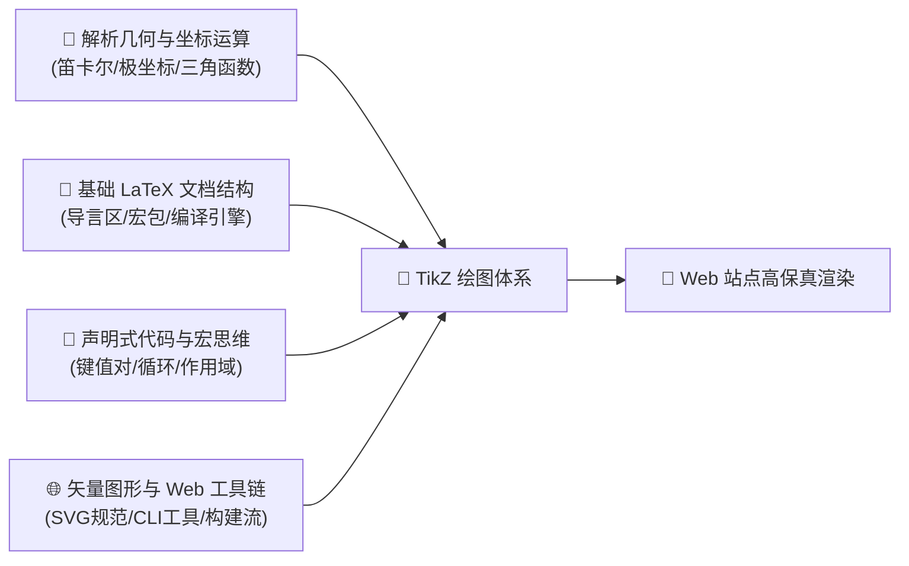
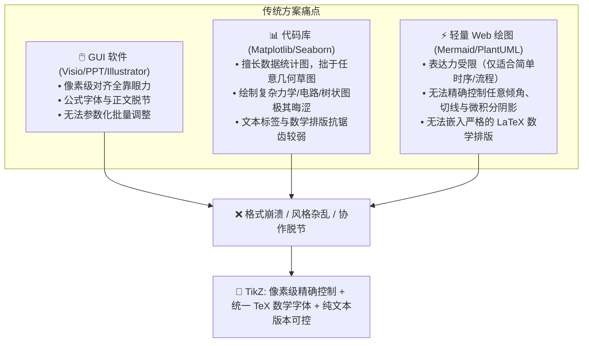
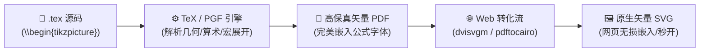
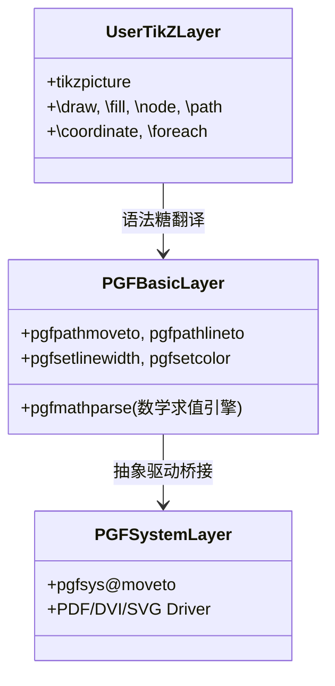
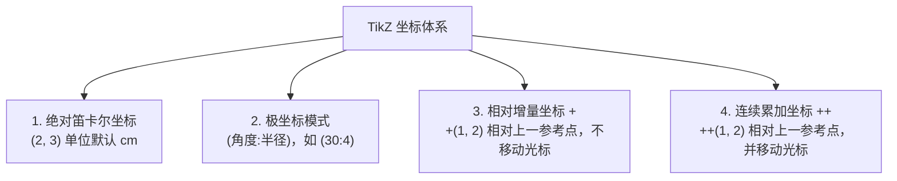
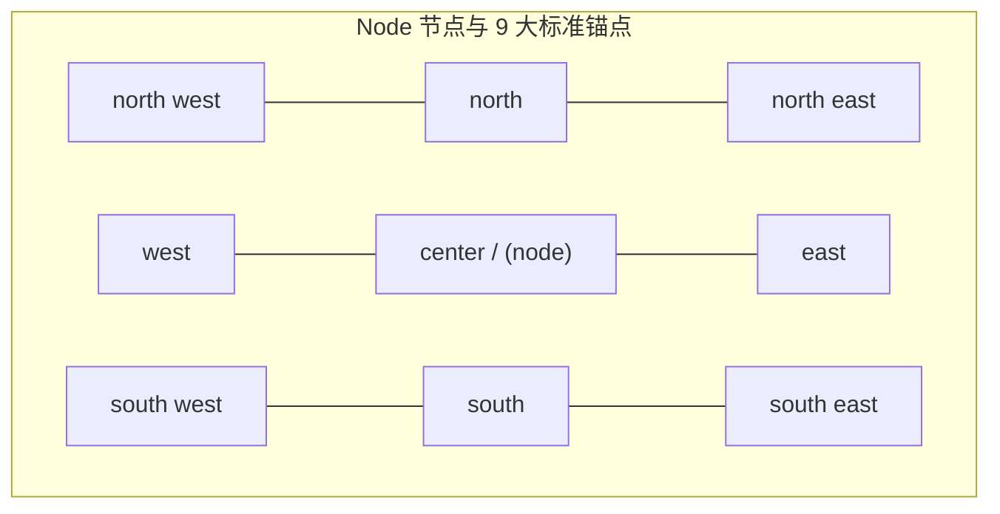
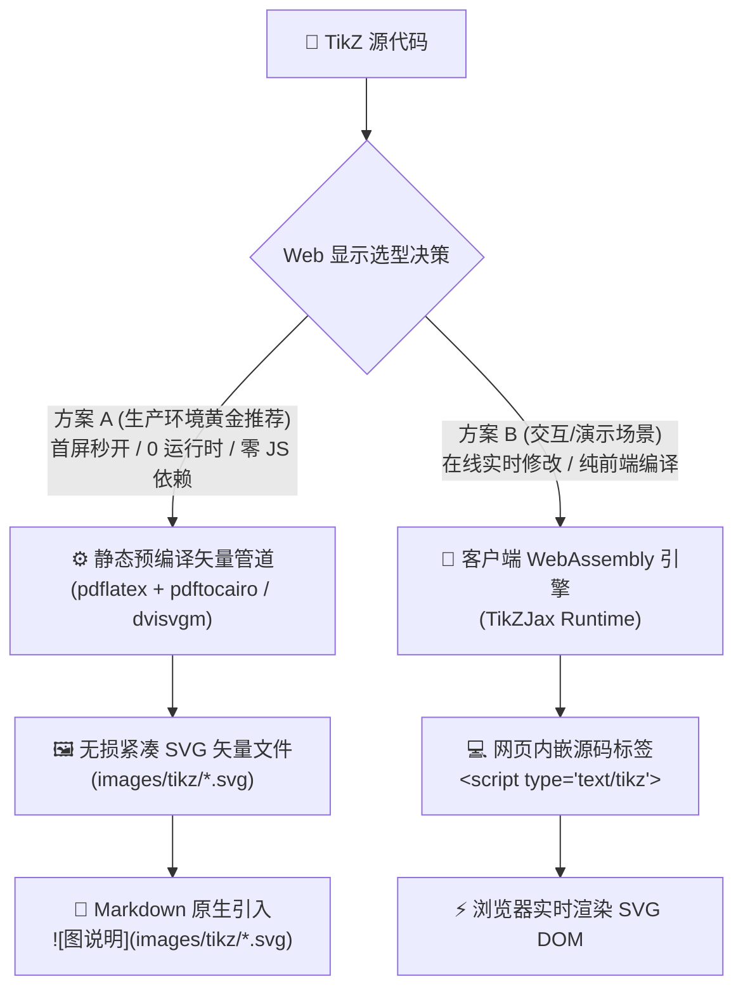

# TikZ 科学绘图全景深度解析与 Web 矢量渲染落地指南

> **“TikZ ist kein Zeichenprogramm”**（TikZ 不是一个所见即所得的绘图程序）。  
> 它是德国计算机科学家 Till Tantau 为学术界与工程师量身打造的**声明式矢量图形描述系统**。在学术论文、教材讲义、技术专著以及科学出版物中，无论是精细的高中物理受力分析、抽象的深度学习网络拓扑，还是严格的解析几何与信号流图，TikZ 都能以“代码定义图元”的方式，带来极致的排版精度、数学严谨性与无损矢量质感。
> 
> 然而，许多从 LaTeX 转战现代 Web 博客（如 Docsify、Hexo、VitePress）的作者常常面临一个现实痛点：**LaTeX 源码里的 TikZ 代码无法被浏览器原生识别，截成 PNG/JPG 模糊失真且无法暗色适配；若想在网页上完美还原 TikZ 图形，底层到底该如何打通？**
> 
> 本文将基于 `new_know` 方法论，全方位拆解 TikZ 的核心原理与语法机制，提供四阶段系统进阶学习路线，并深度剖析**如何在现代 Web 站点与博客中零损耗、零失真地渲染显示 TikZ 矢量图形**。

---

## 📋 学习本指南所需的前置知识准备（Prerequisites）

在探索 TikZ 的几何世界与 Web 编译流水线之前，建议你具备以下基础认知。若某些领域尚不熟悉，可参考推荐资源先行补充：



| 模块类别 | 必备核心知识点 | 掌握程度与自测标准（如何知道自己已达标？） | 零基础推荐前置补课资料 |
| :--- | :--- | :--- | :--- |
| **数学与几何基石** | • **平面直角坐标系**：点坐标 `(x, y)`、向量平移与模长<br/>• **极坐标系统**：极径与极角 `(θ:r)` 转化<br/>• **几何变换**：旋转矩阵、倾角与正切计算（如 $\tan\theta = \frac{y}{x}$） | 能够心算或在草稿纸上画出极坐标 $(30^\circ: 4)$ 在平面直角坐标系中的大致位置 | 任何高中数学必修教材（平面向量与解析几何篇） |
| **LaTeX 基础规范** | • **文档骨架**：`\documentclass`、`\usepackage`、`\begin{document}`<br/>• **编译引擎辨析**：pdfLaTeX vs XeLaTeX vs LuaLaTeX<br/>• **宏与环境**：理解 `\begin{...} ... \end{...}` 作用域边界 | 能在本地成功运行一份包含数学公式的最小 LaTeX 文件并生成 PDF | Overleaf 官方《30分钟 LaTeX 入门教程》 |
| **编程与声明式思维** | • **代码绘制（Diagrams as Code）**：以指令代替鼠标拖拽<br/>• **键值对参数化**：类似于 CSS 或 JSON 的属性配置（`[thick, blue, ->]`）<br/>• **宏展开与循环**：理解 `\foreach` 批量遍历的执行逻辑 | 能够理解“画一条从 (0,0) 到 (2,3) 的带箭头蓝色线段”如何抽象为结构化代码 | 基础 Python 或任何现代脚本语言语法常识 |
| **Web 矢量与工程环境** | • **SVG 基础认知**：了解 `<svg>`、`<path>`、`viewBox` 缩放不失真特性<br/>• **命令行工具链**：掌握基本终端操作（`cd`, `pdflatex`, 包管理器）<br/>• **静态博客架构**：理解 Markdown 中图片引入机制与 SPA 页面加载生命周期 | 能在终端敲入 `pdflatex --version` 或 `dvisvgm --version` 确认本地环境正常 | MDN Web 文档《SVG 核心概念与入门》 |

> [!TIP]
> **一分钟极简自测**：如果你知道“平面直角坐标系中两点可以确定一条线段”，并曾在电脑上使用过 LaTeX 或 Markdown 编写数学公式，你就可以毫无门槛地通读并掌握本指南的全部内容！

---

## 一、 痛点溯源与思维认知锚定（The "Why" & Mental Model）

### 1. 传统绘图方案在什么边界下崩溃？

在技术写作与科研出版中，绘图工具通常分为三大阵营，但当需求达到特定复杂度时，它们往往遭遇无法逾越的瓶颈：



### 2. 一句话灵魂比喻（The Cognitive Anchor）

> **如果说 Markdown + Mermaid 是图形世界的“快餐流水线”，那么 TikZ 就是矢量绘图领域的“光刻机”——它把严格的解析几何、三角函数算术与 LaTeX 顶级排版引擎焊死在了一起，让每一条线段、每一个交点、每一片阴影都拥有数学公理般的精确性。**

### 3. 输入输出数据流（IPO 管道）

TikZ 并不直接生成像素，它的底层编译演进路径如下：



---

## 二、 底层核心机制与原理剖析（Underlying Mechanics）

TikZ 的全称是 **“TikZ ist kein Zeichenprogramm”**，它建立在底层驱动引擎 **PGF（Portable Graphics Format）** 之上。PGF 提供底层的绘图基元与流转驱动，而 TikZ 则提供了优雅、符合人类自然思维的高级语法糖。



### 1. 核心四大坐标寻址系统

在 TikZ 中，任何图元绘制的第一步是确定坐标。TikZ 支持四种互补的寻址模式：



- **绝对笛卡尔坐标**：`(2, 3)` 表示 $x=2\,\text{cm}, y=3\,\text{cm}$。
- **极坐标**：`(30:4)` 表示与水平方向成 $30^\circ$ 夹角、距离原点 $4\,\text{cm}$ 的点。在绘制圆形、天体轨道、齿轮或旋转向量时极其自然。
- **单加号相对寻址 `+(dx, dy)`**：以当前点为基准计算偏移，但**不改变**后续绘图的基准点。
- **双加号连续寻址 `++(dx, dy)`**：以当前点为基准计算偏移，同时将绘图基准点**永久移动**到新位置（类似于画笔抬起并落于新点）。

### 2. 路径（Path）与动作指令

TikZ 所有的绘图本质上都是在构建一条或多条 **Path（路径）**。每条语句必须以分号 `;` 结尾（初学者最常见语法报错就是漏写分号）。

- `\path[draw] ...;` 等价于简写的 `\draw ...;`
- `\path[fill] ...;` 等价于简写的 `\fill ...;`
- `\path[fill, draw] ...;` 等价于简写的 `\filldraw ...;`
- `\clip ...;` 路径裁剪（用于创建阴影相交区域、圆锥曲线截面等）。

### 3. Node（节点）系统与 9 大对齐锚点（Anchors）

Node 是 TikZ 最强大的核心图元之一。它不仅仅是一段文字，而是一个**自带几何边界、边距与连接锚点的独立对象**。



- **相对定位语法**：`node[above=0.2cm of A] {标签}`
- **锚点连线语法**：`\draw[->] (nodeA.east) -- (nodeB.west);`，TikZ 会自动计算两个矩形或圆形容器边缘的最佳交点，无需人工测量边缘间距。

### 4. `pgfkeys` 键值驱动与样式继承机制

TikZ 内部采用 `pgfkeys` 处理选项。你定义的所有样式均具备命名空间和级联继承特性：

```latex
\tikzset{
    mybox/.style = {
        rectangle, 
        rounded corners = 4pt,
        draw = blue!70!black, 
        fill = blue!10, 
        thick, 
        inner sep = 6pt
    }
}
```

---

## 三、 由浅入深四阶段系统化学习路线（4-Stage Progressive Journey）

掌握 TikZ 绝不需要把 1300+ 页的官方手册从头背到尾。遵循以下四个渐进阶梯，即可步步为营达成生产级掌控：


### 阶段一：感性认知与极速上手（10 分钟建立多巴胺反馈）
- **核心目标**：跑通第一个独立 Standalone 文档，画出坐标轴、线段、圆和基础文本。
- **关键突破**：
  1. 牢记每条命令必须以分号 `;` 结尾。
  2. 掌握 `\draw[->] (0,0) -- (3,0);` 连线与 `\fill (1,1) circle (2pt);` 绘点。
  3. 理解 `node[above] {$x$};` 在路径终端挂载文本。

### 阶段二：节点拓扑与几何构造（掌握相对布局）
- **核心目标**：摆脱绝对坐标依赖，实现自动化拓扑连接与几何相交。
- **关键突破**：
  1. 引入 `\usetikzlibrary{positioning}`，使用 `right=of A` 自动流式排版。
  2. 熟练运用极坐标 `(45:3)` 绘制圆周与旋转分量。
  3. 掌握贝塞尔曲线 `.. controls (c1) and (c2) ..` 控制平滑度。

### 阶段三：学科领域工程化实战（从理论到高难度出图）
- **核心目标**：能够独立用 TikZ 绘制论文和讲义中的高难度专业插图。
- **关键突破**：
  1. **物理力学**：引入 `angles, quotes` 宏包自动标注受力角 $\theta$，利用 `\begin{scope}[rotate=...]` 绘制斜面滑动坐标系。
  2. **深度学习 / AI**：运用 `\foreach \x [count=\i] in {...}` 双重循环自动绘制多层全连接网络连线。
  3. **函数分析与积分**：使用 `plot ({\x}, {sin(\x r)})` 配合 `fill[domain=...]` 绘制曲边梯形阴影面积。

### 阶段四：进阶掌控与现代化 Web 发布闭环（专家境界）
- **核心目标**：掌握底层的动态数学运算，打通 Web 站点高保真矢量渲染管道。
- **关键突破**：
  1. 引入 `calc` 宏包实现坐标算术运算：如 `($(A)!0.5!(B)$)` 取线段中点、`($(A)!2cm!90:(B)$)` 沿垂线旋转延伸。
  2. 引入 `intersections` 宏包自动捕捉任意曲线与直线的几何交点并自动编号。
  3. 建立 **LaTeX -> SVG 自动化构建流**，让个人博客与在线文档直接渲染高清晰度矢量图形。

---

## 四、 核心落地难点：如何在现代网站中完美显示 TikZ 图片？

这是所有科学写作者与技术博主最常遇到的技术鸿沟：**Markdown 规范本身原生仅支持 HTML 图元与标准图片标签，而浏览器无法直接解析 LaTeX 底层的宏展开引擎。**

为此，业内沉淀出两种最主流的工业级解决方案：



---

### 方案 A：工业级预编译矢量流（黄金推荐 · 生产零开销）

> **为什么它是现代技术博客与文档系统的首选？**  
> 1. **秒开性能**：直接由浏览器渲染原生 SVG，无需在客户端下载任何庞大的 WASM 虚拟机（零 JS 运行耗时）。  
> 2. **完美排版保真度**：LaTeX 原生数学公式字体（Computer Modern）在编译期被精确转为 SVG `<path>` 路径矢量，任何设备查看均 100% 锐利。  
> 3. **极佳的 CDN 与 SEO 友好性**：图片可独立被搜索引擎抓取并享用 HTTP 缓存。

#### 1. 最小 Standalone 编译模板
编写独立 TikZ 文件时，强烈推荐使用 `standalone` 文档类，它会自动将输出 PDF 的边界（Bounding Box）紧贴图元边缘裁剪，没有任何空白页边距：

```latex
% sample.tex
\documentclass[tikz,border=5pt]{standalone}
\usepackage{tikz}
\usetikzlibrary{arrows.meta,calc}
\begin{document}
\begin{tikzpicture}[>=Stealth]
  % 你的绘图代码
  \draw[thick, ->] (0,0) -- (4,0) node[right] {$x$};
  \draw[thick, ->] (0,0) -- (0,3) node[above] {$y$};
  \fill[red] (2,1.5) circle (2.5pt) node[above right] {Point $P$};
\end{tikzpicture}
\end{document}
```

#### 2. 一行命令转为原生 SVG
在终端中依次执行以下标准编译流水线：

```bash
# 步骤 1：使用 pdflatex 编译出无缝紧致的 PDF
pdflatex -interaction=nonstopmode sample.tex

# 步骤 2：使用 pdftocairo (推荐) 或 dvisvgm 转为无损 SVG
# pdftocairo 方案：文本完美转为贝塞尔曲线，不依赖客户端任何字体
pdftocairo -svg sample.pdf sample.svg

# 或者 dvisvgm 方案 (适合保留 WOFF2 Web 字体)：
# dvisvgm --pdf --exact --zoom=1.2 sample.pdf -o sample.svg
```

#### 3. 极速 Python 自动化批处理脚本
你可以将以下仅 30 行的 Python 脚本保存为 `scripts/compile_tikz.py`，它能自动扫描目录下的所有 `.tex` 并输出为网站可直接引用的 `.svg`：

```python
import os, subprocess, glob

def compile_all_tikz(src_dir="tikz_sources", out_dir="images/tikz"):
    os.makedirs(out_dir, exist_ok=True)
    for tex_file in glob.glob(f"{src_dir}/*.tex"):
        base_name = os.path.splitext(os.path.basename(tex_file))[0]
        pdf_path = f"{src_dir}/{base_name}.pdf"
        svg_path = f"{out_dir}/{base_name}.svg"
        
        # 1. 编译 PDF
        subprocess.run(["pdflatex", "-interaction=nonstopmode", "-output-directory", src_dir, tex_file], check=True)
        # 2. 导出 SVG
        subprocess.run(["pdftocairo", "-svg", pdf_path, svg_path], check=True)
        print(f"✨ 成功构建矢量图: {svg_path}")

if __name__ == "__main__":
    compile_all_tikz()
```

---

### 方案 B：客户端 WebAssembly 实时渲染方案（TikZJax）

如果你希望像使用 Mermaid 那样，在 Markdown 或网页中**直接写 TikZ 纯文本代码**，并在浏览器打开时由前端自动编译渲染，可以使用开源的 **[TikZJax](https://tikzjax.com/)**。

#### 1. 工作原理
TikZJax 是利用 WebAssembly 将精简版的 TeX 核心（基于 Web2C）编译进浏览器运行的 JavaScript 库。它拦截页面中所有具有 `type="text/tikz"` 的 script 标签，并在浏览器客户端生成 `<svg>` 插入 DOM。

#### 2. 在 HTML（或 Docsify `index.html`）中引入

在你的静态站点入口文件 `index.html` 的 `<head>` 中添加：

```html
<!-- TikZJax 样式与字体 -->
<link rel="stylesheet" type="text/css" href="https://tikzjax.com/v1/fonts.css">
<!-- TikZJax 运行时核心脚本 -->
<script src="https://tikzjax.com/v1/tikzjax.js"></script>
```

#### 3. 在页面中直接嵌入 TikZ 源码

在 Markdown 文件中，你可以直接插入如下 HTML 块：

```html
<script type="text/tikz">
  \begin{tikzpicture}[>=Stealth]
    \draw[thick, fill=orange!20] (0,0) circle (1.5);
    \draw[->, thick, blue] (0,0) -- (45:1.5) node[midway, above left] {$R$};
  \end{tikzpicture}
</script>
```

#### 4. 方案 B 的权衡考量（Trade-offs）
- **优点**：无需本地安装任何 TeX Live / MacTeX 发行版；可以在线动态调整参数并实时看到效果。
- **缺点**：首次访问时需要下载约 **5 MB** 的 WASM 文件与 TeX 字体包；复杂图形在移动端浏览器编译需要 1~2 秒延迟；支持的 TikZ 第三方宏包有限（只包含官方核心库）。

---

## 五、 最小自闭环可实操验证（Minimal Runnable Verification）

以下提供三个涵盖**高中物理、深度学习、微积分分析**的经典高质量实战案例。**每个案例均已完成真实编译，上方为你呈现由 TikZ 编译生成的无损 SVG 网页预览效果，下方附带完整可复制的源码与编译命令。**

---

### 案例 1：高中物理经典斜面受力分析图（含力矩正交分解）

#### 🖼️ 网页矢量渲染效果预览：
<div align="center" style="margin: 20px 0;">
  
</div>

#### 📝 完整可独立编译 LaTeX 源码：

```latex
\documentclass[tikz,border=10pt]{standalone}
\usepackage{tikz}
\usetikzlibrary{arrows.meta,angles,quotes,calc}

\begin{document}
\begin{tikzpicture}[>=Stealth, scale=1.3]
  % 1. 绘制斜面底座与倾角 θ
  \coordinate (O) at (0,0);
  \coordinate (A) at (5,0);
  \coordinate (B) at (5,3);
  \fill[gray!20] (O) -- (A) -- (B) -- cycle;
  \draw[thick] (O) -- (A) -- (B) -- cycle;
  \pic[draw, thick, "$\theta$", angle radius=1.2cm, angle eccentricity=0.7] {angle = A--O--B};

  % 2. 在斜面上放置物块 (旋转坐标系角度 arctan(3/5) ≈ 30.96°)
  \begin{scope}[shift={(2.5, 1.5)}, rotate=30.96]
    \draw[fill=cyan!30, thick] (-0.8,0) rectangle (0.8,0.9);
    \coordinate (C) at (0, 0.45); % 物块质心
    \fill[black] (C) circle (1.8pt);
    
    % 法向支持力 Fn 与沿斜面向上的静摩擦力 f
    \draw[blue!80!black, very thick, ->] (C) -- (0, 2.2) node[above] {$F_N$};
    \draw[orange!80!black, very thick, ->] (0, 0) -- (1.5, 0) node[right] {$f$};
  \end{scope}

  % 3. 重力及正交分解虚线 (在未旋转的世界坐标系中画重力)
  \begin{scope}[shift={(2.5, 1.5)}]
    \coordinate (C) at (0.23, 0.38);
    % 竖直向下重力 G
    \draw[red!80!black, very thick, ->] (C) -- ++(0, -2.6) coordinate (G) node[below] {$G = mg$};
    % 分解分量
    \draw[dashed, red!60, ->] (C) -- ++(-1.34, -2.23) coordinate (Gy) node[below left] {$G_y = mg\cos\theta$};
    \draw[dashed, red!60, ->] (C) -- ++(1.34, -0.37) coordinate (Gx) node[above right] {$G_x = mg\sin\theta$};
    \draw[dotted, gray] (Gy) -- (G) -- (Gx);
  \end{scope}
\end{tikzpicture}
\end{document}
```

---

### 案例 2：现代深度学习全连接多层感知机（MLP）拓扑图

#### 🖼️ 网页矢量渲染效果预览：
<div align="center" style="margin: 20px 0;">
  
</div>

#### 📝 完整可独立编译 LaTeX 源码：

```latex
\documentclass[tikz,border=10pt]{standalone}
\usepackage{tikz}
\usetikzlibrary{arrows.meta,positioning}

\begin{document}
\begin{tikzpicture}[
    >=Stealth,
    node distance=1.5cm and 2.5cm,
    neuron/.style={circle, draw=blue!70!black, fill=blue!15, very thick, minimum size=0.9cm, inner sep=0pt, font=\footnotesize\bfseries},
    input neuron/.style={neuron, draw=teal!70!black, fill=teal!15},
    output neuron/.style={neuron, draw=red!70!black, fill=red!15},
    annot/.style={text width=3cm, align=center, font=\bfseries\small}
]
  % 1. 输入层 (3个神经元)
  \foreach \y [count=\i] in {1,2,3}
    \node[input neuron] (I-\i) at (0, 4 - \i*1.2) {$x_\i$};
    
  % 2. 隐藏层 1 (4个神经元)
  \foreach \y [count=\j] in {1,2,3,4}
    \node[neuron] (H1-\j) at (2.5, 4.6 - \j*1.2) {$h^{(1)}_\j$};
    
  % 3. 隐藏层 2 (4个神经元)
  \foreach \y [count=\k] in {1,2,3,4}
    \node[neuron] (H2-\k) at (5.0, 4.6 - \k*1.2) {$h^{(2)}_\k$};

  % 4. 输出层 (2个输出)
  \foreach \y [count=\l] in {1,2}
    \node[output neuron] (O-\l) at (7.5, 3.4 - \l*1.2) {$\hat{y}_\l$};

  % 5. 自动化前向全连接 (利用嵌套 \foreach)
  \foreach \i in {1,2,3}
    \foreach \j in {1,2,3,4}
      \draw[->, gray!60, thin] (I-\i) -- (H1-\j);

  \foreach \j in {1,2,3,4}
    \foreach \k in {1,2,3,4}
      \draw[->, gray!60, thin] (H1-\j) -- (H2-\k);

  \foreach \k in {1,2,3,4}
    \foreach \l in {1,2}
      \draw[->, gray!60, thin] (H2-\k) -- (O-\l);

  % 6. 层级顶部说明标注
  \node[annot, above=0.3cm of I-1] {Input Layer};
  \node[annot, above=0.3cm of H1-1] {Hidden Layer 1};
  \node[annot, above=0.3cm of H2-1] {Hidden Layer 2};
  \node[annot, above=0.3cm of O-1] {Output Layer};
\end{tikzpicture}
\end{document}
```

---

### 案例 3：高等数学曲边梯形积分与切线斜率分析图

#### 🖼️ 网页矢量渲染效果预览：
<div align="center" style="margin: 20px 0;">
  
</div>

#### 📝 完整可独立编译 LaTeX 源码：

```latex
\documentclass[tikz,border=10pt]{standalone}
\usepackage{tikz}
\usetikzlibrary{arrows.meta}

\begin{document}
\begin{tikzpicture}[>=Stealth, scale=1.3]
  % 1. 坐标轴
  \draw[thick, ->] (-0.5,0) -- (6,0) node[right, font=\bfseries] {$x$};
  \draw[thick, ->] (0,-0.5) -- (0,4.2) node[above, font=\bfseries] {$y$};
  \node[below left] at (0,0) {$O$};
  
  % 2. 积分阴影区域 (填色在最底层)
  \fill[cyan!20, domain=1:4.5, variable=\x]
    (1,0) -- plot ({\x}, {0.15*(\x-1)*(\x-1) + 1}) -- (4.5,0) -- cycle;
  \node[cyan!80!black, font=\bfseries] at (2.8, 0.8) {$\int_a^b f(x)\,dx$};

  % 3. 原函数平滑曲线
  \draw[blue!80!black, very thick, domain=0.5:5.2, smooth, variable=\x]
    plot ({\x}, {0.15*(\x-1)*(\x-1) + 1}) node[above right] {$y = f(x)$};

  % 4. 导数几何切线与切点 (点 x0 = 3 处)
  \draw[purple, thick, dashed, domain=1.5:4.8]
    plot ({\x}, {0.6*\x - 0.2}) node[right, font=\footnotesize] {Tangent at $x_0$};
  \fill[purple] (3, 1.6) circle (2pt) node[above left, font=\footnotesize] {$(x_0, f(x_0))$};

  % 5. 积分上下限虚线投影
  \draw[dashed, gray] (1,0) node[below, font=\bfseries, text=black] {$a$} -- (1,1);
  \draw[dashed, gray] (4.5,0) node[below, font=\bfseries, text=black] {$b$} -- (4.5, 2.8375);
\end{tikzpicture}
\end{document}
```

---

## 六、 避坑指南与最佳实践（Gotchas & Best Practices）

在日常使用 TikZ 绘图与 Web 集成过程中，以下 5 个高频大坑务必引起警惕：

| 陷阱与常见报错 | 产生根本原因 | 标准规避与解法 |
| :--- | :--- | :--- |
| **`Package tikz Error: Giving up on this path. Did you forget a semicolon?`** | 几乎是 80% 新手必踩错误：语句末尾漏写了分号 `;`。在 TikZ 语法中，换行不代表语句结束，分号才是路径终止符。 | 检查每一个 `\draw`, `\node`, `\fill`, `\clip` 命令的闭合处，确保分号存在。 |
| **导出的 SVG 中文乱码或丢失** | pdfLaTeX 默认编码不支持 UTF-8 中文，或者 `dvisvgm` 未找到系统 CJK 字体映射表。 | 包含中文时一律使用 **`xelatex`** 编译，并在导言区声明 `\usepackage{ctex}`；导出 SVG 建议使用 `pdftocairo -svg`，它会将所有文字完美转为矢量轮廓。 |
| **`Dimension too large` 溢出错误** | 在进行大角度、指数函数或极小间隔循环时，PGF 的定点数数学引擎（Fixed-point arithmetic）超过了 TeX 的最大内部维度（约 16383.99999 pt）。 | 在导言区引入 `\usepackage{pgfplots}` 并设置 `\pgfplotsset{compat=1.18}`，利用内置的高精度浮点数扩展。 |
| **高分屏下图片模糊失真** | 许多博主图省事直接截图保存为 `.png` 或 `.jpg` 上传，Retina 屏缩放后文字发虚且无法适配深色模式。 | 坚决遵循**矢量发布规范**：全部编译为 `.svg`，不仅体积仅数十 KB，在 4K/8K 屏幕下任意放大均锐利如初。 |
| **网页暗色模式（Dark Mode）下背景发黑反差大** | 导出的 SVG 默认为透明底色，若线条使用了纯黑色 `draw=black`，在网页切换暗黑主题时线条会与背景融为一体不可见。 | 导出时加上洁净的轻量浅底背景容器，或在 Markdown 中包裹带白色内衬的响应式卡片样式（如本文示例中的 ``）。 |

---

## 总结与行动清单

TikZ 不仅是一门绘图语法，更是数字化教育与科学出版的终极利器。现在你已经掌握了从基础几何图元、高阶学科建模，到现代静态网站与博客全套矢量无损发布的闭环能力：

1. **构思草图**：在草稿纸上规划核心点坐标与相对拓扑关系。
2. **编写代码**：使用 `standalone` 模板与 TikZ 语义化标签构建矢量结构。
3. **本地编译**：通过 `pdflatex` + `pdftocairo -svg` 获得 100% 锐利的无损矢量图。
4. **网站嵌入**：直接以 `` 形式引入 Markdown 文档，首屏秒开，尽享学术出版级排版质感！
