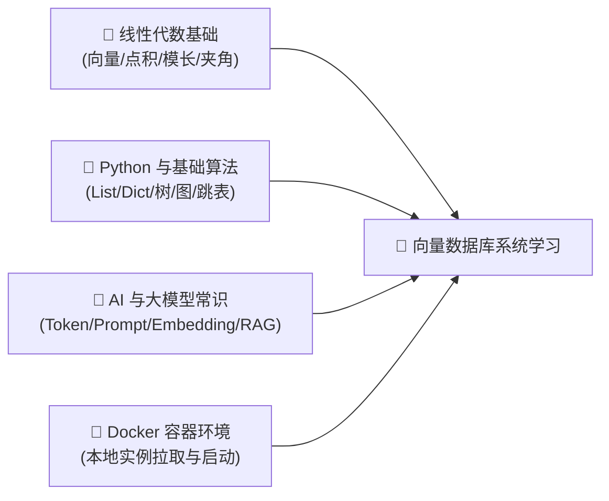
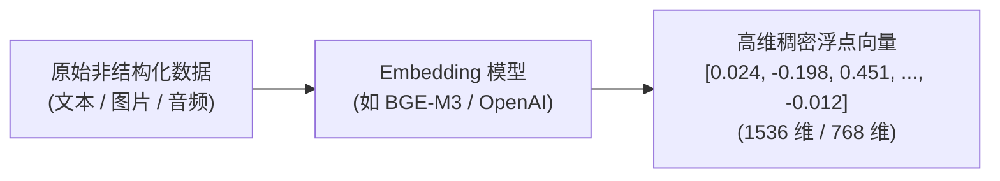
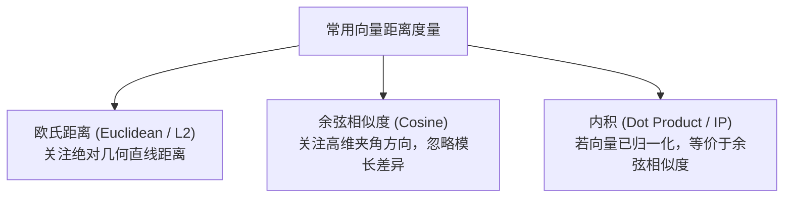
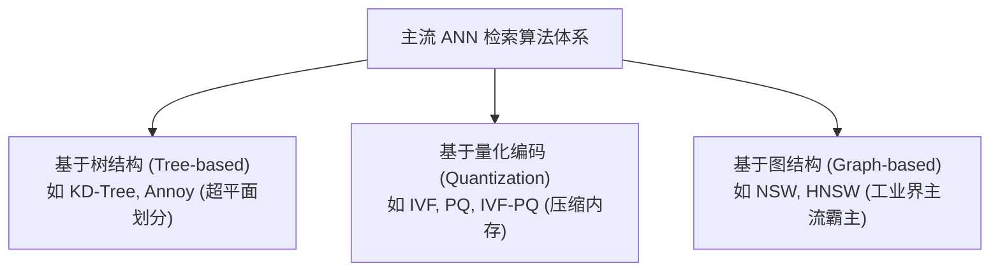
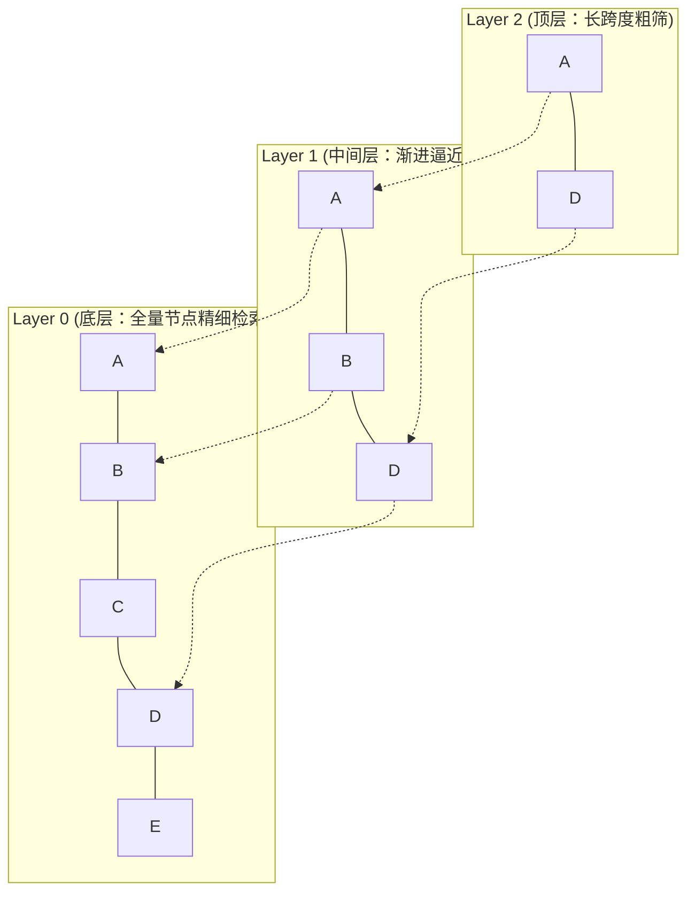
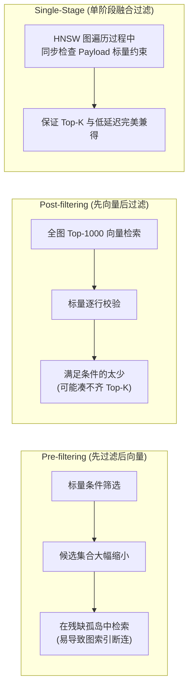
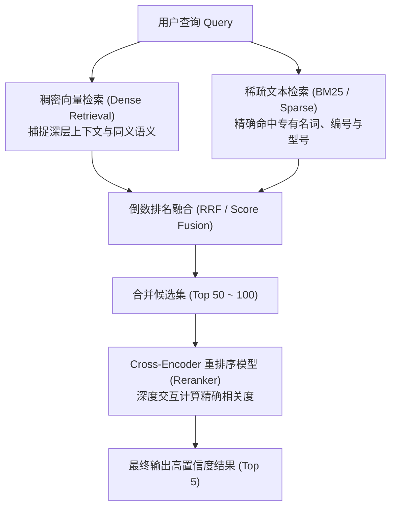
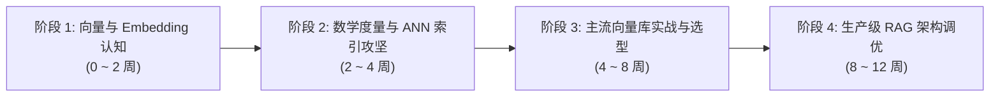

# 向量数据库核心概念深度解析与系统化学习路径指南

> **“数据是大模型的粮食，而向量数据库是大模型的外挂海马体（长期记忆）。”**
> 随着以 ChatGPT、Claude、DeepSeek 为代表的大语言模型（LLM）爆发，传统关系型数据库（Relational Database）在处理非结构化数据（文本、图像、视频、音频、代码）的语义理解时遇到了前所未有的瓶颈。**向量数据库（Vector Database）** 应运而生，并在检索增强生成（RAG）、智能客服、多模态搜索、代码补全与推荐系统中扮演着核心中枢角色。

本指南旨在为技术开发者建立一套**成体系、有深度、可动手落地**的向量数据库认知模型。文章分为三大部分：
1. **学习本指南所需的前置知识准备清单**（自测与基础补齐）
2. **向量数据库核心概念、数学度量与 ANN 索引算法深度剖析**（底层原理）
3. **由浅入深的四阶段系统化学习路径与工程实战指南**（落地演练）

---

## 📋 学习本指南所需的前置知识准备（Prerequisites）

在开始系统学习向量数据库之前，建议你已经具备以下基础认知。如果你发现某些知识点有盲区，可以根据推荐指引快速补齐：



| 模块类别 | 必备核心知识点 | 掌握程度与自测标准 | 零基础推荐前置补课资料 |
| :--- | :--- | :--- | :--- |
| **数学基础** | • **线性代数**：向量概念、坐标表示、高维空间、向量模长（L2 范数）、点积（Dot Product）、夹角与正交性<br/>• **基础几何与统计**：欧氏距离、余弦值特征、聚类中心（Centroid）直观理解 | 能够口算简单向量的点积与模长；理解两向量夹角越小余弦值越接近 1（同向共线为 1） | 3Blue1Brown《线性代数的本质》系列视频 |
| **编程与数据结构** | • **Python 语法**：熟练运用列表、字典、推导式、异步函数与包管理（pip/conda）<br/>• **核心数据结构**：数组（Array）、跳表（SkipList）、二叉平衡树、图的节点与连边（邻接表） | 能独立编写 Python 脚本调用 REST API 或 SDK；理解跳表的多层跳跃检索与图的贪婪遍历思路 | 菜鸟教程 Python 3 教程、《数据结构与算法之美》图论章节 |
| **AI 与 LLM 常识** | • **Embedding 认知**：理解“把文本/图像映射为一组固定维度的浮点数组”的输入输出语义<br/>• **RAG 原理**：清楚为什么大模型需要知识库外挂（Context Window 受限 + 规避幻觉） | 了解大模型 Token 计费与上下文窗口限制；理解“语义相近”与“关键词精确匹配”的区别 | 吴恩达（Andrew Ng）《Generative AI for Everyone》 |
| **环境与开发工具** | • **Docker 容器**：掌握 `docker run`, `docker ps`, `-v` 卷挂载, `-p` 端口映射<br/>• **终端基础**：熟练进行 Linux/Mac 命令行基本操作与环境变量配置 | 能在本地终端熟练敲入一条 Docker 命令拉起后台数据库镜像并查看日志 | Docker 官方文档 5 分钟上手教程 |

> [!TIP]
> **一分钟极简自测**：如果你知道“一个 1536 维的向量本质上就是一个含有 1536 个浮点数的 Python 列表”，并且本地安装了 Python 或 Docker，你就可以毫无门槛地通读本指南的全部内容！

---

## 一、 为什么大模型时代需要向量数据库？

### 1. 传统数据库的语义鸿沟

传统数据库（如 MySQL、PostgreSQL 或 Elasticsearch）的检索逻辑建立在**精确值匹配**或**倒排词频索引（如 TF-IDF、BM25）** 之上：
- **精确匹配**：`WHERE name = '苹果'` 无法理解“iPhone”或“红富士”。
- **模糊匹配**：`LIKE '%苹果%'` 性能极差，且无法匹配同义词（如“电脑”与“计算机”）。
- **全文检索**：虽然能根据分词计算相关性，但依赖于“词面重合”，面对跨语言（“dog”与“狗”）、多模态（“一张金毛的照片”与文本提示词）以及深层语义上下文时束手无策。

### 2. 什么是 Embedding（向量嵌入）？

现代深度学习模型（如 OpenAI `text-embedding-3`、BGE、Sentence-Transformers）具备将非结构化数据映射到高维连续向量空间的能力：



- **高维语义空间法则**：在训练良好的 Embedding 空间中，**语义越接近的事物，其向量之间的空间距离就越近**。
- **向量数据库的使命**：不仅要持久化存储这数以亿计的高维浮点数组，更要在数毫秒内找出与目标向量“距离最近”的前 $K$ 个向量（Top-K 最近邻检索）。

---

## 二、 核心数学原理：相似度度量（Distance Metrics）

计算两个高维向量 $\vec{A} = [a_1, a_2, \dots, a_D]$ 与 $\vec{B} = [b_1, b_2, \dots, b_D]$ 的相似度，最常见的数学度量有三种：



### 1. 欧氏距离（Euclidean Distance / L2）

计算两点之间的绝对直线距离：
$$d(\vec{A}, \vec{B}) = \|\vec{A} - \vec{B}\|_2 = \sqrt{\sum_{i=1}^D (a_i - b_i)^2}$$
- **数值特征**：距离越小越相似，$d=0$ 表示完全重合。
- **适用场景**：人脸识别、物理空间点集、数值大小本身代表显著特征的图像识别。

### 2. 余弦相似度（Cosine Similarity）

衡量两个向量方向之间的夹角大小，与向量长度（模长）无关：
$$\text{Cosine}(\vec{A}, \vec{B}) = \frac{\vec{A} \cdot \vec{B}}{\|\vec{A}\| \|\vec{B}\|} = \frac{\sum_{i=1}^D a_i b_i}{\sqrt{\sum_{i=1}^D a_i^2} \sqrt{\sum_{i=1}^D b_i^2}}$$
- **数值特征**：取值范围在 $[-1, 1]$ 之间。值越大越相似，1 表示方向完全相同，0 表示正交（无相关性），-1 表示完全相反。
- **适用场景**：**NLP 文本语义检索的首选**。因为长文章和短句即使语义相同，词频导致的向量模长可能相差巨大，余弦度量能消除篇幅长短的干扰。

### 3. 内积（Dot Product / Inner Product, IP）

两向量各维度分量的点积和：
$$\text{IP}(\vec{A}, \vec{B}) = \vec{A} \cdot \vec{B} = \sum_{i=1}^D a_i b_i$$
- **工程技巧**：如果向量在入库前已经完成了**单位归一化（L2-Normalization，即 $\|\vec{A}\|=1$）**，那么内积就精确等价于余弦相似度！
- **性能优势**：内积省去了计算分母开根号的昂贵 CPU 指令开销，在 SIMD/AVX-512 硬件加速下吞吐量最高。

---

## 三、 核心检索算法：近似最近邻（ANN, Approximate Nearest Neighbor）

如果对全库 $N$ 个向量挨个计算距离并排序（暴力检索 KNN），每次查询的时间复杂度高达 $\mathcal{O}(N \cdot D)$。面对千万级、亿级向量库，暴力计算单次查询耗时将达数秒甚至数分钟，完全不可行。

为了在**“毫秒级低延迟”**与**“高召回率（Recall，如 98%+）”**之间取得平衡，工业界普遍采用 **ANN（近似最近邻）算法**。



### 1. HNSW（分层可导航小世界网络，当前统治级算法）

**HNSW（Hierarchical Navigable Small World）** 是现代向量数据库（Qdrant, Milvus, pgvector, Weaviate 等）最核心的索引引擎，被誉为高维检索的工业奇迹。

#### HNSW 的核心思想：多层跳表（SkipList）+ 可导航图
- **顶层（Top Layers）**：包含极少数节点，节点间的边非常“长”（跨度大），用于快速在大范围内跨越定位到目标向量所在的全局大致区域。
- **底层（Bottom Layers）**：包含全部节点，节点间的连边密集而短，用于在局部进行精细化贪婪遍历搜索。



- **搜索过程**：从最高层入口节点出发，贪婪遍历找到当前层与目标向量最近的节点，然后下潜至下一层继续贪婪搜索，直到第 0 层完成最终的 Top-K 收集。
- **优势**：检索耗时低至 $\mathcal{O}(\log N)$，召回率极高；缺点是构建索引相对耗费内存与构建时间。

### 2. IVF-PQ（倒排索引 + 乘积量化）

- **IVF（Inverted File，倒排文件）**：利用 K-Means 算法将全量向量聚成 $K$ 个中心点（Centroids）。查询时先找到最近的几个聚类中心，只在这几个簇内部检索，大幅缩小候选集。
- **PQ（Product Quantization，乘积量化）**：将高维向量切分为多个低维子向量，对每个子空间做聚类量化，用紧凑的编码（Codebook Index）替代原始 32 位浮点数。
- **优势**：可以将内存占用压缩至原来的 **1/10 ~ 1/30**，特别适合十亿级海量受限内存场景。

---

## 四、 向量数据库生态全景选型对比

当前市场上的向量存储方案主要分为两大赛道：**原生专业向量数据库** 与 **传统关系型/搜索引擎扩展**。

| 数据库 | 架构类型 | 核心优势 | 适用业务场景 |
| :--- | :--- | :--- | :--- |
| **Qdrant** | 原生专业（Rust 开发） | 单机性能极高、内存控制优异、标量过滤功能极为强大、支持动态热更新 | 中大型企业 RAG 知识库、高并发生产检索系统首选 |
| **Milvus / Zilliz** | 原生专业（云原生分布式） | 存算分离架构、支持十亿至百亿级规模、生态工具完备（Attu、Birdwatcher） | 超大规模企业级数据湖、多租户向量平台 |
| **Chroma** | 原生轻量（Python 原生） | 极简、本地免运维、支持嵌入在应用内直接运行 | AI 应用原型验证、初创微服务、本地实验 |
| **PostgreSQL (`pgvector`)** | 关系型插件扩展 | **一套技术栈兼顾传统事务与向量**、无需双写维护数据一致性 | 已有 PostgreSQL 栈的中小规模业务首选 |
| **Elasticsearch** | 搜索引擎扩展 | 擅长结合 BM25 稀疏检索与 dense_vector 打造混合检索（Hybrid Search） | 传统日志分析与文本搜索向 AI 向量搜索平滑演进 |

---

## 五、 工程进阶关键技术：标量过滤与混合检索（Hybrid Search）

在真实工业级生产系统中，几乎没有“纯向量检索”的场景。我们经常需要执行带条件的组合查询，例如：
> “找出与‘量子计算’语义最相似的文档，**且发布时间在 2026 年之后，且当前租户属于 vip**。”

### 1. 标量过滤的三种策略对比



- 现代优秀的向量数据库（如 Qdrant）原生实现了 **Single-Stage Filtered Search**，在构建 HNSW 邻居时考虑 Payload 条件，彻底规避了先过滤或后过滤的致命缺点。

### 2. 混合检索（Hybrid Search）与 Reranker 黄金管线



1. **密集检索（Dense）**：召回语义相近但措辞不同的内容。
2. **稀疏检索（Sparse / BM25）**：保证专有名词（如设备型号 `GTX-4090`、身份证号、特定错误码）绝对不被 Embedding“模糊化”漏掉。
3. **Reranker 重排序**：Cross-Encoder 模型对 Top 50 候选进行全注意力交互重排，将 RAG 知识命中准确率提升至生产级可用标准。

---

## 六、 向量数据库四阶段系统化学习路径



### 阶段一：向量化与 Embedding 基础认知（0 ~ 2 周）
- **核心目标**：理解高维向量的语义表征能力，熟练调用主流 Embedding 模型。
- **学习清单**：
  1. 掌握 Tokenizer 与 Embedding 的生成过程。
  2. 使用 HuggingFace `sentence-transformers` 或 OpenAI API 生成文本向量。
  3. 动手用 Numpy 实现余弦相似度与内积运算，理解 L2 归一化对计算性能的优化。
- **实战任务**：手写一个基于 Numpy 的“小规模文本语义问答检索器”（1000 篇段落的向量化与 Top-5 排序）。

---

### 阶段二：相似度数学与 ANN 索引算法攻坚（2 ~ 4 周）
- **核心目标**：彻底吃透 HNSW 与 IVF-PQ 底层机制，知晓调参背后的数学原理。
- **学习清单**：
  1. 精读 HNSW 核心经典论文《Efficient and robust approximate nearest neighbor search using Hierarchical Navigable Small World graphs》。
  2. 理解核心索引超参数：`M`（每个节点的最大双向边数）、`efConstruction`（建图探索深度）、`efSearch`（查询时的候选队列大小）。
  3. 掌握召回率（Recall@K）与 QPS、延迟之间的权衡调优法则。
- **实战任务**：在本地使用 `faiss` 库，分别构建 Flat（暴力）、IVF、HNSW 三种索引，压测对比百万级向量下的内存开销、构建时间与检索延迟。

---

### 阶段三：主流向量库选型与工程生产落地（4 ~ 8 周）
- **核心目标**：能够根据具体业务场景，熟练设计向量数据库架构并落地生产。
- **学习清单**：
  1. **Qdrant 实战**：Collection 创建、Payload 标量约束设计、单阶段融合过滤调优、集群高可用配置。
  2. **PostgreSQL (`pgvector`) 实战**：在关系型表中新增 `vector(1536)` 字段，创建 `hnsw` 索引，结合 SQL 关联查询。
  3. 评估维度对比：数据一致性、持久化机制、内存与磁盘分层存储（如 Qdrant 的 Memmap 磁盘索引）。
- **实战任务**：设计一个带有多租户隔离（`tenant_id`）、支持时间范围筛选并能在 10ms 内响应的知识库检索服务。

---

### 阶段四：生产级 RAG 架构调优与评估体系（8 ~ 12 周）
- **核心目标**：解决大模型“幻觉”与召回不准问题，构建工业级高精准 RAG 链路。
- **学习清单**：
  1. **文档切分进阶（Chunking Strategies）**：递归字符切分、按 Markdown 标题层级语义切分、父子文档切分（Parent-Child Retrieval）。
  2. **混合检索落地**：集成 BM25 与 Dense 向量，基于 RRF 算法进行结果打分合并。
  3. **Reranker 重排序集成**：接入 BGE-Reranker 模型对粗排结果二次精炼。
  4. **RAG 评估与监控**：使用 RAGAS 框架，从忠实度（Faithfulness）、答案相关性（Answer Relevance）、上下文精准率（Context Precision）三维指标量化优化效果。
- **实战任务**：搭建一套端到端的企业级智能问答流水线，建立自动化召回评测基准并持续迭代索引参数。

---

## 七、 5 分钟上手实战：Docker + Python + Qdrant

### 1. Docker 一键启动 Qdrant

```bash
docker run -d \
  --name qdrant-lab \
  -p 6333:6333 \
  -p 6334:6334 \
  -v $(pwd)/qdrant_storage:/qdrant/storage:z \
  qdrant/qdrant:latest
```

### 2. Python 快速写入与语义检索示例

安装官方客户端：
```bash
pip install qdrant-client
```

执行如下端到端脚本：

```python
from qdrant_client import QdrantClient
from qdrant_client.models import Distance, VectorParams, PointStruct

# 1. 连接本地 Qdrant 实例
client = QdrantClient(url="http://localhost:6333")

# 2. 创建集合 (Collection)，指定维度为 4，使用余弦相似度
collection_name = "knowledge_base"
client.recreate_collection(
    collection_name=collection_name,
    vectors_config=VectorParams(size=4, distance=Distance.COSINE),
)

# 3. 写入带 Payload 标量元数据的向量点 (Points)
client.upsert(
    collection_name=collection_name,
    points=[
        PointStruct(
            id=1, 
            vector=[0.05, 0.61, 0.76, 0.17], 
            payload={"topic": "database", "title": "PostgreSQL 核心概念"}
        ),
        PointStruct(
            id=2, 
            vector=[0.19, 0.81, 0.75, 0.11], 
            payload={"topic": "ai", "title": "向量数据库与 RAG 架构"}
        ),
        PointStruct(
            id=3, 
            vector=[0.89, 0.05, 0.12, 0.44], 
            payload={"topic": "frontend", "title": "Web 渲染与 CSS 排版"}
        ),
    ]
)

# 4. 执行语义最近邻搜索 (Top 2)
query_vector = [0.18, 0.80, 0.74, 0.12]
search_result = client.search(
    collection_name=collection_name,
    query_vector=query_vector,
    limit=2
)

for hit in search_result:
    print(f"命中: {hit.payload['title']} (相似度得分: {hit.score:.4f})")
```

---

## 八、 推荐学习资源与经典论文

1. **奠基之作**：
   - 📄 《Efficient and robust approximate nearest neighbor search using Hierarchical Navigable Small World graphs》（HNSW 原作者论文）
   - 📄 《Product Quantization for Nearest Neighbor Search》（乘积量化经典论文）
2. **权威官方资源与文档**：
   - [Qdrant Documentation & Articles](https://qdrant.tech/documentation/)：目前全网质量最高的向量检索与标量过滤工程实操教程。
   - [Milvus Bootcamp & Docs](https://milvus.io/docs)：大规模分布式向量集群的最佳参考。
   - [Pinecone Learning Center](https://www.pinecone.io/learn/)：深入浅出的向量嵌入与 RAG 入门指南。
3. **开源生态与框架**：
   - **Faiss**（Meta 出品的高性能本地向量检索库）
   - **LangChain / LlamaIndex**（RAG 生态核心编排工具）
   - **Ragas**（专业 RAG 评测体系）

---

## 九、 总结

向量数据库绝非传统数据库的简单替代者，而是**面向 AI 时代非结构化数据与语义高维空间量身打造的数据基础设施新范式**。

从掌握欧氏/余弦相似度数学特征起步，深入理解 HNSW 的分层跳表检索网络与量化压缩原理，再到精通带标量过滤的 Single-Stage 混合检索与重排序工程管线，依照本指南的学习路线踏实演进，你将完全具备构建下一代高并发、高准确率 AI 记忆引擎的核心底座能力。
